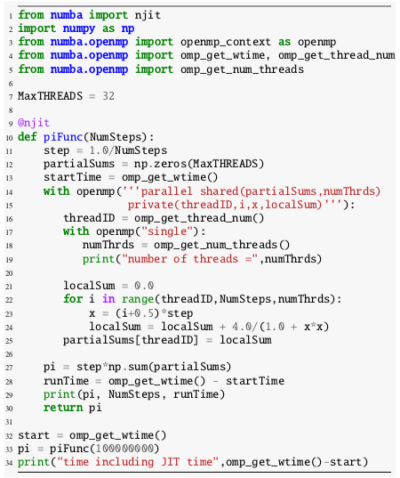
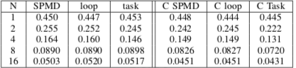
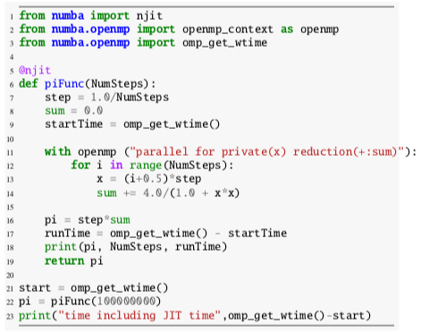
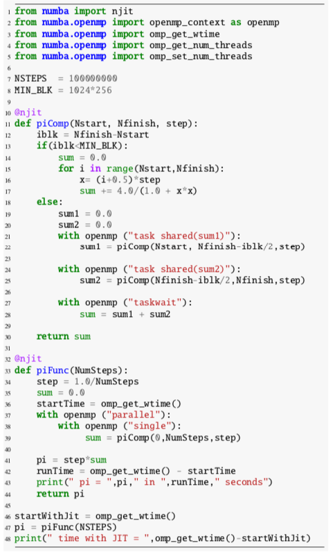
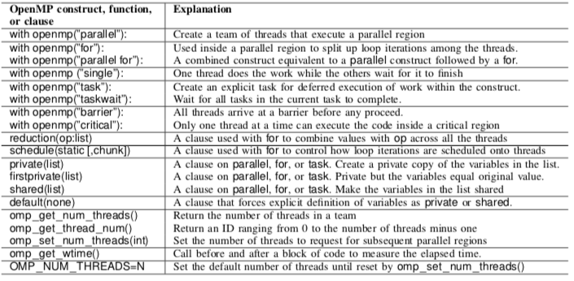
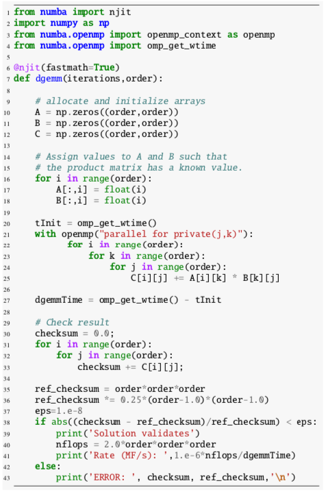
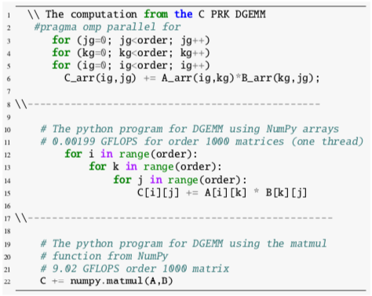
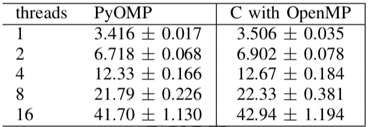

:author: Todd Anderson
:email: todd.a.anderson@intel.com
:institution: Intel Corp.
:equal-contributor:

:author: Tim Mattson
:email: timothy.g.mattson@intel.com
:institution: Intel Corp.
:corresponding:

----------------------------------------------------------------------------------------
Multithreaded parallel Python through OpenMP support in Numba
----------------------------------------------------------------------------------------

.. class:: abstract

A modern CPU delivers performance through parallelism.  A program that exploits the performance 
available from a CPU must run in parallel on multiple cores.   This is usually best done through multithreading.
Threads belong to a process and share the memory associated with that process.  The most
popular approach for writing multithreaded code is to use directives to tell the compiler
how to convert  code into multithreaded code.  The most commonly used directive-based API for
writing multithreaded code is OpenMP.  
Python is not designed for parallel programming with threads.
The GlobalInterpreterLock (GIL) prevents multiple threads from simultaneously accessing Python objects.
This effectively prevents data races and makes Python naturally thread safe.  Consequently, the GIL prevents parallel programming 
with multiple threads and therefore keeps Python from accessing the full performance 
from a CPU.   
In this paper, we describe a solution to this problem.  We implement OpenMP in 
Python so programmers can easily annotate their code and then let the Numba just-in-time (JIT) compiler generate
multithreaded, OpenMP code in LLVM, thereby bypassing the GIL.  We describe this new multithreading 
system for Python and and show that the performance in our early tests is on par with the analogous C code.

.. class:: keywords

   OpenMP, Python, Numba

Introduction
------------

Python emphasizes productivity over performance.  Given the growth of Python and the fact it is 
by some measures the most popular programming language in the world [PyP21]_ , this focus
on productivity has turned out to be the right choice at the right time.  

Performance from Python code, however, has suffered. The recent paper about software
performance ("There's plenty of room at the top..." [Lei20]_ ) used a simple
triply nested loop for a matrix multiply routine and found that the Python code delivered 
results that, when rounded to the correct number of significant digits, were zero percent of the 
available peak performance from the chip.  

A common attitude in the high performance computing  community is that  Python is for developing new
algorithms or managing workflows built up from external, high performance modules
written in low level languages.  If the performance is not good enough from Python, then the code is 
reimplemented in a low-level language such as C.  Why sacrifice productivity for performance if 
programmers who need high performance will rewrite their code in C anyway?

In our line of research, we are developing technologies that let programmers stay in 
Python.  Some of our prior work in this area is ParallelAccelerator in Numba (i.e., the
parallel=True option to the Numba JIT decorator) ( [Lam15]_  [And17]_  [NPar]_  ) 
In this work, common 
patterns in code are exploited to expose concurrency in the code which is then executed in parallel.
The parallelism is implicit in the patterns of code written by a programmer aware of these tools.
Implicit parallelism is powerful but there are too many cases where it can not find sufficient 
concurrency to support the levels of parallelism needed to fully occupy the cores on a modern CPU.

Another approach is to embed parallelism inside the functions from modules such as NumPy.  This is an effective way
to exploit the parallel resources of a system.   However, there are two well known limitations to this approach.
First, if the parallelism is constrained to the body of a function, there is startup overhead in launching
the parallel threads and shutting them down for each function call.  This overhead may be small, 
but they add up since they occur each time a function is called.  This increases the fraction of a program execution
time that is not reduced as parallel resources are added (the "serial fraction") and
limits the maximum possible speedup (which is restricted by Amdahl's law to one over the serial fraction).
Second, limiting parallelism to the bodies of parallelized functions misses the opportunity for additional
parallelism that comes from running those functions in parallel.  A great deal of available parallelism 
is missed if such cross-function parallelism is not exploited.

Taken together, we believe these limitations to parallelism strongly suggest that a
well-rounded Python tool chain needs to include explicit parallelism.   With our
focus on programming the cores in a CPU, this translates into utilizing multiple threads 
in parallel from python code.  The problem is that the GlobalInterpreterLock (GIL) prevents 
multiple threads from simultaneously accessing Python objects.  The GIL helps programmers write
correct code.  It reduces the chances that a program would produce different results based 
on how threads are scheduled (a "race condition").  It means that loads and stores from memory are
unlikely to conflict and create a "data race". There were very good reasons for including the GIL in Python.
It has the effect, however, of preventing parallel programming 
with multiple threads and therefore keeps Python from accessing the full performance 
from a CPU.   

Multithreading for performance has been a foundational technology for writing applications in
high performance computing for over four decades.   Its use grew rapidly in 1997 with the introduction
of OpenMP [deS18]_ .  This API worked with C, C++ and Fortran compilers so a programmer 
could direct the compiler to generate multithreaded code through a sequence of directives.  
The power of OpenMP is that a programmer can add parallelism to a serial program incrementally, 
evolving a program step by step into a parallel program.  

In this paper, we introduce PyOMP: a research prototype system with support for OpenMP directives in Python.
PyOMP uses the Python with statement to expose the directives in OpenMP.
These with statements are interpreted by our custom Numba JIT and combined with a backend that connects these
constructs to analogous entry points in the generated LLVM code.  This LLVM code is then compiled
using the Intel LLVM
system, which includes support for the full range of OpenMP constructs.  For this early research prototype, we 
restrict ourselves to a subset of OpenMP known as the OpenMP Common Core [Mat19]_ .
We describe the subset of OpenMP supported from Python including the most common design patterns used
by OpenMP programmers.  We then discuss details of how we worked with Numba to implement this tool.  
Finally, we include some preliminary benchmark numbers and then close with a description of our future plans
for PyOMP.

We want to be clear about what this paper is not.  It is not a review of alternative approaches for parallel programming
in Python.  It is not a benchmarking paper where we compare major approaches for parallel programming in Python.
We hope to write those papers in the future, but that is work-in-progress.  Furthermore, we take benchmarking very seriously.
We will not publish benchmarks that have not been fully optimized, reviewed for correctness by the authors of
the alternative systems we are comparing against, and address patterns application developers actually use.  A good
benchmarking paper is a major undertaking, which we fully intend to do.  For now, however, we just want to introduce
this new form of parallel programming in Python; to gauge interest and find fellow-travelers to join us as we turn
this research prototype system into a robust technology for the general Python programming community.

PyOMP:  Python and OpenMP
--------------------------------------------
OpenMP is a standard API that defines a set of compiler directives that can be used
with C, C++ and Fortran to help applications programmers write multithreaded code.
First released in 1997, it continues to be the most common way programmers in the 
high performance computing community write multithreaded code.

The standard has grown in size and complexity as it has evolved from version 1.0 to the
current release (version 5.1).   Important new features have been added over the years
including support for programming GPUs and detailed controls over how a computation 
is mapped onto many cores in a nonuniform address space.  Most OpenMP programmers, however, 
restrict themselves to a subset of the OpenMP 3.0 specification released in 2008.  
This subset of the 21 most commonly used elements of OpenMP is called the
"OpenMP Common Core" [Mat19]_  .  

PyOMP is a research prototype system implementing OpenMP in Python.
In PyOMP, we cover 90% of the common core.   
These are are summarized in table I.  
PyOMP is tied to the Numba JIT (Just-In-Time) compilation system.   Any function using PyOMP
must be JIT'ed with Numba.  The contents of PyOMP are provided as a module included with
Numba.  The Numba compiler works with NumPy arrays which must be used for any arrays
inside a PyOMP function.

The essence of OpenMP is the well-known fork-join parallelism foundational to most
multithreaded programming models.  A program begins as a serial thread.  At some point,
a compute intensive block of work is encountered.  If this can be broken down
into a set of tasks that can run at the same time AND unordered with respect to 
each other (in other words, they are concurrent), a team of threads is forked
to do this work in parallel. When the threads are done, they join together and
the original serial thread continues.

In essence, an OpenMP program is a sequence of serial and parallel executions.   The API
is expressed in terms of directives to the compiler which handles the tedious work of 
packaging code into functions for the threads, managing threads, and synchronizing the
threads to maintain a consistent view of memory.  The programming style is one of 
incremental parallelism so a program evolves in phases from a serial program into a parallel program.

Obviously, a detailed course on OpenMP is well beyond the scope of this paper.  Instead, we present 
the three core design patterns used in OpenMP.
These are SPMD (Single Program Multiple Data), Loop Level Parallelism,
and Divide and Conquer with tasks.  We will describe each of these patterns in turn and
in doing so describe the key elements of PyOMP.  We will apply these patterns to a single problem;
the numerical integration of `4/(1+x^2)` from zero to one.  If the program is correct, the 
result of this definite integral should be an approximation of pi.

The SPMD Pattern
----------------------------
 A classic use of the SPMD pattern is shown in figure 1.  In an SPMD pattern, you
 create a team of threads and then, using the rank of a thread (a number ranging from zero
 to the number of threads minus one) and the number of threads, explicitly control how work 
 is divided between the threads.  Threads are created with the parallel construct 
 expressed in PyOMP using the with context statement.  We see this in line 14-15.
 The identifier openmp indicates this is an element of PyOMP and parallel indicates
 that the compiler should fork a team of threads.  These threads come into "existence" at that 
 point in the program and they each redundantly execute the work in the code associated with 
 the with statement.   This code is called a structured block in OpenMP and is outlined into 
 a function that will be passed to each thread in the team.  OpenMP requires that a structured block
 has one point of entry at the top and one point of exit at the bottom (the only exception being
 a statement that shuts down the entire program). 

   A program using the SPMD pattern to numerically approximate 
   a definite integral that should equal pi  

As with multithreaded programming environments in general, OpenMP is a shared memory API.  
The threads "belong" to a single process and they all share the heap associated with the process.
Variables visible outside a parallel construct are by default shared inside the construct.  Variables created
inside a construct are by default private to the construct (i.e., there is a copy of the variable for each
thread in the team).  It is good form in OpenMP programming to make the status of variables
explicit in an OpenMP construct which we do with the shared and private clauses
in lines 14 and 15 in figure 1.

In an SPMD program, you need to find the rank (or thread number) and number of threads.
We do this with OpenMP runtime functions in lines 16 and 18.   The rank of a thread, threadID,
is private since each thread needs its own value for its ID.   All threads in a single team, however,
see the same value for the number of threads (numThrds) so this is a shared variable.
In multithreaded programming, it is a data race if multiple threads write to the same variable; even if
the value being written is the same for each thread.  So we must assure that only one thread 
sets the value for the number of threads.  This is done with the single construct
on line 17.   

The extent of the parallel algorithm is the for-loop starting at line 22.    Each thread starts with
a loop iteration (i) equal to its rank, which is incremented by the number of threads. The result is
loop iterations dealt out as if from a deck of cards.  This commonly used technique is called a "cyclic
distribution of loop iterations".  This loop is summing values of the integrand which we accumulate into
a private variable for each thread.  Since we need to later combine these local sums to get the
final answer (on line 27), we store the local sum into a shared array (partialSums) on line 25.

The parallel region ends at line 25 at which point the team of threads join back together and the 
single original thread continues.  We time the block of code with calls to the 
OpenMP runtime function  omp\_get\_wtime() (lines 13 and 28) which returns the elapsed time 
since a fixed point in the past.  Hence, differences in time values returned 
from omp\_get\_wtime() provides the elapsed time for execution of a block of code.
We show runtimes for this SPMD program in figure 2 and compare to the same
algorithm implemented in C.  The runtimes are comparable.  This supports our assertion that
once the path for execution passes from the Python interpreter to machine code via Numba 
and LLVM, performance should match that from lower-level programming 
languages passing through the same LLVM/runtime infrastructure.

   Programs to approximate a definite integral whose value equals pi using the 
   SPMD, loop level, and divide-and-conquer/task pattern. Runtimes 
   in seconds for  PyOMP and analogous C programs.  Programs were 
   run on an Intel(R)
   Xeon(R) E5-2699 v3 
   CPU with 18 cores running at 2.30  GHz. For the C programs we used 
   the Intel(R) icc compiler version 19.1.3.304 as "icc -qnextgen -O3 -fiopenmp".  

Loop Level Parallelism
------------------------

The Loop Level Parallelism pattern is where most people start with OpenMP.
This is shown in figure 2.  The code is almost identical to 
the serial version of the program.   Other than the import and timing statements,
parallelism is introduced through a single with statement to express
the parallel for construct.  This construct creates a team of threads
and then distributes the iterations of the loop among the threads.  To accumulate
the summation across loop iterations, we include the reduction clause.  This
clause defines reduction with the + operator over the variable sum.  A copy 
of this variable is created for each thread in the team.  It is initialized to the
identity for the operator (which in this case is zero).  At the end of the loop, all
the threads wait for the other threads (a synchronization operation called a barrier).
Before exiting the barrier, the local copies of sum are combined into a single value,
that value is combined with the value of sum from before the parallel loop construct,
and the threads join so only the single, original thread continues.

This program uses the default number of threads established outside the code of the program.
This is set using an environment variable, OMP\_NUM\_THREADS; hence, we run
our program pi\_loop with the command line:
 
OMP_NUM_THREADS=16 python pi_loop.py

The results for this pattern are shown as the second column in figure 2.
Once again, the performance is similar to that achieved with the C version of the program.

   A program using the Loop Level Parallelism pattern to numerically approximate 
   a definite integral that should equal pi 

Tasks and Divide and Conquer
--------------------------------------------

Our final pattern is more complex than the other two.  This important pattern
is heavily used by more advanced parallel programmers.  A wide range of problems including 
optimization problems, spectral methods, and cache oblivious algorithms use
the Divide and Conquer pattern.  The general idea is to define three basic
phases of the algorithm: split, compute, and merge.  The split phase recursively divides a  problem into 
smaller subproblems.  After enough splits, the subproblems are small enough to 
directly compute in the compute phase.  The final phase merges subproblems together
to produce the final answer.

   A program using the Divide and Conquer pattern with tasks to numerically approximate 
   a definite integral that should equal pi. 

A Divide and Conquer solution to our pi problem is shown in figure 3.  We start
by creating a team of threads on line 37.   We use the single construct to select one thread 
to start the algorithm with a call to our recursive function piComp().   With the 
single construct, one thread does the computation within the construct while the other threads 
wait at the end of the single construct (a so-called implied barrier).  While those threads wait at
the barrier, they are available for other computation on behalf of the program.

Inside the piComp() function, we test if the problem size is small enough for direct
computation (is it smaller than a minimum block size) on line 13.  If it is, we just compute the numerical
integration for that block of loop iterations (lines14 to 17) and return the partial sum (line 30). 
If an instance of the function, piComp(), has a block of iterations greater than MIN\_BLK, we 
enter the split phase of the algorithm.  The split occurs in lines 19 to 25 using the task
construct.  This construct takes the code associated with the construct (in this case, a single line)
and outlines it with its data environment to define a task.  This task is placed in a queue for
other threads in the team to execute.  In this case, that would be the threads waiting at the barrier
defined with the single construct on line 38.   

As tasks complete, we enter the merge phase of the algorithm.  This occurs at lines 27 and 28.  The
task that launches a pair of tasks must wait until its "child tasks" complete.   Once they do, it 
takes the results (the shared variables sum1 and  sum2), combines them, and returns 
the result.  The results are summarized in figure 2.  Even though the code is 
more complex than for the other two patterns, the runtimes for this simple problem are comparable 
to the other patterns for both Python and C.

   
   Summary of the elements of OpenMP included in PyOMP.  This includes constructs (using the Python with statement),
   clauses that modify constructs, functions from the OpenMP runtime library, and a single environment variable.
   These elements include 19 of the elements in the OpenMP Common core (missing only nowait and the dynamic schedule).

Numba and the implementation of PyOMP
------------------------------------------------------

Numba is a Just In Time (JIT) compiler that translates Python functions into native code optimized for a particular target.
The Numba JIT compiles PyOMP to native code in 4 basic phases.
 
* Untyped phase: Numba converts Python bytecode into its own intermediate representation (IR), including "with" contexts that are OpenMP-represented in the IR as "with" node types, and performs various optimizations on the IR. Later, Numba removes these "with" nodes by translating them to other node types in the IR.  For our PyOmp implementation, we added a new OpenMP node type into the IR, and we convert OpenMP with contexts into these new OpenMP IR nodes.

* Type inference phase: Numba performs type inference on the IR starting from the known argument types to the function and then performs additional optimizations. No changes were made to the Numba typed compilation phase to support OpenMP.

* IR conversion phase: Numba converts its own IR into LLVM IR.

* Compilation phase: Numba uses LLVM to compile the LLVM IR into machine code and dynamically loads the result into the running application.

For PyOmp, we replaced the mainline LLVM normally used by Numba with the custom LLVM used within the Intel compiler, icx.
This custom icx LLVM supports the bulk of OpenMP through two special function calls to demarcate the beginning and end of OpenMP regions (we will refer to these as OpenMP\_start and OpenMP\_end respectively) and LLVM tags on those function calls are used to apply the equivalent of OpenMP directives/clauses to those regions.
Our PyOMP prototype passes the equivalent of the "-fiopenmp" icx compiler option to the icx LLVM which causes it to convert the demarcated OpenMP regions into OpenMP runtime function calls.
The Intel OpenMP runtime is thus also needed and loaded into the process by the PyOMP prototype OpenMP system.
In PyOMP during the third phase, we convert the Numba OpenMP IR nodes to these two special function calls along with the corresponding LLVM tags.
Additional details are described later.

OpenMP includes a number of runtime functions to interact with the system as a program runs.  This is used to 
manage the number of threads, discover thread IDs, measure elapsed time, and other operations that can only occur as a program executes.
For these functions, our prototype using CFFI  to make those functions from the OpenMP runtime accessible from Python.
The importing of some of these functions such as omp\_get\_num\_threads, omp\_get\_thread\_num, omp\_get\_wtime, and omp\_set\_num\_threads 
can be seen, for example, in the initial "from numba.openmp import" ... lines at the beginning of the code example in figure 1.

Converting PyOMP with clauses to Numba IR
---------------------------------------------------------------

When removing OpenMP with contexts and replacing them with OpenMP IR nodes, Numba provides basic block information to demarcate the region that the with context covers.
PyOMP  places one OpenMP IR node at the beginning of this region and one at the end with a reference from the end node back to the start node to associate the two.
To determine what to store in the OpenMP IR node, PyOMP first parses the string passed to the OpenMP with  context to create a parse tree.
Then, we perform a postorder traversal of the parse tree, accumulating the information as we go up the tree until we reach a node that has a direct OpenMP LLVM tag equivalent.
At this point, we convert the information from the sub-tree into tag form and then subsequently pass that tag up the parse tree.
These tags are accumulated as lists of tags up the parse tree until the traversal reaches a top-level OpenMP construct or directive, which have their own tags.
Some of these directives are simple and require no additional processing whereas others, particularly those that support data clauses, require additional 
clauses to be added to the Numba OpenMP node that are not necessarily explicitly present in the programmer's OpenMP string.
For example, all variables used within the parallel, for and parallel for directives must be present as an LLVM tag even if they are not explicitly mentioned in the programmer's OpenMP statement.
Therefore, for these directives our PyOmp prototype performs a use-def analysis of the variables used within the OpenMP region to determine if they are also used before or after the OpenMP region.
If they are used exclusively within the OpenMP region then their default data clause is private.
In all other cases, the default data clause is shared but of course these defaults can be overridden by explicit data clauses in the programmer OpenMP string.
For looping constructs, icx LLVM only supports loops in a certain canonical form that differs from the standard Numba IR loop form.
For this purpose, our prototype transforms the Numba IR loop structure to match the icx LLVM loop structure.

Converting PyOMP Numba IR to LLVM
-----------------------------------------------------------------------

When a Numba OpenMP IR node is encountered in the process of converting Numba IR to LLVM IR, that node is converted to an LLVM OpenMP\_start (or OpenMP\_end) call.
Inside the Numba OpenMP node is a list of the clauses that apply to this OpenMP region and we perform a 1-to-1 conversion of that list of clauses into a list of LLVM tags on the LLVM OpenMP\_start call.
We emit code that captures the result of the LLVM OpenMP\_start call and we pass that result as a parameter to the OpenMP\_end, which allows LLVM to match the beginning and end of OpenMP regions.

In the process of converting Numba OpenMP IR nodes and the intervening OpenMP regions to LLVM, we disable certain Numba functionality.
Numba unifies the handling of exceptions and return values by adding an additional hidden parameter to functions it compiles that indicates whether the function has returned normally with a given return value or is propagating an exception.
After a call site, Numba inserts code into a caller to check if the callee function is propagating an exception by inspecting the callee's hidden parameter.
If there is an exception, the caller places that exception in its own hidden parameter and returns.
However, this approach of using returns for exceptions breaks the icx LLVM requirement that OpenMP regions be single-entry and single-exit.
Likewise, exceptions generated from within the caller, such as divide-by-zero, also fill in the exception information in the hidden parameter and immediately return, again breaking the single-entry/exit requirement.
It is not currently possible to explicitly catch such exceptions in PyOMP Numba regions because the Numba exception catching mechanism also generates control flow that violates single-exit.
As such, in our PyOMP prototype, inside OpenMP regions, exception handling is currently elided.

The Numba process of converting Numba IR to LLVM IR introduces many temporary variables into the LLVM IR that are not present in the Numba IR.
Thus, these variables are not visible in the untyped phase in which the data clauses for all variables accessed in OpenMP regions are determined.
Such temporaries used solely within an OpenMP region should be classified as private in the tags associated with the surrounding OpenMP region's OpenMP\_start demarcation function call.
In PyOMP, we implemented a callback in the Numba function that creates these LLVM temporary variables such that we can learn of the existence of these new variables and to add them as private to the previously emitted tags of the surrounding OpenMP region.

Finally, certain OpenMP directives such as single and critical, require the use of memory fences with acquire, release, or acquire/release memory orders.
Our prototype knows which directives require which kind of fences and we store that information in the Numba OpenMP IR node as those are created during the untyped phase.
During conversion of those OpenMP IR nodes to LLVM, if the node require memory fences then we insert the equivalent LLVM fence instructions into the LLVM IR.

Results
----------------

The key result of this paper is that PyOMP works.  As we saw in figure 2, we achieved 
reasonable speedups for the three key patterns that dominate OpenMP programming where
by the word "reasonable" we mean "achieving performance similar to that from C".
The pi programs, however, are "toy programs".
They are useful pedagogically but are far removed from actual applications.  

One step above a "toy program" is dense matrix multiplication. While this 
is a simple program lacking in the inevitable complexities faced by real applications, dense matrix multiplication 
uses a familiar loop-nest and data access patterns found in real applications.  It 
has the further advantage that dense matrix multiplication over double precision values (DGEMM) is compiler-friendly.  
If a compilation tool-chain is going to work well, DGEMM is where this would be most apparent.  

Our DGEMM code comes from the Parallel Research Kernels (PRK) [VdW14]_ version 2.17.  All code is available 
from the PRK repository [PRK]_. The PyOMP code is summarized in figure 6.  The
Numba JIT was done with the 'fastmath' option.  This resulted in a 20% performance improvement.  Numba
and therefore PyOMP requires that any arrays use NumPy.  They are allocated and initialized on lines 10 to 12 and then 
assigned values on lines 16 to 18 such that the matrix product is known and available for testing to verify correctness. 
The multiplication itself occurs on lines 21 to 25.  The ikj loop order is used since it leads to 
a more cache-friendly memory access pattern.   The elapsed time is found (dgemmTime) and reported as
GF/s (billions of floating point operations per second or GFLOPS).

   A PyOMP program to multiply two matrices.  
 

We compare performance from PyOMP to the analogous program written with C/OpenMP, 
NumPy arrays with the ikj loop-nest, and a call to the matrix multiplication 
function included with NumPy.  Code fragments for these cases are shown in 
figure 7.  The C DGEMM program was compiled with the Intel(R) 
icc compiler version 19.1.3.304.  The compiler command line was::

   icc -std=c11 -pthread -O3 -xHOST  -qopenmp 

   We compare our PyOMP program to three other cases: C with OpenMP, 
   serial code using the NumPy arrays, and the 'matmul()' built in function for 
   matrix multiplication. All programs use the same matrices, tests for correctness, and
   performance metrics (shown in figure 6), hence that code is not reproduced here.   

We ran all computations on an an Intel(R)
Xeon(R)  E5-2699 v3 CPU
CPU with 18 cores running at 2.30  GHz.  For the multithreaded programs with OpenMP
we forced the threads to map onto specific cores with one thread per core using the following pair of 
environment variables::

     export OMP_PLACES="{0},{1},{2},{3},{4}"
     export OMP_PROC_BIND=close

where the numbers in OMP\_PLACES continued up to the number of threads used in the computation.  When combined with the
processor binding term (close) this connected the OpenMP thread ID with the core ID (e.g., OpenMP thread ID 0 
ran on core 0).  This way, we knew that the
C and Python OpenMP programs used precisely the same cores and had the same relationship 
to the memory controllers on the chip.

We choose a matrix order large enough to create sufficient work to overcome memory movement and thread
overhead.  These matrices were too large for the computation to complete on our system
for matrices represented through Python lists.  Using NumPy arrays with triply nested loops
in i,k,j order, the computation ran at  0.00199 GFLOPS.
For our scalability studies, all runs were repeated 250 times.  Averages and standard deviations in GFLOPS are reported.
Results are shown in figure 8.  For the PyOMP results, we do not include the JIT times.
These were only done once per run (i.e. not once per iteration) and took on the order of two seconds.

Parallel Research Kernel DGEMM gigaFLOPS per second for order 1000 matrices.  
Results are the average  and standard deviation of 250 runs for execution on an 
Intel(R) Xeon(R) E5-2699 v3 CPU
with 18 cores running at 2.30  GHz. The python results do not include the time to JIT
compile the python code.  This one-time cost was observed to add around 2 seconds to the runtime.

   
   The PyOMP and the C are comparable with the C results consistently around 2.8 percent
   faster than the results from PyOMP.   We performed a Welch's T-test for the two sets of data.
   The test showed that while the difference between the PyOMP and C cases are small, they are statistically significant to 
   the 99\% confidence level. 

If we use
NumPy and call the matrix multiplication function provided with NumPy (line 22 in figure 7, 
the order 1000 DGEMM ran at 11.29 +/- 0.58 GFLOPS with one thread (using the matmul() function
from NumPy).   This high performance serves to emphasize that while DGEMM is a useful 
benchmark to compare different approaches to writing code, if you ever need to multiply matrices in a
real application, you should use code in a library produced by performance optimization experts.

Discussion
-------------------------

In the paper "There's plenty of room at the top..." [Lei20]_, much was made of the low performance available from code
written in Python.  They motivated their discussion using DGEMM. The implication 
was that when you care about performance, rewrite your code in C.
We understand that sentiment and often use that strategy ourselves.  Our goal, however, is to
meet programmers "on their turf" and let them "stay with Python".

One of the key challenges to the "stay with Python" goal is multithreading.  Because of the GIL, if you
want multithreaded code to execute in parallel, you can't use Python.  In this paper, we have 
addressed this issue by using Numba to map onto LLVM and the OpenMP hooks contained therein.
This resulted in our Python OpenMP system called PyOMP.

The performance from PyOMP was within a few percent of performance from OpenMP code written in C.
Performance differences were statistically significant, but we believe not large enough to justify
rewriting code in C.  This holds for a subset of OpenMP
supported in PyOMP (known as the "Common Core" [Mat19]_) and for the three fundamental design
patterns used by OpenMP programmers.

PyOMP is a research prototype system.  It is a proof-of-concept system we created to validate 
that Numba together with LLVM could enable multithreaded programming in Python through OpenMP.  A 
great deal of work is needed to move from a research prototype to a production-ready 
tool for application programmers.
 
* We need to develop a formal test suite. We currently have a test suite that covers each PyOMP OpenMP construct in isolation.  In those tests, we use a very limited subset (e.g., ints, floats, NumPy arrays, prints, assignments) of the Python features supported by Numba [Numba]_. We need a test suite that covers the combinations of OpenMP constructs encountered in real OpenMP applications with the full set of data types and Python features supported by Numba.  In this process, we will note Numba features incompatible with OpenMP (such as ParallelAccelerator [And17]_); fixing the cases we can fix and documenting those we can't.   

* We need to work out the details for how we will distribute this code.  We used the Intel production LLVM-based compiler which ties PyOMP to Intel proprietary tools.  We need to investigate whether the OpenMP support in the Intel open source release of LLVM is sufficient to support PyOMP.

* Currently, exception handling in PyOMP is disabled due to the interaction of how Numba manages exceptions with how LLVM manages execution of structured blocks in OpenMP.  We are investigating ways to address this problem, but don't have a solution at this time.

* We currently disable the Numba static single assignment mode (SSA). In this mode, Numba creates variants of variables. Those names are difficult to track relative to the data environment of OpenMP.  We believe we can account for these variants in PyOMP, but we have not done so yet.

In additions to refinement to PyOMP itself, we need to conduct a formal benchmarking effort with 
benchmarks that exercise the system in the way real applications would. In this effort we also need to compare
to the performance of other systems for parallel programming for a CPU with Python.  In particular, we want to
understand the performance tradeoffs between PyOMP, Dask, MPI4Py, and implicit parallelism through Numba's ParallelAccelerator.

References
----------

.. [And17]  T. Anderson, H. Liu. L. Kuper, E. Totoni, J. Vitek and T. Shpeisman. "Parallelizing Julia with a Non-Invasive DSL"
       31st European Conference on Object-Oriented Programming (ECOOP 2017), 
       Leibniz International Proceedings in Informatics (LIPIcs)}, vol. 74, pp. 4.1-4.29, 2017.
       
.. [CFFI],  "CFFI documentation", https://cffi.readthedocs.io/en/latest/.

.. [deS18]  B. de Supinski, T. Scogland, A. Duran, M. Klemm, S. Bellido, S. Olivier, C. Terboven, T. Mattson.
           "The Ongoing Evolution of OpenMP", Proceedings of the IEEE, Vol 106, No. 11, 2018

.. [Lam15] S. Lam, K. Siu, A. Pitrou, and S. Seibert. "Numba: A llvm-based python jit compiler:,
          Proceedings of the Second Workshop on the LLVM Compiler Infrastructure in HPC}, pp. 1-6, 2015.
           
.. [Lei20] C. Leiserson, N. Thompson, J. Emer, B. Kuszmaul, B. Lampson, D. Sanchez, and T. Schardl,
                "There's plenty of room at the Top: What will drive computer performance after Moore's law?",
                Science, Vol. 368, P. 6495, 2020.
                
.. [Mat19] T. Mattson, Y. He, and A. Koniges. "The OpenMP Common Core: Making OpenMP Simple Again",
                 MIT Press, 2019.

.. [Numba] "Python features supported by Numba", https://numba.pydata.org/numba-doc/dev/reference/pysupported.html.

.. [NPar] "Automatic parallelization with jit", https://numba.pydata.org/numba-doc/latest/user/parallel.html, 2021.
          
.. [PRK] "Parallel Research Kernels repository", https://github.com/ParRes/Kernels        

.. [PyP21] "PYPL PopularitY of Programming Language", https://pypl.github.io/PYPL.html,
            collected May, 2021.

.. [VdW14]  R. van der Wijngaart and T. Mattson, 
          "The Parallel Research Kernels: A tool for architecture and programming system investigation"
          IEEE High Performance Extreme Computing, 2014.

