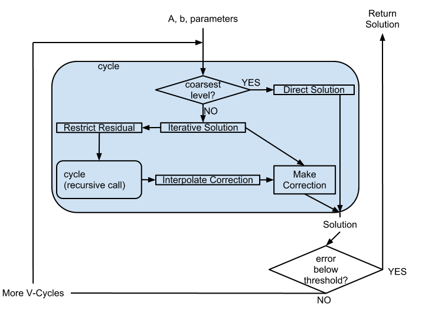
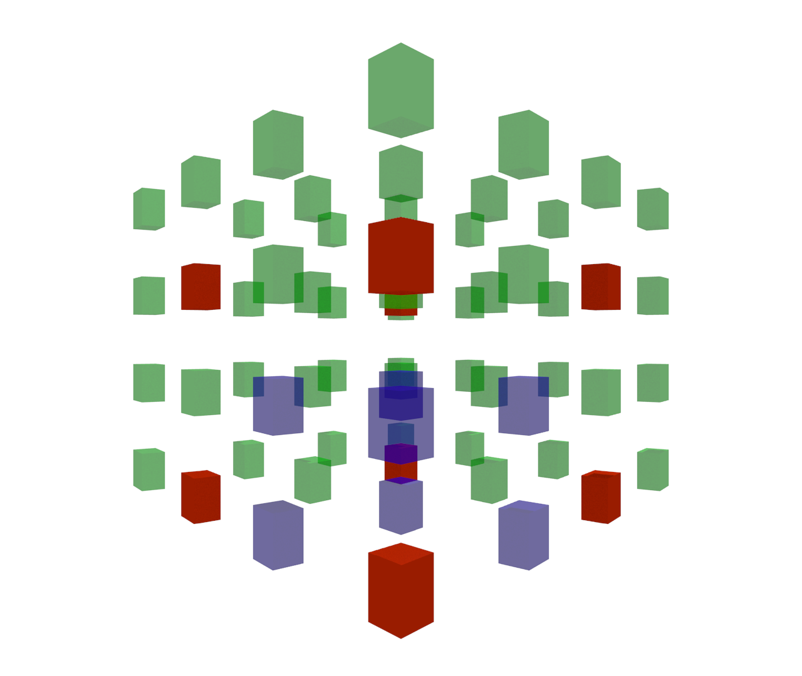
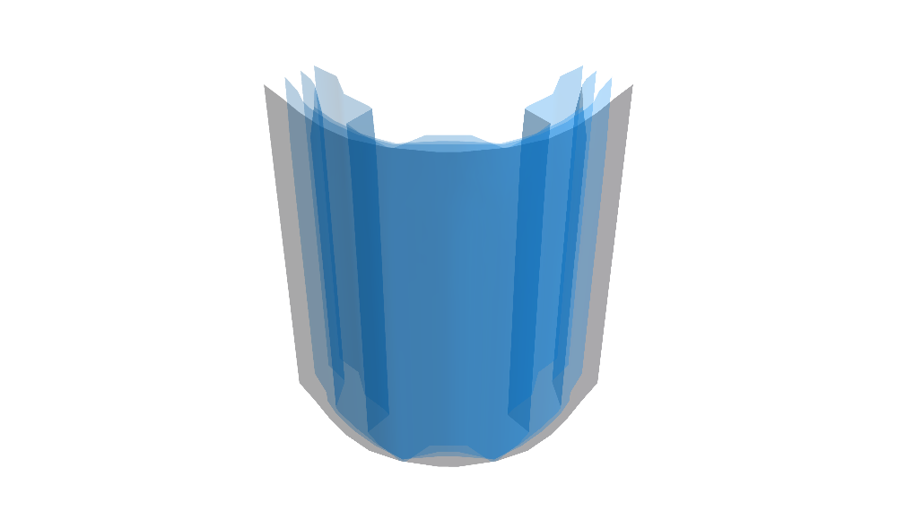
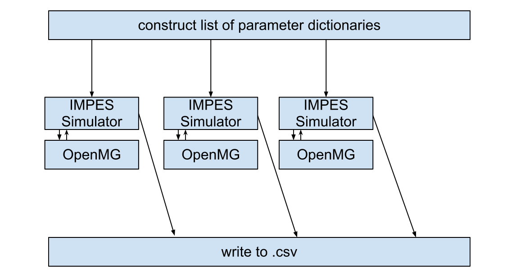
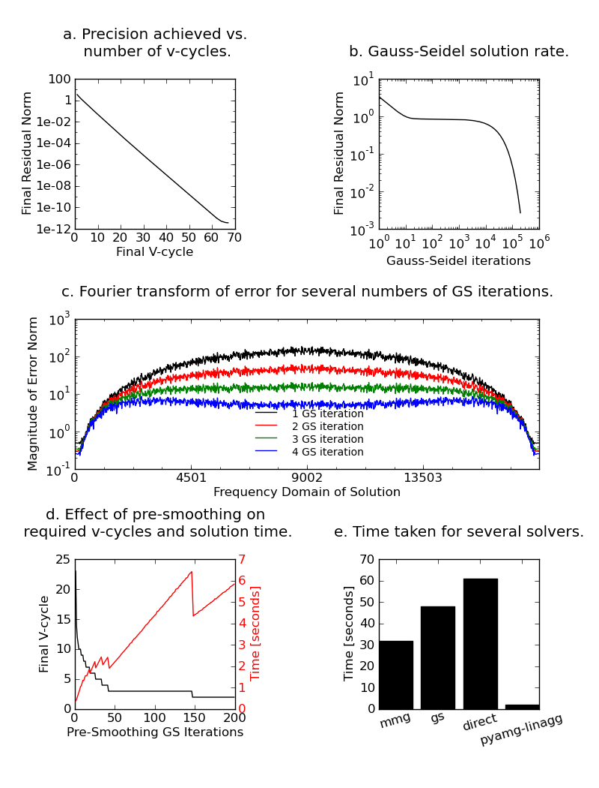

.. |versiondate| date:: v%m%d%H%M

.. |isodate| date:: %Y%m%dT%H%M

.. |--| unicode:: U+02013 .. en dash
    :trim:

.. |registered|   unicode:: U+00AE .. REGISTERED SIGN
    :trim:

.. role:: raw-math(raw)
    :format: latex html

:author: Tom S. Bertalan
:email: tom@tombertalan.com
:institution: The University of Alabama, Department of Chemical and Biological Engineering

:author: Akand W. Islam
:email: awislam@crimson.ua.edu
:institution: The University of Alabama, Department of Chemical and Biological Engineering

:author: Roger B. Sidje
:email: roger.b.sidje@ua.edu
:institution: The University of Alabama, Department of Mathematics

:author: Eric Carlson
:email: ecarlson@eng.ua.edu
:institution: The University of Alabama, Department of Chemical and Biological Engineering

------------------------------------------------
OpenMG: A New Multigrid Implementation in Python
------------------------------------------------

.. class:: abstract

   In many large-scale computations, systems of equations arise in the form :math:`Au=b`, where :math:`A` is a linear operation to be performed on the unknown data :math:`u`, producing the known right-hand side,  :math:`b`, which represents some constraint of known or assumed behavior of the system being modeled. Since such systems can be very large, solving them directly can be too slow. In contrast, a multigrid solver solves partially at full resolution, and then solves directly only at low resolution. This creates a  correction vector, which is then interpolated to full resolution, where it corrects the partial solution. This project aims to create an open-source multigrid solver called OpenMG, written only in Python. The existing PyAMG multigrid implementation is a highly versatile, configurable, black-box solver, but is difficult to read and modify due to its C core. Our proposed OpenMG is a pure Python experimentation environment for testing multigrid concepts, not a production solver. By making the code simple and modular, we make the algorithmic details clear. We thereby create an opportunity for education and experimentation with the partial solver (Jacobi, Gauss Seidel, SOR, etc.), the restriction mechanism, the prolongation mechanism, and the direct solver, or the use of GPGPUs, multiple CPUs, MPI, or grid computing. The resulting solver is tested on an implicit pressure reservoir simulation problem with satisfactory results.
.. class:: keywords

   python, multigrid, numpy, partial differential equations

Introduction to Multigrid
=========================
.. |intro| replace:: *Introduction to Multigrid*

Multigrid algorithms aim to accelerate the solution of large linear systems that typically arise from the discretization of partial differential equations. While small systems (hundreds of unknowns) can efficiently be solved with direct  methods such as Gaussian elimination or iterative methods such as Gauss-Seidel, these methods do not scale well.  In contrast, multigrid methods can theoretically solve a system in :math:`O(N)` CPU steps and memory usage [Brandt2]_.

The entire multigrid algorithm can be summarized in a few steps. The process below assumes that the user has first discretized the partial differential equation ("PDE") of interest, or otherwise expressed the problem as a matrix system of equations.

#. Setup hierarchies of operators and restriction matrices.
#. Find an approximation to the solution (pre-smooth the high-frequency error).
#. Find the fine residual.
#. Coarsen the residual, and produce the coarse right-hand side.
#. Solve at the coarse level (via a direct solver or a recursive call to the multigrid algorithm).
#. Prolong the coarse solution, and produce the fine correction vector.
#. Return the corrected solution.

Because of the possibility for a recursive call, this is often called a multigrid "cycle".

The basic premise of multigrid is that a quick but sloppy solution can be corrected using information calculated at a coarser resolution. That is, an approximation is first made at the fine resolution, and the residual from this approximation is used as the right-hand side for a correction equation to be solved at a much coarser resolution, where computational costs are also much lower. This basic two-grid scheme can be extended by using a recursive call at the coarse level instead of a direct solver.

.. **Maybe include some stuff from our pitch, also?**

History
-------
.. |history| replace:: *History*

Multigrid techniques were first introduced in 1964 in the USSR by R. P. Fedorenko [Fedorenko1]_ [Fedorenko2]_, who recognized the significance of the interaction between the mesh resolution and the components of the error of an iterative solution (see section |theory-smooth|), but who initially conceived of the multigrid algorithm simply as an occasional correction to a basic iterative solver. 
Rigorous analysis of the technique was furthered in the seventies by Achi Brandt, Wolfgang Hackbusch, and R. A. Nicolaides.
Brandt [Brandt2]_ placed more emphasis on the coarse-grid representations, describing multigrid as a method by which to "intermix discretization and solution processes, thereby making both of them orders of magnitude more effective." He further recast the process in terms of local and global mode analysis (Fourier analysis) in 1994 [Brandt1]_.
In 1979 Nicolaides wrote a useful synthesis of the work of Fedorenko and Brandt up to that point, and also contrasted the older two-level coarse-grid correction strategy with true, :math:`l`-level multigrid [Nicolaides]_.
Hackbrush wrote one of the foundational texts on multigrid [Hackbusch]_.

.. Around 1981 interest increased, apparently.

.. Somewhere in here I also might talk about the origins of the full approximation storage scheme (FAS) and full multigrid (FMG). http://jullio.pe.kr/fluent6.1/help/html/ug/node838.htm ... OR NOT. But, if I were to talk about it Brandt (boundary) would be the source to use for understanding.

.. FAS is an agglomeration-based coarsening strategy specially suited to unstructured grids. The commercial fluid dynamics package Fluent uses FAS as part of a geometric multigrid strategy, in which the equation is re-discretized at each successive coarse level. However, the FAS scheme should be usable for algebraic methods as well as geometric methods of constructing coarse-grid operators. **cite**

.. The Full Multigrid scheme starts with a discretization on a coarser level and uses the interpolated solution from this level as a preconditioner for the truncated iterative solver that begins a regular V- or W-cycle strategy at the finest level. [Brandt2]_

More information on the history of multigrid techniques can be found in several books [Trottenberg]_ [Hackbusch]_ [Wesseling]_ or lecture notes [Heckbert]_ on the topic.

Examples of simulation problem domains that have benefited from multigrid techniques include 
porous media transport [Douglas2]_ [Kameswaran]_,
molecular dynamics [Dzwinel]_ [Zapata]_ [Boschitsch]_,
fluid dynamics [Denev]_ [Douglas2]_ [Kameswaran]_,
and
neural network simulations (and neurotransmitter diffusion) [Bakshi]_.

.. Interestingly, the problem of realistic brain simulation is one in which two completely different types of problems could benefits from a multigrid approach.

Multigrid concepts are not limited to applications in simulation. Mipmapped textures for computer graphics and ultra-high-resolution image viewing applications such as satellite imaging both rely on the concept of a hierarchy of grid resolutions, although intergrid transfer operators and iterative methods are of less importance since an equation typically is not being solved.

Existing Python Implementations
-------------------------------
.. |existing| replace:: *Existing Python Implementations*

.. What open source multigrid packages are available and brief overview of them from their website/documentation. Also mention about Matlab version which is not an open source, but openly available.

The current open-source python package, PyAMG, due to Nathan Bell at Nvidia [Bell]_ is a very capable and extremely speedy multigrid solver, with a core written in C. However, because of the extent of optimizations (and the inclusion of C code), it is not particularly readable.

.. Additionally, it is not parallelized to make use of multiple CPUs or GPU compute units. 

.. We might leave out the parallelization bit.

Another interesting implementation is Yvan Notay's AGMG, which is available for Matlab and Fortran and includes parallel versions [Notay]_ [AGMG]_. AGMG is available for free for academic use and by site-license for commercial use.

.. Another open-source implementation is WolfMG by ..... **[need citation]** **this might not actually be Python.**

Our project, OpenMG, is not intended to be a production solver but instead a tool for education and experimentation. In this, it is largely inspired by the intentions behind Douglas, Deng, Haase, Liebmann, and Mckenzie's AMGlab [Douglas1]_, which is written for MATLAB. (AMGlab is freely available, although a license does not seem to be specified.) OpenMG is constructed in a modular fashion so each part can be understood by itself. Optimizations that might decrease readability have been avoided. Because of the modularity of the system, simplified components of the algorithm can be overridden with more optimized components in the future.

Theoretical Algorithm
=====================
.. |theory| replace:: *Theoretical Algorithm*

Discretization
--------------
.. |discretization| replace:: *Discretization*

The need for any sort of linear algebraic solver arises when a system of partial differential equations is discretized on a finite grid of points. While this is not the work of the OpenMG solver itself (the arguments to the solver are already in discretized form), it is a necessary preliminary step.

A good illustration of discretization is that of the Poisson equation, :math:`\nabla u = 0`. Here, :math:`\nabla` is the Laplace operator, which signifies the sum of unmixed second partial derivatives.

.. math::

    \nabla u = \frac{\partial^2 u}{\partial x^2} + \frac{\partial^2 u}{\partial y^2}

One possible discretization of this equation uses a central difference of both forward- and backwards-difference discretizations of the first partial derivatives.

.. math::

    \frac{\partial^2 u}{\partial x^2} \approx \frac{    \frac{u_{i,j+1}-u_{i,j}}{h} - \frac{u_{i,j}-u_{i,j-1}}{h}    }{h}
.. math::

    \frac{\partial^2 u}{\partial y^2} \approx \frac{    \frac{u_{i+1,j}-u_{i,j}}{h} - \frac{u_{i,j}-u_{i-1,j}}{h}    }{h}
.. math::
    :label: discretization

    \frac{\partial^2 u}{\partial x^2} + \frac{\partial^2 u}{\partial y^2} \approx \left( \frac{1}{h^2} \right) (1 u_{i-1,j}+1 u_{i,j-1}-4 u_{i,j}+1 u_{i,j+1}+1 u_{i+1,j})

When applied to every point in the domain, the coefficient pattern :math:`1,1,-4,1,1` produces a five-banded square coefficent matrix :math:`A` in the equation

.. math::
    :label: Aub

    A u = b

where :math:`u` is the vector of unknowns, for which we must solve, and the right-hand side `b` includes boundary information.

1. Setup R and A Hierarchies
----------------------------
.. |theory-setup| replace:: *Setup R and A Hierarchies*
 
The basic requirement of multigrid is, unsurprisingly, a multiplicy of grids, each discretizing the problem domain at a different resolution. In the simplest ("two-grid") scheme, there are two grid levels, :math:`h` and :math:`H`, where grid :math:`h` has :math:`N_h` unknowns, grid :math:`H` has :math:`N_H` unknowns, :math:`N_h > N_H`, and (for regular Cartesian grids) the values of :math:`h` and :math:`H` represent the fine and coarse grid spacings, respectively.

In *geometric multigrid*, the operator at the fine level :math:`A_h` is replaced by the operator at the coarse level :math:`A_H` re-discretizing the underlying PDE. However, this method, while potentially faster, enforces a tighter coupling between the solver and the simulation problem at hand.

The alternative to geometric multigrid is *algebraic multigrid*, in which the coarse operator is derived not from the PDE but only from the fine operator. Ruge-Steuben coarsening bases this transformation on the pattern of coefficients in :math:`A_h`, but our current implementation (see |implementation|) instead uses a stencil-based average.

Before the cycling portion of the algorithm, a setup phase is executed in which we generate a hierarchy of restriction matrices and coefficient matrices. The restriction array at position :math:`h` in the hierarchy, where the number of unknowns is :math:`N_h`, and where the number of unknowns for the next coarsest level is :math:`N_H`, is :math:`R_h^H`, or simply :math:`R_h`. It functions as an intergrid transfer operator from grid :math:`H` to grid :math:`h`, and has shape :math:`(N_H,N_h)`. That is, it can reduce the size of a vector from :math:`N_h` to :math:`N_H` elements:

.. math::
    :label: algebraicrestriction

    u_H = R_h u_h

These restriction matrices are used to produce a similar hierarchy of coefficient matrices, via the Galerkin coarse-grid approximation [Zeng]_.

.. math::

    A_H = R_h A_h R_h^T

This is significant because the multigrid algorithm thereby requires no knowledge of the underlying PDE to generate the coarse-grid operator. Instead, the coarse-grid operator is created solely through algebraic manipulation, giving rise to the term “algebraic multigrid”.

It should be noted that the labels `h` and `H` are used because, in cartesian structured grids, the characteristic that distinguishes between grid levels is the spacing between points. It is geometrically intuitive to call the distance between points `h` in the fine grid and `H` in the coarse grid.

2. Pre-Smoothing: :math:`u_{apx,h}`
-----------------------------------
.. |theory-smooth| replace:: *Pre-Smoothing*

An iterative solver is used to produce an initial estimate of the solution. This solver can be a Jacobi, Gauss-Seidel, or conjugate gradient implementation, or any other solver that can use a number-of-iterations parameter to make a tradeoff between overall accuracy and speed.

These iterative solvers begin with some initial guess of the solution, which could either be the work of previous solvers or simply a zero-vector. Because the iterative solvers reduce the high-frequency components of the error in this guess more quickly than they reduce the low-frequency, they are often referred to as “smoothers” in the context of multigrid methods. The purpose of a multigrid scheme is to use these high-resolution iterative smoothers only to reduce the high-frequency error, relying on lower-resolution corrections to reduce the low-frequency components of the error. [Harimi]_ See Figure :ref:`results` c, and accompanying explanations in |test-defn|.

So,

.. math::
    :label: solveforuapx

    u_{apx,h} = iterative\_solve(A_h, b_h, iterations)

where :math:`iterations` is a small integer, often simply :math:`1`.

3. Residual: :math:`r_h`
------------------------
.. |theory-resid| replace:: *Residual*

After the iterative solution, an error :math:`r_h` in the approximation :math:`u_{apx,h}` can still be defined as

.. math::
    :label: residual

    A_h u_{apx,h} + r_h = b_h

where :math:`b_h` is the given right-hand side.

4. Coarse Right-hand-side: :math:`b_H`
--------------------------------------
.. |theory-bH| replace:: Coarse Right-hand-side

let :math:`r_h = A_h v_h`

.. math::
    :label: vh

    A_h u_{apx,h} + A_h v_h = b_h

.. math::
    :label: correctable

    A_h ( u_{apx,h} + v_h ) = b_h

So, :math:`v_h` functions as a correction vector for the iterative approximation. Equation :ref:`vh` can be rearranged to produce another matrix equation in the same form as Equation :ref:`Aub`:

.. math::
    :label: solveforvh

    A_h v_h = b_h - A_h u_{apx,h}

Here, every element on the right-hand side is known, so it can be used to form a new right-hand side with which we can solve for the correction :math:`v_h`. However, because this correction only serves the purpose of reducing the low-frequency components of the error, we can safely solve Equation :ref:`solveforvh` at a coarser resolution without losing information [Borzi]_. So, we make use of our hierarchy of restriction and coefficient matrices to make Equation :ref:`solveforvh` an easier problem to solve (fewer unknowns):

.. math::
    :label: solveforvH

    A_H v_H = R_h ( b_h - A_h u_{apx,h})

where :math:`A_H` and :math:`R_h` are taken from the hierarchy generated earlier.

5. Coarse Solution
------------------
.. |theory-uH| replace:: *Coarse Solution*

The unknown vector and right-hand side of Equation :ref:`solveforvH` can now be replaced with new variables, revealing a new problem with only :math:`N_H` unknowns, down from the :math:`N_h` unknowns in Equation :ref:`solveforvh`.

.. math::
    :label: coarse problem

    A_H u_H = b_H

Because this is simply another matrix equation similar in form to Equation :ref:`Aub`, it can be solved either with a recursive call to the multigrid solver, or with a direct solver, such Numpy's ``np.linalg.solve`` or Scipy's ``scpy.base.np.linalg.solve``.

6. Interpolate Correction
-------------------------
.. |theory-interpolate| replace:: *Interpolate Correction*

.. My method actually relies on the shape tuple which might be considered “problem-specific”.

In order to correct the iterative approximation :math:`u_{apx}`, the solution from the coarse problem must be interpolated from :math:`N_H` unknowns up to :math:`N_h` unknowns. Because the restriction matrices are defined algebraically in Equation :ref:`algebraicrestriction`, it is possible to define an interpolation (or “prolongation”) algebraically:

.. math::
    :label: algebraicprolongation

    v_h = R_h^T u_H

This is used to prolongate the solution :math:`u_H` from the coarse level for use as a correction :math:`v_h` at the fine level. Note that, at the coarse level, the symbol `u` is used, since this is a solution to the coarse problem, but, at the fine level, the symbol `v` is used, since this is not the solution, but a correction to the iterative approximation.

7. Return Corrected Solution
----------------------------
.. |theory-u| replace:: *Return Corrected Solution*

With the correction vector in hand, it is now possible to return a solution whose error has been reduced in both high- and low-frequency components:

.. math::
    :label: corrected

    u_h = u_{apx} + v_h

It is also possible to insert a second “post-smoothing” step between the interpolation and the return steps.

.. Add a diagram showing several different V and W cycles.

As described in this section, this algorithm is a 2-grid V-cycle, because the high-resolution :math:`\rightarrow` low-resolution :math:`\rightarrow` high-resolution pattern can be visualized as a V shape. In our small sample problem, using more grid levels than two actually wasted enough time on grid setup to make the solver converge less quickly. However, repeated V-cycles were usually necessary for visually compelling convergence. That is, the solution from one V-cycle is used as the initial guess for the fine-grid pre-smoother of the next V-cycle. More complicated cycling patterns are also possible, such as W-cycles, or the full-multigrid ("FMG") pattern, which actually starts at the coarse level. However, these patterns are not yet addressed by OpenMG.

.. I should probably cite something for both W-cycles and FMG.

Implementation
==============
.. |implementation| replace:: *Implementation*

The process shown in Figure :ref:`cycle` is a multigrid solver with nearly black-box applicability |--| the only problem-specific piece of information required (one of the “parameters” in the figure) is the shape of the domain, as a 3-tuple, and it is possible that future versions of ``restriction()`` will obviate this requirement. Note that, in code listings given below, ``import numpy as np`` is assumed.

    Recursive multigrid cycle, with V-cycle iteration until convergence. :label:`cycle`

Setup R and A Hierarchies
-------------------------
.. |implementation-setup| replace:: *Setup R and A Hierarchies*

Any restriction can be described by a restriction matrix. Our current implementation, which is replacable in modular fashion, uses 2-point averages in one dimension, 4-point averages in two dimensions, and 8-point averages in three dimensions, as depicted in Figure :ref:`restriction`. Alternate versions of these two functions have been developed that use sparse matrices, but the dense versions are shown here for simplicity.

    Eight-point average restriction method. All points are included in the fine set, but red points are additionally included in the coarse set. Blue points are used in the calculation of eight-point average for the coarse point nearest to the camera in the bottom plane. :label:`restriction`

.. These code blocks should somehow be made to fit in one column each, according to the SciPy Proceedings README_.

.. _README: https://github.com/scipy/scipy_proceedings/blob/master/README.txt

Other simplifications have also been made |--| for example, automatic V-cycling has been removed, although, in the actual code, this is contained with in the wrapper function ``openmg.mg_solve``. Forced line breaks have also reduced the readability of this sample code, and perhaps broke key parts. We recommend downloading the most up-to-date OpenMG code from `https://github.com/tsbertalan/openmg <https://github.com/tsbertalan/openmg>`_ for working examples.

The following code generates a particular restriction matrix, given a number of unknowns ``N``, and a problem domain shape tuple, ``shape``.

.. code-block:: python

    from sys import exit
    def restriction(N, shape):
        alpha = len(shape)  # number of dimensions
        R = np.zeros((N / (2 ** alpha), N))
        r = 0  # rows
        NX = shape[0]
        if alpha >= 2:
            NY = shape[1]
        each = 1.0 / (2 ** alpha)
        if alpha == 1:
            coarse_columns = np.array(range(N)).\
                            reshape(shape)\
                            [::2].ravel()
        elif alpha == 2:
            coarse_columns = np.array(range(N)).\
                            reshape(shape)\
                            [::2, ::2].ravel()
        elif alpha == 3:
            coarse_columns = np.array(range(N)).\
                            reshape(shape)\
                            [::2, ::2, ::2].ravel()
        else:
            print "> 3 dimensions is not implemented."
            exit()
        for c in coarse_columns:
            R[r, c] = each
            R[r, c + 1] = each
            if alpha >= 2:
                R[r, c + NX] = each
                R[r, c + NX + 1] = each
                if alpha == 3:
                    R[r, c + NX * NY] = each
                    R[r, c + NX * NY + 1] = each
                    R[r, c + NX * NY + NX] = each
                    R[r, c + NX * NY + NX + 1] = each
            r += 1
        return R

The function ``restriction()`` is called several times by the following code to generate the complete hierarchy of restriction matrices.

.. code-block:: python

    def restrictions(N, problemshape, coarsest_level,\
                    dense=False, verbose=False):
        alpha = np.array(problemshape).size
        levels = coarsest_level + 1
        # We don't need R at the coarsest level:
        R = list(range(levels - 1))
        for level in range(levels - 1):
            newsize = N / (2 ** (alpha * level))
            R[level] = restriction(newsize,
                        tuple(np.array(problemshape)\
                            / (2 ** level)))
        return R

Using the hierarchy of restriction matrices produced by ``restrictions()`` and the user-supplied top-level coefficient matrix ``A_in``, the following code generates a similar hierarchy of left-hand-side operators using the Galerkin coarse-grid approximation, :math:`A_H = R A_h R^T` [Zeng]_.

.. code-block:: python

    def coarsen_A(A_in, coarsest_level, R, dense=False):
        levels = coarsest_level + 1
        A = list(range(levels))
        A[0] = A_in
        for level in range(1, levels):
            A[level] = np.dot(np.dot(
                                R[level-1],
                                A[level-1]),
                            R[level-1].T)
        return A

Both ``restrictions()`` and ``coarsen_A()`` return lists of arrays.

Smoother
--------
.. |implementation-smooth| replace:: *Smoother*

Our iterative smoother is currently a simple implementation of Gauss-Seidel smoothing, but this portion of the code could be replaced with a Jacobi implementation to allow parallelization if larger domains prove to spend more execution time here.

.. code-block:: python

    
    def iterative_solve(A, b, x, iterations):
        N = b.size
        iteration = 0
        for iteration in range(iterations):
            for i in range(N):  # [ 0 1 2 3 4 ... n-1 ]
                x[i] = x[i] + (b[i] - np.dot(
                                        A[i, :],
                                        x.reshape((N, 1)))
                            ) / A[i, i]
        return x

Multigrid Cycle
---------------
.. |implementation-cycle| replace:: *Multigrid Cycle*

The following function uses all the preceeding functions to perform a multigrid cycle, which encompasses the Residual, Coarse Solution, Interpolate Correction, and Return Corrected Solution steps from the theoretical discussion above. It calls itself recursively until the specified number of ``gridlevels`` is reached. It can be called directly, or through a wrapper function with a more simplified prototype, ``mg_solve(A_in, b, parameters)`` (not shown here).

.. code-block:: python

    def amg_cycle(A, b, level, \
                R, parameters, initial='None'):
        # Unpack parameters, such as pre_iterations
        exec ', '.join(parameters) +\
            ',  = parameters.values()'
        if initial == 'None':
            initial = np.zeros((b.size, ))
        coarsest_level = gridlevels - 1
        N = b.size
        if level < coarsest_level:
            u_apx = iterative_solve(\
                                    A[level],\
                                    b,\
                                    initial,\
                                    pre_iterations,)
            b_coarse = np.dot(R[level],\
                            b.reshape((N, 1)))
            NH = len(b_coarse)
            b_coarse.reshape((NH, ))
            residual = b - np.dot(A[level], u_apx)
            coarse_residual = np.dot(\
                                R[level],\
                                residual.reshape((N, 1))\
                                ).reshape((NH,))
            coarse_correction = amg_cycle(
                                A,
                                coarse_residual,
                                level + 1,
                                R,
                                parameters,
                                )
            correction = np.dot(\
                                R[level].transpose(),\
                                coarse_correction.\
                                reshape((NH, 1))\
                            ).reshape((N, ))
            u_out = u_apx + correction
            norm = np.linalg.norm(b - np.dot(
                                        A[level],
                                        u_out.\
                                        reshape((N,1))
                                        ))
        else:
            norm = 0
            u_out = np.linalg.solve(A[level],\
                                b.reshape((N, 1)))
        return u_out

Results
=======
.. |sec-results| replace:: *Results*

Sample Application
------------------
.. |application| replace:: *Sample Application*

.. Wahid, make sure I’m typesetting these equations correctly. For instance, should I be bold-facing :math:`\mathbf{K}n`, to indicate that it’s a tensor?

In our test example we simulate the geologic sequestration of :math:`CO_2`. The governing pressure-saturation equation is

.. math::
    :label:  pressure

    v = - \mathbf{K}( \lambda_w + \lambda_{CO_2} ) \nabla p + \mathbf{K}( \lambda_w \rho_w + \lambda_{CO_2} \rho_{CO_2} )G

where the gravitational pull-down force :math:`G` is :math:`-g \nabla  z`.

The saturation equation is

.. math::
    :label: saturation
    
    \phi \frac{ \partial s_w }{ \partial t } + \nabla \left( f_w (s_w)[ v + d(s_w, \nabla s_w)+g(s_w)] \right) = \frac{q_w}{ \rho_w }

where subscript :math:`w` represents water-saturated porous medium, :math:`g` represents gravitational acceleration, :math:`K` represents permeability, :math:`q` models sources and sinks, (outflow or inflow), :math:`S` represents saturation, :math:`z` represents the vertical direction, :math:`\rho` represents water density, :math:`\phi` represents porosity, and :math:`\lambda` represents mobility (ratio of permeability to viscosity).
    

Equation :ref:`saturation`, the saturation equation, is generally parabolic. However, the terms for the viscous force :math:`f(s)v` and the gravity force :math:`f(s)g(s)` usually dominate the capillary force :math:`f(s)d(s, \nabla s)`. Therefore the equation will have a strong hyperbolic nature and can be solved by many schemes [Aarnes]_. On  the other hand, Equation :ref:`pressure`, the pressure equation, is of elliptic form. After discretization, this equation will reduce to :math:`Au = b` and a multigrid scheme can be used for efficient computation especially if the problem size is big (for instance, millions of cells [Carlson]_).

The unknown quantity, which the solver algorithm must find, is the fluid pressure :math:`p`. In Figure :ref:`solution`, we show ~3033 psi isosurfaces of this solution (pressure across the entire domain varies by only about 5 psi). The actual solution (via ``np.linalg.solve``) is rendered in grey, and the three blue surfaces (from narrowest to widest) are the result of applying one, two, and three two-grid cycles, respectively.

As shown, this two-grid solver is converging on the true solution in the vicinity of this isosurface. The multigrid isosurface and the direct solution isosurface become indistinguishable within about ten V-cycles.

.. Two more example problems should be included for a journal article.

    Pressure isosurfaces of several solutions to a 3D porous media problem with :math:`12^3=1728` unknowns. The grey outer surface is a direct solution, while the blue inner surfaces are the result of different numbers of multigrid V-cycles |--| with more V-cycles, the multigrid solution approaches the true solution. Plotted with MayaVi's ``mlab.contour3d``. :label:`solution`

Discussion
==========
.. |discussion| replace:: *Discussion*
    
Testing Setup
-------------
.. |sec-testing| replace:: *Testing Setup*

    Parallel testing apparatus. The IMPES (implicit pressure, explicit saturation) simulation script calls the OpenMG script when solving its pressure equation, and then reports a dictionary of dependent variables of interest to be written to a comma-separated-value file. :label:`testing`

In a wrapper script depicted in Figure :ref:`testing`, we used the Python 2.6 module ``multiprocessing.Pool`` to accelerate the execution of test sets. A dictionary of parameters is constructed for each distinct possible parameter combination where several parameters of interest are being varied. 
A process in the pool is then assigned to test each parameter combination. Each pool process then returns a dictionary of dependent variables of interest.
Our tests are run on a dual-socket Intel Xeon E5645 (2.40GHz) machine with 32 GB of memory. However, care still must be taken to ensure that the number of processes in the pool is not so high that individual processes run out of memory.

Test Definitions and Results
----------------------------
.. |test-defn| replace:: *Test Definitions and Results*

In Figure :ref:`results` a, we show the results of a V-cycle convergence test with our OpenMG solver. Here, we specify the number of repeated 2-grid cycles as an independent variable, and monitor the residual norm as the dependent variable. There were :math:`8^3=512` unknowns, one pre-smoothing iteration, and zero post-smoothing iterations. OpenMG was able to reduce the error at a steady logarithmic rate. The norm used everywhere was the 2-norm.

This contrasts with Figure :ref:`results` b, where we show the convergence behavior of the ordinary Gauss-Seidel on its own. Similarly to the method used for Fig. :ref:`results` a, we used the number of iterations as the independent variable, and examined the residual norm as the dependent variable. There were :math:`12^3=1723` unknowns, and the test took 43 hours to complete 200,000 iterations. However (for this sample problem), the Gauss-Seidel solver quickly exhausts the high-frequency portions of the solution error, and begins slower work on the low-frequency components.

This spectral effect can be seen more clearly in Figure :ref:`results` c, where we show the Fourier transform of the error (:math:`u - u_{apx}` ) after different numbers of Gauss-Seidel iterations. A Hann-window smoother with a window width of 28 was applied after the Fourier transform to better distinguish the several curves. For this test, we used a 1D Poisson coefficent matrix and an expected solution vector generated using ``np.random.random((N,)).reshape((N,1))``, where ``N`` was 18,000 unknowns. Because of this method of noise generation (a continuous uniform distribution, or equal probability of all permitted magnitudes at all points in the domain), the pre-generated solution sampled all frequencies unequally, unlike true white noise. This accounts for the initial bell-shaped error in the frequency domain. However, the unequal rate of error-reduction for different frequencies that was observed as iterations were completed is to be expected of iterative solvers, hence their description as "smoother" in the context of multigrid methods. This recalls the argument from a frequency-domain perspective for a multigrid solver [Brandt2]_.

In Figure :ref:`results` d, we examine the effect of this Gauss-Seidel pre-smoother by increasing the number of pre-smoothing iterations from our default value of only one. Dependent variables include the number of V-cycles required to obtain a residual norm of 0.00021, and the time taken by the whole OpenMG solver to arrive at that precision. There were :math:`8^3=512` unknowns and two grid levels, and all restriction and coefficient matrices used were stored in dense format. As expected, increasing the number of pre-smoothing iterations does decrease the number of required V-cycles for convergence, but this does not generally improve the solution time, except in the transition from 3 V-cycles to 2 V-cycles. However, this trend is useful to validate that the smoother is behaving as expected, and might be useful if, in the future, some coarsening method is employed that makes V-cycling more expensive.

The Gauss-Seidel (GS) solver's very slow convergence in low-frequency error accounts for the difference in time between it and the OpenMG multigrid (mmg) solver, as shown in Figure :ref:`results` e. Here, we compare the running times of several solvers, including PyAMG's smoothed aggregation solver, our own pure-python Gauss-Seidel iterative solver, and the direct solver `np.linalg.solve`. There were :math:`20^3=8000` unknowns, and dense :math:`R` and :math:`A` matrices were used for OpenMG. In order to keep the GS bar similar in scale to the other bars in the chart, a relatively high residual norm tolerance of 0.73 was used for both the GS and mmg solvers. However, this tolerance parameter was not an option for the direct solver or PyAMG, both of which achieved very good precision without prompting. The PyAMG solver (pyamg-linagg) used linear aggregation coarsening, and so is not really comparable to our multigrid implementation in this example, but it is included in this plot to demonstrate the speed that can be achieved using optimized multigrid methods with efficient coarsening algorithms. Our own coarsener uses the simple geometric scheme shown in Figure :ref:`restriction`, not the more efficient, general, and geometry-agnostic Ruge-Steuben method usually used in algebraic multigrid solvers.

.. TODO **Bring back the PyAMG Ruge-Steuben solver. Explore for something more comparable.**

.. Figure :ref:`results` f, we show the results of our first test, which demonstrates the effect of changing domain size. The independent variable was ``problemscale``, which began at 8 and was incremented by 4 until the OpenMG solver raised a ``MemoryError`` (at 24 when using dense matrices for `R` and `A`, or at 32 when using sparse matrices). The variable ``problemscale`` is the cube root of the number of unknowns for our three-dimensional porous media sample problem. **Other parameters used in this test were..**

    Results from explanatory tests. Tests described and interpreted in |test-defn|. :label:`results`

.. Generated using the ``'graph_pressure'`` test case in ``time_test_grid``, and actual mayavi code in ``tom_viz.make_multiple_3d_graphs``.

Conclusion and Future Work
--------------------------
.. |conclusion| replace:: *Conclusion and Future Work*

OpenMG is an environment for testing new implementations of algebraic multigrid components. While optimized implementations such as PyAMG are more suitable for use as production solvers, OpenMG serves as an easy-to-read and easy-to-modify implementation to foster understanding of multigrid methods. For example, future module improvements could include a parallel Jacobi iterative solver, a method of generating restriction matrices that is tolerant of a wider range of problem sizes, or operator-based Ruge-Steuben coarsening in addition to the option of stencil-based coarsening. In order to find computational bottlenecks, it might be useful also to add a per-step time profiler.

As open-source software, the code for this project has been posted online under the New BSD license at `https://github.com/tsbertalan/openmg <https://github.com/tsbertalan/openmg>`_. We invite the reader to download the code from this address to explore its unit tests and possible modifications, and to contribute new modules.

References
----------
.. |references| replace:: *References*
   
.. [AGMG] Y Notay, *AGMG,* 2012. [Online]. Available: http://homepages.ulb.ac.be/~ynotay/AGMG.

.. [Aarnes] J E Aarnes, T Gimes, and K Lie. *An Introduction to the Numerics of Flow in Porous Media using Matlab*, Geometric Modeling, Numerical Simulation and Optimization. 2007, part II, 265-306.

.. [Bakshi] B R Bakshi and G Stephanopoulos, *Wave-net: a multiresolution, hierarchical neural network with localized learning,* AIChE Journal, vol. 39, no. 1, pp. 57-81, Jan. 1993.

.. [Bell] N Bell, L Olson, and J Schroder, *PyAMG: Algebraic Multigrid Solvers in Python,* 2011.

.. [Borzi] A Borzi, *Introduction to multigrid methods.* [Online]. Available: http://www.uni-graz.at/imawww/borzi/mgintro.pdf. [Accessed: 03-Jul-2012].

.. [Boschitsch] A H Boschitsch and M O Fenley, *A Fast and Robust Poisson-Boltzmann Solver Based on Adaptive Cartesian Grids.,* Journal of chemical theory and computation, vol. 7, no. 5, pp. 1524-1540, May 2011.

.. [Brandt1] A Brandt, *Rigorous Quantitative Analysis of Multigrid I. Constant Coefficients Two-Level Cycle with L2 Norm*, SIAM Journal on Applied Mathematics, vol. 31, no. 6, pp. 1695-1730, 1994.

.. [Brandt2] A Brandt, *Multi-Level Adaptive Solutions to Boundary-Value Problems*, Mathematics of Computation, vol. 31, no. 138, pp. 333-390, 1977.

.. [Brandt3] A Brandt, *Multilevel computations of integral transforms and particle interactions with oscillatory kernels*, Computer Physics Communications, vol. 65, no. 1–3, pp. 24-38, Apr. 1991.

.. [Brandt4] A Brandt, *AMG and Multigrid Time-Dependence*, Multigrid Methods: Lecture Notes In Mathematics, pp. 298-309, 1987.

.. [Carlson] E S Carlson, A W Islam, F Dumkwu, and T S Bertalan. *nSpyres, An OpenSource, Python Based Framework for Simulation of Flow through Porous Media*, 4th International Conference on Porous Media and Annual Meeting of the International Society for Porous Media, Purdue University, May 14-16, 2012.

.. [Denev] J A Denev, F Durst, and B Mohr, *Room Ventilation and Its Influence on the Performance of Fume Cupboards: A Parametric Numerical Study,* Industrial & Engineering Chemistry Research, vol. 36, no. 2, pp. 458-466, Feb. 1997.

.. [Douglas1] C C Douglas, L I Deng, G Haase, M Liebmann, and R Mckenzie, *Amglab: a community problem solving environment for algebraic multigrid methods.* [Online]. Available: http://www.mgnet.org/mgnet/Codes/amglab.

.. [Douglas2] C C Douglas, J Hu, M Iskandarani, M Kowarschik, U Rüde, and C Weiss, *Maximizing Cache Memory Usage for Multigrid Algorithms for Applications of Fluid Flow in Porous Media,* vol. 552. Berlin, Heidelberg: Springer Berlin Heidelberg, 2000.

.. [Dzwinel] W Dzwinel, D. A. Yuen, and K. Boryczko, *Bridging diverse physical scales with the discrete-particle paradigm in modeling colloidal dynamics with mesoscopic features,* Chemical Engineering Science, vol. 61, no. 7, pp. 2169-2185, Apr. 2006.

.. [Fedorenko1] R P Fedorenko, *The Speed of Convergence of One Iterative Process,* Zhurnal Vychislitel’noi Matematiki i Matematicheskoi Fiziki, 1964.

.. [Fedorenko2] R P Fedorenko, *A relaxation method for solving elliptic difference equations,* Zhurnal Vychislitel’noi Matematiki i Matematicheskoi Fiziki, pp. 922-927, 1961.

.. [Hackbusch] W Hackbusch, Multi-Grid Methods and Applications. Springer, 1985, p. 377.

.. [Harimi] I Harimi and M Saghafian, *Evaluation of the Capability of the Multigrid Method in Speeding Up the Convergence of Iterative Methods,* ISRN Computational Mathematics, vol. 2012, pp. 1-5, 2012.

.. [Heckbert] P Heckbert, *Survey of Multigrid Applications*, 1998. [Online]. Available: http://www.cs.cmu.edu/~ph/859E/www/notes/multigrid.pdf. [Accessed: 13-Jun-2012].

.. [Kameswaran] S Kameswaran, L T Biegler, and G H Staus, *Dynamic optimization for the core-flooding problem in reservoir engineering,* Computers & Chemical Engineering, vol. 29, no. 8, pp. 1787-1800, Jul. 2005.

.. [Nicolaides] R A Nicolaides, *On Some Theoretical and Practical Aspects of Multigrid Methods,* Mathematics of Computation, 1979. [Online]. Available: http://www.jstor.org/stable/10.2307/2006069. [Accessed: 07-Jul-2012].

.. [Notay] Y Notay, *An aggregation-based algebraic multigrid method,* Electronic Transactions on Numerical Analysis, vol. 37, pp. 123-146, 2010.

.. [Trottenberg] U Trottenberg, C W Oosterlee, and A Schüller, *Multigrid*, Academic Press, 2001, p. 631.

.. [Wesseling] P Wesseling, *An introduction to multigrid methods. 1992,* Willey, New York, 1991.

.. [Zapata] G Zapata-Torres et al., *Influence of protonation on substrate and inhibitor interactions at the active site of human monoamine oxidase-a.,* Journal of chemical information and modeling, vol. 52, no. 5, pp. 1213-21, May 2012.

.. [Zeng] S Zeng and P Wesseling, *Galerkin Coarse Grid Approximation for the Incompressible Navier-Stokes Equations in General Coordinates*, Thesis, 2010.
