:author: Marian-Leontin Pop
:email: popmarianleontin@gmail.com
:institution: Technical University of Cluj-Napoca

:author: Szilard Molnar
:email: molnarszilard10@gmail.com
:institution: Technical University of Cluj-Napoca

:author: Alexandru Pop
:email: Alexandru.Pop@aut.utcluj.ro
:institution: Technical University of Cluj-Napoca

:author: Benjamin Kelenyi
:email: Benjamin.Kelenyi@aut.utcluj.ro
:institution: Technical University of Cluj-Napoca

:author: Levente Tamas
:email: Levente.Tamas@aut.utcluj.ro
:institution: Technical University of Cluj-Napoca
:corresponding:

:author: Andrei Cozma
:email: Andrei.Cozma@analog.com
:institution: Analog Devices International

:bibliography: mybib

:video: https://www.youtube.com/watch?v=kANXhHwFrCo

------------------------------
CNN Based ToF Image Processing
------------------------------

.. class:: abstract

   In this paper a Time of Flight (ToF) camera specific data processing pipeline is presented, followed by real life applications using artificial intelligence.
   These applications include use cases such as gesture recognition, movement direction estimation or physical exercises monitoring. 
   The whole pipeline for the body pose estimation is described in details, starting from generating and training phases to the pose estimation 
   and deployment. The final deployment targets were Nvidia Xavier NX and AGX platforms receiving data from an Analog Devices ToF camera.

.. class:: keywords

   transfer learning, ToF, python

Introduction
------------
   
In recent years the evolution of deep neural networks has affected the way in which Time of Flight (ToF) images are 
processed. Images from ToF cameras are usually obtained as synchronized depth and infrared (IR) image pairs. 
The customization of the existing deep nets to the IR and depth images allows us to reuse the existing models and techniques from this emerging domain. The applications targeted are ranging from person detection, counting, activity analysis to volumetric measurements, mapping and navigation with mobile agents.
In the following parts the introduction to the specific ToF imaging, custom data processing and CNN based solutions are presented :cite:`tamas2021embedded`.
Although for the 2D data a bunch of CNN based solutions exists, for the 3D data :cite:`Gezawa2020` only some base architectures were widespread such as Pointnet :cite:`qi2017pointnet`, while for the calibration between different sensing modalities can be done in an efficient way according to :cite:`frohlich2019absolute`.
   
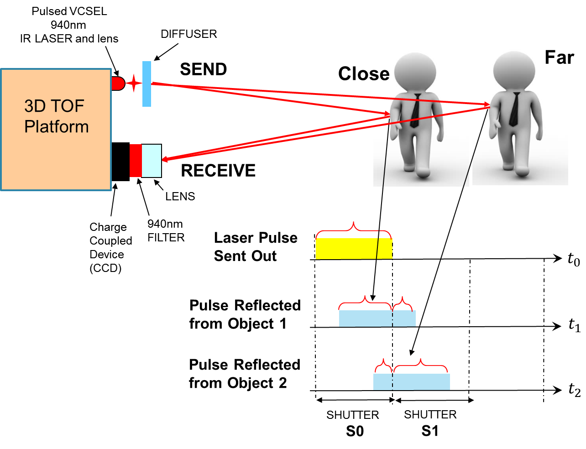

  Exemplification of ToF camera :label:`tof`

ToF specific imaging
++++++++++++++++++++
.. TL part

The 2D image processing part
is a customized IR image module based on transfer learning for bounding box estimation, 
skeleton extraction and hardware specific model translation.
The latter is relevant in order to have a light-weight embedded solution running on limited floating-point precision hardware platforms such as Jetson Nvidia Family. 
As the existing CNN models are mainly with the focus on colour images, thus ones has to adopt transfer learning as a method to finetune the existing CNN models such as VGG, MobileNet for the infrared or depth images specific to ToF cameras. 
This solution seemed to be effective in terms of precision and runtime on embedded devices (e.g Jetson NX or AGX). 
For the skeleton detection part we relied on the real-time Tensorflow optimized module for the Jetson product family, however for the generic GPU enabled devices we had to tailor our models since these are custom solutions.

Custom pipeline for ToF data
++++++++++++++++++++++++++++
The main role of the depth image preprocessing part is the filtering and bounding box estimation for the 3D ROI. 
The filtering is essential for the embedded device in order to reduce the computational overload. 
For the filtering pipeline we considered three interconnected filters: voxel, pass-through and outlier filter as this is visible in Figure :ref:`filters`. All these implementations are open source library  based variants. The details of the filtering were reported in :cite:`tamas2021embedded`.

   
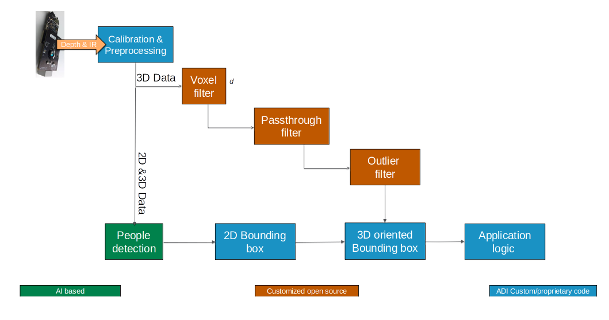

  Processing pipeline for ToF camera :label:`filters`

Low level ToF image pre-processing - ToFNest
++++++++++++++++++++++++++++++++++++++++++++
.. MSz part

In ToFNest we are approximating surface normals from depth images, recorded with Time-of-Flight cameras. The approximation is done using a neural network. The base of our neural network is the PyTorch library, since the whole process is done using Python 3.6 as our programming language. Using PyTorch we have created a Feature Pyramid Network type model (:cite:`FPN2017`).

The main pipeline of the data was the following: 
first we read the depth images with OpenCV (alongside 
the depth information we could also use the infrared 
information or the rgb information from the camera as well,
thus adding more information to work with), 
then we prepare them with numpy. From a numpy array it is easy 
to convert it to a torch tensor on the GPU, which then creates 
the predictions about the surface normals. 
An example of the prediction can be seen in Figure :ref:`tofnest`, 
where the direction of the normal vectors are decoded with RGB images. 

The following code represents the loss: 

.. code-block:: python

    pred=pred*2-1
    gt=gt*2-1
    inner_product = (pred * gt).sum(dim=1).unsqueeze(1)
    cos = inner_product / 2
    angle = torch.acos(cos)
    if not args.orient_normals:
        angle[angle>1.57]=3.14-angle[angle>1.57] 
    loss = torch.mean(angle)
    return loss

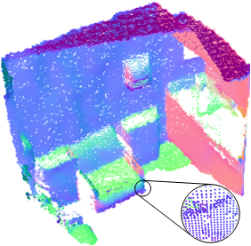

  Exemplification of ToF normal estimation :label:`tofnest`

The results were accurate relative to other techniques, but the time was much less. The time being less means that at least 100 times faster. This can be due to the fact, that this method works with images, instead of point clouds as other methods do. This makes it much faster, as this was reported in :cite:`iros2021`.

Our method was evaluated by verifying only the angles between the lines, not the exact directions of the vectors (this was the case in the other methods as well), but we can train that, although the results are going to get worse.

Furthermore, in order to get a real-time visualization about the predictions, we used rospy to read the images from ROS topics, and also to publish the normal estimation values to another ROS topic, that we could visualize using Rviz. This can be seen in the demo video. 

Low level ToF image pre-processing - ToFSmooth
++++++++++++++++++++++++++++++++++++++++++++++

This whole pipeline and network, with some minor modifications can be also used to  smoothen the depth image, thus making the point cloud smoother as well.

For the dataset we added gaussian noise of 5 and 10 cm to the original data, while we smoothed the original data with PointCloudDenoising (:cite:`pistilli2020learning`) method.

Our method got pretty close to the ground truth value, in most of the cases. Although, in the case of the original (originally fairly smooth) data resulted slightly worse results, then some other methods (for instance the PointCloud Library :cite:`Rusu_ICRA2011_PCL`), when we tested the smoothing for much more noisy data, our results barely changed, while other methods were highly compromised. A comparison between these cases can be seen in the next image 3 images:

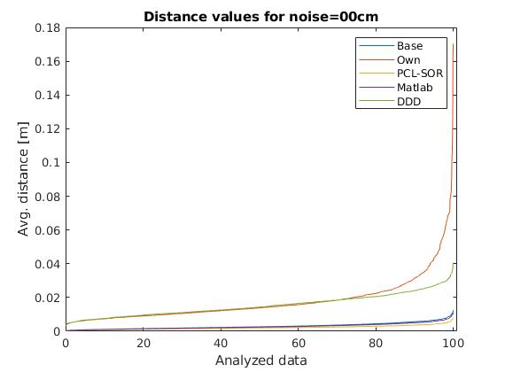

  The average error for the original data :label:`noise00`

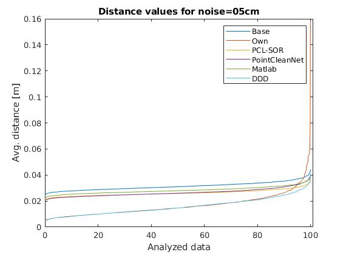

  The average error for data with 5 cm gaussian noise :label:`noise05`

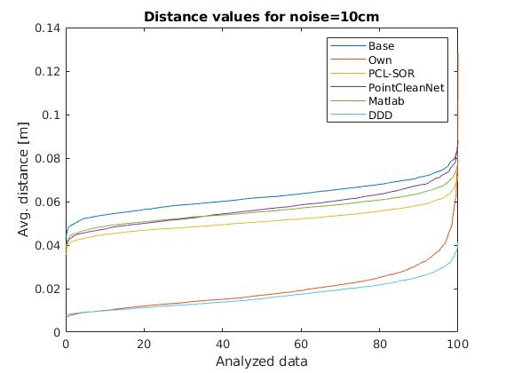

  The average error for data with 10 cm gaussian noise :label:`noise10`

Here we can see that our method kept very much the same throughout all the cases same as DeepDepthDenoising method (:cite:`sterzentsenko2019denoising`), which is the only other method that we have found, that works with depth images as well, making it about the same as ours, but a little bit more polished. Also this method performs at the same speed as ours.

The jump in the error at the end of the scale is due to some denormalization bias that we need to fine-tune. 

.. PCL based pipeline for ToF.

CNN based solutions
-------------------
In this part we describe in details the person detection, action recognition and volumetric estimation applications.

Person detection from IR imaging
++++++++++++++++++++++++++++++++

DetectNet is a detection algorithm based on the jetson-inference repository with people detection focus presented in :cite:`tracking2016` or :cite:`XUE201670`. 
This repository uses NVIDIA TensorRT for efficient implementation of neural networks on the Jetson platform, improving performance and energy efficiency through graphical optimizations, kernel fusion and FP16/INT8 accuracy.

Object detection requires a lot of information for training. DetectNet uses a large dataset, and each image contains multiple objects. For each object in the image, the trained model must detect both the object and the corner coordinates of the bounding box. Since the number of objects can vary in the training image set, it would be difficult to define the loss function if we  choose the label format with variable length and dimensionality. This problem has been solved by introducing a 3-dimensional label format that enables DetectNet to ingest images of any size with a variable number of objects present.

In the Figure :ref:`archdetectnet` you can see the architecture for the training process, which is based on 3 important steps:

* data layers ingest the training images and labels
* a fully-convolutional network (FCN) performs feature extraction and prediction of object classes and bounding boxes per grid square
* loss functions simultaneously measure the error in the two tasks of predicting the object coverage and object bounding box corners per grid square

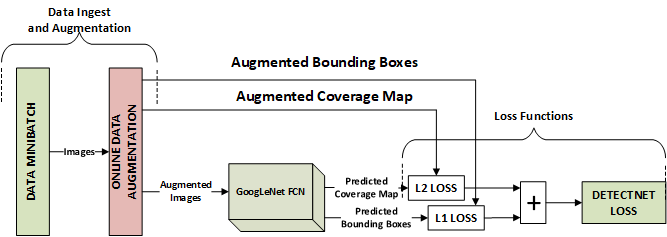

  DetectNet structure for training :label:`archdetectnet`

In the final layers of DetectNet the openCV groupRectangles algorithm 
is used to cluster and filter the set of bounding boxes generated for 
grid squares with predicted coverage values greater than or equal to 
gridbox_cvg_threshold, which is specified in the DetectNet 
model definition prototxt file.

DetectNet also uses the “Python Layers” interface 
to calculate and output a simplified mean Average Precision (mAP) score
for the final set of output bounding boxes. 
For each predicted bounding box and each ground truth 
bounding box the Intersection over Union (IoU) 
score is computed. IoU is the ratio of the overlapping areas of 
two bounding boxes to the sum of their areas.

The pre-trained model accepts 3 channel images – RGB, 
by modifying the existing model, we have managed to detect 
and track people on the infrared image – 1 channel. 
With the help of the OpenCV library and the 3.7 Python 
programming language version, we have developed a script 
that modifies the contrast of the IR image; 
thus, we obtained a much better result than if we had not used 
this approach. This result can be seen in 
the Figure :ref:`detection`, where we can see that the people 
are detected on the IR image with high confidence.

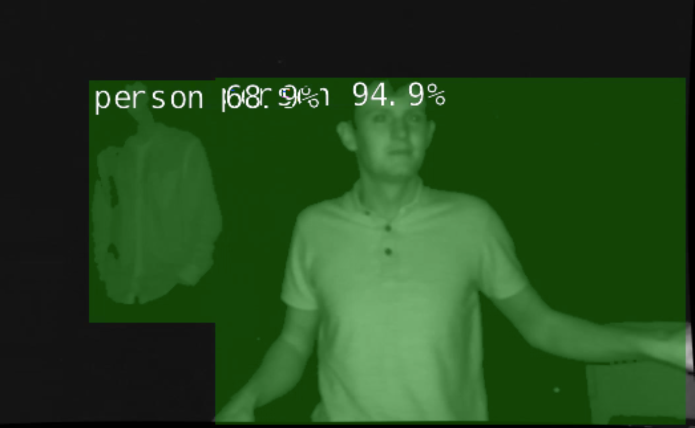

  Exemplification of people detection on infrared images based detection :label:`detection`

To be able to run the algorithm in real-time we used the rospy client. With the help of this API, we have developed an efficient way to pass a ROS topic as input to our model. The algorithm was tested on a Jetson AGX, and the camera used was from Analog Devices (AD-96TOF1-EBZ). The result can be seen in the attached demo video.

Action recognition from IR images
+++++++++++++++++++++++++++++++++
.. PM part

This is a small tutorial for detecting the skeleton, or rather 
an approximation of the joints of a person, from an infrared image. 
In our setup we used one of the Analog Devices
Time-of-Flight cameras, which provided us the infrared image, and an
NVIDIA Jetson Xavier NX board, which is a compact system-on-module (SOM),
very well suited for model inference.

As a baseline architecture model, we used the pretrained model from one
of the NVIDIA-AI-IOT's repositories: https://github.com/NVIDIA-AI-IOT/trt_pose .
We used the TensorRT SDK in order to optimize our pretrained 
model for the Jetson Xavier NX platform, thus achieving 
a better performance in our model inference pipeline.

We also used, some of the Robot Operating System's (ROS) tools for retrieving
the camera infrared images and by using the rospy client library API
we managed to transfer our infrared images to the network's model. While this
would have been an easy step using the CvBridge library, which provides an interface
between ROS and OpenCV, this time was not the case, as we had some issues with
this library. Because we are working on Jetson Xavier NX board, which comes with
the latest OpenCV version, and CvBridge uses at its core an older version of
OpenCv, we replaced the conversion from sensor_msgs/Image message type to the 
OpenCv image array made by CvBridge with a very useful numpy functionality 
which allowed us to make this conversion flawlessly, while still achieving the same functionality
and performance, because in fact, this was only a slight alteration of the underlying Python
implementation of the CvBridge package. So, we replaced:

.. code-block:: python

   ir_image = CvBridge().imgmsg_to_cv2(image_msg,-1)

with:

.. code-block:: python

   ir_image = numpy.frombuffer(
   image_msg.data,
   dtype=numpy.uint8).reshape(
                           image_msg.height,
                           image_msg.width,
                           -1)

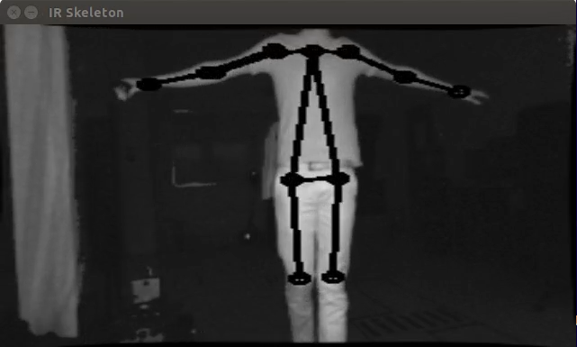
  
  Exemplification of skeleton detection on infrared images :label:`skeleton`

After making this conversion, we preprocessed the infrared image before 
feeding it to the neural network, using the OpenCv library. 
After this step we supply the model input with this preprocessed image, and
we obtained the results which can be seen in the Figure :ref:`skeleton`.

Furthermore, as a side quest, because we tested the TensorRT SDK and we saw some 
good results in our model's inference, we decided
to extend the infrared people detection application
by integrating it with NVIDIA's Deepstream SDK. While this SDK
brings further optimization to our model's inference performance and optimize 
the image flow along the inference pipeline by transferring the image on GPU
for any kind of preprocessing required before it enters the model and even 
allowing us to serve multiple images, from multiple cameras, without a very 
drastic change in the model's inference speed. Even though these functionalities
are important, we were interested by another functionality which the Deepstream SDK 
supports, this being the fact that is able to provide communication with a server 
and transmit the output of the neural network's model, which runs on the Jetson platform,
to the server, for further data processing. 
This can be very useful in applications where we want to gather some sort of 
statistics or when our application has to make some decisions based on the 
output of our trained model, but we don't want to affect the 
Jetson's inference performance by overwhelming it with other processes. 
In the Figure :ref:`deepstream`, can be seen the result of the people 
detection algorithm made by using the Deepstream SDK, and below is the network's
output received on our custom configured server when a person is detected:

.. code-block:: json

  {
  "object" : {
  "id" : "-1",
  "speed" : 0.0,
  "direction" : 0.0,
  "orientation" : 0.0,
  "person" : {
    "age" : 45,
    "gender" : "male",
    "hair" : "black",
    "cap" : "none",
    "apparel" : "formal",
    "confidence" : -0.10000000149011612
  },
  "bbox" : {
    "topleftx" : 147,
    "toplefty" : 16,
    "bottomrightx" : 305,
    "bottomrighty" : 343
  },
  "location" : {
    "lat" : 0.0,
    "lon" : 0.0,
    "alt" : 0.0
  },
  "coordinate" : {
    "x" : 0.0,
    "y" : 0.0,
    "z" : 0.0
  }
  }

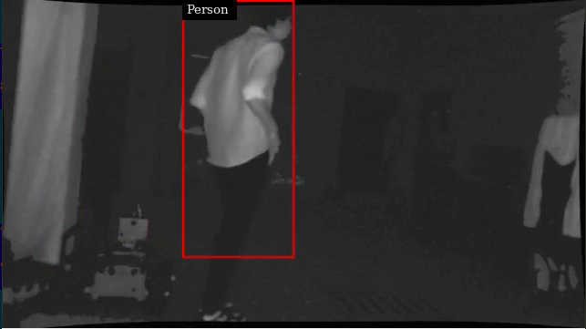

  People detection algorithm running with the Deepstream SDK on the Jetson Xavier NX board :label:`deepstream`

Volumetric estimates for depth images
+++++++++++++++++++++++++++++++++++++
.. PA part

The goal of this research is to estimate the volume of objects using 
only depth images recorded with Time-of-Flight cameras. 
As a simplifying feature, we consider only box shaped objects, 
with clearly definable perpendicular planes. 
Two methods have been determined.The first method uses RANSAC algorithm 
to detect planes while the other one uses the ideas from :cite:`sommer2020`. 

The first algorithm iteratively finds the largest plane using RANSAC 
and uses euclidean extraction to remove it from the point cloud. Once the planes are determined and checked to see if they are perpendicular, the intersection lines of the planes are determined by projecting between them. The projections approximate a line and the points with the largest component difference determine the length of the line. This way iteratively the 3 intersecting line lengths can be determined once the planes are determined and checked for orthogonality.

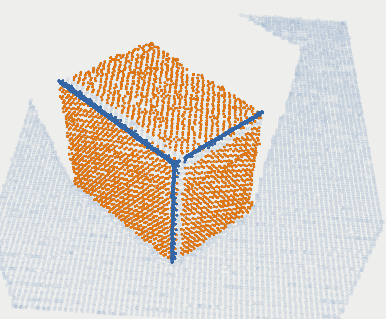
  
  Planar detection :label:`plamar`

An important observation is that it can compute the volume using 2 planes instead of 3. This is due to the fact that if 2 planes are orthogonal, the common line between them will be determined by 2 points that are also corner points for the object. By selecting a corner point and the two perpendicular planes, a third plane can be determined that is perpendicular to the other two and it contains the chosen point. Once the virtual third plane has been computed, the algorithm resumes as in the case with 3 determined planes.

An advantage of this method is that it uses readily available 
and studied functions for processing pointclouds. 
For a simple case of a box and floor plane, 
the algorithm accuracy depends on the level of noise 
the pointcloud has. The following code snippets ilustrate 
the functionality of the Planar Segmenting Volume computation method 
using 2 planes.

.. code-block:: python
    :linenos:

    def volume_main(perp_thresh,min_nr_points,input_pcd)
    floor=pcl_Planar_Ransac(input_pcd)
    input_pcd=Euclidean_extraction(input_pcd)
    if (pcl_Planar_Ransac(input_pcd)>min_nr_points)
       plane_1=Planar_Ransac(input_pcd)
    input_pcd=Euclidean_extraction(input_pcd)
    if(pcl_Planar_Ransac(input_pcd)>min_nr_points)
      plane_2=pcl_Planar_Ransac(input_pcd)
    if(cos(plane_1 * plane_2)<perpendicular_threshold>)
      Volume=compute_volume_2_planes(plane1_plane2)
    else
      (p_A, p_B)=line_points(plane_1,plane_2)
      plane_3=com_perp_plane_point(plane_1,plane_2,p_A)
      if(cos(plane_1*plane_3)<perpendicular_threshold>)
        Volume=compute_volume_2_planes(plane_2,plane_3)
    

.. code-block:: python
    :linenos:

    def compute_volume_2_planes(plane_A,plane_B):
    (p_AB_1, p_AB_2)=line_points(plane_A,plane_B)
    plane_C=com_perp_plane_point(plane_A,plane_B,p_AB_1)
    (p_AC_1,p_AC_2)=line_points(plane_A,plane_C)
    (p_BC_1,p_BC_2)=line_points(plane_B,plane_C)
    L1=distance(p_AB_1, p_AB_2)
    L2=distance(p_AC_1, p_AC_2)
    L3=distance(p_BC_1, p_BC_2)
    Volume=L1*L2*L3
    

.. code-block:: python
    :linenos:

    def line_points(plane_A,plane_B):
    line_AB_pcd=pcl_project_inliers(plane_A,plane_B)
    line_BA_pcd=pcl_project_inliers(plane_B,plane_A)
    line_pcd=concat(line_AB_pcd,line_BA_pcd)
    (abs_diff_x,p_AB_1_x,p_AB_2_x)=max_diff_x(line_pcd)
    (abs_diff_y,p_AB_1_y,p_AB_2_y)=max_diff_y(line_pcd)
    (abs_diff_x,p_AB_1_z,p_AB_2_z)=max_diff_z(line_pcd)
    diff=max_diff(abs_diff_x,abs_diff_y,abs_diff_z)
    (pointA, pointB)=points_max_diff(diff)

The downside of this method is that it can compute the volume only for one box. Noise and other objects in the scene can totally disrupt the volumetric estimate.

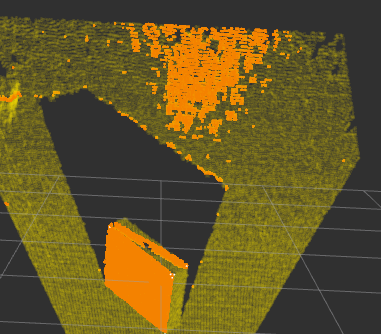

  Limitations of planar segmentation :label:`limitations`

Due to these shortcomings, a new method for measuring the volume is studied, 
based on the work by :cite:`sommer2020`. 
Their paper, details an algorithm that uses pointclouds with normals 
computed in each point in order to determine collections of point 
pairs for which their normals satisfy the orthogonality constraint.  
The point pair collections will approximate the orthogonal planes. 
By determining the points contained by each orthogonal plane, 
projections can be made that approximate the intersecting lines 
of the orthogonal planes. By selecting the 3 lines that have 
the edge points closest to each other, volume of a box can be computed.
The advantage of this method is that it allows the computation 
of the volume for multiple box shaped objects. 
The following code snippets show the usage of the 
Sommer's plane determination method to compute the volume.

.. code-block:: python
    :linenos:

    def comp_vol_ortho(pcd,dmin,dman,votes,seg,thresh):
    all_lines=sommer_planes(pcd,dmin,dman,votes,seg)
    all_triplets=find_line_triplet(thresh,all_lines)
    for i in all_triplets:
      line_1=distance(all_triplets[i][0])
      line_2=distance(all_triplets[i][1])
      line_3=distance(all_triplets[i][2])
      Volume[i]=line_1*line_2*line_3

.. code-block:: python
    :linenos:

    def find_line_triplet(thresh):
    for i in range(0,size(all_lines-3)):
     for j in range(i+1,size(all_lines-2)):
      for k in range(j+1,size(all_lines-1)):
       avr_p=(all_lines[i]+all_lines[j]+all_lines[k])/3
       if dist_each_to_avr(avr_p)<threshold:
          add_triplet(all_triplets)
    

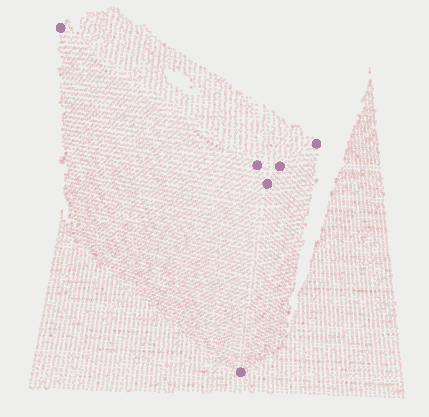

  Corner detection :label:`corner`

Volume estimation using enhanced planar/corner detections 
was done using the training from :cite:`sommer2020`. 
The largest benefit of this method is that it does not 
rely on RANSAC and it can compute the volume for multiple objects. 

This permits in further research to consider the idea of moving 
the camera in such a way to improve the volumetric measurement of multiple objects. 
This problem statement becomes equivalent to a Next Best View problem in 
which the view must optimize the accuracy or availability of a volumetric measurement. 
This translates to the question "In which of the available positions 
does the camera need to be placed next in order to improve the volumetric measurement". 
A starting point for such an idea would be to use the 
neural network architecture used in :cite:`zeng2020pc`, 
but change the loss function's objective from reconstruction 
to volumetric accuracy. By creating a scoring function for 
the volumetric accuracy, candidate new positions might be evaluated and chosen based on the input pointcloud.

Conclusion
----------
In this paper we provided some guidelines for the ToF specific image processing 
using Python libraries. The demos are ranging from 
basic pointcloud processing to people detection and enhanced volume estimation.

Acknowledgement
---------------
The authors are thankful for the support of Analog Devices Romania, 
for the equipment list (cameras, embedded devices, GPUs) offered as support 
to this work. 
This work was financially supported by the Romanian National Authority 
for Scientific Research, CNCS-UEFISCDI, project number PN-III-P2-2.1-PTE-2019-0367.
The authors are thankful for the generous donation from NVIDIA corporation for supporting this research.
