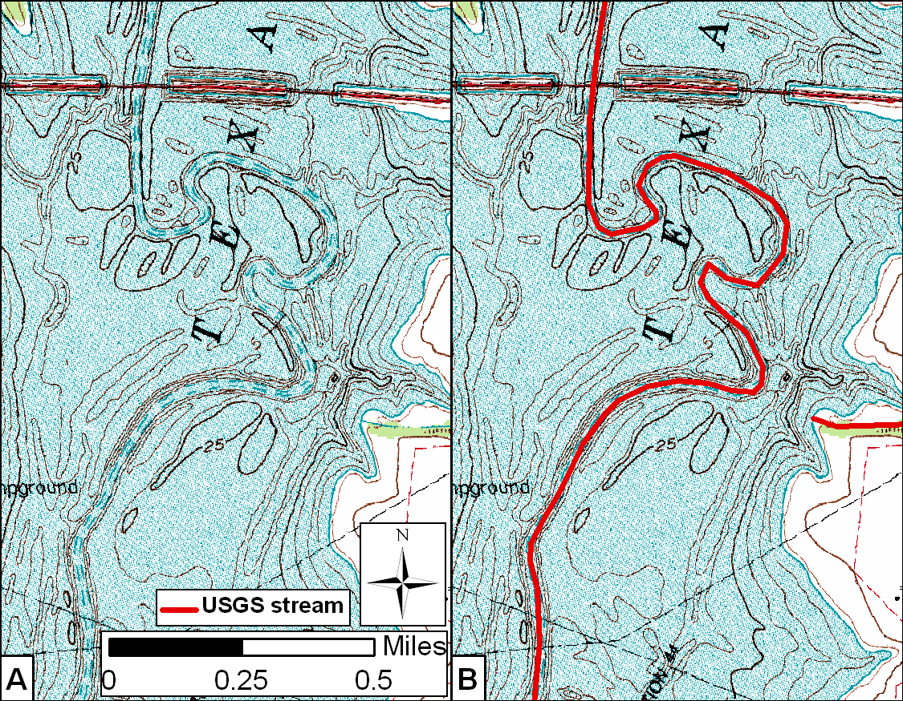
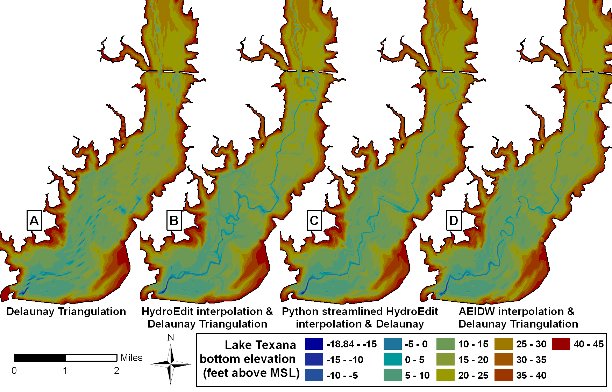

:author: Tyler McEwen
:email: tyler.mcewen@twdb.state.tx.us
:institution: Texas Water Development Board

:author: Dharhas Pothina
:email: dharhas.pothina@twdb.state.tx.us
:institution: Texas Water Development Board

:author: Solomon Negusse
:email: solomon.negusse@twdb.state.tx.us
:institution: Texas Water Development Board

----------------------------------------------------------------------------
Improving efficiency and repeatability of lake volume estimates using Python
----------------------------------------------------------------------------

.. class:: abstract

   With increasing population and water use demands in Texas, accurate estimates of lake volumes is a critical part of planning for future water supply needs. Lakes are large and surveying them is expensive in terms of labor, time and cost. High spatial resolution surveys are prohibitive to conduct, hence lake are usually surveyed along widely spaced survey lines. While this choice reduces the time spent in field data collection, it increases the time required for post processing significantly. Standard spatial interpolation techniques available in commercial software are not well suited to this problem and a custom procedure was developed using in-house Fortran software. This procedure involved difficult to repeat manual manipulation of data in graphical user interfaces, visual interpretation of data and a laborious  manually guided interpolation process. Repeatibility is important since volume differences derived from multiple surveys of individual reservoirs provides estimates of capacity loss over time due to sedimentation. Through python scripts that make use of spatial algorithms and GIS routines available within various Python scientific modules, we first streamlined our original procedure and then replaced it completely with a new pure python implementation. In this paper, we compare the original procedure, the streamlined procedure and our new pure python implementation with regard to automation, efficiency and repeatability of our lake volumetric estimates. Applying these techniques to Lake Texana in Texas, we show that the new pure python implementation reduces data post processing time from approximately 90 man hours to 8 man hours while improving repeatability and maintaining accuracy.

.. class:: keywords

   gis, spatial interpolation, hydrographic surveying, bathymetry, lake volume,
   reservoir volume, anisotropic, inverse distance wieghted, sedimentation

Introduction
------------

With increasing population and water use demands in Texas, accurate estimates of lake volumes is a critical part of planning for future water supply needs. In order to correctly manage surface water supplies for the State of Texas, it is vital that managers and state water planners have accurate estimates of reservoir volumes and capacity loss rates due to sedimentation. To address these issues, in 1991 the Texas Legislature authorized the Texas Water Development Board (TWDB) to develop a cost-recovery hydrographic surveying program. The program is charged with determining reservoir storage capacities, sedimentation levels, sedimentation rates, and available water supply projections to benefit Texas. Since its inception, staff in the hydrographic survey program have completed more than 125 lake surveys. Included in each survey report are updated elevation-area-capacity tables and bathymetric contour maps.

Lakes are large and surveying them is expensive in terms of labor, time and cost. Over the years, the Texas Water Development Board (TWDB) has settled on a 500 ft spacing of survey lines oriented perpendicular to an assumed relic stream channel for hydrographic data collection as a good balance between survey effort and level of data coverage. While this choice reduces the time spent in data collection, it significantly increases the time needed for post-survey processing. Currently, a typical major reservoir (greater than 5,000 acre-feet) survey can consume anywhere between 1 to 7 weeks of time in field data collection and 2 to 8 weeks of time in data post-survey processing before a volumetric estimate is available. 

Volumetric estimate algorithms available in commercial software are usually based on the Delaunay triangulation method for actual survey points bounded by digitized lake boundary at a known elevation. When applied to data collected with widely spaced survey lines, these techniques tend to underestimate the true volume of the lake. To overcome this issue, TWDB preconditions the survey point dataset by inserting additional artificial points in between survey lines and using directional linear interpolation to estimate the bathymetry at the inserted points. Delaunay triangulation of the resulting dataset gives a more accurate estimate of lake volume. This technique makes use of the assumption that the profile of the lake between each set of survey lines is similar to that of the survey lines. Figure REF shows the improvement in the representation of the bathymetry of the lake that can be obtained by such preconditioning. Previous surveys have shown that the improved bathymetric representation of the lake increase volume estimates [Furn08]_.

While effective in improving volume estimates, this technique as currently implemented has a number of flaws. Notably, it depends on exact positions of survey points and hence is difficult to apply repeatibly for repeat surveys of lakes. In addition, it requires manual visual interpretation and manipulation of data in graphical user interfaces as well as a laborious guided interpolation process.

Standard TWDB Surveying Technique
---------------------------------

TWDB hydrographic surveys are conducted using a boat mounted single beam multi-frequency (200, 50 and 24 kHz) sub-bottom profiling sonar echo sounder integrated with differential global positioning system (DGPS) equipment along preplanned survey lines. Survey planning, operationally defined here as the spacing and orientation of pre-planned survey lines, is likely to affect volumetric calculations if there are notable bathymetric changes between surveyed lines. In many cases, however, reservoir bathymetry will not be known before the survey, and survey lines must be planned based on an interpretation of the reservoir shape in map-view and the presumed location and orientation of the submerged stream channel. Previous TWDB surveys have been conducted using lines spaced at from 100 ft to 1000 ft intervals [TWDB06]_ [TWDB09]_ [TWDB09b]_. Analyses of these surveys showed that greater volumes are obtained from surveys conducted with higher density line spacin. However, with suitable post processing the lower 500 ft resolution survey density is sufficient to accurately estimate the volume of the lake [Furn06]_ [Furn10]_. 

   Survey lines used for the 2010 hydrographic survey of Lake Texana :label:`data`

Figure :ref:`data` exibits TWDB standard bathymetric survey data collection along survey lines spaced 500 feet apart and oriented perpendicular to the assumed location of the submerged river channel (usually taken to be along the centerline of the lake). Radial lines are utilized when the shape of the lake and presumed shape of the submerged river channel curve. Data post processing is then used to improve the representation of the bathymetry between survey lines.

Data processing with HydroEdit
------------------------------

Over the years, the TWDB has developed several post processing routines that have been packaged together in an in-house Fortran program, HydroEdit. HydroEdit contains modules to integrate boat GPS and sonar bathymetric data, calculate sediment thicknesses, extrapolate into regions with no survey data, convert data between projected and geographic coordinate systems, merge data files and generate the preconditioned dataset for volumetric estimates [Furn06]_ [Furn08]_. 

.. figure:: SS_example.png

   Example of a single HydroEdit guided interpolation :label:`ssexample`

One of the primary functions of the Hydroedit is to perform is to insert extra artificial survey points and interpolate bathymetric data to those points. Using ArcGIS software, areas of desired interpolation from one survey line segment to an adjacent survey line segment are visually located and their point identification numbers are manually recorded into a text file along with parameters that control the number of artificial survey lines to be inserted between the adjacent survey lines and the density of points to be inserted on each artificial survey line. HydroEdit then linearly interpolates the bathymetry from the adjacent survey line segments to the points on the artificial segments. In addition, HydroEdit allows for more complicated interpolations for locations where there is evidence that where a river may curve or double back between survey lines. These require more complicated procedures that include the creation and export of a polygon feature in ArcGIS, as well as text entries in the HydroEdit input file. Figure :ref:`ssexample` shows an example of the visual inspection required for a single HydroEdit interpolation between adjacent survey line segments. The portion of the input text file corresponding to this interpolation is as follows::
    
    Section1
    53 54 0
    Section2
    53 79049 79060 3 0
    54 78326 78315 3 0

This procedure has to be followed for every pair of adjacent survey lines in the dataset. In some cases, survey lines must be broken into multiple segments in order to capture a relic river channel than may require interpolation in a direction different from the rest of the transect. This is laborious work and is the cause of the majority of the time consumed in the data post-survey processing. The dependance of the technique on 4 individual survey points on adjacent survey line segments makes the interpolation survey specific requiring that new input files be created if a lake is resurveyed. This is both time consuming and prone to parts of the lake bathymetry being interpolated differently in repeat surveys. In addition, the technique starts to break down when survey lines intersect or are at sharp angles to each other. In addition, the density of the inserted artificial interpolated survey points is not consistent across the lake with some areas of high density and other areas of no interpolations. This is demonstrated in Figure :ref:`interps`.

Line-automated HydroEdit Using Python
-------------------------------------

Seeking to improve upon the lengthy and tedious process required to manually create a HydroEdit input text file, Python was utilized to automatically generate the HydroEdit input text file after manually drawing paired interpolation guide-lines in ArcGIS. This technique was named line-automated HydroEdit and was an interim step used to improve efficiency without having to abandon the HydroEdit codebase.

The line-automated HydroEdit algorithm is implemented through these simplified steps. Initially, the paired interpolation guide lines are drawn as polyline features and associated attribute fields are populated in ArcGIS. The attribute fields control interpolation options required in the HydroEdit input file. Next, the density of vertices for the interpolation guide lines is increased to ensure identification of the intersections with survey points. The intersection of the paired interpolation guide lines and survey lines are found efficiently using the KDTree algorithm available in scipy.spatial. Once the intersection points are identified the polyline attributes are used along with survey line metadata to autogenerate the corresponding entries in the HydroEdit input file. Figure :ref:`autopop` shows examples of paired guide lines used for the Line-automated HydroEdit interpolation of Lake Texana.

   Line-automated polygons and polylines for the lower portion of Lake Texana :label:`autopop`

Anisotropic Elliptical Inverse Distance Weighting (AEIDW)
---------------------------------------------------------

Merwade discusses at length how river channel bed morphology is anisotropic in that the bathymetric variability is greater transverse to the flow direction than along the flow direction. In addition, the direction of this anisotropy is not consistent; it varies with the orientation of the channel as exhibited by any sinous channel. He proposes and elliptical inverse distance weighting algorithm that follows this anisotropy as a simpler and computationally more efficient technique than anisotropic kriging [Merw06]_. AEIDW involves first transforming the survey point dataset from cartesian coordinates to a flow oriented *s-n* coordinate system; Where *n* is the perpendicular distance of a point from a defined channel centerline and *s* is the distance along the centerline. Looking downstream points to the left of the centerline are assigned a positive *n* and points to the right a negative *n*, *s* is always positive. Since the flow direction is now always along the *s* coordinate, this transformation has the effect of removing the variation in direction of anisotropy.

Inverse Distance Weighting(IDW) is a form of interpolation the value at a point is approximated by a weighted average of observed values within an circular search neighborhood, whose radius is defined by the range of a fixed number of closest points. A common weighting function is the inverse of the distance squared. Elliptical Inverse Distance Weighting(EIDW) modifies the search radius to an ellipse by modifying the distance used in IDW by an elliptical measure of distance. By orienting the mmajor axis of this ellipse along the *s* axis where the topographic variability is lower, a point along the direction of flow will have greater predictive control at the point of interest than one transverse to flow at the same distance. 

To increase the computational efficiency of the algorithm, rather than calculate the elliptical measure of distance, we multiply the *n* coordinates of the transformed dataset by the inverse of the ellipse's eccentricity. This trick along with the use of a KDTree to find the points within the search radius make the python implementation of AIEDW significantly faster than regular IDW interpolation algorithms in commerical packages.

Applying AEIDW to a Lake
------------------------

The AEIDW python implementation was originally designed to generate bathymetric representations of river channels. For lakes, the technique is by segmenting the lake and applying AEIDW to each segment. For each lake segment a centerline polyline and a bounding polygon is drawn in ArcGIS. In practice, a segment is drawn for the original river channel, the main stem of the lake and each of the secondary stems. A high resolution grid of artificial survey points is generated that covers the entire lake. A python script cycles through the segments and applies AEIDW based on the segment centerline and interpolates data survey lines to artificial survey points that lie within the segment bounding polygon. Figure :ref:`polys` shows the polygons and associated polylines for the lower portion of Lake Texana.

   AEIDW segment polygons and centerline polylines for the lower portion of Lake Texana :label:`polys`

Lake Texana
-----------

The Palmetto Bend Dam was completed in 1979, impounding the Navidad River and creating Lake Texana [TWDB74]_. At approximately 9,727 acres, Lake Texana is a small to medium major reservoir in Texas; the minimum acreage of major reservoirs in Texas is 5,000 acres.

TWDB collected bathymetric data for Lake Texana between January 12 and March 4, 2010. The daily average water surface elevations during that time ranged between 43.89 and 44.06 feet above mean sea level (NGVD29). During the survey, team mbers collected nearly 244,000 individual data points over cross-sections totaling approximately 160 miles in length. Figure 2 shows where data collection occurred during the survey.

Figure :ref:`channel` (A) below shows the USGS 24,000 scale topographic map and USGS delineated stream channel. Figure :ref:`channel` (B) shows the TWDB delineation of USGS stream channel. These maps where used to guide the drawing of the Line-automated HydroEdit guide lines and the AIDW river centerline. This type of information is alwailable for some lakes in Texas, but not all.

   USGS topographic map with delineated stream channel (A) and TWDB delineation of USGS stream channel of Lake Texana :label:`channel`

Results
-------

As a baseline for comparison, using HydroEdit, Lake Texana had approximately 3050 manually entered interpolations requiring approximately 90 man hours to complete. The overall increase in the estimated volume due to this post processing was 3.11%. In comparing methods,first we look at density and distribution of artificial survey points in the three methods. As can be seen from Figure :ref:`interps`, both the HydroEdit and the Line-automated HydroEdit methods have inconsistant point density. However much care is taken, the dependence of the basic HydroEdit technique on pairs of points on adjacent survey lines inevitably causes large variations in the artificial survey line density. These means that certain regions of the lake may not be interpolated well. The AEIDW technique on the otherhand allows for uniform point density throughout the each lake segment and allows for increased density in highly variable areas like near the stream channel.

   Comparison of artificial survey point density :label:`interps`

Figures :ref:`lowerfig`, :ref:`upperfig`  and :ref:`closefig`, compare bathymetric contour maps of the lower, upper part of the lakes and as well as an area of high channel sinuousity respectively. The comparisons of the lower and upper regions of the lake show that all three methods capture the major features of the lake reasonably well. HydroEdit, AEIDW do an excellent job of delineating the main stem river channel along with its sinuosity, while line-automated Hydroedit is able to capture the major features but not the details. This becomes even more evident when we look at Figure :ref:`closefig`, here it can be seen that HydroEdit and AEIDW are able to correctly connect the deep areas in the original survey data into the sinous relic stream channel that can be seen on the USGS topographical maps. 

   
   Comparison of Interpolation Methods for the lower part of Lake Texana :label:`lowerfig`

.. figure:: interp_compare_upper_4.png

   Comparison of Interpolation Methods for the upper part of Lake Texana :label:`upperfig`

.. figure:: interp_compare_close_4.png

   Comparison of interpolation methods for a section of Lake Texana with a sinous channel :label:`closefig`

Differences can also be seen between all three methods near the lake boundaries. This is due to a difference in the current omplementations of extrapolations to the shore between the three methods and does not effect the volume estimates significantly.

.. table:: Comparison of interpolation methods. :label:`voltable`

   +---------------------------+-------------+---------------+-------------+
   | Interpolation Method      | Volume      |  Increase in  | Hours for   |
   |                           | (acre-feet) |  Lake Volume  | completion  |
   +---------------------------+-------------+---------------+-------------+
   | Delaunay Triangulation    |   156,283   |      <-->     |     0       |
   +---------------------------+-------------+---------------+-------------+
   | HydroEdit                 |   161,139   |      3.27%    |     90      |
   +---------------------------+-------------+---------------+-------------+
   | Line-automated HydroEdit  |   159,845   |      2.28%    |     33      |
   +---------------------------+-------------+---------------+-------------+
   | AEIDW (eccentricity=1/25) |   161,693   |      3.46%    |     8       |
   +---------------------------+-------------+---------------+-------------+

Analysis shows a 63% reduction of processing time by using the line-automated HydroEdit method for Lake Texana when compared to the original HydroEdit method. Using the AEIDW method resulted in a 91% and 76% reduction of processing time when when compared to the original HydroEdit and line-automated Hydroedit methods. A summary and comparison table is presented in Table :ref:`voltable`. The table shows that all three methods add volume to the lake volumetric estimate. The volume added by the line-automated HydroEdit method is lower probably due to it not capturing much of the sinousity of the relic stream channel. The remaining variance between AIEDW and HydroEdit can be explained by differences in the way boundaries have been handled.

Conclusions
-----------

The pure python AEIDW method for estimating lake volumes shows a drastic increase in post-survey processing efficiency when compared to both the original HydroEdit method and the line-automated HydroEdit. In addition, the new technique is completely independant of the exact survey line locations, being defined completely by a best available description of lake morphology. This enhances the efficieny and accuracy of  volume estimates of repeat surveys of the same lake, thus also improving sedimentation rate analyses. 

The original HydroEdit fortran codebase ran over 10,000 lines of code (loc). by using available scientific, GIS and file handling modules available in Python the new suite of python tools being used for lake hydrographic survey analysis runs less than 1000 loc, besides being much easier for new staff to pick. This order of magnitude reduction in code complexity has allowed the the TWDB hydrosurvey program to rapidly innovate new techniques to improve the efficieny and accuracy of lake hydrographic surveys.

References
----------

.. [ESRI95] Environmental Systems Research Institute, 1995, *ARC/INFO Surface Modeling and Display, TIN Users Guide*, ESRI, 380 New York Street, Redlands, CA 92373.

.. [Furn06] Furnans, Jordan, 2006, *HydroEdit User's Manual*, Texas Water Development Board. 
           
.. [Furn08] Furnans, J. and B. Austin, 2008, *Hydrographic survey methods for determining reservoir volume*, Environmental Modelling and Software, Volume 23, Issue 2, February 2008, Pages 139-146, ISSN 1364-8152, DOI: 10.1016/j.envsoft.2007.05.011.
           
.. [Furn10] Furnans, J., D. Pothina, T. McEwen, and B. Austin, *Hydrographic Survey Porgram Assessment*, Texas Water Development Board, Austin, Texas 78711. 

.. [Merw04] Merwade V. and D. Maidment, *A GIS framework for describing river channel bathymetry*, Center for Research in Water Resources, J.J. Pickle Research Campus, University of Texas at Austin, Austin, TX 78712. 

.. [Merw06] Merwade V. M., Maidment D. R., and Goff J. A., Anisotropic considerations while interpolating river channel bathymetry. Journal of Hydrology, Vol.331(3-4), pp. 731-741 (2006).

.. [TWDB74] TWDB (Texas Water Development Board), 1974, *Iron Bridge Dam and Lake Texana*, Report 126, Engineering Data on Dams and Reservoirs in Texas, Part 1.
           
.. [TWDB06] TWDB (Texas Water Development Board), 2006, *Volumetric Survey of Lake Kemp*, TWDB, Austin, Texas 78711.
           
.. [TWDB09] TWDB (Texas Water Development Board), 2009, *Volumetric Survey of Aquilla Lake*, TWDB, Austin, Texas 78711.
           
.. [TWDB09b] TWDB (Texas Water Development Board), 2009b, *Volumetric Survey of Lady Bird Lake*, TWDB, Austin, Texas 78711.

