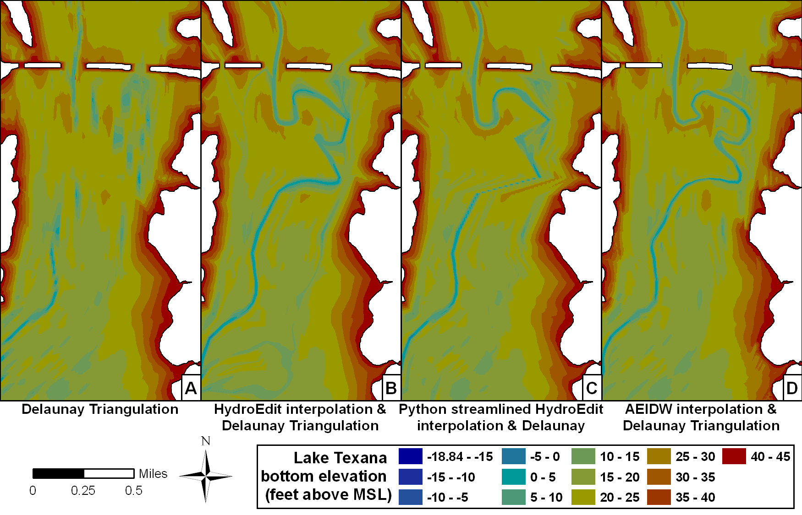

:author: Tyler McEwen
:email: tyler.mcewen@twdb.state.tx.us
:institution: Texas Water Development Board
:institution: Texas Water Development Board

:author: Dharhas Pothina
:email: dharhas.pothina@twdb.state.tx.us
:institution: Texas Water Development Board

:author: Solomon Negusse
:email: solomon.negusse@twdb.state.tx.us
:institution: Texas Water Development Board

----------------------------------------------------------------------------
Improving efficiency and repeatability of lake volume estimates using Python
----------------------------------------------------------------------------

.. class:: abstract

   With increasing population and water use demands in Texas, accurate estimates
   of lake volumes is a critical part of planning for future water supply needs.
   Lakes are large and surveying them is expensive in terms of labor, time and
   cost. High spatial resolution surveys are prohibitive to conduct, hence lakes
   are usually surveyed along widely spaced survey lines. While this choice
   reduces the time spent in field data collection, it increases the time
   required for post processing significantly. Standard spatial interpolation
   techniques available in commercial software are not well suited to this
   problem and a custom procedure was developed using in-house Fortran software.
   This procedure involved difficult to repeat manual manipulation of data in
   graphical user interfaces, visual interpretation of data and a laborious
   manually guided interpolation process. Repeatibility is important since
   volume differences derived from multiple surveys of individual reservoirs
   provides estimates of capacity loss over time due to sedimentation.
   Through python scripts that make use of spatial algorithms and GIS routines
   available within various Python scientific modules, we first streamlined our
   original procedure and then replaced it completely with a new pure python
   implementation. In this paper, we compare the original procedure, the
   streamlined procedure and our new pure python implementation with regard to
   automation, efficiency and repeatability of our lake volumetric estimates.
   Applying these techniques to Lake Texana in XX county, Texas, we show that
   the new pure python implementation reduces data post processing time from 90
   man hours to 8 man hours while improving repeatability and accuracy.

.. class:: keywords

   gis, spatial interpolation, hydrographic surveying, bathymetry, lake volume,
   reservoir volume, anisotropic, inverse distance wieghted, sedimentation

Introduction
------------

With increasing population and water use demands in Texas, accurate estimates of lake volumes is a critical part of planning for future water supply needs. In order to correctly manage surface water supplies for the State of Texas, it is vital that managers and state water planners have accurate estimates of reservoir volumes and capacity loss rates due to sedimentation. To address these issues, in 1991 the Texas Legislature authorized the Texas Water Development Board (TWDB) to develop a cost-recovery hydrographic surveying program. The program is charged with determining reservoir storage capacities, sedimentation levels, sedimentation rates, and available water supply projections to benefit Texas. Since its inception, staff in the hydrographic survey program have completed more than 125 lake surveys. Included in each survey report are updated elevation-area-capacity tables and bathymetric contour maps.

Lakes are large and surveying them is expensive in terms of labor, time and cost. Over the years, the Texas Water Development Board (TWDB) has settled on a 500 ft spacing of survey lines oriented perpendicular to an assumed relic stream channel for hydrographic data collection as a good balance between survey effort and level of data coverage. While this choice reduces the time spent in data collection, it significantly increases the time needed for post-survey processing. Currently, a typical major reservoir (greater than 5,000 acre-feet) survey can consume anywhere between 1 to 7 weeks of time in field data collection and 2 to 8 weeks of time in data post-survey processing before a volumetric estimate is available. 

Volumetric estimate algorithms available in commercial software are usually based on a Delaunay's method of triangulation for actual survey points bounded by digitized lake boundary at a known elevation. When applied to data collected with widely spaced survey lines, these techniques tend to underestimate the true volume of the lake.REF To overcome this issue, TWDB preconditions the survey point dataset by inserting additonal points in between survey lines and using directional linear interpolation to estimate the bathymetry at the inserted points. Delaunay triangulation of the resulting dataset gives a more accurate estimate of lake volume. This technique makes use of the assumption that the profile of the lake between each set of survey lines is similar to that of the survey lines. Figure REF shows the improvement in the representation of the bathymetry of the lake 
that can be obtained by such preconditioning. Previous surveys have shown that the improved bathymetric representation of the lake can increave volume estimates from XX to XX % depending on lake size and shape.

While effective in improving volume estimates, this technique as currently implemented has a number of flaws. Notably, it depends on exact positions of survey points and hence is difficult to apply repeatibly for repeat surveys of lakes. In addition, it requires manual visual interpretation and manipulation of data in graphical user interfaces as well as a laborious guided interpolation process.

Standard TWDB Surveying Technique
---------------------------------
TWDB hydrographic surveys are conducted using a boat mounted single beam multi-frequency (200, 50 and 24 kHz) sub-bottom profiling sonar echo sounder integrated with differential global positioning system (DGPS) equipment along preplanned survey lines. Survey planning, operationally defined here as the spacing and orientation of pre-planned survey lines, is likely to affect volumetric calculations if there are notable bathymetric changes between surveyed lines. In many cases, however, reservoir bathymetry will not be known before the survey, and survey lines must be planned based on an interpretation of the reservoir shape in map-view and the presumed location and orientation of the submerged stream channel. Previous TWDB surveys have been conducted using lines spaced at 250 ft intervals (TWDB, 2009b; TWDB, 2006), and at 500 ft intervals with selected areas of 100-ft spaced survey lines (TWDB, 2009c). Analyses of data collected on Lake Kemp indicate that greater volumes are obtained from surveys conducted with higher density line spacing, yet the volume increase is a result of the surface generation methodology used within ArcGIS (Furnans, 2006). reference LBJ REPORT

The TWDB standard bathymetric survey consists of data collection along survey lines spaced 500 feet apart and oriented perpendicular to the assumed location of the submerged river channel (usually taken to be along the centerline of the lake). Radial lines are utilized when the shape of the lake and presumed shape of the submerged river channel curve. Data post processing is then used to improve the representation of the bathymetry between survey lines.

Data processing with HydroEdit
------------------------------

Over the years, the TWDB has developed several post processing routines that
have been packaged together in an in-house Fortran program, HydroEdit. HydroEdit
contains modules to integrate boat GPS and sonar bathymetric data,
calculate sediment thicknesses, extrapolate into regions with no survey data,
, convert data between projected and geographic coordinate systems, merge data files and generate the preconditioned dataset for volumetric estimates [Furn06]_ [Furn08]_. 

The main function of the Hydroedit software is to perform bathymetric data
interpolations. Using ArcGIS software, areas of desired interpolation from one survey line segment to an adjacent survey line segment are visually located and their point identification numbers are manually recorded into a text file along with parameters that control the number of artificial survey lines to be inserted between the adjacent survey lines and the density of points to be inserted on each artificial survey line. HydroEdit then linearly interpolates the bathymetry from the adjacent survey line segments to the points on the artificial segments. In addition, HydroEdit allows for more complicated interpolations for locations where there is evidence that where a river may curve or double back between survey lines. These require more complicated procedures that include the creation of a polygon feature in ArcGIS, as well as text entries in the HydroEdit input file.

   Example of a single HydroEdit interpolation :label:`ssexample`
 
The text file for the HydroEdit interpolation requires two sections; the 
corresponding text for Figure :ref:`ssexample` is as follows::
    
    Section1
    53 54 0
    Section2
    53 79049 79060 3 0
    54 78326 78315 3 0

Streamlining HydroEdit Using Python
-----------------------------------

Seeking to improve upon the lengthy and tedious process required to manually
create a HydroEdit input text file, Python programming was utilized to
automatically generate the HydroEdit input text file using GIS line
shapefiles. 

GO INTO DETAIL HERE ABOUT AUTOPOPULATE ALGORITHM. 

Due to directionality requirements, data input procedures and
interpolations required between survey transects, multiple loops,
sorting, multiple KDtrees and attributing numerous variables to lines and points
was necessary to accommodate the existing requirements of the HydroEdit software.

Next, through the use of built in spatial algorithms, GIS routines available in
Python, and in-house Python scripts; automation, efficiency and repeatability
were introduced to lake volumetric estimates. The line automated interpolation
program improved efficiencies and speeded overall interpolations significantly,
however the program was limited and structured based on the necessary inputs to
the sequential HydroEdit software. The resulting interpolation point spatial
structure provided inconsistent point density.

COMBINE THE TWO PARAGRAPHS INTO ONE?    

Anisotropic Stretched Inverse Distance Weighting (ASIDW)
--------------------------------------------------------

Description of ASIDW algorithm for a channel. 
Assuming a single stream centerline and boundary.
Before running the ASIDW algorithm, a stream centerline polyline and stream 
boundary polygon shapefiles are created using commercial GIS software. The ASIDW 
algorithm uses Numpy to read in the (x,y,z) file of the 
stream survey points and Shapefile to read in the centerline 
polyline and boundary polygon. Then using an in-house module, the conversion
from the (x,y) coordinate system is initiated by defining the (s,n) coordinate 
system. From here the interpolation points grid can be created within the (x,y) 
or (s,n) coordinate systems. 

To create the interpolation points grid within the (x,y) coordinate system, 
Numpy.arange is used to create a list for x and y coordinates, from the minimum, 
to the maximum, with the desired grid spacing. Due to memory size restrictions
the grid must be split into managable sized chunks before processing. By looping 
through the chunks, the Numpy.meshgrid command creates the grid. Then, the chunk
interpolation points are eliminated if outside the boundary polygon using the 
nxutils.points_inside_poly command. The data points and the chunk grid are 
converted to the (s,n) coordinate system. Using a combination of KDtree and 
inverse distance weighting (IDW) called idw.Invdisttree, the ASIDW interpolation 
is completed using the following settings: nnear=16, eps=0, p=1, weights=None. 
The z values calculated for the (s,n) points are then attributed to the 
corresponding (x,y) points and the resulting (x,y,z) of the interpolation points 
are written to a .csv file. The result of the algorithm is a single .csv file 
containing the (x,y,z) values. 

The process is similar when creating the interpolation grid in the (s,n) 
coordinate system. First, the (x,y,x) survey data is converted to (s,n) 
coordinates. Based on the minimum and maximum s and n values as well as the 
desired grid spacing, s and n interpolation value lists are created using the 
Numpy.arange command. Based on memory restrictions, chunks are utilized to 
process the interpolations. The ASIDW interpolations are completed using the 
Idwtree with the following settings: nnear=16, eps=0, p=1, weights=None. The 
(s,n,z) iterpolation points are then converted from the (s,n) to the (x,y) 
coordinate system and written to a .csv file. 

Include image of s-n coordinate
conversion. Image of lake with ellipse oriented along direction of interpolation

Modifications to the ASIDW algorithm were necessary to apply the 
interpolation methodology to lakes. For lake ASIDW interpolations, multiple
polygons and associated centerlines are needed to simulate the network of stream 
reaches that existed prior to impoundment. Each of the polygon and centerline 
pairs are assigned matching identification and priority numbers. The matching 
identification numbers are to ensure the proper polygon and centerline are
used for each interpolation within the algorithm. The priority number allows the 
user to set the order in which the sections of the lake are interpolated. The 
ASIDW algorithm reads in the (x,y,z) survey data as an array using Numpy and the 
polygons and polylines are read in as a list using Shapefile, where both the 
polyline and polygon lists contains an array of verticies, the identification 
number, the priority number. The polygon list also contains a list of the 
bounding box vertices while the polyline list contains a grid spacing number 
which the user specifies. 

Once the information is arranged into the necessary data structures, the 
algorithm sorts the polyline and polygon lists based on the priority number.
Then it loops through the sets of polylines and polygons to perform the ASIDW
interpolation. For each set of polylines and polygons, the interpolation points 
grid is created in the (x,y) coordinate system by splitting into chunks and 
looping through the chunks as detailed above. However, before each chunk is 
transformed from (x,y) coordinates to the (s,n) coordinate system, interpolation
chunk points located within polygons with a higher priority number are eliminated, 
then interpolation points located outside the current polygon are eliminated. 
The remaining chunk points are transformed to the (s,n) coordinate system; 
the ASIDW interpolation is calculated at those locations; the calculated z values
are transfered to the cooresponding points in the (x,y) coordinates; and written 
to the .csv file.

Image of polygons & lines.

Write algorithm.

Lake Texana
-----------

The Palmetto Bend Dam was completed in 1979, impounding the Navidad River and creating Lake Texana [TWDB74]_. At approximately 9,727 acres (3,936 ha), Lake Texana is a small to medium major reservoir in Texas; the minimum acreage of major reservoirs in Texas is 5,000 acres (2,023 ha).

TWDB collected bathymetric data for Lake Texana between January 12 and March 4, 2010. The daily average water surface elevations during that time ranged between 43.89 and 44.06 feet above mean sea level (NGVD29). During the survey, team mbers collected nearly 244,000 individual data points over cross-sections totaling approximately 160 miles in length. Figure 2 shows where data collection occurred during the survey.

SOME PARTS OF THE LAST PARAGRAPH ARE REPEATED IN THE TWDB STANDARD SURVEY
TECHNIQUES SECTION... 

Results
-------

XX MOVE? Lake Texana had approximately 3050 manually entered interpolations requiring approximately 90 hours to complete. Specialized interpolations are also available with the appropriate text input format, allowing creativity within the lake bathymetry interpolation.

An internal study showed a 63% reduction of processing time when implementing the line automation interpolation for Lake Texana. The same internal study showed a 91% and 76% reduction of processing time when implementing the ASIDW interpolation methodology for Lake Texana when compared to HydroEdit and Python streamlined Hydroedit interpolations with a defined stream channel, respectively. A summary and comparison table is presented below in :ref:`voltable`. 

.. table:: Volume and time comparison of interpolation methods. :label:`voltable`

   +-------------------------------------------------+-------------+-------------------+-------------+
   |                                                 |   Volume    | % Volume increase | Hours for   |
   | TIN model                                       | (acre-feet) |  compared to no   | completion  |
   |                                                 |             |  interpolation    |             |
   +-------------------------------------------------+-------------+-------------------+-------------+
   | Delaunay's Triangulation                        |   156,283   |       <-->        |     0       |
   +-------------------------------------------------+-------------+-------------------+-------------+
   | HydroEdit                                       |   161,139   |       3.11        |    ~90      |
   +-------------------------------------------------+-------------+-------------------+-------------+
   | HydroEdit w/ edits                              |   161,394   |       3.27        | ~90 w/edits |
   +-------------------------------------------------+-------------+-------------------+-------------+
   | Python streamlined HydroEdit (No channel)       |   159,904   |       2.32        |     23      |
   +-------------------------------------------------+-------------+-------------------+-------------+
   | ASIDW (No channel, e=1/25)                      |   165,410   |       5.84        |      5      |
   +-------------------------------------------------+-------------+-------------------+-------------+
   | Python streamlined HydroEdit (Channel)          |   159,843   |       2.28        |     33      |
   +-------------------------------------------------+-------------+-------------------+-------------+
   | ASIDW (Straight channel, e=1/25)                |   165,839   |       6.11        |      6      |
   +-------------------------------------------------+-------------+-------------------+-------------+
   | ASIDW (USGS channel, e=1/25, w/boundary points  |   163,897   |       4.87        |      8      |
   +-------------------------------------------------+-------------+-------------------+-------------+
   | ASIDW (USGS channel, e=1/10, bounded)           |   161,368   |       3.25        |      8      |
   +-------------------------------------------------+-------------+-------------------+-------------+
   | ASIDW (USGS channel, e=1/15, bounded)           |   161,471   |       3.32        |      8      |
   +-------------------------------------------------+-------------+-------------------+-------------+
   | ASIDW (USGS channel, e=1/25, bounded)           |   161,693   |       3.46        |      8      |
   +-------------------------------------------------+-------------+-------------------+-------------+
   | ASIDW (USGS channel, e=1/33, bounded)           |   161,870   |       3.57        |      8      |
   +-------------------------------------------------+-------------+-------------------+-------------+
   | ASIDW (USGS channel, e=1/50, bounded)           |   162,182   |       3.77        |      8      |
   +-------------------------------------------------+-------------+-------------------+-------------+
   | ASIDW (USGS channel, e=1/100, bounded)          |   162,756   |       4.14        |      8      |
   +-------------------------------------------------+-------------+-------------------+-------------+

In Figure :ref:`closefig` below, a detailed comparison of the interpolation results is presented for a 
small portion of Lake Texana where the USGS mapped stream channel was highly sinuous. 
In Figure :ref:`closefig`A the boundary polygon and the raw data were input into the commercial 
GIS TIN creation software. The TIN model is created using Delaunay’s method for 
triangulation [ESRI95]_. The TIN model is unable to connect high sinuosity 
portions of  stream channel and often produces unnatural topography near the lake 
boundary between survey transects. The HydroEdit interpolation in Figure 2B is 
guided by USGS topographic lines and the delineated blue stream line created prior 
to impoundment of Lake Texana. The TIN model in Figure :ref:`closefig`C is the result of line 
automated HydroEdit interpolations. The disconnected nature of the stream channel 
resulted from interpolation guide lines extending into the floodplain. The broad 
definition of the stream channels allowed the HydroEdit program to interpolate the 
channel. Figure :ref:`closefig`D illustrates the ASIDW interpolation with the USGS delineated stream 
line. The stream channel is well defined due to the agreement between the survey data 
and the USGS stream line. Also evident from Figure 2D is the need for some additional 
work on interpolations near the boundary. 
   

   Close-up interpolation comparison of resulting TIN models for Lake Texana :label:`closefig`

Figure :ref:`lowerfig` is a comparison of the interpolation techniques and 
resulting TIN models for the lower portion of Lake Texana. 

.. figure:: interp_compare_lower_4.png

   Interpolation comparison of resulting TIN models for lower part of Lake Texana :label:`lowerfig`

It is evident in Figure :ref:`lowerfig`A that Delaunay's triangulation of 
survey data and the lake boundary is insufficient at connecting the relic stream
channel feature and extrapolating lake bathymetry for sections of the 
lake which were too shallow to survey. In Figure :ref:`lowerfig`B, using HydroEdit
interpolation imporved connectivity of the channel as well as connecting features
based on USGS topographic features. The areas where coves join the main section 
of Lake Texana show a smooth transition due to the user's ability to manipulate 
the HydroEdit text file to interpolate between non-parallel survey transects. This 
ability is most evident in the center of Figure :ref:`lowerfig`B where the user 
connected similar depths to create a horse shoe feature adjacent to the channel. 
In Figure :ref:`lowerfig`A this feature is represented by several adjacent
light green areas. Also evident in Figure :ref:`lowerfig`B is the mixture of 
straight channel sections with sharp turns mixed with sinuous channel features 
that resemble a more natural stream. HydroEdit allows the user to create 
stream reach polygons within which the program will interpolate from one survey
transect to the connected survey transect. 

Figure :ref:`lowerfig`C is similar to Figure :ref:`lowerfig`B with less connections
of features located within the floodplain. The Python streamlined HydroEdit 
interpolation does not utilize the polygon interpolation feature of HydroEdit 
except in specific instances involving the main channel. The polygon interpolation
feature of HydroEdit is difficult to reproduce and it's accuracy is questionable.
The TIN model in Figure :ref:`lowerfig`C created using simple polylines 
represents a more reproducable interpolation of Lake Texana. 

Figure :ref:`lowerfig`D representes...
 
THIS IS WHERE WE DESCRIBE SOME RESULTS FOR THE UPPER PART OF THE LAKE.

   Interpolation comparison of resulting TIN models for upper part of Lake Texana :label:`upperfig`
   
As you can see in Figures :ref:`lowerfig` and :ref:`upperfig`, this is how you reference auto-numbered
figures.

Conclusions
-----------

Due to the drastic increase in post-survey processing efficiency, accuracy and repeatablility, 
the ASIDW interpolation method is preferred to HydroEdit with or without Python 
streamlining. 

References
----------

.. [ESRI95] Environmental Systems Research Institute, 1995, *ARC/INFO Surface Modeling and Display, TIN Users Guide*, 
           ESRI, 380 New York Street, Redlands, CA 92373.

.. [Furn08] Furnans, J. and Austin, B., *Hydrographic survey methods for determining reservoir volume*,
           Environmental Modelling & Software, Volume 23, Issue 2, February 2008, Pages 139-146, ISSN 1364-8152, DOI: 10.1016/j.envsoft.2007.05.011.

.. [Furn06] Furnans, Jordan, 2006, *HydroEdit User’s Manual*, Texas Water Development Board.

.. [TWDB74] TWDB (Texas Water Development Board), 1974, *Iron Bridge Dam and Lake Texana*, 
           Report 126, Engineering Data on Dams and Reservoirs in Texas, Part 1.

