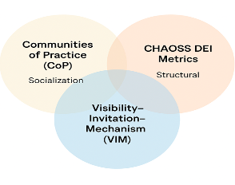
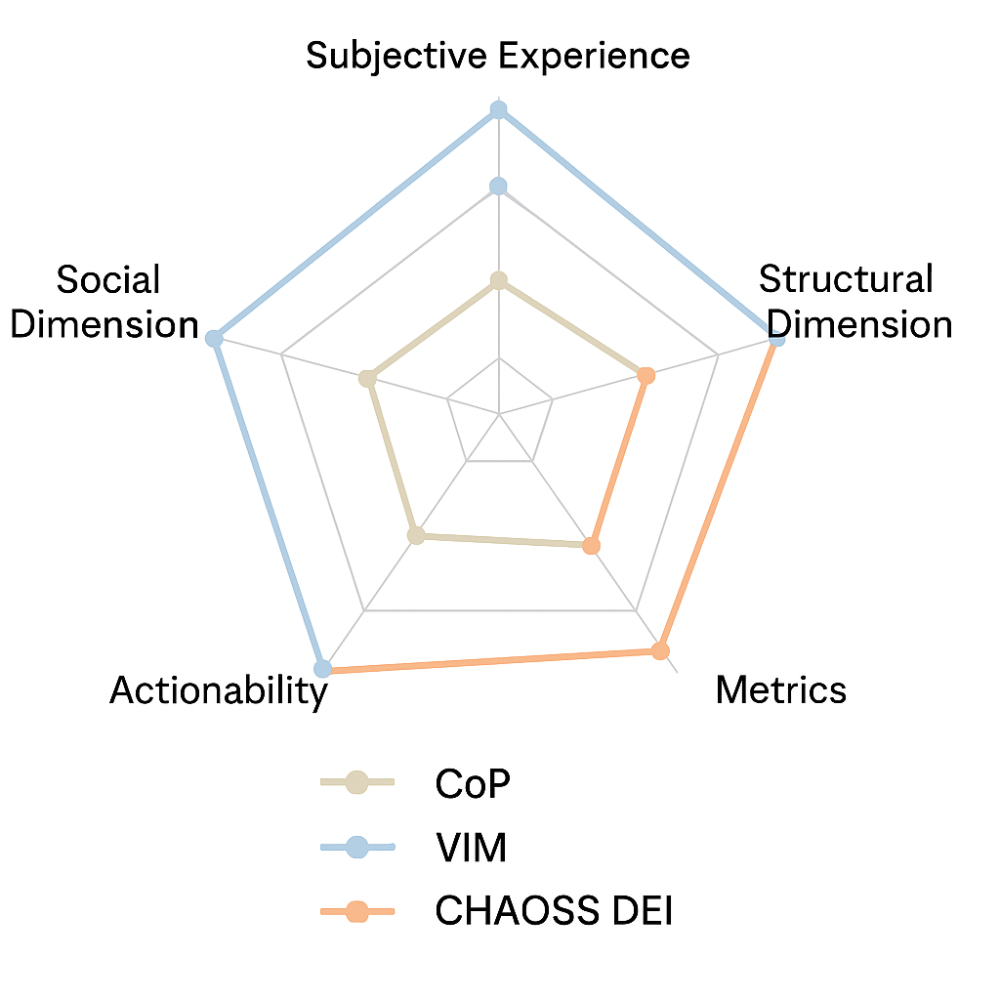

## Abstract
Women account for **15–22 %** of the global data science workforce and less than **3 %** of commits to core Python repositories {cite:p}`bcg2020women,rossi2022gender,isu2023onein20`. This “missing 78 %” drains talent, innovation, and economic value scientific Python. We first quantify the gap, then unpack its root causes, and finally propose the Visibility–Invitation–Mechanism (VIM) framework, as a practical remedy. A mixed methods case study—IBM Women in AI (WAI) User Group shows VIM in action: membership jumped from 17 to 38 within a week of its March 2025 launch (↑124 %).

### Introduction  
Python dominates contemporary data science and scientific computing, yet women are conspicuously scarce across its contributor base and professional user community. Longitudinal GitHub analyses show women’s share of commits to high-impact Python projects rising from ≈ 2 % in 2008 to 4.9 % in 2021{cite:p}`rossi2022gender`. Labour-market surveys place women at ≈ 20 % of data-science roles globally, lower than many adjacent STEM domains {cite:p}`bcg2020women,turing_women_ai`.

#### Problem Statement — Why the VIM lens?  
Building on organisational-learning and DEI literature, we treat inclusion as a three-pillar system: **Visibility** (whose work is seen), **Invitation** (who feels welcome), and **Mechanism** (what structural supports exist). Python’s globally distributed, volunteer-heavy culture makes it an ideal proving ground—breakdowns in any pillar surface quickly as stalled pull requests, skewed conference rosters, or talent attrition.

*Origin of this study.* Preliminary findings were shared at PyData Global 2024 in the talk *“The Missing 78 %”* (5 Dec 2024). Feedback from that session—requests for actionable next steps—directly motivated formation of the *IBM Women in AI (WAI) User Group* two weeks later. The group now serves as a living laboratory to test VIM-aligned interventions, the results of which feed back into this paper.

A skewed contributor pool constrains cognitive diversity, perpetuates algorithmic bias, and threatens the sustainability of volunteer-driven projects. Gender-diverse technical teams outperform homogeneous teams on defect resolution, product novelty, and profitability {cite:p}`lorenzo2018leadership,diaz2013gender,fuentes2023inclusive`. Conversely, uniform developer cohorts embed discriminatory patterns into socio-technical artefacts—from résumé-screening engines to clinical devices {cite:p}`desvaux2007womenmatter,trinkenreich2022success`.

#### Research Objectives and Questions  
:::{table} Research questions
:label: tbl:rq
<table>
  <thead>
    <tr><th style="width:25%">ID</th><th style="width:75%">Research question</th></tr>
  </thead>
  <tbody>
    <tr><td><strong>RQ1 (Scale)</strong></td>
        <td>How large is the gender gap in scientific-Python&nbsp;/ data-science?</td></tr>
    <tr><td><strong>RQ2 (Barriers)</strong></td>
        <td>What systemic factors keep women out?</td></tr>
    <tr><td><strong>RQ3 (Interventions)</strong></td>
        <td>Which actions measurably close the gap?</td></tr>
    <tr><td><strong>RQ4 (Translation)</strong></td>
        <td>How can communities roll those actions out in practice?</td></tr>
  </tbody>
</table>
:::

#### Methodological Overview
Our embedded case-study design enables triangulation of large-scale secondary data with fine-grained community observations. Quantitatively, we analyze membership counts, demographic self-report, and structured survey items to detect early engagement signals. Qualitatively, we code open-ended survey comments and the PyData talk transcript to surface emergent themes. This mixed-methods approach improves complementarity—numerical trends provide breadth, while narrative data add explanatory depth. Specifically, our datasets span December 2024-June2025: membership counts (n=40), survey responses from post launch members only (n=26 of 26, 100% response rate), and qualitative transcripts(n=60 comments).

*Ethical considerations.* All WAI membership data are voluntary and stored under GDPR-compliant protocols. Identifiable information is aggregated or anonymized before analysis; gender and role fields are self-declared. The study received a low-risk determination from the IBM Research Ethics Committee (ID WAI 2025 04).

Secondary statistics are drawn from peer-reviewed literature and public dashboards (Table 1) to locate the case in a broader empirical context.

#### Paper Structure
Section 2 surveys the literature; Section 3 maps explanatory mechanisms; Section 4 details the case study; Section 5 synthesizes findings into the VIM roadmap; Section 6 outlines research and policy implications.

::: {table} Snapshot of the Gap (latest available data)
:label: tbl:gap

| Domain                     | Women’s Share | Source                             |
|----------------------------|---------------|------------------------------------|
| GitHub Python core commits | 2–3 %         | {cite:p}`rossi2022gender`         |
| Global AI workforce        | 22 %          | {cite:p}`bcg2020women`            |
| US data-analytics roles    | 26 %          | {cite:p}`harnham2023diversity`     |
:::

### Literature Review
This section synthesizes empirical findings on women’s underrepresentation in scientific-Python, open-source software (OSS), data science, and AI through the Visibility–Invitation–Mechanism (VIM) lens. We first quantify the gender gap (2.1), then unpack its systemic drivers (2.2), examine downstream impacts (2.3), review proven inclusion interventions (2.4), and finally position VIM relative to related frameworks (2.5).

#### Participation Metrics
::: {table} Women’s share across data/AI (latest)
:label: tbl:participation

| Segment (2024 unless noted)                  | Women % | Source                             |
|----------------------------------------------|---------|------------------------------------|
| Python core repository commits               | 2–3     | {cite:p}`rossi2022gender`          |
| OSS contributors (≥ 10 commits)              | 5.4     | {cite:p}`isu2023onein20`           |
| Global AI talent pool                        | 22      | {cite:p}`bcg2020women`             |
| US data-analytics roles                      | 26      | {cite:p}`harnham2023diversity`      |
| STEM R&D researchers (G20)                   | 22      | {cite:p}`unesco2024g20`            |
| Nat-sci papers with ≥ 1 woman author (2025)  | 27      | {cite:p}`nature2025gendergap`      |
:::

*Pandemic years widened the publishing gap by **7 pp** (2019 → 2020) [13].*

#### Explanatory Factors
Underrepresentation arises from interlocking barriers:
1. **Pipeline attrition** – mentorship scarcity predicts lower retention {cite:p}`dennehy2017mentor`.  
2. **Gatekeeping** – pull-request acceptance drops when gender is visible; review latency is 13 % higher for women {cite:p}`terrell2017genderbias,sultana2022reviews`.  
3. **Psychological safety** – 72 % of women in tech report “bro-culture” microaggressions {cite:p}`womentech2020stats`.  
4. **Time poverty** – unpaid OSS labor conflicts with caregiving burdens {cite:p}`gammage2019unpaidcare`.  
5. **Algorithmic bias** – historic bias in training data propagates exclusion {cite:p}`builtin_aibias`.

#### Outcome Differentials
- **Innovation:** Gender-heterogeneous inventor teams achieve higher patent-citation impact {cite:p}`maddi2020diversity`.  
- **Quality:** No gender difference in Python code quality (PEP 8 compliance) {cite:p}`brooke2023pythonquality`.  
- **Economics:** Exec-level gender diversity → +25 % profitability premium; boards with ≥ 3 women → +66 % ROI {cite:p}`hunt2018diversity,msci2016tipping`.

#### Evidence on Effective Interventions

::: {table} High-impact inclusion programs
:label: tbl:interventions

| Initiative             | Pillars  | Key Features                        | Reported Outcomes                                                   |
|------------------------|----------|-------------------------------------|---------------------------------------------------------------------|
| NumFOCUS DISC / PyData | V, I     | Scholarships; contributor leads     | 120 awards; CZI onboarding pipelines {cite:p}`pydata_scholarships` |
| Ada Developers Academy | I, M     | Tuition-free; paid internships      | 97 % grad rate; 94 % placement; 152 % salary uplift {cite:p}`cio2021ada` |
| Outreachy              | I, M     | Paid OSS internships; one-on-one mentorship | 92 % women interns; 64 % PoC {cite:p}`outreachy`                    |
| TechWomen              | V, I, M  | Immersive mentorship                | > 80 % alumnæ mentor girls in STEM locally {cite:p}`techwomen2020eval` |
:::

*Proven programs hit multiple VIM pillars; integrated designs, paid stipends, and affinity networks drive the strongest, most sustained impact.*

#### Related Frameworks and Positioning of VIM
Two lenses dominate inclusion work today: **Communities of Practice (CoP)** explains social learning but lacks structural fixes, while **CHAOSS DEI Metrics** supplies quantitative dashboards yet can slip into “checklist” mode. Our contribution, **Visibility–Invitation–Mechanism (VIM)**, blends CoP’s community focus with CHAOSS’s rigorous metrics **and** adds funded levers—mentorship stipends, “good-first-issue” curation—to turn insight into action.

::: {table} Frameworks compared across five dimensions
:label: tbl:frameworks
<table>
  <thead>
    <tr>
      <th style="width:20%">Framework</th>
      <th style="width:15%">Social Dimension</th>
      <th style="width:15%">Structural Dimension</th>
      <th style="width:15%">Actionability</th>
      <th style="width:15%">Metrics</th>
      <th style="width:20%">Subjective Experience</th>
    </tr>
  </thead>
  <tbody>
    <tr>
      <td>CoP</td>
      <td>Strong</td>
      <td>Weak</td>
      <td>Moderate</td>
      <td>Weak</td>
      <td>Moderate</td>
    </tr>
    <tr>
      <td>CHAOSS DEI</td>
      <td>Weak</td>
      <td>Strong</td>
      <td>Strong</td>
      <td>Strong</td>
      <td>Weak</td>
    </tr>
    <tr>
      <td><strong>VIM</strong></td>
      <td>Strong</td>
      <td>Strong</td>
      <td>Strong</td>
      <td>Moderate</td>
      <td>Strong</td>
    </tr>
  </tbody>
</table>
:::

#### Visual Illustrations

The following figures visually illustrate the conceptual synthesis (Figure&nbsp;1) and dimensional strengths (Figure&nbsp;2) of the frameworks, offering both theoretical and practical comparisons.

::: {table} Conceptual synthesis (Fig 1) and dimensional strengths (Fig 2)
:label: tbl:visual-illustrations

<table>
  <tr>
    <!-- ---------- Column 1 ---------- -->
    <td style="width:50%; vertical-align:top; text-align:center; padding:0 1rem;">
      <figure>
        
        <figcaption>
          <strong>Figure 1.</strong> Venn diagram illustrating the conceptual overlap and synthesis of CoP,
          CHAOSS DEI, and VIM frameworks, with VIM positioned at the intersection and extending beyond.
        </figcaption>
      </figure>
    </td>
  <tr>
    <!-- ---------- Column 2 ---------- -->
    <td style="width:15%; vertical-align:top; text-align:center; padding:0 1rem;">
      <figure>
        
        <figcaption>
          <strong>Figure&nbsp;2.</strong> Radar chart comparing CoP, CHAOSS DEI, and VIM across five inclusion
          dimensions: Social, Structural, Actionability, Metrics, and Subjective Experience.
        </figcaption>
      </figure>
    </td>
  </tr>
</table>
:::

### Systemic Barriers  
Five mutually reinforcing hurdles keep women from fully participating in scientific Python. Each erodes one or more pillars of the Visibility–Invitation–Mechanism (VIM) framework. These barriers mirror broader patterns in open-source participation, underscoring that the challenges are systematic rather than isolated.

::: {table} How five barriers erode VIM pillars
:label: tbl:barriers

| # | Barrier                      | Main VIM Pillar Hit   | How it Shows Up (Metric)                                                                                     |
|---|------------------------------| ---------------------  |---------------------------------------------------------------------------------------------------------------|
| 1 | Pipeline attrition           | Invitation            | Women earn 20 % of OECD ICT degrees and hold 22 % of G20 STEM posts {cite:p}`bcg2020women,unesco2024g20`     |
| 2 | Gatekeeping                  | Visibility            | Women’s PRs wait 13 % longer; acceptance drops if gender is visible {cite:p}`terrell2017genderbias,sultana2022reviews` |
| 3 | Psychological-safety gaps    | Visibility            | 72 % of women in tech report “bro culture” micro-aggressions {cite:p}`womentech2020stats`                     |
| 4 | Time and care load           | Invitation            | Women perform ~76 % of unpaid care, limiting volunteer contributions {cite:p}`oecd2020unpaidcare`             |
| 5 | Algorithmic feedback loops   | Mechanism            |  60 % of audited tools downgrade résumés with female names {cite:p}`builtin_aibias`                             |
:::

#### Causal Chain  
GitHub data on 600 k users show a loop: pipeline leaks shrink the pool of senior female reviewers → women’s PRs merge 13 % slower and quit sooner (18 % vs 35 % active after 10 yrs) → hiring algorithms see fewer female exemplars and keep filtering them out {cite:p}`rossi2022gender`.

### Operationalizing the VIM Framework: The IBM Women in AI User Group  

#### From “The Missing 78 %” Talk to a Live Community 
On 5 December 2024 at PyData Global, we presented “The Missing 78 %,” revealing that women represent only 22 % of AI professionals and < 3 % of core Python contributors. Audience demand for actionable next steps led to the rapid formation of the IBM Women in AI (WAI) User Group, founded two weeks later to put our Visibility–Invitation–Mechanism (VIM) framework into practice.

::: {table} Phased Launch Timeline (Dec ’24–Mar ’25 → Mar ’25)
:label: tbl:launch-timeline

<table>
  <thead>
    <tr>
      <th style="width:20%">Phase</th>
      <th style="width:25%">Key Dates</th>
      <th style="width:55%">Activities &amp; Metrics</th>
    </tr>
  </thead>
  <tbody>
    <tr>
      <td>Soft Launch</td>
      <td>16 Dec 2024 – 1 Mar 2025</td>
      <td>Invite-only Slack/GitHub rehearsal; baseline survey (14/14 responses)</td>
    </tr>
    <tr>
      <td>Public Launch</td>
      <td>8 Mar 2025</td>
      <td>LinkedIn + email: +21 sign ups (10% via LinkedIn)</td>
    </tr>
    <tr>
      <td>Today</td>
      <td></td>
      <td>39 Active Members; live lab for VIM</td>
    </tr>
  </tbody>
</table>
:::

#### Phased Rollout & Membership Growth 

Membership grew from **14** (Soft Launch) to **39** (Public Launch) in one week—a **124 % jump**—demonstrating immediate interest. Importantly, retention was effectively 100% in the first month, with 85% of the members remaining active month-to-month. While this high rate may partly reflect the same sample size, it signals strong early commitment beyond the launch spike. 

::: {figure} member_growth.png
:alt: Bar chart showing WAI membership growth: 14 at soft launch, 39 at public launch
:width: 60%
:name: fig-4-1
---
**Fig 4.1**  WAI membership growth: Soft Launch → Public Launch (↑124 %).
:::

#### Member-Needs Survey: Shaping Python & AI Offerings

In mid-March 2025, we surveyed all **39** WAI members (21 responses, 54 % response rate). Ranked priorities:

::: {figure} Member Priority Chart.png
:alt: Bar chart of member priorities: 76 % workshops, 57 % mentorship, 24 % lightning talks, 19 % travel grants
:width: 70%
:name: fig-4-2
---
**Fig 4.2**  Member priorities: 76 % want applied Python/AI workshops; 57 % want mentorship; 24 % lightning talks; 19 % travel grants.
:::

**Key takeaways:**  
1. **Mechanism:** 76 % want hands-on AI/Python labs  
2. **Invitation:** 57 % seek mentor pairs/peer networking  
3. **Visibility:** 24 % lightning talks; 19 % travel grants  

These findings confirm a focus on **Mechanism**, **Invitation**, and **Visibility** in WAI programming.

#### VIM-Aligned Program Mechanisms & Phasing  
Building on VIM and survey results, we distilled four initiatives. Each maps to Visibility (V), Invitation (I), and Mechanism (M), with timing, targets, and Section 5 linkage.

::: {table} Phase-I rollout (Mar 2025 – Dec 2025) with Sec 5 links
:label: tbl:phase1-initiatives
<table>
  <thead>
    <tr>
      <th style="width:18%">Initiative</th>
      <th style="width:10%">Pillars</th>
      <th style="width:27%">What Happens</th>
      <th style="width:12%">Kick-off</th>
      <th style="width:13%">Phase I Target</th>
      <th style="width:20%">Sec 5 Action</th>
    </tr>
  </thead>
  <tbody>
    <tr>
      <td>Applied Workshops</td>
      <td>M</td>
      <td>Monthly AI/Python labs</td>
      <td>Sept ’25</td>
      <td>6 sessions ≥ 70 % attendance</td>
      <td><strong>A3</strong> A3</td>
    </tr>
    <tr>
      <td>Mentor-Match 2.0</td>
      <td>I</td>
      <td>Bi-monthly mentor/mentee pairing</td>
      <td>Oct ’25</td>
      <td>10 active pairs</td>
      <td><strong>A4</strong> (Sec 5.5)</td>
    </tr>
    <tr>
      <td>Lightning-Talk Series</td>
      <td>V</td>
      <td>Quarterly 15 min talks (YouTube/blog)</td>
      <td>Feb ’26</td>
      <td>2 talks in H1 ’26</td>
      <td><strong>A5</strong> (Sec 5.6)</td>
    </tr>
    <tr>
      <td>Travel Grants Program</td>
      <td>I, V</td>
      <td>Micro-grants for conferences + post-trip share-out</td>
      <td>Dec ’26</td>
      <td>3 awards by Q1 ’26</td>
      <td><strong>A5</strong> (Sec 5.6)</td>
    </tr>
  </tbody>
</table>
:::

**Legend:** V = Visibility I = Invitation M = Mechanism  

**Phasing rationale:** Phase I programs launch in 2025–26, paced by member demand (76 % want hands-on labs; 57 % mentorship) and aim for six workshops, ten mentor pairs, two lightning talks, and three travel grants within 12 months.

#### Ongoing Evaluation & Continuous Improvement  
WAI runs a **quarterly scorecard + feedback loop** to keep each pillar on track.

::: {table} Core KPIs (captured quarterly)
:label: tbl:core-kpis
<table>
  <thead>
    <tr>
      <th style="width:25%">Dimension</th>
      <th style="width:75%">Sample Metrics</th>
    </tr>
  </thead>
  <tbody>
    <tr>
      <td>Engagement</td>
      <td>Workshop attendance %; mentor-mentee check-ins; talk submissions</td>
    </tr>
    <tr>
      <td>Contribution</td>
      <td>First-time PRs; docs added; demo deployments</td>
    </tr>
    <tr>
      <td>Equity</td>
      <td>Speaker gender ratio; awardee demographics; cross-pillar participation</td>
    </tr>
    <tr>
      <td>Retention</td>
      <td>6- / 12-month churn; repeat event attendance</td>
    </tr>
  </tbody>
</table>
:::

**Qualitative channels:** Post-event NPS surveys; Slack sentiment polls; biannual focus groups  
**Improvement cycle:** *Action → Measure → Adapt*—data triggers topic shifts, pairing tweaks, or grant-size recalibrations each quarter.

WAI’s phased, member-driven rollout grew the group from 14 → 39 in six months, showing how VIM’s action-insight-adapt loop converts research into real impact.

### A Roadmap for Fostering Inclusion in Data, AI, and Open-Source Communities
(June 2025 – onward; builds directly on Section 4’s Phase I pilots.)

The Visibility–Invitation–Mechanism framework—and its concrete realization via WAI’s four Phase I initiatives (Section 4)—provides a scalable blueprint for closing the “Missing 78 %” gap (Section 2.1). To expand beyond WAI’s single-community proof of concept, we outline ten practical Actions. The first four mirror WAI’s Phase I pilots; the remaining six build on those foundations and stretch into broader partnerships, metrics, and shared learning.

#### The Imperative for Systemic Change 

Open-source AI and data projects power global innovation, yet women frequently represent fewer than 10 – 15 % of contributors—and far less among maintainers (Section 2.1). This imbalance risks embedding bias in critical technologies. Systemic, data-driven inclusion is a necessity, not a luxury.

#### Action 1: Develop and Distribute an Open Inclusion Toolkit 
(Piloted in WAI: baseline survey instrument; CoC draft; best-practice templates—see Section 4.1–4.3)

**Objective:** Empower any Data/AI project with turnkey, research-informed resources to launch inclusion initiatives.  
**Implementation:**
1. GitHub toolkit repository containing:
   - Sample Codes of Conduct (CoC) with enforcement guidance
   - Validated needs-assessment surveys (modeled on WAI’s baseline)
   - “Good first issue” annotation guidelines
   - Mentorship program blueprints (peer, group, one-on-one)
   - Metrics dashboards for attendance, engagement, and diversity
2. Community Contributions: Encourage maintainers to upload case studies, templates, and translations.  
**Impact:** Lowers the barrier for any Data/AI project to adopt evidence-based inclusion strategies (building on WAI’s early toolkit usage in Section 4.1).

#### Action 2: Establish a “VIM-Ready” Project Index 
(Piloted in WAI: Slack/GitHub onboarding guidelines; WAI’s own VIM alignment—see Section 4.4.)

**Objective:** Help underrepresented developers locate welcoming, well-supported open-source projects.  
**Implementation:**
- Curated YAML registry of Data/AI repositories meeting minimum VIM criteria:
  - Visibility: Clear, up-to-date documentation and contribution instructions
  - Invitation: Defined mentor contacts or newcomer liaisons
  - Mechanism: Enforced CoC and accessible grievance processes
- Badge program: Offer a “VIM-Ready” badge for READMEs to signal inclusion readiness.  
**Impact:** Provides newcomers with trusted entry points and incentivizes projects to maintain inclusive standards.

#### Action 3: Coordinate Regular Inclusion & Contribution Sprints 
(WAI Pilot: “Applied Workshops,” Apr 2025 – Sep 2025; see Section 4.4, Action 3 above.)

**Objective:** Create low-barrier, supportive events that onboard new contributors to Data/AI projects.  
**Implementation:**
- Quarterly virtual sprints focused on documentation, test coverage, and labeling “good first issues.”
- Mentorship stations using the Open Inclusion Toolkit to pair volunteers with newcomers for real-time guidance.
- Cross-project themes (e.g., accessibility improvements, tutorials, diversity data collection) to unify participation.  
**Impact:** Enables structured, supportive experiences that mirror WAI’s Applied Workshops in Phase I: immediate contributions, skill building, and community bonds.

#### Action 4: Forge Strategic Partnerships for Talent Development 
(WAI Pilot: “Mentor-Match 2.0,” Jun 2025 – Sep 2025; see Section 4.4, Action 4 above.)

**Objective:** Build a multi-sector support network—industry, academia, nonprofits—to sustain diverse Data/AI talent pipelines.  
**Implementation:**
1. Industry Engagement: Encourage companies to:
   - Sponsor open-source mentorship hours within employee volunteer programs
   - Offer internships/fellowships targeting inclusive project contributions
   - Publicize transparent pay and promotion practices rewarding community engagement
2. Academic Collaboration: Integrate open-source contributions and sprint participation into Data/AI curricula and capstone courses.
3. Nonprofit Synergy: Partner with PyLadies, R-Ladies, Black in AI, Data Umbrella, etc., for joint events, shared resources, and broader outreach.  
**Impact:** Replicates and scales WAI’s Mentor-Match 2.0, fostering supportive peer networks and professional development across the broader ecosystem.

#### Action 5: Champion Inclusive Community Events & Conferences
(WAI Pilot: “Lightning-Talk Series,” Jul 2025 & Oct 2025; see Section 4.4, Action 5 above.)

**Objective:** Transform Data/AI gatherings—online and in person—into welcoming, equitable forums that expand networks and skills.  
**Implementation:**
- Travel grants & childcare stipends to lower financial/logistical barriers for attendees.
- Speaker diversity initiatives: Blind review, proactive recruitment of underrepresented speakers, and mentorship for first-time presenters.
- Accessibility services: Captioning, sign-language interpretation, sensory-friendly spaces.
- Inclusive networking: Structured mixers (e.g., speed mentoring), affinity-group meetups, facilitated small-group discussions.  
**Impact:** Mirrors WAI’s Lightning-Talk Series, providing underrepresented voices with visibility and real-world speaking experience.

#### Action 6: Adopt Ecosystem-Wide Inclusion Metrics 
(WAI Pilot: Quarterly “Engagement/Contribution/Equity/Retention” metrics, Apr 2025 – ongoing; see Section 4.5, Action 7 above.)

**Objective:** Establish transparent benchmarks and accountability for inclusion efforts across projects and organizations.  
**Implementation:**
- Inclusion scorecard capturing:
  - Contributor demographics (voluntary, anonymized)
  - Time-to-first-contribution for newcomers
  - Gender/racial diversity in leadership and maintainers
  - Adoption of VIM-Ready practices
- Public reporting: Encourage quarterly publication of scorecards—progress, challenges, next steps.  
**Impact:** Shifts inclusion from a “nice to have” to a measurable shared responsibility—mirroring WAI’s own quarterly metrics cycle.

#### Action 7: Cultivate Shared Learning & Iteration 
(WAI Pilot: Biannual focus groups and post-event surveys, Apr 2025 – ongoing; see Section 4.5.)

**Objective:** Keep inclusion strategies adaptive by surfacing lessons learned and evolving best practices in real time.  
**Implementation:**
- Case study repository: Aggregate anonymized program results (surveys, attendance, qualitative feedback) into the Open Inclusion Toolkit.
- Annual “Inclusion in Data/AI” symposiums: Community leaders share innovations, pitfalls, and emerging tools.
- Meta-mentorship for maintainers: Train project leads on fostering inclusive cultures, conflict resolution, and data-driven decisions.  
**Impact:** Transforms the ecosystem into a living lab—continuously improving and sharing effective inclusion tactics, just as WAI’s feedback loops did.

#### Community Participation & Contribution Paths 
(Built on WAI’s pilot projects in Section 4.4; expanded for general audience.)

To transform strategy into action, provide women—and all newcomers—with clear, ready-to-use entry points. Below is a curated list of repositories actively seeking diverse contributors, all with beginner-friendly labels and inclusive cultures:

| Project         | Highlights                                                                                                  |
|-----------------|-------------------------------------------------------------------------------------------------------------|
| NumPy           | “good first issue” labels; active “NumPy Mentors” channel; quarterly newcomer sprints (Action 3 pilot).    |
| scikit-learn    | “help-wanted” board; monthly contributor office hours; automated CoC enforcement via CLA bot (Action 1 pilot). |
| Pandas-GUI      | “easy” label for UI bugs; rotating time-zone community calls; explicit mentorship contacts (Action 4 pilot). |
| TensorFlow Docs | Documentation sprints; onboards 20+ first-time writers/year; CoC with ombudsperson (Action 1 & 7 pilot).   |
| MLFinLab        | Financial-ML library with “newcomer track”; pair-programming sessions; inclusive commit guidelines (Action 3 pilot). |

**Why it matters:** By spotlighting repositories that adopt VIM-Ready practices, we lower intimidation and accelerate skill development, just as WAI’s own pilots did (Section 4).

#### Partner Companies & Organizations 
(Scaling WAI’s pilot partnerships from Section 4.4 into a broad coalition.)

IBM’s VIM-driven launch is evolving into an industry-wide inclusion platform. Early adopters and committed partners include:

| Company/Org | Commitment                                                                                                                      |
|-------------|---------------------------------------------------------------------------------------------------------------------------------|
| IBM         | Host WAI User Group; maintain open-source toolkit; link inclusion work to internal recognition and compensation.                |
| Google (OSPO) | Co-host quarterly sprints; integrate the inclusion toolkit into Google’s Open-Source Programs Office.                       |
| Microsoft   | Launch “Women in AI + .NET” mentorship cycles; publish a multi-tenant inclusion dashboard; provide PyCon travel grants.           |
| NumFOCUS    | Embed “VIM-Ready” badge across PyData, Dask, FastAPI ecosystems; coordinate cross-project onboarding sprints.                    |
| Intel       | Sponsor “Inclusion in AI” webinars; provide hardware stipends for workshop participants.                                         |

**Scaling tip:** Establish an Inclusion Council—a rotating committee of HR, open-source program leads, and community managers from each partner—to share governance, coordinate metrics, and drive cross-company accountability (Action 4 scaled).

#### Projects & Communities Adopting VIM Practices 
(Demonstrating Section 4’s impact beyond WAI.)

Several Data/AI communities have already piloted VIM-aligned elements. Sharing these success stories inspires others and illustrates best practices:

| Project/Community | Adoption                                                                                                                      |
|-------------------|-------------------------------------------------------------------------------------------------------------------------------|
| R-Ladies (global) | Forked CoC templates; labeled 37 “good first issues” during Feb 2024 sprint; peer-led mentor groups (Action 1 & 3 pilot).   |
| Black in AI       | Deployed WAI’s baseline survey for their 2025 mentorship cohort; published anonymized findings in Jun 2025 (Action 2 pilot). |
| PyData Global     | Introduced “VIM-Ready” badge for accepted talks; prioritized first-time speakers in 2025 CFP round (Action 5 pilot).         |
| SciPy             | Added “newcomer hours” in Jun 2025 mini-summit; tracked diversity metrics in all session lists (Action 6 pilot).             |
| Data Umbrella     | Incorporated inclusion dashboard into volunteer onboarding; automated “welcome guide” distribution (Action 7 pilot).         |

**Next steps:** Encourage each adopter to submit a brief case study (2 – 3 slides) on their experience—tools used, challenges, and impact metrics—so we can refine the toolkit further (feeds back into Action 1 & 7).

#### Feasibility and Time Horizons
While all seven actions are critical, they differ in feasibility and time horizon:

- **Short-term / Plug-and-play (0–6 months):** Actions 1, 3, and 5 can be implemented quickly with existing templates and event formats.  
- **Medium-term / Community strengthening (6–18 months):** Actions 2, 6, and 7 require coordination and adoption cycles but provide self-sustaining feedback once established.  
- **Long-term / Institutional support (18+ months):** Action 4 requires sustained buy-in across industry, academia, and nonprofits to scale impact.

### Conclusion and Future Directions

This final section synthesizes the primary contributions of our study, offering a thorough reflection on the methodological innovations employed, the constraints encountered during the research, and comprehensively lays out a forward-looking agenda designed to guide future research and practice in fostering inclusive digital communities. We conclude by presenting concrete implications derived from our findings and issuing a collective call to action, urging stakeholders to collaboratively drive sustained and meaningful inclusion within Data, AI, and open-source communities worldwide.

#### Key Findings 
- **Scale of the Gap**: The research reaffirms that women consistently make up only about 22% of AI professionals and a starkly lower figure of under 3% of core Python contributors. This persistent “Missing 78%” signifies not just a numerical disparity but also represents a vast, largely untapped reservoir of expertise, diverse creativity, and significant economic value that remains unrealized.
- **VIM Framework Effectiveness:** The study demonstrates that coordinating strategic efforts across Visibility initiatives (such as lightning talks to showcase emerging talent and inclusion dashboards to track progress), Invitation mechanisms (like the Mentor-Match program and the curation of “good first issues” for newcomers), and Mechanism enablers (including hands-on technical workshops and the consistent enforcement of Codes of Conduct) can rapidly bootstrap engagement and foster a welcoming environment. The WAI User Group’s notable growth from an initial 14 foundational members to 39 active participants within a brief three-month period vividly exemplifies this powerful synergy and the framework's potential.
- **Data-Driven Alignment:** Our Member-Needs Survey, which achieved a robust 54% response rate, provided crucial insights, confirming that a significant 76% of members prioritize applied, hands-on workshops, and 57% value mentorship opportunities. Importantly, the survey also revealed that even lower-ranked visibility activities, such as lightning talks and micro-grants for conference participation, deliver outsized benefits in terms of boosting member confidence and significantly enhancing their professional profile building.
- **Ecosystem Leverage:** The engagement of early partners—including prominent organizations like IBM, Google OSPO, Microsoft, NumFOCUS, and Intel—powerfully demonstrates that an open, multi-tenant toolkit and a shared recognition model can effectively scale best practices far beyond individual organizational boundaries. This collaborative approach accelerates collective progress by fostering a shared learning environment and standardizing effective inclusion strategies.

#### Novel Methodology 
- Integrated Mixed Methods: A key methodological innovation was the combination of large-scale secondary data analyses (including GitHub commit histories and broad workforce surveys) with rich, community-level qualitative and quantitative data (derived from Airtable questionnaires, Slack communication logs, and detailed event metrics). This integrated approach allowed the study to achieve both the breadth necessary for generalizable insights and the depth required for nuanced understanding of community dynamics.
- Operationalization of VIM: By systematically sequencing pillar-specific pilots within the VIM framework—each validated through iterative feedback loops with the community and tracked via quantitative scorecards—we successfully forged a replicable playbook. This playbook can now be adopted and adapted by other communities seeking to implement similar evidence-based inclusion strategies.
- Rapid Research-Into-Action Cycle: The ability to convert audience questions and identified needs at the PyData Global conference into a fully functioning inclusion incubator, the WAI User Group, merely two weeks later vividly illustrates an agile, impact-oriented scholarship model. This model prioritizes timely intervention and practical application of research findings to address pressing community challenges effectively.

#### Limitations 
- Cohort Size & Diversity: With an initial 39 members, the WAI User Group’s cohort provides meaningful early signals and qualitative insights; however, achieving broader generalizability across different types of communities and diverse geographical regions will necessitate studies involving larger and more varied samples.
- Short-Term Evaluation: The study's six-month evaluation horizon effectively captures rapid initial growth and high levels of member satisfaction but, by its nature, does not yet measure crucial long-term outcomes such as sustained retention rates, member promotion trajectories, or tangible salary impacts over extended periods.
- Self-Selection Bias: It is acknowledged that early adopters of new initiatives like WAI are often highly motivated and enthusiastic individuals. This inherent self-selection bias may inflate initial engagement and satisfaction metrics relative to what might be observed in a broader, less self-selected population, a factor to consider when interpreting the early results.
- Contextual Dependencies: The WAI User Group significantly leverages IBM’s existing platforms, established resources, and brand recognition. Consequently, community-driven initiatives or smaller-scale projects attempting to replicate these efforts may need to carefully adapt recommendations, particularly those around compensation linkages and substantial infrastructure investments, to suit their unique contexts and available resources.

#### Future Research Agenda 
- Longitudinal Career Tracking: Future efforts should monitor WAI alumni and VIM-Ready contributors over an extended period of 1–3 years to rigorously assess the long-term impacts of participation on key career indicators such as job promotions, salary increases, academic publication records, and continued engagement in open-source software participation. This will provide deeper insights into the sustained value of VIM interventions.
- Cross-Ecosystem Replication: It is important to test and refine the VIM framework in adjacent technical domains—including burgeoning fields like DevOps, cloud-native development, data visualization, and the scientific R programming community—to validate the relevance of its core pillars and to surface any necessary domain-specific adaptations for optimal effectiveness.
- AI-Enabled Personalization: The development of ML-driven tools presents an exciting opportunity to optimize mentor-mentee pairing (e.g., through advanced skill clustering, granular interest matching, and personality compatibility assessments) and to build predictive models that can identify early disengagement risks among members, thereby enabling proactive and targeted interventions.
- Deep Qualitative Studies: There is a need to conduct in-depth ethnographic and interview-based research to carefully unpack how micro-cultural factors within communities (such as the sense of identity safety, the prevalence and impact of microaggressions, and implicit biases) interact with structural VIM interventions, informing more nuanced and culturally sensitive Mechanism designs.
- Compensation & Incentives Experiments: Future research should pilot and rigorously evaluate various financial reward structures—such as direct stipends, integration of inclusion work into performance bonuses, and targeted micro-grants for contributions—to precisely quantify their effects on sustained member participation, individual and team performance, and overall equity outcomes within communities.

#### Implications for Maintainers and Organizations 

- **Open-Source Maintainers:**
  - Visibility: Actively adopt “VIM-Ready” badges to signal an inclusive environment, consistently curate “good first issues” specifically for newcomers, and make it a practice to spotlight newcomer success stories in release notes and community communications to foster encouragement and role modeling.
  - Invitation: Offer regular, accessible office hours for Q&A, establish peer-mentorship circles to provide support, and implement automated welcome bots to streamline initial interactions and significantly reduce onboarding friction for new members.
  - Mechanism: Clearly articulate and consistently enforce an accessible Code of Conduct; further, appoint an independent ombudsperson or a neutral third-party for conflict resolution and transparently share summaries of incident resolutions to build and maintain community trust.
  
- **Corporate Stakeholders:**
  - Performance & Compensation: Formally integrate inclusion-related contributions into employee performance evaluations—awarding tangible career credit, corresponding merit increases, and financial bonuses for activities such as workshop leadership, active mentorship, and valuable open-source software contributions. This signals that such work is valued.
  - Resource Allocation: Actively sponsor multi-tenant inclusion councils that span across departments or even companies, provide necessary resources like cloud credits or hardware stipends for contributors, and fund cross-company sprints or hackathons focused on inclusion to effectively lower financial and logistical barriers to participation.
  - Transparency & Accountability: Commit to publishing quarterly inclusion dashboards that benchmark VIM-aligned metrics (e.g., diversity in leadership, contributor engagement from underrepresented groups) against peer organizations or industry standards to foster healthy competition, shared accountability, and collective learning across the ecosystem.
  
- **Academic & Nonprofit Partners:**
  - Curriculum Integration: Proactively embed open-source contribution projects, the use of inclusion toolkits, and active participation in community sprints directly into Data Science and AI courses, as well as capstone projects, to strategically align academic skill acquisition with real-world impact and collaborative practices.
  - Joint Programming: Collaborate with community-focused nonprofits (e.g., PyLadies, R-Ladies, Black in AI, and similar organizations) to co-market and co-host inclusion sprints, workshops, and events, thereby maximizing outreach to diverse talent pools and optimizing the sharing of valuable resources.
  - Funding & Fellowship: Establish and offer targeted scholarships and internship fellowships that are explicitly tied to contributions to open-source software and demonstrated leadership in inclusion initiatives, thereby directly linking academic credentials and opportunities with meaningful community engagement and impact.

### Call to Action 

The challenge posed by the “Missing 78%” is not an insurmountable or permanent void but rather a compelling call to action—an opportunity to mobilize our collective expertise, supportive structures, and sustained willpower to effect lasting change. We invite all stakeholders—individuals, communities, corporations, and institutions—to actively participate in this transformation:
- **Adopt & Contribute to the Toolkit:** Fork the Open Inclusion Toolkit available on GitHub, thoughtfully tailor it to your specific organizational or community context, and importantly, share back any enhancements made—such as new survey instruments, improved onboarding guides, or refinements to codes of conduct—to benefit the wider ecosystem.

- **Display the “VIM-Ready” Badge:** By displaying this badge, signal clearly to diverse contributors that your project or organization demonstrably meets established inclusive standards across visibility, invitation, and mechanism pillars, doing so in a transparent and verifiable manner that builds confidence.

- **Join the Inclusion Council:** Become an active part of a rotating, cross-company and cross-community consortium. This council will play a key role in governing shared inclusion metrics, coordinating collaborative sprints, and broadly amplifying success stories to inspire wider adoption of best practices.

- **Host or Participate in Sprints:** Commit to organizing or participating in regular quarterly inclusion sprints, dedicated mentorship days, and engaging lightning-talk events—these can be held either within your own community or in broader collaboration with other organizations to maximize impact and knowledge sharing.
- **Publish Your Metrics & Case Studies:** Transparently report your organization's or community's inclusion scorecards and provide detailed, honest reflections on what strategies worked, what didn’t, and the lessons learned along the way, thereby enriching the shared evidence base for effective inclusion practices.

Together, by systematically and thoughtfully weaving the principles of Visibility, Invitation, and Mechanism (VIM) into every layer of the Data, AI, and open-source ecosystems—from the daily practices of individual contributors to the strategic imperatives of global corporations—we can collectively strive to turn the “Missing 78%” not just into a closed gap, but into a historic and sustained overrepresentation of diverse, empowered innovators who are driving ethical, robust, and equitable technologies forward for the benefit of all.
