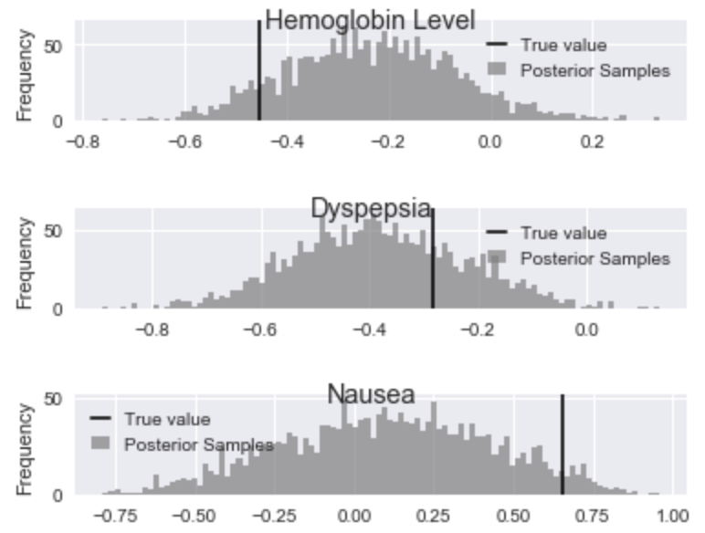
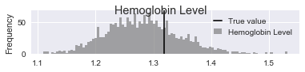
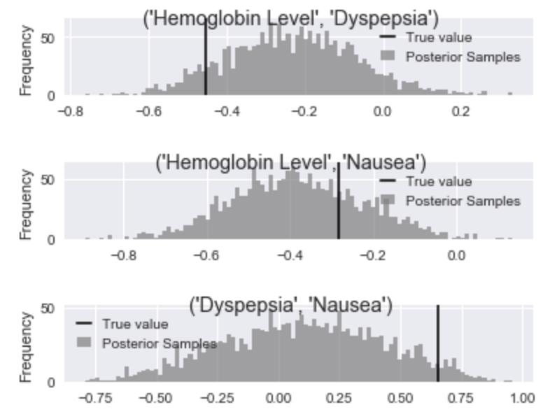
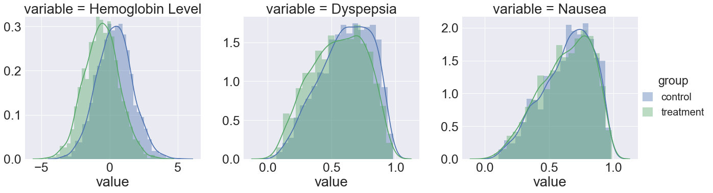

:author: Konstantinos Vamvourellis
:email: k.vamvourellis@lse.ac.uk
:institution: London School of Economics and Political Science
:corresponding:

:author: Marianne Corvellec
:email: marianne.corvellec@igdore.org
:institution: Institute for Globally Distributed Open Research and Education (IGDORE)

:bibliography: library

--------------------------------------------------
A Bayesian’s journey to a better research workflow
--------------------------------------------------

.. class:: abstract

   This work began when the two authors met at a software development meeting.
   Konstantinos was building Bayesian models in his research and wanted to
   learn how to better manage his research process. Marianne was working on
   data analysis workflows in industry and wanted to learn more about Bayesian
   statistics. In this paper, the authors present a Bayesian scientific
   research workflow for statistical analysis. Drawing on a case study in
   clinical trials, they demonstrate lessons that other scientists, not
   necessarily Bayesian, could find useful in their own work. Notably, they can
   be used to improve productivity and reproducibility in any computational
   research project.

.. class:: keywords

   Bayesian statistics, life sciences, clinical trials, probabilistic programming, Stan, PyStan

Introduction
------------

We present a research workflow for Bayesian statistical analysis. We
demonstrate lessons we learned from our own computational research that other
scientists, not necessarily Bayesian, could find useful when they manage their
own work. To illustrate these lessons we use a specific case study in clinical
trial modeling.

Clinical trial data are presented to experts and clinicians to assess the
efficacy and safety of a given drug. The analysis of trial data is based on
statistical summaries of the data, including averages, standard deviations, and
significance levels. However, dependencies between the treatment effects are
the subject of clinical judgment and are rarely included in the statistical
summaries.

We propose a Bayesian approach to model clinical trial data. We use latent
variables to account for the whole joint distribution of the treatment effects,
including effects of different types. As a result, we can find the predictive
distribution of the treatment effects on a new patient accounting for
uncertainty in all the parameters, including the correlation between the effects.

Although this case study is by no means the ideal introductory example of
computational modeling, it provides us with a real-world problem from which we
can share practical lessons. We believe this paper can be of help to a number
of different audiences. Firstly, it can help non-Bayesian statisticians, or
beginning Bayesians, get a a sense of how to apply Bayesian statistics to their
work. Secondly, it can provide computational scientists with advice on building
a reproducible and efficient research workflow. And, thirdly, it can spark
discussions with advanced Bayesians about the complexities of Bayesian
workflows and how to build better models.

A Bayesian Workflow
-------------------

We present a Bayesian workflow for statistical modeling. We recognize that each
project is unique and the research process can be too complex to summarize
in a recipe-style list. However, we believe that following a workflow, such as
suggested here, can help researchers, especially beginners. We have found that
setting up a workflow increases productivity. It also helps make research
projects more reproducible, as we discuss in the last section.

We propose a simple workflow made of the following steps:

1. Scope the problem;
2. Specify the likelihood and priors;
3. Generate fake data that resemble the true data to a reasonable degree;
4. Fit the model to the fake data;

   a. Check that the true values are recovered;
   b. Check the model fit;

5. Fit the model to the real data.

An advanced workflow, which is beyond the scope of this paper, could be
extended to include the following steps:

6. Check the predictive accuracy of the model;
7. Evaluate the model fit;
8. Select best model among different candidates (model selection);
9. Specify and integrate the utility function over the posterior distribution;
10. Perform a sensitivity analysis.

In what follows, we will use :math:`\mathcal{M}(\theta)` to denote the model as
a function of its parameter :math:`\theta` (:math:`\theta` is either a scalar
or a vector representing a set of parameters).
Data usually consist of observable outcomes [#]_ :math:`y`
and covariates [#]_ :math:`x`, if any. We will distinguish between the two when
necessary; otherwise, we will denote all data together by :math:`\mathcal{D}`.
We use :math:`p(\cdot)` to denote either probability distributions or probability
densities, even though it is not rigorous notation.

.. [#] Depending on their field, readers may want to think ‘dependent variables’ or ‘labels’.
.. [#] Depending on their field, readers may want to think ‘independent variables’ or ‘features’.

*1) Scope the problem*

The main goal of this workflow is to achieve successful Bayesian inference.
That is, correctly retrieving samples from the posterior distribution of the
parameter values, which are typically unknown before the analysis, using the
information contained in the data.
The major difference of the Bayesian approach relative to frequentist, is that
it modifies the likelihood function (to be introduced later) into a proper
distribution over the parameters, called the posterior distribution.
The posterior distribution
:math:`p(\theta | \mathcal{D})` forms the basis of the Bayesian approach from
which we derive all quantities of interest.

Why do we need statistical inference in the first place? We need it to answer
our questions about the world. Usually, our questions refer to an implicit or
explicit parameter :math:`\theta` in a statistical model, such as:

* What values of :math:`\theta` are most consistent with the data?
* Do the data support a certain condition (e.g., for :math:`\theta` a scalar, :math:`\theta > 0`)?
* How can we predict the future outcome of an experiment?

To proceed, we need to define a model. Choosing a model is usually
tied to the exact research questions we are interested in.
We can choose to start with a postulated data generation process and then
decide how to interpret the parameters in relation to the research question.
Alternatively, it is equally valid to start from the research question and
design the model so that its parameters are directly connected to the specific
questions we wish to answer.
In the next section, we illustrate with an example
how to design a model to answer a specific research question.

Note that the question of prediction depends directly on inferring successfully
the parameter values. We shall come back to this at the end of this section.

*2) Specify the likelihood and priors*

Once we have defined the scope of the problem, we need to specify the design of
the model which is captured in the *likelihood* function
:math:`f(\mathcal{D} | \theta, \mathcal{M})`.
Usually, argument :math:`\mathcal{M}` is dropped for notational
simplicity, the model being chosen and assumed known.
Note, however, that when the model includes covariates, the more accurate
expression is
:math:`f(y | \theta, x)`.
This function ties together the ingredients of
statistical inference and allows information to flow from the data
:math:`\mathcal{D}` to the parameters :math:`\theta`.

The second ingredient of Bayesian inference is the prior distribution
:math:`p(\theta)`. Priors are inescapably part of the Bayesian approach and, hence,
have to be considered carefully. The goal of Bayesian inference is to combine
the prior information on the parameters (the prior distribution), with the
evidence contained in the data (the likelihood), to derive the posterior
distribution :math:`p(\theta | \mathcal{D})`.
It is difficult to predict how sensitive the final
results will be to a change in the priors. However, it is important to note
that the impact of priors progressively diminishes as the number of observations
increases.

The ideal scenario for applying the Bayesian approach is when prior knowledge is
available, in which case the prior distribution can and should capture that
knowledge. But, sometimes, we might want to avoid expressing prior knowledge,
especially when such knowledge is not available. How are we supposed to
choose priors then? Constructing default priors is an active area of research
that is beyond the scope of this work. Here, we provide a high-level overview and refer
the interested reader to various sources for further reading.

Priors which express very little or no prior knowledge are called vague or
*uninformative priors*. Such priors are deliberately constructed in a way which
minimizes their impact on the resulting inference, relative to the information
brought in by the likelihood.  In fact, Bayesian inference technically works
even when the prior is not a proper distribution but a function that assumes all
values are equally likely, referred to as *improper prior*. However, it is
generally advisable to avoid improper priors, especially in settings beyond
just inference, such as the more advanced workflow of steps 6)–10).
If no prior knowledge is available, a very vague normal
distribution with large variance is still a better default prior than a uniform
distribution. It is important to note that improper or even vague priors are not
appropriate for model selection.

Additional considerations can impact the choice of priors,
especially when chosen together with the likelihood.
From a computational perspective, the most convenient priors are called
*conjugate priors*, because they mimic the structure of the likelihood function
and lead to a closed-form posterior distribution. Priors can have additional
benefits when used deliberately with a certain goal in mind. For example,
priors can be used to guard against overfitting by pulling the
parameters away from improbable values, or help with feature selection (e.g., see
horse-shoe priors).

Bayesian critics often see priors as a weakness, whereas in reality they are
an opportunity. Notably, priors give us the opportunity to employ our
knowledge to guide the inference in the absence of evidence from the data.
Also, it is important to remember that, in a scientific research context,
we rarely have absolutely no prior knowledge and
we typically do not consider any parameter value to be equally likely.

*3) Generate fake data*

Once we have agreed on a generative process, i.e., a model :math:`\mathcal{M}`,
we can use it to simulate data :math:`\mathcal{D'}`.
To do that, we choose reasonable
parameter values :math:`\theta_0` and use :math:`\mathcal{M}` to generate data
based on these values. Alternatively,
instead of coming up with reasonable parameter values, we can sample
these values from the prior distribution

.. math::

   \theta_0 \sim p(\theta).

The fake data
:math:`\mathcal{D'}`
can then be interpreted as our prior distribution of the data.
Hence, by inspecting the fake data, we can reflect back on our choices for the
likelihood and priors. However,
if we do use our priors to generate parameter values, we should make
sure that our priors are not uninformative, which would likely produce
unreasonable fake data.

Note how the model :math:`\mathcal{M}` is a hypothesized process and comes with
necessary assumptions and simplifications. It is highly unlikely that the real
world would follow exactly :math:`\mathcal{M}`. That being said, if
:math:`\mathcal{M}` is close enough to the real generative process, it can
still be very useful to help us understand something about the world.
As the phrase goes, “all models are wrong, but some models are useful.”

*4) Fit the model to the fake data*

If simulating data using our generative process :math:`\mathcal{M}` is the forward
direction, statistical inference is the reverse direction by which we find what
parameter values could have produced such data, under :math:`\mathcal{M}`.

The most popular statistical inference algorithm is maximum likelihood
estimation (MLE), which finds the parameter values that maximize the likelihood
given the observed data.
To reiterate, under the Bayesian approach, we treat the parameters
:math:`\theta` as random variables and express our prior knowledge about :math:`\theta` with
the prior probability distribution :math:`p(\theta)`. Bayesian inference is the process of
updating our beliefs about :math:`\theta` in light of the data :math:`\mathcal{D}`. The
updating process uses Bayes’ theorem and results in the conditional distribution :math:`p(\theta|
\mathcal{D})`, the posterior distribution. Bayesian inference is
generally a hard problem. In most cases, we cannot derive the mathematical form
of the posterior distribution; instead, we settle for an algorithm that returns
samples from the posterior distribution.

When we fit the model to fake data, we want to check two things, i.e., the correctness
of the inference algorithm and the quality of our model.

a. Much like in software testing, we want to check if the inference process
works by starting simple and advance progressively to the real challenge. By
fitting the model to fake data generated from the same model, we effectively
rule out issues of mismatch between our model and the real data. Testing the
inference algorithm under these ideal conditions allows us to perfect the
inference algorithm in a controlled environment, before trying it on the real data. In
our experience, this step brings to the surface many bugs in the code as well as
issues about the model in general.
It offers an added benefit, later on, when
we critique the fit of our model :math:`\mathcal{M}` to the real data
:math:`\mathcal{D}`. Having confidence in the correctness of our inference process
allows us to attribute any mismatch issues to the choice of the model,
as opposed to the inference algorithm.

By fitting the model to fake data, we recover samples from the posterior
distribution of the model parameters. There are various model fit tests to
choose from. At a minimum,
we need to check that the 95% posterior confidence intervals cover the true
parameter values :math:`\theta_0` that were used to generate the fake data. We should
tolerate a few misses, since 95% intervals will not cover the true values 5% of the
time, even if the algorithm is perfectly calibrated. Success at this stage is
not sufficient guarantee that the model will fit well to the real data, but it is
a necessary condition for proceeding further.

b. Equipped with a correct inferential algorithm for our model :math:`\mathcal{M}`,
it is time to critique the model and ask if it is appropriate for the application.
More generally, this is a good time to check the model fit and decide if we
need to make any changes to it. This step is usually specific to each
application. There is no limit as to how many tests we can do at this stage. It is
up to us to decide which tests are necessary to build confidence in
the model. If we choose a different model :math:`\mathcal{M'}`, we need to go
back to step 2 and start again.
Note that for a more comprehensive evaluation of the model, we can, and
probably should, wait until we check how the model fits the real data as well.

*5. Fit the model to the real data*

This is the time we have been waiting for. Once we have finalized the design of
our model and have tested it on fake data, we are ready to fit it to the real
data and get the results. Usually, we focus our attention on a specific
quantity of interest to our problem, that is derived from the posterior samples
(see our case study in the next section for an example). If we are satisfied
with the fit of the model and the results, we are done.

In most cases, though, at this stage we are expected to evaluate the model to
revise it as necessary, depending on the application.
For example, the model
may capture the average of the quantity but fail to capture the behavior at
the tails of the distribution.  This step is highly application-specific and
requires a combination of statistical expertise and subject-matter expertise. It is
important to build confidence in the power of our inference algorithm before we
proceed to interpreting the results, in order to be able to separate, to the extent
possible, inference issues from model issues. At this stage, it is likely that we
will come up with a slightly updated model :math:`\mathcal{M'}`. We then have to go
back and start again from the beginning.

*Posterior Predictive Checks and Model Evaluation*

In this subsection, we would like to touch briefly on two topics for more
advanced workflows, predictive accuracy and model evaluation.
One way to evaluate a model is to check how well it predicts unknown observable
data :math:`\tilde{y}`, where unknown means that the model was not fit
to :math:`\tilde{y}`. The Bayesian posterior predictive distribution is given
by the following formula:

.. math::
   :type: eqnarray

   p (\tilde{y} | \mathcal{D} ) &=& \int p( \tilde{y}, \theta | \mathcal{D}) d\theta \\
   &=& \int p( \tilde{y} |  \theta) p(\theta | \mathcal{D}) d\theta

In practice, we approximate the integral using samples from the posterior
distributions, by mapping each parameter posterior sample

.. math::

   \tilde{\theta} \sim p(\theta|\mathcal{D})

to the corresponding sample of the posterior predictive distribution

.. math::

   \tilde{y} \sim p (\tilde{y} | \mathcal{D}).

Posterior predictive accuracy is useful even outside the strict scope of a
predictive task. Posterior predictive checks, evaluating the predictive accuracy
of a model [#]_, can be a good method to evaluate a model, especially in exploratory
analyses. A model that predicts well is a model that fits the data well. Model
evaluation is an extensive area of research with a rich literature, which is
beyond the scope of this contribution.

.. [#] To check the predictive accuracy of the model, we need to measure our
       predictions :math:`\tilde{y}` against real data. To do this, we usually
       hold out a small random sample of the original data and deliberately
       restrain from fitting the model to that sample.

*Further reading*

For a concise overview of statistical modeling and inference, including a high-level
comparison with the frequentist approach, see :cite:`Wood15`. For a more
extended treatment of the Bayesian approach, including utility functions, see
:cite:`robert2007bayesian`. For an accessible Bayesian modeling primer,
especially for beginner Bayesians, see :cite:`McElreath15` and
:cite:`Marin2006`. For a complete treatment of Bayesian data analysis, including
many workflow-related discussions, see :cite:`gelman2013bayesian` [#]_.

.. [#] And for an example implementation of a complete workflow with PyStan,
       see https://github.com/betanalpha/jupyter_case_studies/tree/master/pystan_workflow.

A Case Study in Clinical Trial Data Analysis
--------------------------------------------

We propose a Bayesian model to extract insights from clinical trial datasets.
We are interested in understanding the effect of a treatment on the patients.
Our goal is to use the data to predict the effect of the treatment on a new
patient. We apply our method on artificially created data, for illustration
purposes only.

*1) Scope the problem*

Regulators focus on a few key effects when deciding whether a drug is fit for
market. In our case we will assume, for simplicity, that there are three
effects, where two are binary variables and the other is a continuous variable.

Our data is organized as a table, with one patient (subject) per row and one effect per column. For
example, if our clinical trial dataset records three effects per subject,
‘Hemoglobin Levels’ (continuous), ‘Nausea’ (yes/no), and ‘Dyspepsia’ (yes/no),
the dataset looks like Table :ref:`mtable`.

.. table:: Toy clinical trial data. :label:`mtable`

   +------------+------------+------------------+-----------+--------+
   | Subject ID | Group Type | Hemoglobin Level | Dyspepsia | Nausea |
   +============+============+==================+===========+========+
   | 123        | Control    | 3.42             | 1         | 0      |
   +------------+------------+------------------+-----------+--------+
   | 213        | Treatment  | 4.41             | 1         | 0      |
   +------------+------------+------------------+-----------+--------+
   | 431        | Control    | 1.12             | 0         | 0      |
   +------------+------------+------------------+-----------+--------+
   | 224        | Control    | -0.11            | 1         | 0      |
   +------------+------------+------------------+-----------+--------+
   | 224        | Treatment  | 2.42             | 1         | 1      |
   +------------+------------+------------------+-----------+--------+

The fact that the effects are of mixed data types, boolean and
continuous, makes it harder to model their interdependencies. To address this
challenge, we propose a latent variable  structure. Then, the expected value of
the latent variables will correspond to the average effect of the treatment.
Similarly, the correlations between the latent variables will correspond to the
the correlations between the effects. Knowing the distribution of the latent
variables will give us a way to predict what the effect will be on a new
patient.

*2) Specify the model, likelihood, and priors*

a. Model

Let :math:`Y` be a :math:`N\times K` matrix where each column represents an effect and each
row refers to an individual subject. This matrix contains our observations,
it is our clinical trial dataset. We distinguish between treatment and
control subjects by considering separately :math:`Y^T` (resp. :math:`Y^{C}`),
the subset of :math:`Y` containing only treatment subjects (resp. control subjects).
Since the model for :math:`Y^T` and :math:`Y^{C}` is identical, for convenience,
we suppress the notation into :math:`Y` in the
remainder of this section. Recall that the important feature of
the data is that each column in :math:`Y` may be measured on different scales, i.e.,
binary, count, continuous, etc. The main purpose of this work is to extend the
current framework so that it can incorporate interdependencies between
different features, both discrete and continuous.

We consider the following general latent variable framework. We assume subjects
are independent and wish to model the dependencies between the effects.
The idea is to bring all columns to a common scale :math:`(-\infty, \infty)`.
The continuous effects are observed directly and are already on this scale.
For the binary effects, we apply appropriate transformations on their
parameters via user-specified link functions :math:`h_{j}(\cdot)`, in order to
bring them to the :math:`(-\infty, \infty)` scale.
Let us consider the :math:`i`-th subject. Then, if the :math:`j`-th effect is
measured on the binary scale, the model is

.. math::
   :type: eqnarray

   Y_{ij} &\sim& \text{Bernoulli}(\eta_{ij})\\
   h_{j}(\eta_{ij}) &=& Z_{ij},

where the link function can be the logit, probit, or any other bijection from
:math:`[0, 1]` to the real line. Continuous data are assumed to be observed
directly and accurately (without measurement error), and modeled as follows:

.. math::

   Y_{ij} = Z_{ij} \quad \text{for}\; i=1, \dots, N.

In order to complete the model, we need to define the
:math:`N\times K` matrix :math:`Z`.
Here, we use a :math:`K`-variate normal distribution
:math:`\mathcal{N}_K(\cdot)` on each :math:`Z_{i \cdot}` row, such that

.. math::

   Z_{i\cdot} \sim \mathcal{N}_{K}(\mu, \Sigma),

where :math:`\Sigma` is a :math:`K\times K` covariance matrix, :math:`\mu` is a row
:math:`K`-dimensional vector, and :math:`Z_{i\cdot}` are independent for all :math:`i`.

In the model above, the vector :math:`\mu=(\mu_{1},\dots,\mu_K)` represents
the average treatment effect in the common scale. In our example, the first
effect is directly observed whereas the other effects can only be
inferred via the corresponding binary observations. Note that the variance of
the non-observed latent variables is non-identifiable :cite:`Chib1998a,Talhouk2012a`,
so we need to fix it to a known constant to fully specify
the model. We do this by decomposing the covariance into correlation and
variance: :math:`\Sigma = DRD`, where :math:`R` is the correlation matrix and :math:`D` is a
diagonal matrix of variances :math:`D_{jj} = \sigma_j^2` for the :math:`j`-th effect.

b. Likelihood

The likelihood function can be expressed as

.. math::
   :type: eqnarray

   f(Y | Z, \mu, \Sigma) &=& f(Y|Z) \cdot p(Z| \mu, \Sigma)\\
   &=& \prod_{j \in J_b} \prod_{i=1}^N h_j^{-1}(Z_{ij})^{Y_{ij}} (1-h_j^{-1}(Z_{ij}))^{(1-Y_{ij})} \cdot p(Z| \mu, \Sigma)\\
   &=& \prod_{j \in J_b} \prod_{i=1}^N \eta_{ij}^{Y_{ij}} (1-\eta_{ij})^{(1-Y_{ij})} \cdot N(Z| \mu , \Sigma),\\

where :math:`J_b` is the index of effects that are binary and
:math:`N(Z| \mu , \Sigma)` is the probability density function (pdf)
of the multivariate normal distribution.

c. Priors

In this case study, the priors should come from previous studies of the treatment
in question or from clinical judgment. If there was no such option,
then it would be up to us to decide on an appropriate prior. We use
the following priors for demonstration purposes:

.. math::
   :type: eqnarray

   \mu_i \; & \sim \; N(0,10) \\
   R \; & \sim \; \text{LKJ}(2) \\
   \sigma_j \; & \sim \; \text{Cauchy}(0,2)  \; \text{for} \; j \not\in J_b \\
   Z_{ij} \; & \sim \; N(0,1) \; \text{for} \; j \in J_b. \\

This will become more transparent in the next section, when we come back to
the choice of priors.
Let us note that our data contain a lot of information, so the final outcome
will be relatively insensitive to the priors.

*3) Generate fake data*

To generate fake data, we choose reasonable parameter values :math:`(\mu, \Sigma)`
and generate 200 samples of underlying latent variables
:math:`Z_{i \cdot} \sim N(\mu,\Sigma)` [#]_.
We picked :math:`\mu = (0.3, 0.5, 0.7)`, :math:`\sigma = (1.3, 1, 1)`, and
:math:`R(1, 2) = -0.5, \; R(1, 3) = -0.3, \; R(2, 3) = 0.7`.
The observed fake data :math:`Y_{ij}` are defined to be equal to
:math:`Z_{ij}` for the effects that are continuous. For the binary effects, we sample
Bernoulli variables with probability equal to the inverse logit of the
corresponding :math:`Z_{ij}` value.

.. [#] Both :math:`Z_{i\cdot} \sim \mathcal{N}_{K}(\mu, \Sigma)` and
       :math:`Z_{i \cdot} \sim N(\mu,\Sigma)` hold, since the :math:`\sim`
       symbol means “is distributed as” and :math:`N(\mu,\Sigma)` is
       the pdf of :math:`\mathcal{N}_{K}(\mu, \Sigma)`.

A Bayesian model with proper informative priors, such as the one above, can also
be used directly to sample fake data. As explained in the previous section,
we can sample all the parameters according to the prior distributions.
The fake data can then be interpreted as our prior distribution on the data.

*4) Fit the model to the fake data*

The Stan program encoding this model is the following:

.. code-block:: c++
   :linenos:

   data {
     int<lower=0> N;
     int<lower=0> K;
     int<lower=0> Kb;
     int<lower=0> Kc;
     int<lower=0, upper=1> yb[N, Kb];
     vector[Kc] yc[N];
   }

   transformed data {
     matrix[Kc, Kc] I = diag_matrix(rep_vector(1, Kc));
   }

   parameters {
     vector[Kb] zb[N];
     // first continuous, then binary
     cholesky_factor_corr[K] L_R;
     vector<lower=0>[Kc] sigma;
     vector[K] mu;
   }

   transformed parameters {
     matrix[N, Kb] z;
     vector[Kc] mu_c = head(mu, Kc);
     vector[Kb] mu_b = tail(mu, Kb); {
       matrix[Kc, Kc] L_inv = \
       mdivide_left_tri_low(diag_pre_multiply(sigma, \
       L_R[1:Kc, 1:Kc]), I);
        for (n in 1:N) {
          vector[Kc] resid = L_inv * (yc[n] - mu_c);
          z[n,] = transpose(mu_b + tail(L_R * \
          append_row(resid, zb[n]), Kb));
        }
     }
   }

   model {
     mu ~ normal(0, 10);
     L_R ~ lkj_corr_cholesky(2);
     sigma~cauchy(0, 2.5);
     yc ~ multi_normal_cholesky(mu_c, \
     diag_pre_multiply(sigma, L_R[1:Kc, 1:Kc]));
     for (n in 1:N) zb[n] ~ normal(0, 1);
     for (k in 1:Kb) yb[, k] ~ bernoulli_logit(z[, k]);
   }

   generated quantities {
     matrix[K, K] R = multiply_lower_tri_self_transpose(L_R);
     vector[K] full_sigma = append_row(sigma, \
                                       rep_vector(1, Kb));
     matrix[K, K] Sigma = \
     multiply_lower_tri_self_transpose(\
     diag_pre_multiply(full_sigma, L_R));
   }

*Model Fit Checks*

Figures :ref:`mean`, :ref:`sd`, and :ref:`corr`,
we plot the posterior samples on top of the true values and check visually that
the confidence intervals cover the true values we used to generate the fake
data.

   Histogram of values sampled from the posterior mean of latent variables. :label:`mean`

   Histogram of values sampled from the posterior standard deviation for
   Hemoglobin Level. :label:`sd`

   Histogram of values sampled from the posterior correlation of effects. :label:`corr`

With Stan, we can also utilize the built-in checks to inspect the correctness of
of the inference results. One of the basic tests is the :math:`\hat{R}`
(:code:`Rhat`),
which is a general summary of the convergence of the Hamiltonian Monte Carlo
(HMC) chains. Another measure is the
number of effective samples, denoted by :code:`n_eff`.
These metrics, along with other basic information on the Stan :code:`fit` object,
are shown below. We shall come back to the topic of fit diagnostics in the
next section.

.. code-block:: c++

    Inference for Stan model:
    anon_model_389cd056347577840573e8f6df0e7636.
    4 chains, each with iter=1000; warmup=500; thin=1;
    post-warmup draws per chain=500,
    total post-warmup draws=2000.

               mean se_mean     sd   2.5%    25%    50%    75%  97.5%  n_eff   Rhat
    mu[0]      0.36  2.1e-3   0.09   0.17    0.3   0.36   0.42   0.54   2000    1.0
    mu[1]      0.56  4.1e-3   0.18    0.2   0.44   0.56   0.69   0.94   2000    1.0
    mu[2]      0.67  4.0e-3   0.18   0.33   0.55   0.68   0.79   1.02   2000    1.0
    R[0,0]      1.0     0.0    0.0    1.0    1.0    1.0    1.0    1.0   2000    nan
    R[1,0]    -0.24  3.6e-3   0.16  -0.55  -0.35  -0.24  -0.13    0.1   2000    1.0
    R[2,0]    -0.38  3.6e-3   0.16  -0.69  -0.49  -0.39  -0.28  -0.05   2000    1.0
    R[0,1]    -0.24  3.6e-3   0.16  -0.55  -0.35  -0.24  -0.13    0.1   2000    1.0
    R[1,1]      1.0 2.1e-189.3e-17    1.0    1.0    1.0    1.0    1.0   1958    nan
    R[2,1]      0.1    0.01   0.32  -0.52  -0.12   0.11   0.32   0.69    550    1.0
    R[0,2]    -0.38  3.6e-3   0.16  -0.69  -0.49  -0.39  -0.28  -0.05   2000    1.0
    R[1,2]      0.1    0.01   0.32  -0.52  -0.12   0.11   0.32   0.69    550    1.0
    R[2,2]      1.0 1.7e-187.8e-17    1.0    1.0    1.0    1.0    1.0   2000    nan
    sigma[0]   1.28  1.4e-3   0.06   1.16   1.24   1.28   1.32   1.41   2000    1.0

*5. Fit the model to the real data*

Once we have built confidence in our inference algorithm, we are ready to fit our
model to the real data and answer the question of interest. Our goal is to use
the data to predict the effect of the treatment on a new patient, i.e.,
the posterior predictive distribution.

In this case study, we may not share real data but, for demonstration purposes,
we created two other sets of fake data, one representing the control group and
the other the treatment group. We plot the results in Figure :ref:`pred`.

   Histogram of values sampled from the posterior predictive distributions.
   :label:`pred`

Looking at the plots, we can visualize the effect of the treatment by
distinguishing between the blue and green colors. Note how the posterior
predictive distributions incorporates the uncertainty from the inference of the
parameters.

Bayesian Inference with Stan
----------------------------

Stan is a powerful tool which “mitigates the challenges of programming and
tuning” HMC to do statistical inference. Stan is a compiled language written in C++.
It includes various useful tools and integrations which make the researcher's life easier.
It can be accessed from different languages via interfaces.
This case study was created with the Python interface, called Pystan.
Note that, at the time of writing, the most developed interfaced is the R one, called RStan.
Although the underlying algorithm and speed is the same throughout the different
interfaces, differences in user experience can be meaningful.

Stan requires a description of the basic ingredients of Bayesian inference (i.e.,
the model, likelihood, priors, and data) and returns samples from the posterior
distribution of the parameters. The user specifies these ingredients in separate
code blocks called  `model` (lines 37–45),
`parameters` (lines 14–20), and `data` (lines 1–8).
Stan code is passed in via a character
string or a plain-text `.stan` file, which is compiled down to C++ when the
computation happens. Results are returned to the interface as objects.

Aside from the implementation of HMC, Stan and the researchers behind it, provide users
with guidance that make Bayesian inference easier to use.

*Choice of priors*

Stan provides many distributions to choose from, which are
pre-implemented to maximize efficiency. The Stan team also provides researchers
with recommendations on default priors for commonly used parameters, via the
Stan manual :cite:`StanManual`
and other online materials. In our case study, we chose
an LKJ prior (line 39) for the correlation matrix, one of the pre-implemented
distributions in Stan. The LKJ prior has certain attractive properties and is a
recommended prior for correlation matrices in Stan (for reasons beyond the
scope of this paper). It has only one parameter (we set it to 2) which pulls
slightly the correlation terms towards 0.
Another example is the half-Cauchy prior distribution for scale parameters such
as standard deviation (line 40). Half-Cauchy is the recommended prior for
standard deviation parameters because its support is the positive real line but
it has higher dispersion than other alternatives such as the normal
distribution. Note that it is easy to truncate any pre-implemented
distribution. Stan accepts restrictions on parameters. For example, we restrict
the parameter for standard deviation to be positive (line 18). This restriction
is then respected when combined with the prior distribution defined later (line
40) to yield a constrained half-Cauchy prior.

*Fit diagnostics*

HMC has many parameters that need to be tuned and can have a big impact on the
quality of the inference.  Stan provides many automated fit diagnostics as well
as options to tune manually the algorithm, if the  default values do not work.
For example, the Gelman–Rubin convergence statistic, :math:`\hat{R}`, comes for free with
a Stan fit; effective sample size is another good way to evaluate the fit.
In most cases, :math:`\hat{R}` values need to be very close to
:math:`1.0 \; (\pm 0.01)` for the results of the inference to be trusted, although
this on its own does not guarantee a good fit. More
advanced topics, such as divergent transitions, step sizes and tree depths are
examined in the Stan manual, together with recommendations on how to use them.

*Challenges*

Stan, and HMC in general, is not perfect and can be challenged in various ways.
For example multimodal posterior distribution, which are common in mixture
models, are hard to explore [#]_.
Another common issue is that mathematically equivalent parameterizations of a
model can have vastly different performance in terms of sampling.
See https://github.com/stan-dev/example-models/tree/master/knitr/mle-params.
One parameterization trick is to center parameters that are normally
distributed. In our case study, we achieve this by targeting the non-centered
parts of the latent variable :code:`Z` (line 23) [#]_.
It is
important to note that most of the issues that a researcher will encounter when
using Stan stem from the difficulties of Bayesian inference, and HMC in
particular, not Stan. The biggest limitation of HMC is that it only works for
continuous parameters. As a result we cannot use Stan, or HMC for that matter,
to do inference on discrete unknown model parameters. However, in some cases we
are able to circumvent this issue [#]_.

.. [#] See https://github.com/betanalpha/knitr_case_studies/tree/master/identifying_mixture_models.
.. [#] See https://github.com/betanalpha/knitr_case_studies/tree/master/qr_regression.
.. [#] See http://elevanth.org/blog/2018/01/29/algebra-and-missingness/.

Reproducibility
---------------

In this last section, we report on our experience of making the case study
more reproducible. We consider the definition of reproducibility put forward by
:cite:`Kitzes2018`.
Namely, reproducibility is “the ability of a researcher to
duplicate the results of a prior study using the same materials as were used by
the original investigator” :cite:`Kitzes2018:chapter2`.
To achieve it, we follow the guidance of the three key practices of computational
reproducibility :cite:`Kitzes2018:chapter3`:

1. Organizing the project into meaningful files and folders;
2. Documenting each processing step;
3. Chaining these steps together (into a processing *pipeline*).

We care about reproducibility for both high-level and low-level reasons. In the
big picture, we want to make the work more shareable, reliable, and auditable.
In the day-to-day, we want to save time, catch mistakes, and ease collaboration.
We are experiencing these benefits already, having taken a few steps towards
computational reproducibility. Finally, let us borrow a quote which is
well-known in the reproducible research communities:
“Your most important collaborator is your future self.”

The case study presented earlier was not originally set up according to the
three practices outlined above. Notably, it used to live in a variety of files
(scripts, notebooks, figures, etc.) with no particular structure. File
organization is a common source of confusion and frustration in academic
research projects. So, the first step we took was to create a clear, relatively
standardized directory structure. We went for the following:

.. code-block:: bash

    |-- mixed-data/        <- Root (top-most) directory
                              for the project.
      |-- README.md        <- General information about
                              the project.
      |-- environment.yml  <- Spec. file for reproducing
                              the computing environment.
      |-- data/
        |-- raw/           <- The original, immutable
                              data dump.
        |-- interim/       <- Intermediate outputs.
      |-- models/
        |-- modelcode.stan <- Model definition.
      |-- notebooks/       <- <- Jupyter notebooks.
        |-- rosi_py.ipynb
        |-- rosi_py_files/ <- Subdirectory for temporary
                              outputs such as figures.
          |-- README.md    <- Documentation for this
                              subdirectory.

We have found this directory structure to be very helpful and useful in the case of an
exploratory data analysis project. Additionally, there is value in reusing the
same structure for other projects (given a structure that works for us):
By reducing unnecessary cognitive load,
this practice has made our day-to-day more productive and more enjoyable.
For further inspiration, we refer the
interested reader to :cite:`Tran2017`,
:cite:`cookiecutterdsdocs` and references therein.

The second step we took was to set up the project as its own Git repository [#]_.
Thus, we can track changes conveniently and copy (‘clone’) the project on
other machines safely (preserving the directory structure and, hence, relative
paths) [#]_.

.. [#] Git is a distributed version control system which is extremely popular
       in software development (https://git-scm.com/).
.. [#] The `mixed-data` project is hosted remotely at
       https://github.com/bayesways/mixed-data.

Reproducible research practitioners recommend licensing your scientific work
under a license which ensures attribution and facilitates sharing
:cite:`Stodden2009`.
Raw data are not copyrightable, so it makes no sense to license them. Code
should be made available under a FLOSS [#]_ license.
Licenses suitable for materials which are neither software nor data (i.e.,
papers, reports, figures), and offering both attribution and ease of sharing,
are the Creative Commons Attribution (CC BY) licenses.
The case study (notebook) has been licensed under CC BY since the beginning.
This practice can indeed contribute to improving reproducibility, since other
researchers may then reuse the materials independently, without having to ask
the copyright holders for permission.

.. [#] FLOSS stands for “Free/Libre and Open Source Software.”

We were confronted with the issue of software portability in real life, as soon
as we (the authors) started collaborating. We created an isolated Python 3
environment with `conda`, a cross-platform package and environment manager
[#]_. As it turned out, the conventional file :code:`environment.yml`,
which specifies package dependencies, did
not suffice: We run different operating systems and some dependencies were not
available for the other platform. Therefore, we included a
:code:`spec-file.txt` as a
specification file for creating the `conda` environment on GNU/Linux.
Admittedly, this feels only mildly satisfying and we would welcome feedback from
the community.

.. [#] See https://conda.io/docs/.

At the moment, all the analysis takes place in one long Jupyter notebook. We
could break it down into smaller notebooks (and name them with number prefixes,
for ordering). This way, someone new to the project could identify the various
modelling and computing steps, in order, only by looking at the
‘self-documenting’ file structure. If we ever take the project to a
production-like stage, we could further modularize the functionality of each
notebook into modules (`.py` files), which would contain functions and would be
organized into a project-specific Python package. This would pave the way for
creating a build file [#]_
which would chain all operations together and generate results for our specific
project. Reaching this stage is referred to as *automation*.

.. [#] See https://swcarpentry.github.io/make-novice/reference#build-file.

In data analysis, the first of these operations usually consists in accessing
the initial, raw dataset(s). This brings about the question of data
availability. In human subject research,
such as clinical trials, the raw data cannot, and should not, be made publicly
available. We ackowledge the tension existing between reproducibility and
privacy [#]_. At the time of this writing and as mentioned in the case study
section, we are showcasing the analysis only with synthetic input data.

.. [#] A case study in political science is discussed in this respect in
       :cite:`Kitzes2018:Barbera`. Some private communication with political
       scientists and various technologists have led us to throw the idea of
       leveraging the blockchain to improve reproducibility in human subject research:
       What if the raw datasets could live as private data on a public blockchain,
       notably removing the possibility of cherry-picking *by design*?

References
----------

