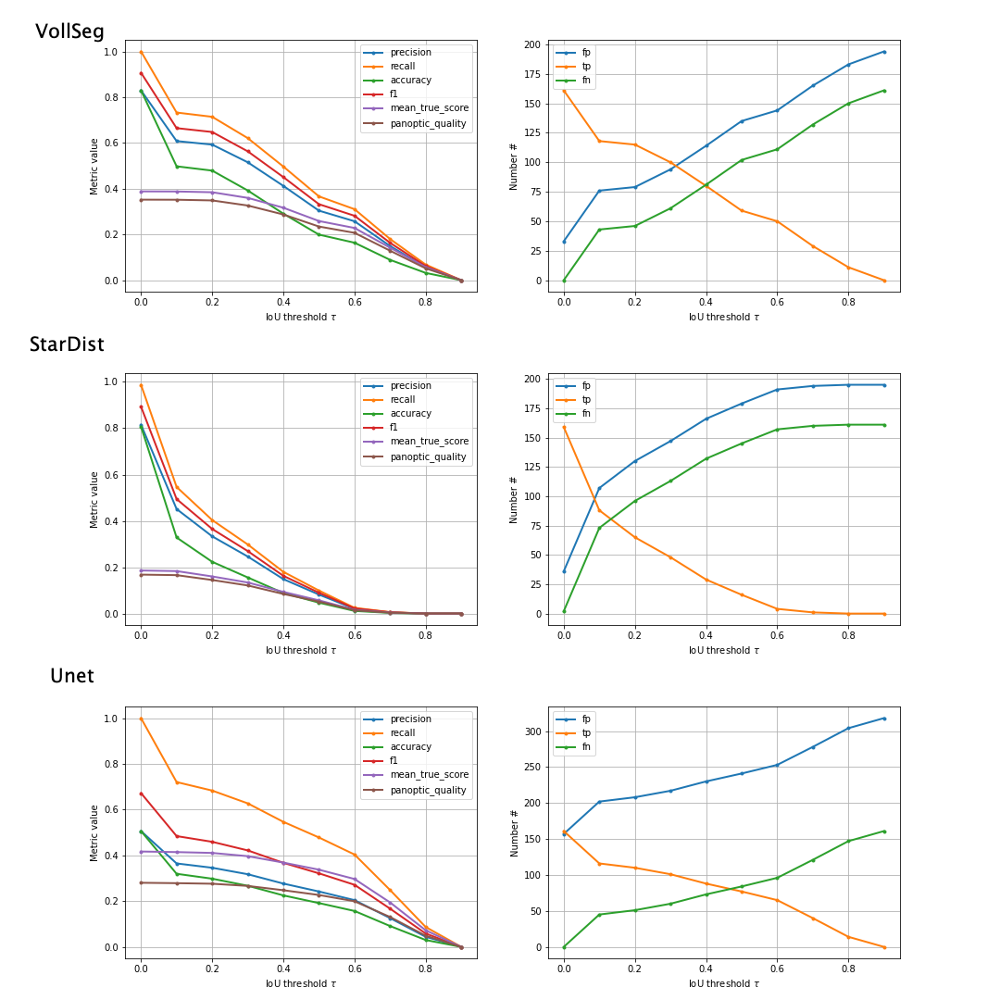
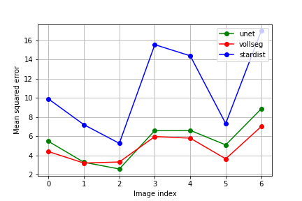
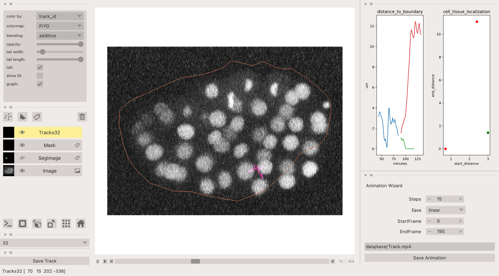

:author: Varun Kapoor
:email: varun.kapoor@curie.fr
:institution: Institut Curie
:institution: Paris, France

:corresponding:

:author: Claudia Carabana Garcia
:email: claudia.carabana-garcia@curie.fr
:institution: Institut Curie
:institution: Paris, France

:bibliography: ``vkcl.bib``

------------------------------------------------------------------------------------------------
Cell Tracking in 3D using deep learning segmentations
------------------------------------------------------------------------------------------------

.. class:: abstract

Live-cell imaging is a highly used technique to study cell migration and dynamics over time. Although many computational tools have been developed during the past years to automatically detect and track cells, they are optimized to detect cell nuclei with similar shapes and/or cells not clustering together. However, automated analysis of fluorescently membrane-labeled cells can be highly challenging due to their irregular shape, variability in size and dynamic movement across Z planes making it difficult to detect and track them.
Here we provide a detailed analysis pipeline to perform segmentation with accurate shape information, combined with a customized codebase of popular Fiji software Trackmate, BTrackmate, to perform cell tracking inside the tissue of interest. We developed VollSeg, a new segmentation method able to detect membrane-labeled cells with low signal-to-noise ratio and dense packing. Finally, we also created an interface in Napari, an Euler angle based viewer, to visualize the tracks along a chosen view making is possible to follow a cell along the plane of motion. Importantly, we provide a detailed protocol to implement this pipeline in a new dataset, together with the required Jupyter notebooks. Our code is released open source and BTrackmate is supplied as a plugin in ImageJ/Fiji available at the following links 

.. class:: keywords

   3D segmentation, cell tracking, deep learning, irregular shaped cells

Introduction
------------

Quantitative analysis to study morphogenesis requires an accurate image analysis workflow. Such a workflow entails volumetric (3D) imaging cells via fluorescence microscopy, accurate detection and segmentation of cells followed by tracking and track analysis. Depending on the biological question of interest the cells can be stained either with nuclei, cytoplasm or membrane fluorescent marker. The segmentation pipeline is tailored based on the staining as when the experiment is done with nuclei statining segmenting the nuceli pixels are of interest in contrast to when it is membrane stainng in which case the boundary pixels prediction is of interest. Broadly speaking the task of segmentation can be separated into semantic (classifying pixels as background or pixels belonging to the cell) segmentation or instance (classifying pixels belonging to individual cells by assigning a unique label to each cell) segmentation. Segmentation is complicated due to presence of multiple objects in the image, overlapping object pixels and non-homogeneous intensity distribution. Several methods have been proposed for such automated detection and segmentation tasks such as the traditional intensity based thresholding, watershed transform :cite:`Beucher2018` and of recent machine learning methods based on random-forest classifiers and support vector machines :cite:`berg2019`. Methods based on deep learning have made improved the accuracy of segmentation for natural and biomedical images alike :cite:`Rasse2020`. For the purpose of semantic segmentation U-Net has emerged as the most widely used network. This network also forms the backbone of another successful network to do cell nuclei segmentation in 3D, stardist :cite:`schmidt2018` :cite:`weigert2020`. Stardist directly predicts a shape representation as star-convex polygons for cell nuclei. Cell membrane segmentation is more challenging because segmentation mistakes would lead to missing links whereas for cell nuclei segmentation this only would lead to few missing pixels. To predict cell contours together with cell centroids :cite:`Wolny2020` proposed a 3D U-Net network using centroids as seeds for watershed in 3D confocal microscopy images. The drawback of this approach is misclassification due to sub-optimal seeding. Another approach is to directly predict the cell boundaries using a 3D U-Net and then using a volume partitioning algorithm to segment each cell based on the boundary prediction.
   
Our data set comprised of epithelial cells of mouse mammary glands using membrane marker. The cells are highly irregular in shape and do not posses clear boundaries to have a segmentation based on the boundary information alone, hence we developed a segmentation package in python called VollSeg, as a method to perform segmentation of such cells. Instead of segmenting the membrane we try to segment the region inside the membrane. We use stardist in 3D to obtain a star convex shape approximation for the cells and extract the cell centroids from these polygons. We also train a 3D U-Net to obtain a semantic segmentation map of the cells. We then perform a marker controlled watershed on the probability map of stardist using the U-Net segmentation as a mask image to prevent the overflow of segmentation regions. To avoid the error of sub-optimal seeding we developed a seed pooling approach to take advantage of strength of both the stardist and U-Net network to create an optimal seed pool to start the watershed process. We benchmarked our segmentation result and obtain different metrics showing how our approach is able to obtain shape approximation for the overlapping cells that go beyond the star convex shape.    
   
For analysis of the cell migration behavior we need to reliably track the cells and obtain certain attributes such as intensity, cell to tissue distance change over time. Cell tracking is challenging due to erratic volumetric motion, occlusion and cell divisions. Tracking using only the centroid information may lead to wrong cell assigmements hence we need to include other cell attributes such as the shape and intensity information while making the links between the cells in successive time frames. Trackmate :cite:`Tinevez2017` is a popular tracking software that uses customizable cost matrix for solving the linear assingement problem and uses Jaqman linker as a second step to link segments to dividing or merging cells. The software also comes with an interactive track editing interface. In our tracking solution called BTrackmate we only track the cells that are inside a tissue and allow the input to the tracking program as a csv file of cell attributes or image files of cell and tissue segmentation. We provide Jupyter notebooks to create such csv files that serve as an input to the tracker. Furthermore we also add some biological context in the tracking process of segment linking where after segment linking is done a track inspector removes tracklets that are shorter than a user defined time length. This avoids the tedious manual correction of removing such unphysical tracklets. 

The tracking results are saved as an xml file, the xml file can be re-opened in the software again to do more track editing. Of recent there is an Euler angle based viewer in python called Napari that allows for volumetric viewing along any chosen view. Using the track layer of napari :cite:`Ulicna2020` the cell tracks can be viewed in the plane of cell motion. We made a python package napatrackmater to export the track xml file as tracks layer in Napari for dividing and non dividing tracks. We provide a customized Napari widget to view selected tracks and obtain cell migration attributes from the selected tracks. Our pipeline allows precise segmentation of epithelial cells with irregular shape and posterior analysis of cell migration behavior.

Segmentation
-----------------
Our segmentation task required segmentation of cells coming from developing mouse embryo in 3D. These cells are imaged in low light to avoid photo-toxicity and are irregular in shape and intensity. Any bio image analysis task starts with segmentation of such cells coming out of a microscope. In order to avoid photo-toxicity that leads to cell death the imaging conditions have to be modulated to not have too high laser intensity under which the cells are imaged in. This leads to a low signal to noise ratio image dataset. Segmentation of such cells could be tedious with the conventional computer vision based techniques alone which almost always will lead to over segmentation in such images :cite:`Rasse2020` . However given enough training data, deep learning networks can be trained to achieve the same task with high degree of accuracy. Segmentation tasks can broadly be divided into semantic or instance segmentation methods. In the semantic segmentation approach only background-foreground segmentation is performed where the pixels are classified either belonging to an object class or not, in the instance segmentation approach the object pixels are classified as belonging to object A or B. In our case we use U-net to perform semantic segmentation of the cells in 3D. U-net is independent of shape of the cell hence can do a good semantic segmentation task, if the cells do not overlap connected component analysis alone is enough to segment the cells. But often in time lapses the cells often overlap and this requires a network that can do instance segmentation. Stardist has proven to be network that performs well in such segmentation tasks compared to other available networks for biological cells. Stardist is an N + 1 channel U-net network where N output channels are distance from the center of the cell to the boundary over a range of angles and a single channel for foreground-background pixel probability map. Using this distance information a mathematically abstract representation of a cell can be learnt by the network. The limitation of this network is that it works reliably for star-convex shapes and does not perform well if the shape of the cells is irregular. Furthermore it is dependent on two parameters to avoid over/under-segmentation, the probability threshold and the non-maximal suppression threshold.

We combine the strengths of both the networks in the following way: We denoise the image using the network trained using noise to void model train don our dataset. We perform the semantic segmentation using U-net, the foreground predicted pixels serve as the mask image we use later. The stardist prediction gives us convex polygon approximation to the cells and a distance map of the cell. Given our denoising step we are able to obtain a distance map that can then be used as base image of performing the watershed operation on. The convex polygons are shrunk down to obtain seeds, then use do connected components on the U-net result to obtain a label image and for each label we search in the stardist seed pool for existence of a seed. If no such seed is found the U-net seed is accepted as a valid seed else it is rejected. Post this seed pooling we perform watershed on the distance map and the overlapping/non-overlapping cells are basins of the energy map. With such an approach we are able to segment faint and bright cells alike in the same frame and obtain reliable shape as shown in Fig.

Network Training
---------------------

To train U-net and stardist networks for the segmentation task we created labeled training dataset of the cells in 3D. There are several network hyper parameters that have to be chosen to ensure that the model is not over or under fitting to the data. Such hyper parameters include the network depth, the starting number of convolutional filters that double with depth thereby increasing the number of optimization parameters of the network. For a network to generalize well on unseen data we need to fine tune these parameters. We also trained a noise to void network to denoise the images and used them in segmentation training as well. In this way we were able to augment the dataset that had only few examples to make a dataset containing enough examples to learn the underlying data generating distribution needed to have a robust segmentation.
 
We trained several networks, compared their training and validation losses and also measured their performance on ground truth data the networks to asses their performance. In order to assess the performance of the segmentation we use object level metric used in :cite:`schmidt2018` :cite:`weigert2020`. We compute true positive (TP)  as intersection over union of the predicted and the ground truth being greater than a given threshold, :math:`$\tau \in [0,1]$` Unmatched objects are false positives (FP)  and unmatched ground truth objects are false negatives (FN). We then compute average precision :math:`$AP_\tau= \frac{TP_\tau}{TP_\tau+ FP_\tau + FN_\tau} $`

evaluated across several Z stacks. We also compute mean squared error between the ground truth and the predicted results. In Fig. we show the stardist, unet and results from our approach (vollseg). We also show the results as plots in Fig.:ref:metrics U-net has low performance when it comes to object level segmentation as two channel unet can not do instance segmentation and hence shows poor object level detection scores but good true positive rate. But at a semantic level U-net is better than stardist at resolving the shape of the objects, vollseg even has a better performance compared to both due to our pooling approach that obtains the instance level information from stardist and cell shape information from U-net. Fig.:ref:mse. 

.. _fig-metrics:

   Metric of comparison between 1) VollSeg, 2) Stardist, 3) Unet.
   
.. _fig-mse:
   

   Mean Squared error comparison between VollSeg,  Stardist, Unet.
   
   
.. _fig-GTVoll:

.. figure:: figs/GTVoll.png

   Visual 3D segmentation comparison between 1) GT segmentation (top) and 2) VollSeg segmentation (bottom).
   
.. _fig-GTUnet:
   
.. figure:: figs/GTUnet

   Visual  3D segmentation comparison between 1) GT segmentation (top) and 2) Unet segmentation (bottom).     
   
   
.. _fig-GTStar:
   
.. figure:: figs/GTStar.png

   Visual 3D segmentation comparison between 1) GT segmentation (top) and 2) Stardist segmentation (bottom).  
   

The code for the seed criteria is shown below

.. code-block:: python

  def iou3D(boxA, centroid):
    
    ndim = len(centroid)
    inside = False
    
    Condition = [Conditioncheck(centroid, boxA, p, ndim)
     for p in range(0,ndim)]
        
    inside = all(Condition)
    
    return inside

  def Conditioncheck(centroid, boxA, p, ndim):
    
      condition = False
    
      if centroid[p] >= boxA[p] 
      and centroid[p] <= boxA[p + ndim]:
          
           condition = True
           
      return condition 
      
      
After obtaining the pool of seeds we can perform watershedding on either the distance map coming from stardist or the pixel probability map that is also an output of the stardist algorithm. We use U-net semantic segmentation as a mask in the watershedding process. The code for doing so is shown below     

.. code-block:: python     

  def WatershedwithMask3D(Image, Label,mask, grid): 
  
    properties = measure.regionprops(Label, Image) 
    binaryproperties = 
    measure.regionprops(label(mask), Image) 
    cord = 
    [prop.centroid for prop in properties] 
    bin_cord =
    [prop.centroid for prop in binaryproperties]
    Binarybbox = 
    [prop.bbox for prop in binaryproperties]
    cord = sorted(cord , 
    key=lambda k: [k[0], k[1], k[2]]) 
    if len(Binarybbox) > 0:    
            for i in range(0, len(Binarybbox)):
                
                box = Binarybbox[i]
                inside = 
                [iou3D(box, star) for star in cord]
                
                if not any(inside) :
                         cord.append(bin_cord[i])    
                         
    
    cord.append((0,0,0))
    cord = np.asarray(cord)
    cord_int = np.round(cord).astype(int) 
    
    markers_raw = np.zeros_like(Image) 
    markers_raw[tuple(cord_int.T)] =
    1 + np.arange(len(cord)) 
    markers = 
    morphology.dilation(markers_raw,
    morphology.ball(2))

    watershedImage = 
    watershed(-Image, markers, mask) 
    
    return watershedImage, markers 
    
Here the Label comes from stardist prediction and mask comes from the U-net prediction. 
The result of this approach is a 3D instance segmentation which we obtain for the luminal cells as shown in Fig.{1}. In the software package we provide training and prediction notebooks for training the base U-net and stardist networks on your own dataset. The package comes with jupyter notebooks for training and prediction on local GPU servers and also on Google Colab.

Interactive codebase
-----------------------------

To train your networks using vollseg, install the code via pip install vollseg in your tensorflow environment with python > 3.7 and < 3.9. In the first notebook we create the dataset for U-net and Stardist training. In the first cell the required parameters are the path to your data that contains the folder of Raw and Segmentation images with the same name of images to create training pairs. Also to be specified is the name of the generated npz file along with the model directory to store the h5 files of the trained model and the model name.

.. code-block:: python

  Data_dir = '/data/'
  NPZ_filename = 'VolumeSeg'
  Model_dir = '/data/'
  Model_Name = 'VolumeSeg'
  
  
In the next cell specify the model parameters, these parameters are the patch size chosen for training in XYZ for making overlapping patches for training, the number of patches to make the training data. The network depth is an important hyperparameter, the image patch size has to be big enough so that during downsampling the size of the image in the inner most layer is still greater than 1. Start number of convolutional filters is another crucial hyperparameter controlling the network learning capacity. These double up at each layer of the network and depending on the size of the training dataset and of the GPU memory capacity this parameter can be tuned when doing hyperparameter optimization to obtain the best model parameters for the given dataset. As a first step we generate the npz file for U-net training by setting the boolean GenerateNPZ to be true. Then in the next cell we can either train U-net and stardist network sequentially by setting TrainUNET and TrainSTAR booleans to be true or the users can split the training task between two GPUs by making a copy of the notebook and training one network per notebook. The other parameters to be chosen are the number of epochs for training, kernel size of the convolutional filter, the number of rays for stardist network to create a distance map along these directions. Additionally some of the OpenCL computations can be performed on a GPU using gputools library and if that is installed in the environment you can set use_gpu_opencl to be true. 
  
.. code-block:: python

  #Network training parameters
  NetworkDepth = 5
  Epochs = 100
  LearningRate = 1.0E-4 
  batch_size = 1
  PatchX = 256
  PatchY = 256
  PatchZ = 64 
  Kernel = 3
  n_patches_per_image = 16
  Rays = 128 
  startfilter = 48
  use_gpu_opencl = True
  GenerateNPZ = True
  TrainUNET = False
  TrainSTAR = False  
  
After the network has been trained it will save the config files of the training configuration for both the networks along with the weight vector file as h5 files that will be used by the prediction notebook. For running the network prediction on XYZ shape images use the prediction notebook either locally or on Colab. In this notebook you only have to specify the path to the image and the model directory. The only two parameters to be set here are the number of tiles (for creating image patches to fit in the GPU memory) and min_size in pixel units to discard segmented objects below that size. Since we perform watershed on either the probability map or the distance map coming out of stardist the users can choose the former by setting UseProbability variable to true or by default we use the distance map.  The code below operates on a directory of XYZ shape images.

.. code-block:: python
 
     ImageDir = 'data/tiffiles/'
     Model_Dir = 'data/' 
     SaveDir = ImageDir + 'Results/'
     UNETModelName = 'UNETVolumeSeg'
     StarModelName = 'VolumeSeg'
     NoiseModelName = 'NoiseVoid'
      
     UnetModel = CARE(config = None, 
     name = UNETModelName, 
     basedir = Model_Dir)
     StarModel = StarDist3D(config = None, 
     name = StarModelName, 
     basedir = Model_Dir)
     NoiseModel = N2V(config=None,
     name=NoiseModelName,
     basedir=Model_Dir)
  
     Raw_path = 
     os.path.join(ImageDir, '*.tif')
     filesRaw =
     glob.glob(Raw_path)
     filesRaw.sort
     min_size = 5 
     n_tiles = (1,1,1)
     for fname in filesRaw:
     
          SmartSeedPrediction3D(ImageDir,
          SaveDir, fname, 
          UnetModel, StarModel, NoiseModel, 
          min_size = min_size, 
          n_tiles = n_tiles, 
          UseProbability = False)

Tracking
------------

After we obtain the segmentation using our approach we create a csv file of the cell attributes that include their location, size and volume of the segmented cells inside a tissue region. We use this csv file of the cell attributes as input to the tracker along with the Raw and the Mask image. The Raw image is used to measure the intensity signal of the segmented cells while the segmentation is used to do the localization of the cells which we want to track, the mask image is used to localize only the cells that are inside the tissue region and is used to exclude some segmentation labels that may be outside the region of interest. We do the tracking in Fiji, which is a popular software among the biologists. We developed our code over the existing tracking solution called Trackmate :cite:`Tinevez2017`. Trackmate uses linear assignment  problem (LAP) algorithm to do linking of the cells and uses Jaqman linker for linking the segments for dividing and merging trajectories. It also provides other trackers such as the Kalaman filter to do tracking of non-dividing cells. Post tracking it has an interactive interface to edit the tracks. It gives the users full freedom in removing some links, creating new links. Post editing the tracks are saved as an xml file which can then be used to re-start the track editing. In order to aid in track editing we introduced a new parameter of minimum tracklets length to remove tracklets in a track that are short in the time dimension. This introduces a biological context of not having very short trajectories and hence reduces the track editing effort to correct for the linking mistakes made by the program. For testing our tracking program we used a freely available dataset from the cell tracking challenge of a developing C.elegans embryo. Using our software we can remove cells from tracking which do not fit certain criteria such as being too small (hence most likely a segmentation mistake) or being low in intensity or outside the region of interest such as when we want to track cells only inside a tissue. For this dataset we kept 12,000 cells and after filtering short tracks kept about 50 tracks with and without division events. The track information is saved as an XML file and can be re-opened to perform track editing from the last saved checkpoint. This is particularly useful when editing tracks coming from a huge dataset.

For this dataset the track scheme along with overlayed tracks in shown in Fig. The trackscheme is interactive as selecting a node in the trackscheme highlights the cell in Green and by selecting a cell in the image highlights its location in the trackscheme. Extensive manual for using the track editing is available on Fiji wiki.

.. _fig-trackscheme:

.. figure:: figs/trackscheme.png

   Trackscheme display for the C-elegans dataset.
   
   

Track Analysis
------------------------

After obtaining the tracks from BTrackmate we save them as Trackmate XML file, this file contains the information about all the cells in a track. Since the cells can be highly erratic in their motions and move in not just the XY plane but also in Z we needed an Euler angle based viewer to view such tracks from different camera positions, recently a new and easy to use viewer based on python called Napari came into existence. Using this viewer we can easily navigate along multi dimensions, zoom and pan the view, toggle the visibility of image layers etc. We made a python package to bridge the gap between the Fiji and the Napari world by providing a track exporter that can read in the track XML files coming from the Fiji world and convert them into the tracks layer coming form the python world. 

Using this viewer we export the Trackmate XML files as Napari tracks layer and are able to visualize the cell tracks along the plane of the cell motion, something which is not feasible in the hyperstack viewer of Fiji, which is the default track viewer of Trackmate and BTrackmate. The widgets we built in Napari enable animation recording that saves the chosen cell track along a user defined camera view and speed. The other features of the widget include choosing only one cell track to view as compared to viewing tracks of all the cells at the same time along with displaying some track information about the selected track.

We use this viewer not just to view the tracks but also to analyze and extract the track information. As a first step we separate the dividing trajectories from the non-dividing trajectories, then in one notebook we compute the distance of the cells in the track from the tissue boundary and record the starting and the end distance of the root tracks and the succeeding tracklets of the daughter cells post division for dividing trajectories and only the root track for the non-dividing trajectory. This information is used to determine how cell localization at the start and the end of a track This information is crucial when studying the organism in the early stage of development where the cells are highly dynamic and their fate is not known a priori. In conjunction with other studies such track analysis is meant to aid in obtaining insights into how cell chooses its fate (claudia maybe add more?)

Also another quantity of interest that can be obtained from the tools is quantification of intensity oscillations over time. In certain conditions there could be an intensity oscillation in the cells due to certain protein expression that leads to such oscillations, the biological question of interest is if such oscillations are stable and if so what is the period of the oscillation :cite:`Lahmann2019`. Using our tool intensity of individual tracklet can be obtained which is then Fourier transformed to show the oscillation frequency if any. With this information we can see the contribution of each tracklet in the intensity oscillation and precisely associate the time when this oscillation began and ended.

.. _fig-distancediv:

   Parent cell before division.
   
.. _fig-distancediv2:

.. figure:: figs/DistanceDividing2.png

   Parent cell after division, one daughter cells moves inside while other stays close to the boundary.   
   
      
The results of track analysis can be saved as images or csv files.     
     
Conclusions
--------------     
We have presented a workflow to do segmentation, tracking and track analysis of cells in 3D for cells of irregular shape and intensity distribution. Our workflow is three step based approach:
1) Create training models for denoising and segmentation using jupyter notebooks that can be run in local or in Colab environment.
2) Using our Fiji plugin to do the tracking of cells inside the tissue and editing the tracks and creating a tracks xml file.
3) Exporting the xml file into Napari for track visualization and analysis using Jupyter notebooks.        

Acknowledgements
-----------------
We acknowledge the Cell and Tissue Imaging Platform (PICT-IBiSA) of the Genetics and Developmental Biology Department (UMR3215/U934) at Institut Curie, in particular Olivier Renaud for supporting the software development. We are grateful to Dr Silvia Fre for support and constructive discussions. V.K is supported by Labex DEEP at Institut Curie (ANR-11- LBX0044 grant). C.C is supported by funding from the European Unions Horizon 2020 research and innovation programme under the Marie Skłodowska-Curie grant agreement No 666003. 

Author Contributions
---------------------
V.K conceived the project and wrote the code; C.C performed the image acquisition of the used dataset and created labeled training dataset in 3D; V.K and C.C wrote the manuscript. 

        

References
--------------------

