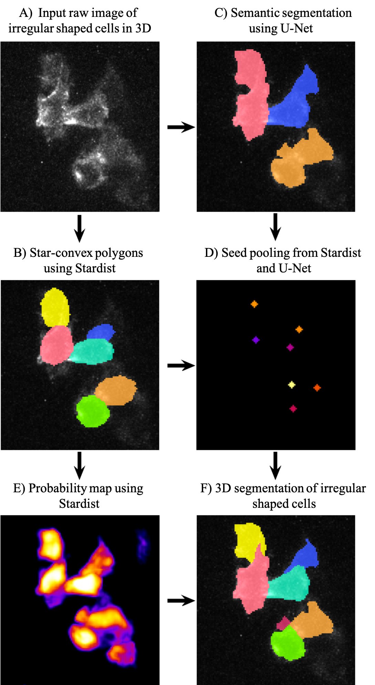
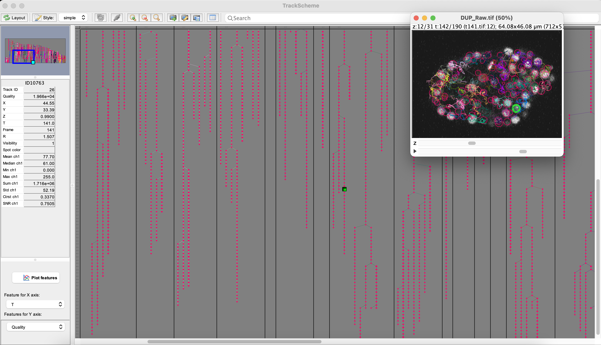
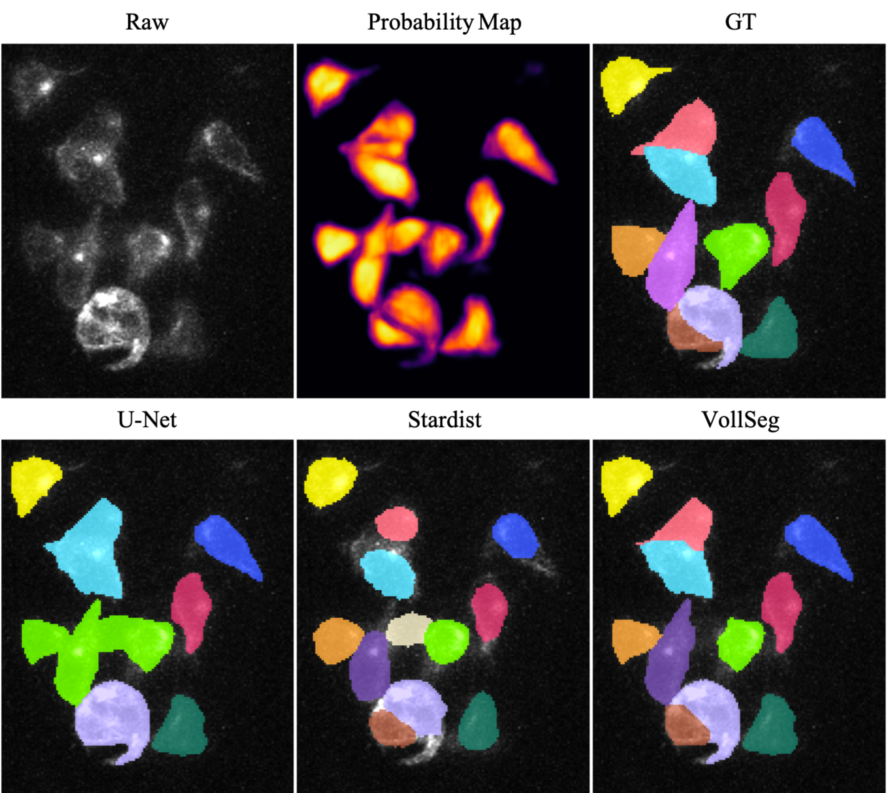
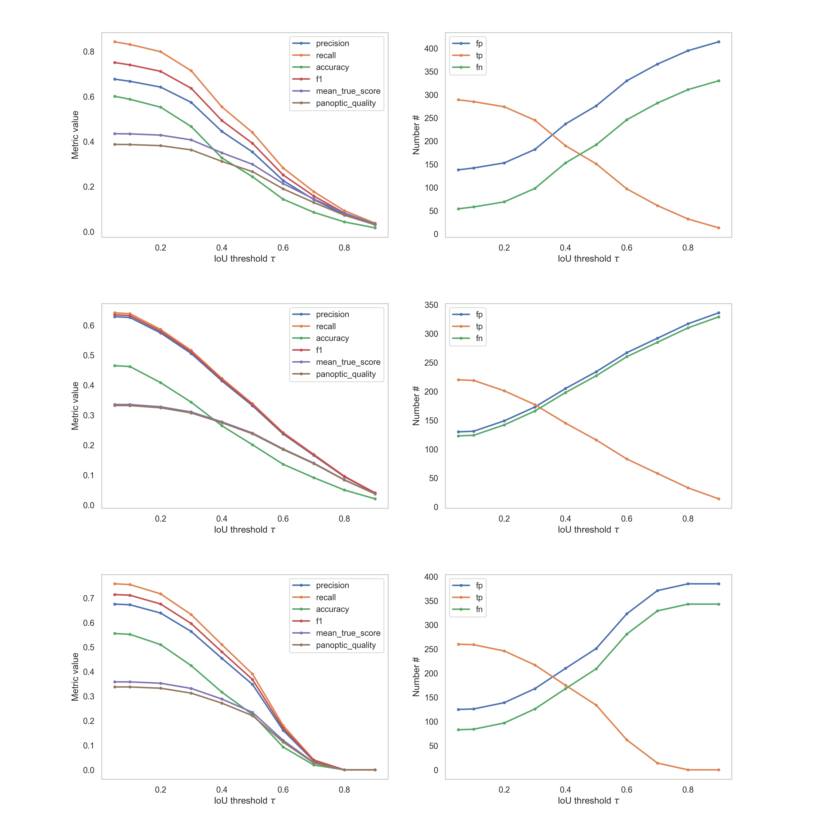
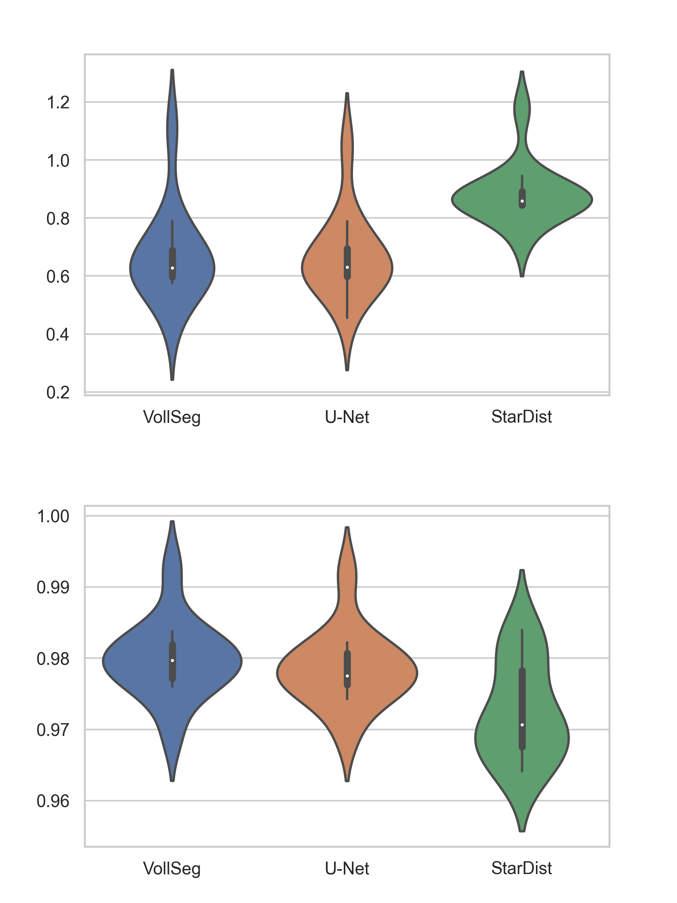
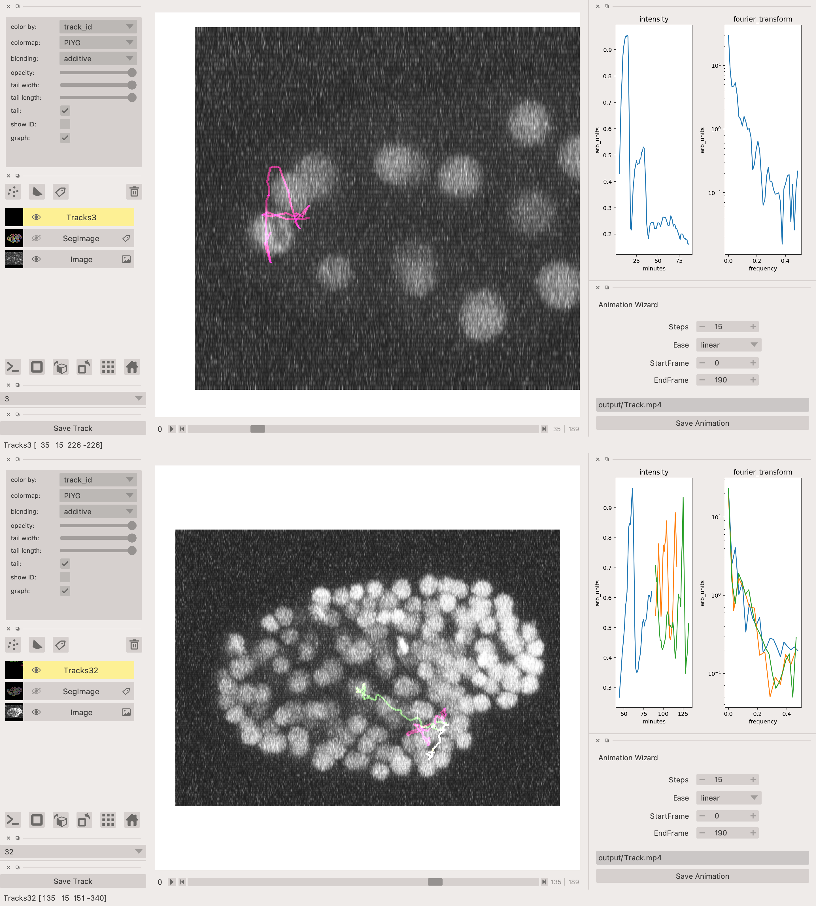
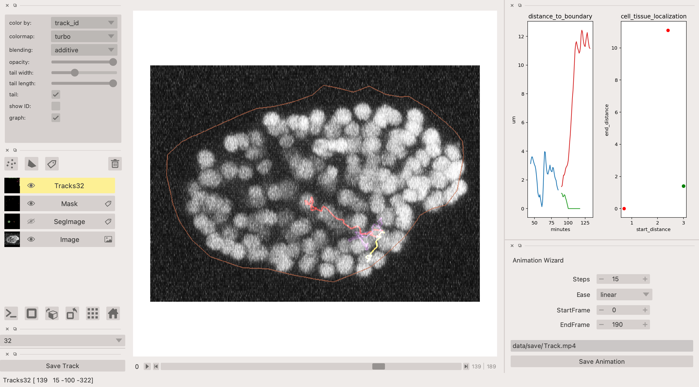

:author: Varun Kapoor
:email: varun.kapoor@curie.fr
:institution: Institut Curie, PSL Research University, Sorbonne University, CNRSUMR 3215, INSERM U934, Genetics and Developemental Biology, Paris, France.

:author: Claudia Carabaña
:email: claudia.carabana-garcia@curie.fr
:institution: Institut Curie, PSL Research University, Sorbonne University, CNRSUMR 3215, INSERM U934, Genetics and Developemental Biology, Paris, France.

:bibliography: vkc

------------------------------------------------------------------------------------------------
Cell Tracking in 3D using deep learning segmentations
------------------------------------------------------------------------------------------------

.. class:: abstract

Live-cell imaging is a highly used technique to study cell migration and dynamics over time. Although many computational tools have been developed during the past years to automatically detect and track cells, they are optimized to detect cell nuclei with similar shapes and/or cells not clustering together. These existing tools are challenged when tracking fluorescently labelled membranes of cells due to cell's irregular shape, variability in size and dynamic movement across Z planes making it difficult to detect and track them.
Here we introduce a detailed analysis pipeline to perform segmentation with accurate shape information, combined with BTrackmate, a customized codebase of popular ImageJ/Fiji software Trackmate, to perform cell tracking inside the tissue of interest. We developed VollSeg, a new segmentation method able to detect membrane-labelled cells with low signal-to-noise ratio and dense packing. Finally, we also created an interface in Napari, an Euler angle based viewer, to visualize the tracks along a chosen view making it possible to follow a cell along the plane of motion. Importantly, we provide a detailed protocol to implement this pipeline in a new dataset, together with the required Jupyter notebooks. Our codes are open source available at :cite:`Github2021`.

.. class:: keywords

   3D segmentation, cell tracking, deep learning, irregular shaped cells, fluorescent microscopy.

Introduction
------------

  
     Schematic representation showing the segmentation approach used in VollSeg. First, we input the raw fluorescent image in 3D (A) and pre-process it to remove noise. Next, we obtain the star convex approximation to the cells using Stardist (B) and the U-Net prediction labelled via connected components (C). We then obtain seeds from the centroids of labelled image in B, for each labelled region of C in order to create bounding boxes and centroids. If there is no seed from B in the bounding box region from U-Net, we add the new centroid (shown in yellow) to the seed pool (D). Finally, we do a marker controlled watershed in 3D using skimage implementation on the probability map shown in (E) to obtain the final cell segmentation result (F). All images are displayed in Napari viewer with 3D display view. 
   
     :label:`algorithm`

Live-cell imaging is a highly used technique to study cell migration and dynamics over time. The image analysis workflow of volumetric (3D) imaging of cells via fluorescence microscopy starts with an accurate detection and segmentation of cells followed by cell tracking and track analysis. Broadly speaking the task of segmentation can be separated into semantic segmentation (classifying pixels as background or pixels belonging to the cell) or instance segmentation (classifying pixels belonging to individual cells by assigning a unique label to each cell). Segmentation is complicated due to presence of multiple objects in the image, overlapping object pixels and non-homogeneous intensity distribution. Several methods have been proposed for such automated detection and segmentation tasks such as the traditional intensity based thresholding, watershed transform :cite:`Beucher2018` and of recent machine learning methods based on random-forest classifiers and support vector machines :cite:`berg2019`. It was shown in :cite:`Rasse2020` that conventional computer vision and machine learning based techniques alone will almost always lead to sub-optimal segmentation and that methods based on deep learning have improved the accuracy of segmentation for natural and biomedical images alike. For the purpose of semantic segmentation U-Net :cite:`Ronn2015` has emerged as the most widely used network for biological applications. This network also forms the backbone of another successful network to do cell nuclei segmentation in 3D, Stardist :cite:`schmidt2018` :cite:`weigert2020`. Stardist directly predicts a shape representation as star-convex polygons for cell nuclei in 2D and 3D. However, cell membrane segmentation is especially challenging as opposed to nuclei segmentation due to fewer boundary pixels and the need to separate touching cells. To predict cell contours together with cell centroids, Eschweiler et al. proposed a 3D U-Net network using centroids as seeds for watershed in 3D confocal microscopy images :cite:`eschweiler2018`. The drawback of this approach is misclassification due to sub-optimal seeding. Another approach proposed by Wolny et al., is to directly predict the cell boundaries using a 3D U-Net followed by a volume partitioning algorithm to segment each cell based on the boundary prediction :cite:`Wolny2020`. This approach requires well defined cell boundaries, which may create segmentation errors in low signal-to-noise imaging conditions.
   
 

To address the issues with existing segmentation algorithms just described, we developed Vollseg. In brief we use Stardist in 3D to obtain a star convex shape approximation for the cells and extract the cell centroids from these polygons. We also train a 3D U-Net model to obtain a semantic segmentation map of the cells. We then perform a marker controlled watershed on the probability map of Stardist using the U-Net segmentation as a mask image to prevent the overflow of segmentation regions. To avoid the error of sub-optimal seeding we developed a seed pooling approach taking advantage of strength of both the Stardist and U-Net networks. We benchmark our segmentation result on a challenging dataset comprised of epithelial cells of mouse embryonic mammary glands with membrane labelling. These cells are highly irregular in shape and have a low signal-to-noise ratio to obtain an accurate segmentation only based on the boundary information. Using this dataset, we obtain different metrics showing that our approach is able to obtain shape approximation for the overlapping cells that go beyond the star convex shape. The complete segmentation pipeline is illustrated in Figure :ref:`algorithm`.

   
   
For analysis of the cell migration behavior we need to reliably track the cells and obtain certain attributes such as signal intensity or changes over time of the distance between the cells and tissue boundary. Cell tracking is challenging due to erratic volumetric motion, occlusion and cell divisions. Tracking using only the centroid information may lead to wrong cell assigmements, hence we need to include other cell attributes such as the shape and intensity information while making the links between the cells in successive time frames. Trackmate is a popular tracking software that uses customizable cost matrix for solving the linear assignment problem and uses Jaqman linker as a second step to link segments of dividing and merging cells :cite:`Tinevez2017`. In this paper, we introduce BTrackmate, a Fiji/ImageJ plugin to track the previously segmented cells. The major advantage of BTrackmate is the ability to track the cells inside a tissue. It allows the input of the cell and tissue segmentation image files and/or a csv file of the cell attributes. Furthermore, we also add some biological context in the tracking process where after segment linking is done a track inspector removes segments that are shorter than a user defined time length. Such short segments are unlikely to be true division events if they are too short and manually removing them can be tedious when many tracks are present. The users can choose this parameter in time units and can set it to 0 if removing such short segments is not required. 

Finally, the tracking results obtained with BTrackmate are saved as an xml file that can be re-opened in an Euler angle based viewer in python called Napari, allowing volumetric viewing of the tracked cells using the track layer feature :cite:`Ulicna2020`. We made a python package called napatrackmater to export the track xml file as tracks layer in Napari for dividing and non-dividing tracks. We provide a customized Napari widget to view selected tracks and obtain their cell migration attributes. 

 

Material and Methods
---------------------

Preparation of the dataset
***************************

We used fluorescent microscopy images of mouse embryonic mammary glands stabilized in an ex vivo culture previously collected in the laboratory of Dr. S. Fre at Institut Curie. All images were acquired with an inverted confocal laser scanning microscope (e.g. Zeiss LSM780/880) equipped with long-working distance objectives to acquire high-resolution 3D image stacks. We acquired images of pixel size (22, 512, 512) with calibration of (3, 0.52, 0.52) micrometer. 
The quality at which these images are acquired is determined by the spatial resolution of the used optical device, desired temporal resolution, duration of the experiment and depth of the acquired Z-stacks. We perform unsupervised image denoising :cite:`krull2019` on our dataset, an algorithm we chose based on its performance compared to other methods :cite:`Richardson72`, :cite:`Lucy74`.
Post-restoration of the 3D images, we developed a method to perform the segmentation of the cells using deep learning techniques. We created a training dataset with hand drawn segmentation of 14 Z-stacks. We performed data augmentation on the microscopy images by denoising, adding Poisson and Gaussian noise, random rotations and flips to create 700 Z-stacks. We chose a patch size of (16, 128, 128) and created 11,264 patches for training Stardist and U-Net network. For the Stardist network we chose 192 rays to have a better shape resolution for the irregular shaped cells. 

Parameter Setting
*****************
Stardist predicts object instances based on probability threshold and non maximal suppression threshold to merge overlapping predictions. These parameters can be automatically determined using the optimize threshold program that we provide with the segmentation package. Higher values of the probability threshold yield fewer object instances, but avoids false positives. Higher values of the overlap threshold would lead to oversegmentation. We used 32 Z-stacks to determine the optimal parameters of probability threshold of 0.76 and non maximal suppression threshold of 0.3. 

Segmentation
*****************
As illustrated in Figure :ref:`algorithm`, we first obtain the centroids of the star convex approximated cell shapes and create a seed pool with these centroid locations. Even with the optimized threshold values we find that the seeds can be sub-optimal as many cells instances with low signal are missed. In order to make the seed pool optimal we use the U-Net prediction to obtain a binary image of semantic segmentation, perform connected component analysis to label the image and obtain bounding boxes (computed using scikit-image :cite:`scikit-image`, version 0.18.x) for each label in 3D. For each bounding box we search for a seed from the Stardist predicted seed pool. If a Stardist seed is found inside the bounding box, the centroid of the U-Net predicted bounding box is rejected else the centroid is added to the seed pool to make a complete set of seeds that we use to start a watershed process in 3D. We use the probability map of Stardist to start the watershed process to obtain a better shape approximation for the irregular shaped cells that goes beyond the star convex shape.  

 
 

The code for the merging of U-Net and Stardist seeds is the following:

.. code-block:: python

  def iou3D(box_unet, centroid_star):
    
    ndim = len(centroid_star)
    inside = False
    
    Condition = [Conditioncheck(centroid_star, box_unet,
     p, ndim)
     for p in range(0,ndim)]
        
    inside = all(Condition)
    
    return inside
  
  def Conditioncheck(centroid_centroid, box_unet, 
         p, ndim):

    condition = False

    if centroid_star[p] >= box_unet[p]
    and centroid_star[p] <= box_unet[p + ndim]:

         condition = True

    return condition
      
The code for doing watershed in 3D using the complete set of seeds on the probability map of Stardist is the following:   

.. code-block:: python     

  def WatershedwithMask3D(Image, Label, mask, grid):
    #Image = ProbabilityMap of Stardist
    #Label = Label segmentation image of Stardist 
    #Mask = U-Net predicted image post binarization 
    properties = measure.regionprops(Label, Image) 
    binaryproperties = 
    measure.regionprops(label(mask), Image) 
    Coordinates = [prop.centroid for prop in properties] 
    BinaryCoordinates = [prop.centroid for 
    prop in binaryproperties]
    Binarybbox =
    [prop.bbox for prop in binaryproperties]
    Coordinates = sorted(Coordinates , 
    key=lambda k: [k[0], k[1], k[2]]) 

    if len(Binarybbox) > 0:    
         for i in range(0, len(Binarybbox)):
        
            box = Binarybbox[i]
            inside = [iou3D(box, star) 
            for star in Coordinates]

            if not any(inside) :
                  Coordinates.append(BinaryCoordinates[i])    
         

    Coordinates.append((0,0,0))
    Coordinates = np.asarray(Coordinates)
    coordinates_int = np.round(Coordinates).astype(int) 

    markers_raw = np.zeros_like(Image) 
    markers_raw[tuple(coordinates_int.T)] = 1
    + np.arange(len(Coordinates)) 
    markers = morphology.dilation(
    markers_raw.astype('uint16'), morphology.ball(2))

    watershedImage = watershed(-Image, markers, 
    mask = mask.copy()) 
    return watershedImage, markers
    
    
Performance Metrics
********************
    
Accuracy of segmentation results is assesed by comparing the obtained labels to the ground truth (GT) labels. The most commonly used metric is to compute intersection over union (IOU) score between the predicted and the GT label image.
We define GT, labels and IOU score as:

:math:`GT = \{gt\}`, :math:`SEG=\{seg\}` are two sets of segmented objects.

:math:`IOU(a, b)` is the value of the IOU operation between two segmented objects a and b.

A threshold score value :math:`\tau \in [0,1]` is used to determine the true positive (TP), false positives (FP) and false negatives (FN) defined as:     
:math:`$TP=\{seg\in SEG, \exists~gt\in GT,~IOU(gt,seg)>\tau\}$`      
:math:`$FP = \{seg\in SEG,\forall~gt\in GT,~IOU(gt, set)<\tau\}$`
:math:`$FN = \{gt\in GT, \forall~seg\in SEG,~IOU(gt, seg)<\tau\}$`

We use the Stardist implementation to compute accuracy scores which uses the hungarian method (scipy implementation) :cite:`Kuhn1955` to compute an optimal matching to do a one to one assingement of predicted label to GT labels. This implementation avoids finding multiple TP for a given instance of GT.
We also compute precision (TP/(TP + FP)), recall (TP / (TP + FN)), F1 score (geometric mean of precision and recall) and accuracy score 
:math:`AP_\tau= \frac{TP_\tau}{TP_\tau+ FP_\tau + FN_\tau}`.  
To evaluate the accuracy of our method in resolving the shape of the cells we compute the mean squared error (MSE) and structural similarity index measurment (SSIM) between the GT and obtained segmentation images post-binarization operation on the obtained instance segmentation maps. MSE shows a low score if the image is structurally closer to GT. SSIM score is higher if the two images are structurally more similar to each other. 
    
    
Detailed Procedure
*******************        
            
The software package we provide comes with training and prediction notebooks for training the base U-Net and Stardist networks on your own dataset. We provide jupyter notebooks to do so on local GPU servers and also on Google Colab.
   
=================
Network Training
=================

In the first Jupyter notebook we create the dataset for U-Net and Stardist training. In the first cell of the notebook the required parameters are the path to your data that contains the folder of Raw and Segmentation images to create training pairs. Also to be specified is the name of the generated npz file along with the model directory to store the h5 files of the trained model and the model name.

.. code-block:: python

  Data_dir = '/data/'
  NPZ_filename = 'VollSeg'
  Model_dir = '/data/'
  Model_Name = 'VollSeg'
  

  
The model parameters are specified in the next notebook cell. These parameters are described as follows:

1) NetworkDepth = Depth of the network, with each increasing depth the image is downsampled by 2 hence the XYZ dimension of the data / 2^depth has to be greater than 1.

2) Epochs: training for longer epochs ensures a well converged network and requires longer GPU runtimes.

3) Learning rate is the parameter which controls the step size used in the optimization process and it should not be greater than 0.001 at the start of the training.

4) Batch size controls the number of images used for doing stochastic gradient descent and is a parameter limited by the GPU memory available, batch size < 10 should be optimal.

5) Patch X, Y, Z is the size used for making patches out of the image data. The original image is broken down into patches for training. Patch size is chosen based on having enough context for the network to learn the details at different scales.

6) Kernel is the receptive field of the neural network, usual choices are 3, 5 or 7. This is the size of the convolutional kernel used in the network.

7) n_patches_per_image is the number of patches sampled for each image to create the npz file, choose an optimal value so that the file fits in the RAM memory.

8) Rays stand for the number of rays used to learn the distance map, low rays decreases the spatial resolution and high rays are able to resolve the shape better.

9) use_gpu_opencl is a boolean parameter that is set true if you want to do some opencl computations on the GPU, this requires GPU tools python package.

10) Before starting the U-Net training an npz file containing the paried Raw and Binary segmentation images needs to be created, by setting GenerateNPZ = True such a file is created. 

11) If there are multiple GPU's available, the training of U-Net and Stardist can be split between the GPU's. Set TrainUNET = True  for training a U-Net network, create a copy of the notebook and only set TrainSTAR = True for training a Stardist network. If there are no multiple GPU's available, set all of these parameters in 10) and 11) to be True to create and train both the networks in a single notebook run.
 

The code to set the parameters is the following:

  
.. code-block:: python

  #Network training parameters
  NetworkDepth = 3
  Epochs = 100
  LearningRate = 1.0E-4 
  batch_size = 5
  PatchX = 128
  PatchY = 128
  PatchZ = 16
  Kernel = 3
  n_patches_per_image = 16
  Rays = 192 
  startfilter = 48
  use_gpu_opencl = True
  GenerateNPZ = True
  TrainUNET = False
  TrainSTAR = False  
  
After the network has been trained it will save the configuration files of the training for both the networks along with the weight vector file as h5 files that will be used by the prediction notebook. For running the network prediction on XYZ shape images use the prediction notebook either locally or on Colab. In this notebook you only have to specify the path to the image and the model directory. The only two parameters to be set here are the number of tiles (for creating image patches to fit in the GPU memory) and min_size in pixel units to discard segmented objects below that size. We perform the watershed operation on the probability map as a default. However, this operation can also be changed to use the distance map coming out of Stardist prediction instead by setting 'UseProbability' variable to false.
The code below operates on a directory of XYZ shape images:

.. code-block:: python
 
     ImageDir = 'data/tiffiles/'
     Model_Dir = 'data/' 
     SaveDir = ImageDir + 'Results/'
     UNETModelName = 'UNETVollSeg'
     StarModelName = 'VollSeg'
     NoiseModelName = 'NoiseVoid'
      
     UnetModel = CARE(config = None, 
     name = UNETModelName, 
     basedir = Model_Dir)
     StarModel = StarDist3D(config = None, 
     name = StarModelName, 
     basedir = Model_Dir)
     NoiseModel = N2V(config=None,
     name=NoiseModelName,
     basedir=Model_Dir)
  
     Raw_path = 
     os.path.join(ImageDir, '*.tif')
     filesRaw =
     glob.glob(Raw_path)
     filesRaw.sort
     min_size = 50
     n_tiles = (1,1,1)
     for fname in filesRaw:
     
          SmartSeedPrediction3D(ImageDir,
          SaveDir, fname, 
          UnetModel, StarModel, NoiseModel, 
          min_size = min_size, 
          n_tiles = n_tiles, 
          UseProbability = False)

Tracking
********* 

After we obtain the segmentation using VollSeg, we create a csv file of the cell attributes that include their location, size and volume inside a region of interest. For large datasets memory usage could be of concern while loading the images into memory, hence inputs via csv could prove helpful. Tracking is performed in ImageJ/Fiji, an image processing package. We developed our code over the existing tracking solution called Trackmate :cite:`Tinevez2017`. Trackmate uses linear assignment  problem (LAP) algorithm to do linking of the cells and uses Jaqman linker for linking the segments for dividing and merging trajectories. It also provides other trackers such as the Kalman filter to do tracking of non-dividing cells. Trackmate comes with a fully interactive track editing interface with graph listener to show the selected cell in the trackscheme and vice versa, to click on the graph and have the selected cell being highlighted in the image, making the process of track editing interactive. Post-editing the tracks are saved as an xml file which can then be loaded back into the program to do more track editing if needed. When a cell divides, the track is splitted up in two tracklets. In order to aid in track editing, we introduced a new parameter of minimum tracklet length to remove tracklets in a track that are short in the time dimension. This introduces a biological context of not having very short trajectories, reducing the track editing effort to correct for the linking mistakes made by the program. For testing our tracking program we used a freely available dataset from the cell tracking challenge of a developing C. elegans embryo :cite:`Celegans` :cite:`Murray2008`. Using our software we can remove cells from tracking which do not fit certain criteria such as being too small (hence most likely a segmentation mistake) or being low in intensity or outside the region of interest such as when we want to track cells only inside a tissue. For this dataset we kept 12,000 cells and after filtering short tracks kept about 50 tracks with and without division events.

For this dataset the track scheme along with overlayed tracks is shown in Figure :ref:`trackscheme`. Selected node in the trackscheme is highlighted in green and vice versa. Extensive manual for using the track editing is available on ImageJ/Fiji wiki :cite:`Fijiwiki`.

  
     Trackscheme display for the C. elegans dataset. 
   
     :label:`trackscheme`
  
Results
--------

Quantitative Comparisons between Segmentation Methods 
******************************************************

   
     
     Visual 3D segmentation comparison between the Ground truth (GT) image, Stardist, U-Net and VollSeg results. The images are displayed in Napari viewer with 3D display view. 
   
     :label:`visseg`

We compare our proposed VollSeg segmentation approach to two commonly used methods for cell segmentation of fluorescent microscopy images, 3D Stardist :cite:`schmidt2018` :cite:`weigert2020` and 3D U-Net :cite:`Ronn2015`.
A 3D cell rendering using all analyzed segmentation methods is shown in the Figure :ref:`visseg`.
Stardist in 3D was previously compared to other classical method, the IFT watershed, and it was shown to perform better than the classical method, hence we use Stardist as a baseline for comparison. To assess the performance of our segmentation, we compute the metrics described in material and methods section. 
VollSeg and Stardist methods perform at comparable accuracy, but higher than U-Net, as shown in Figure :ref:`metrics` A. This is expected, as U-Net can not perform instance segmentation of overlapping cells. In addition, when quantifying the F1-score in Figure :ref:`metrics` B,  U-Net obtains the lowest score because it detects less TP segmented pixels in comparision to VollSeg and Stardist as shown in Figure :ref:`metrics` C. However, Stardist has the highest mean squared error as it is unable to detect the irregular shape while U-Net and Vollseg have similar performance, as shown in Figure :ref:`ssimmse` A. This result can also be seen from structural similarity index measurement, shown in Figure :ref:`ssimmse` B. In conclusion, VollSeg is able to strength the shape accuracy from U-Net and the ability to separate the overlapping instances from Stardist. 

     
      
     Segmentation comparision metrics between VollSeg (in blue), Stardist (in orange) and U-Net (in green). We plot (A) accuracy (as percentage), (B) F1 score (as percentage) and (C) true positive rates (as number of pixels) for all the networks. 
     
     :label:`metrics`

   

     
     
     We plot Mean Squared error (MSE) (A) and Structural similarity index measurement (SSIM) (B)  comparing between VollSeg (in blue), Stardist (in orange) and U-Net (in green). 
     
      
      :label:`ssimmse`

   

Track Analysis
**********************

After obtaining the tracks from BTrackmate, we save them as Trackmate xml file, which contains the information about all the cells in a track. Since the cells can be highly erratic in their volumetric motions, we use Napari, an Euler angle based viewer, to visualize such tracks from different reference positions.  We made a python package to export the xml files previously saved in ImageJ/Fiji and convert them into the tracks layer of Napari. We made a customised widget based graphic user interface (GUI) to view selected tracks, display the track information and save the cell track along user selected view, as shown in 
Figure :ref:`intensity-napari` A. On the top left panel, the image and tracks layer properties are displayed and can be changed (1). In the bottom left, there is a dropdown menu enlisting all the tracks (2). Users can select the track to be displayed in the central window and it can be switched between the hyperstack and the 3D view (3). The user can also choose to view all the tracks at once and then toggle the visibilty of the tracks using the eye icon next to the image and tracks layer (4). On the top right panel, we show two plots displaying the track information (5). The 3D central view can be rotated and translated to view the tracks along the plane of motion of the cells and the selected view can be saved as an animation using the bottom right animation panel (6). For the cells that divide we show the intensity variation and associated fast fourier transform for each tracklet.

We provide two example jupyter notebooks with the package. In the first one we compute the cell distance from the tissue boundary change over time for dividing and non-dividing trajectories. The user selects a track of interest and it displays two plots next to the track view that show the distance change over time for the whole track (non-dividing trajectory) and the starting and end location of the cells, as shown in Figure :ref:`division-napari-start`. For the tracks with multiple events of cell division we show the distance change over time of each tracklet. In the localization plot the parent tracklet start and end location is shown in green while all the daughter cells start and end locations are shown in red. In the second example notebook, the plots show intensity change in the track over time along with the associated frequency of intensity oscillation present in each tracklet. The frequency associated with each tracklet is computed using the scipy implementation of fast fourier transform. The results of track analysis can be saved as plots, mp4 files of the track animation or csv files.     

      
      Napari widget to view tracks and plot track information in non-dividing trajectories (A) and dividing trajecrtories (B). For the selected track we see the intensity change over time and its associated fast Fourier transform.
      
      :label:`intensity-napari`
      

      
      Napari widget to analyze the distance of the cell to the boundary. The left plot displays the distance of the daughter cells to the boundary, while the right plot shows the start and end distance localization of the mother cell (in green) and daughter cells (in red). 
      
      :label:`division-napari-start`
 

Conclusions
---------------------    
We have presented a workflow to do segmentation, tracking and track analysis of cells in 3D with irregular shape and intensity distribution. For performing segmentation we developed VollSeg, a jupyter notebook based python package that combines the strengths of semantic and instance deep learning segmentation methods. Post-segmentation we create a csv file containing the information about the cells inside a region of interest which serves as an input to Btrackmate, the ImageJ/Fiji plugin we created for doing the tracking. The tracking software uses existing track editing interface of Trackmate and saves the track information as an xml file. To view and analyze such volumetric tracks we created napatrackmater, a python package to export such trajectories as track layer of Napari and we provide jupyter notebook based enviornment for track analysis with two example notebooks. 

The tools that we present here can also be useful for segmentation of cells coming from other organisms or imaging modalities (transmitted light and light sheet imaging) as our method can be applied to segment cells that go beyond the star convex polyhedra. 

Acknowledgements
---------------------
We acknowledge the Cell and Tissue Imaging Platform (PICT-IBiSA) of the Genetics and Developmental Biology Department (UMR3215/U934) at Institut Curie, member of the French National Reserch infrastructure France-Bioimaging (ANR-10-INBS-04). We thank specially Olivier Renaud for supporting the software development. We are grateful to Dr Silvia Fre for support and constructive discussions. We thank Leo Guginard for insightful comments about the manuscript. V.K is supported by Labex DEEP at Institut Curie (ANR-11- LBX0044 grant). C.C is supported by funding from the European Union's Horizon 2020 research and innovation programme under the Marie Skłodowska-Curie grant agreement No 666003.  

Author Contributions
---------------------
V.K wrote the code; C.C performed the image acquisition of the used dataset and created labelled training dataset in 3D; V.K and C.C wrote the manuscript. 

        

 
  
References
---------------------

