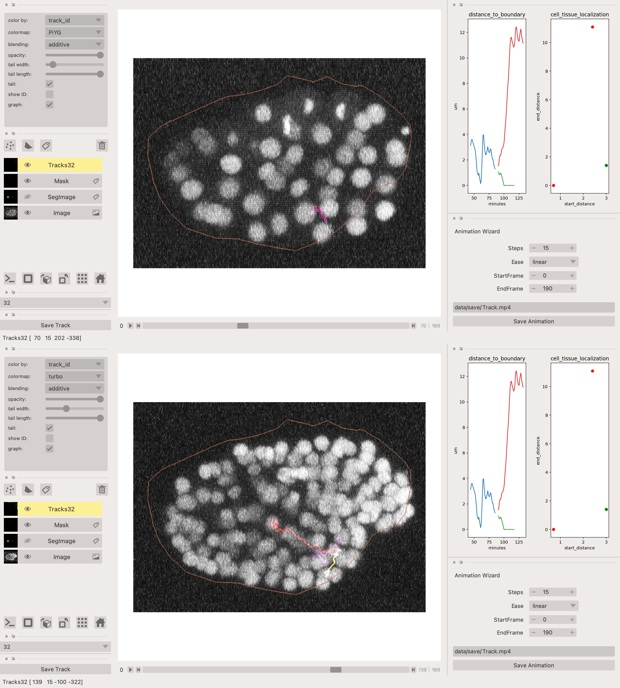

:author: Varun Kapoor
:email: varun.kapoor@curie.fr
:institution: Institut Curie
:institution: Paris, France

:author: Claudia Carabaña
:email: claudia.carabana-garcia@curie.fr
:institution: Institut Curie
:institution: Paris, France

:bibliography: vkc

------------------------------------------------------------------------------------------------
Cell Tracking in 3D using deep learning segmentations
------------------------------------------------------------------------------------------------

.. class:: abstract

Live-cell imaging is a highly used technique to study cell migration and dynamics over time. Although many computational tools have been developed during the past years to automatically detect and track cells, they are optimized to detect cell nuclei with similar shapes and/or cells not clustering together. However, automated analysis of fluorescently membrane-labelled cells can be highly challenging due to their irregular shape, variability in size and dynamic movement across Z planes making it difficult to detect and track them.
Here we provide a detailed analysis pipeline to perform segmentation with accurate shape information, combined with a customized codebase of popular Fiji software Trackmate, BTrackmate, to perform cell tracking inside the tissue of interest. We developed VollSeg, a new segmentation method able to detect membrane-labelled cells with low signal-to-noise ratio and dense packing. Finally, we also created an interface in Napari, an Euler angle based viewer, to visualize the tracks along a chosen view making it possible to follow a cell along the plane of motion. Importantly, we provide a detailed protocol to implement this pipeline in a new dataset, together with the required Jupyter notebooks. Our codes are open source available at :cite:`Github2021`.

.. class:: keywords

   3D segmentation, cell tracking, deep learning, irregular shaped cells.

Introduction
------------

Quantitative analysis to study morphogenesis requires an accurate image analysis workflow. Such a workflow entails volumetric (3D) imaging of cells via fluorescence microscopy, accurate detection and segmentation of cells followed by tracking and track analysis. Broadly speaking the task of segmentation can be separated into semantic segmentation (classifying pixels as background or pixels belonging to the cell) or instance segmentation (classifying pixels belonging to individual cells by assigning a unique label to each cell). Segmentation is complicated due to presence of multiple objects in the image, overlapping object pixels and non-homogeneous intensity distribution. Several methods have been proposed for such automated detection and segmentation tasks such as the traditional intensity based thresholding, watershed transform :cite:`Beucher2018` and of recent machine learning methods based on random-forest classifiers and support vector machines :cite:`berg2019`. Methods based on deep learning have improved the accuracy of segmentation for natural and biomedical images alike :cite:`Rasse2020`. For the purpose of semantic segmentation U-Net has emerged as the most widely used network for biological applications. This network also forms the backbone of another successful network to do cell nuclei segmentation in 3D, Stardist :cite:`schmidt2018` :cite:`weigert2020`. Stardist directly predicts a shape representation as star-convex polygons for cell nuclei in 2D and 3D. The task of segmenting cell membrane requires segmenting the boundaries of the cells as opposed to nuclei segmentation where interior pixels are segmented. Membrane segmentation task is hence more challenging as boundary pixels are fewer than the interior pixels hence segmentation mistakes for membrane would lead to merging of cells or open cell contour. To predict cell contours together with cell centroids, Eschweiler et al. :cite:`eschweiler2018` proposed a 3D U-Net network using centroids as seeds for watershed in 3D confocal microscopy images. The drawback of this approach is misclassification due to sub-optimal seeding. Another approach proposed by Wolny, is to directly predict the cell boundaries using a 3D U-Net followed by a volume partitioning algorithm to segment each cell based on the boundary prediction :cite:`Wolny2020`. This approach requires well defined defined cell boundaries which may create segmentation errors in low singla to noise imaging conditions.
   
Our data set is comprised of epithelial cells of mouse embryonic mammary glands with membrane labelling. These cells are highly irregular in shape and have a low signal-to-noise ratio to obtain an accurate segmentation only based on the boundary information. Therefore, here we developed a segmentation package in python called VollSeg, as a method to perform automated segmentation of such cells. In brief we use Stardist in 3D to obtain a star convex shape approximation for the cells and extract the cell centroids from these polygons. We also train a 3D U-Net model to obtain a semantic segmentation map of the cells. We then perform a marker controlled watershed on the probability map of Stardist using the U-Net segmentation as a mask image to prevent the overflow of segmentation regions. To avoid the error of sub-optimal seeding we developed a seed pooling approach to take advantage of strength of both the Stardist and U-Net networks to create an optimal seed pool to start the watershed. We benchmarked our segmentation result and obtain different metrics showing that our approach is able to obtain shape approximation for the overlapping cells that go beyond the star convex shape.    
   
For analysis of the cell migration behavior we need to reliably track the cells and obtain certain attributes such as signal intensity or changes over time of the distance between the cells and tissue boundary. Cell tracking is challenging due to erratic volumetric motion, occlusion and cell divisions. Tracking using only the centroid information may lead to wrong cell assigmements hence we need to include other cell attributes such as the shape and intensity information while making the links between the cells in successive time frames. Trackmate :cite:`Tinevez2017` is a popular tracking software that uses customizable cost matrix for solving the linear assignment problem and uses Jaqman linker as a second step to link segments of dividing and merging cells. The software also comes with an interactive track editing interface. Our tracking solution, called BTrackmate, we only track the cells that are inside a tissue and allow the input to the tracking program as a csv file of cell attributes or image files of cell and tissue segmentation. Furthermore, we also add some biological context in the tracking process where after segment linking is done a track inspector removes segments that are shorter than a user defined time length. This avoids the tedious manual correction of removing such short segments. 

Finally, the tracking results obtained with BTrackmate are saved as an xml file that can be re-opened in an Euler angle based viewer in python called Napari, allowing volumetric viewing of the tracked cells using the track layer of Napari :cite:`Ulicna2020`. We made a python package called napatrackmater to export the track xml file as tracks layer in Napari for dividing and non dividing tracks. We provide a customized Napari widget to view selected tracks and obtain cell migration attributes from the selected tracks. 

Material and Methods
---------------------

Preparation of the dataset
***************************

We used fluorescent microscopy images of mouse embryonic mammary glands stabilized in an ex vivo culture previously collected in the laboratory of Dr. S. Fre at Institut Curie. All images were acquired with an inverted CLSM equipped with long-working distance objectives to acquire high-resolution 3D image stacks. The quality at which these images are acquired is determined by the spatial resolution of the used optical device, desired temporal resolution, duration of the experiment and depth of the acquired Z stacks. Microscopy always has trade offs between these aspects such as reduction of exposure time to gain imaging speed leads to a lower signal to noise ratio. Some of these trade offs can be overcome by computational procedures that can be used to improve the quality of images which makes the down-stream analysis easier. One such procedure is image restoration where a network can be trained to map the images acquired at low signal to noise ratio to as if they were acquired at high signal to noise ratio. The network is trained to learn this mapping function. Training of restoration networks can be done in supervised way by acquiring low and high signal to noise ratio image pairs to train the network :cite:`Weigert2017` or in an unsupervised way where training image pairs are not required :cite:`krull2019`. It was shown that using unsupervised denoising produces better results than using classical deconvolutional algorithms such as Lucy-Richardson denoising :cite:`Richardson72`, :cite:`Lucy74`. Given our microscope settings, we used the unsupervised learning to restore the volumetric images. 

Segmentation
**************

Post restoration we developed a method to perform the segmentation of the cells using deep learning techniques as it was shown by Rasse et.al.2020 that conventional computer vision and machine learning based techniques alone will almost always will lead to sub par segmentation :cite:`Rasse2020`.We created a training dataset with hand drawn segmentation of 14 Z stacks. We performed data augmentation on the microscopy images by denoising, adding Poisson and Gaussian noise, random rotations and flips to create 700 Z stacks. We choose a patch size of (16,128,128) and create 11264 patches for training Stardist and U-Net network. For the Stardist network we choose 192 rays to have a better shape resolution for the irregular shaped cells. Stardist predicts object instances based on probability threshold and non maximal suppression threshold to merge overlapping predictions. These parameters can be automatically determined using the optimize threshold program that we provide with the segmentation package. Higher values of the probability threshold yield fewer object instances, but avoids false positives. Higher values of the overlap threshold will allow segmented objects to overlap more. We used 32 Z stacks to determine the optimal parameters of probability threshold of 0.76 and non maximal suppression threshold of 0.3. The complete segmentation pipeline is illustrated in Figure :ref:`algorithm`. First, we obtained the centroids of the star convex approximated cell shapes and create a seed pool with these centroid locations. Even with the optimized threshold values we find that the seeds found can be sub-optimal as many cells instances with low signal are missed. In order to make the seed pool optimal we use the U-Net prediction to obtain a binary image of semantic segmentation, perform connected component analysis to label the image and obtain bounding boxes for each label in 3D. For each bounding box we search for a seed from the Stardist predicted seed pool. If a Stardist seed is found inside the bounding box the centroid of the U-Net predicted bounding box is rejected else the centroid is added to the seed pool to make a complete set of seeds that we use to start a watershed process in 3D. We use the probability map of Stardist to start the watershed process to obtain a better shape approximation for the irregular shaped cells that goes beyond the star convex shape.  

 
 
The code for the merging U-Net and Stardist seeds is the following:

.. code-block:: python

  def iou3D(boxA, centroid):
    
    ndim = len(centroid)
    inside = False
    
    Condition = [Conditioncheck(centroid, boxA, p, ndim)
     for p in range(0,ndim)]
        
    inside = all(Condition)
    
    return inside

  def Conditioncheck(centroid, boxA, p, ndim):
    
      condition = False
    
      if centroid[p] >= boxA[p] 
      and centroid[p] <= boxA[p + ndim]:
          
           condition = True
           
      return condition 
      
      
The code for doing watershed in 3D using the complete set of seeds on the probability map of Stardist is the following.    

.. code-block:: python     

  def WatershedwithMask3D(Image, Label,mask, grid): 
  
    properties = measure.regionprops(Label, Image) 
    binaryproperties = 
    measure.regionprops(label(mask), Image) 
    cord = 
    [prop.centroid for prop in properties] 
    bin_cord =
    [prop.centroid for prop in binaryproperties]
    Binarybbox = 
    [prop.bbox for prop in binaryproperties]
    cord = sorted(cord , 
    key=lambda k: [k[0], k[1], k[2]]) 
    if len(Binarybbox) > 0:    
            for i in range(0, len(Binarybbox)):
                
                box = Binarybbox[i]
                inside = 
                [iou3D(box, star) for star in cord]
                
                if not any(inside) :
                         cord.append(bin_cord[i])    
                         
    
    cord.append((0,0,0))
    cord = np.asarray(cord)
    cord_int = np.round(cord).astype(int) 
    
    markers_raw = np.zeros_like(Image) 
    markers_raw[tuple(cord_int.T)] =
    1 + np.arange(len(cord)) 
    markers = 
    morphology.dilation(markers_raw,
    morphology.ball(2))

    watershedImage = 
    watershed(-Image, markers, mask) 
    
    return watershedImage, markers 
    
    
Accuracy of segmentation results is assesed by comparing the obtained labels to the gold standard ground truth (GT) labels. Most commonly used metric is to compute intersection over union (IOU) score between the predicted and the GT label image. A threshold score value :math:`\tau \in [0,1]` is used to determine the true positive (TP), false positives (FP) and false negatives (FN). 
TP are the true positives that are the pairs of predicted and ground truth labels having intersection over union (IOU) score value :math:`> \tau`. FP are the predicted instances not present in the ground truth image and FN are the unmateched ground truth instances that are not present in the predicted label image. Matched score is the number of matching pixels between the predictions and the ground truth at a certain :math:`\tau` We use the Stardist implementation to compute accuracy scores which uses the hungarian method (scipy implementation) :cite:`Kuhn1955` to compute an optimal matching to do a one to one assingement of predicted label to ground truth labels. We also compute precision (TP/(TP + FP)), recall (TP / (TP + FN)), F1 score (geometric mean of precision and recall), mean true score (matched score/ TP), panoptic quality (matchedscore / (TP + FP/2 +FN/2)) and accuracy score 
:math:`AP_\tau= \frac{TP_\tau}{TP_\tau+ FP_\tau + FN_\tau}`.  
To evaluate the accuracy of our method in resolving the shape of the cells we compute the mean squared error and structural similarity index measurment between the GT and obtained segmentation images post binarization operation on the obtained instance segmentation maps. 
    
    
.. figure:: Figures/Seg_pipe.png
  
     Schematic representation showing the segmentation approach used in VollSeg.  A) The input is the Raw image of cells in 3D , the image is passed through trained denoising, B) Stardist and C) U-Net networks. In B) we can see the star convex approximation to the cells and in C) is the U-Net prediction labelled via connected components. Having these results we obtain seeds from the centroids of labelled image in B, for each labelled region of C we create bounding boxes and centroids. If there is no seed coming from B in the bounding box region we add the new centroid to the seed pool. In D we have an extra seed (in yellow) coming from U-Net. Using these seeds we do a marker controlled watershed in 3D using skimage implementation on the probability map shown in E) to obtain final cell segmentation result shown in F). All except the image in E) are displayed in Napari viewer with 3D display view. 
   
     :label:`algorithm`    
    
The software package we provide comes with training and prediction notebooks for training the base U-net and Stardist networks on your own dataset. We provide jupyter notebooks to do so on local GPU servers and also on Google Colab.
   
Network Training, Parameter Setting and Prediction
****************************************************

In the first Jupyter notebook we create the dataset for U-Net and Stardist training. In the first cell of the notebook the required parameters are the path to your data that contains the folder of Raw and Segmentation images to create training pairs. Also to be specified is the name of the generated npz file along with the model directory to store the h5 files of the trained model and the model name.

.. code-block:: python

  Data_dir = '/data/'
  NPZ_filename = 'VollSeg'
  Model_dir = '/data/'
  Model_Name = 'VollSeg'
  
  
The model parameters are specified in the next notebook cell. These parameters are described as follows:

1) NetworkDepth = Depth of the network, with each increasing depth the image is downsampled by 2 hence the XYZ dimension of the data / 2^depth has to be greater than 1.

2) Epochs, training for longer epochs ensures a well converged network and requires longer GPU runtimes.

3) Learning rate is the parameter which controls the step size used in the optimization process and it should not be greater than 0.001 at the start of the training.

4) Batch size controls the number of images used for doing stochastic gradient descent and is a parameter that is limited by the GPU RAM available, batch size < 10 should be optimal.

5) Patch X,Y,Z is the patch size used for making patches out of the image data. The original image is broken down into patches for training. Patch size is chosen based on having enough context for the network to learn the details at different scales.

6) Kernel is the receptive field of the neural network, usual choices are 3,5 or 7. This is the size of the convolutional kernel used in the network.

7) n_patches_per_image is the number of patches sampled for each image to create the npz file, choose an optimal value so that the file is not too big for the computer memory.

8) Rays is the number of rays used the learn the distance map, low rays decreases the spatial resoultion and high rays are able to resolve the shape better.

9) use_gpu_opencl is a boolean parameter that is set true if you want to do some opencl computations on the GPU, this requires GPU tools python package.

10) Before starting the U-Net training an npz file containing the paried Raw and Binary segmentation images needs to be created, by setting GenerateNPZ = True such a file is created. 

11) If there are multiple GPU's available the training of U-Net and stardist can be split between the GPU's set TrainUNET = True  for training a U-Net network, create a copy of the notebook and only set TrainSTAR = True for training a stardist network. If there are no multiple GPU's available the task set all of these parameters in 10) and 11) to be True to create and train both the networks in a single notebook run.
 

  
.. code-block:: python

  #Network training parameters
  NetworkDepth = 5
  Epochs = 100
  LearningRate = 1.0E-4 
  batch_size = 1
  PatchX = 128
  PatchY = 128
  PatchZ = 16
  Kernel = 3
  n_patches_per_image = 16
  Rays = 192 
  startfilter = 48
  use_gpu_opencl = True
  GenerateNPZ = True
  TrainUNET = False
  TrainSTAR = False  
  
After the network has been trained it will save the configuration files of the training for both the networks along with the weight vector file as h5 files that will be used by the prediction notebook. For running the network prediction on XYZ shape images use the prediction notebook either locally or on Colab. In this notebook you only have to specify the path to the image and the model directory. The only two parameters to be set here are the number of tiles (for creating image patches to fit in the GPU memory) and min_size in pixel units to discard segmented objects below that size. We perform the watershed operation on the probability map as a default this however can also be changed to use the distance map coming out of Stardist prediction instead by setting UseProbability variable to false.
The code below operates on a directory of XYZ shape images:

.. code-block:: python
 
     ImageDir = 'data/tiffiles/'
     Model_Dir = 'data/' 
     SaveDir = ImageDir + 'Results/'
     UNETModelName = 'UNETVollSeg'
     StarModelName = 'VollSeg'
     NoiseModelName = 'NoiseVoid'
      
     UnetModel = CARE(config = None, 
     name = UNETModelName, 
     basedir = Model_Dir)
     StarModel = StarDist3D(config = None, 
     name = StarModelName, 
     basedir = Model_Dir)
     NoiseModel = N2V(config=None,
     name=NoiseModelName,
     basedir=Model_Dir)
  
     Raw_path = 
     os.path.join(ImageDir, '*.tif')
     filesRaw =
     glob.glob(Raw_path)
     filesRaw.sort
     min_size = 5 
     n_tiles = (1,1,1)
     for fname in filesRaw:
     
          SmartSeedPrediction3D(ImageDir,
          SaveDir, fname, 
          UnetModel, StarModel, NoiseModel, 
          min_size = min_size, 
          n_tiles = n_tiles, 
          UseProbability = False)

Tracking
********* 

After we obtain the segmentation using VollSeg we create a csv file of the cell attributes that include their location, size and volume inside a region of interest. For large datasets memory usage could be of concern while loading the images into memory hence inputs via csv could prove helpful in such cases. Tracking is performed in ImageJ/Fiji, an image processing package.  We developed our code over the existing tracking solution called Trackmate :cite:`Tinevez2017`. Trackmate uses linear assignment  problem (LAP) algorithm to do linking of the cells and uses Jaqman linker for linking the segments for dividing and merging trajectories. It also provides other trackers such as the Kalaman filter to do tracking of non-dividing cells. Trackmate comes with a fully interactive track editing interface with graph listener to show the selected cell in the trackscheme and vice versa to click on the graph and have the selected cell being highlighted in the image, making the process of track editing interactive. Post editing the tracks are saved as an xml file which can then be loaded back into the program to do more track editing if needed, the program reads the saved settings from the xml to restore the state of track editing as it was when the xml file was last saved. When a cell divides, the track is splitted up in two tracklets.  In order to aid in track editing we introduced a new parameter of minimum tracklet length to remove tracklets in a track that are short in the time dimension. This introduces a biological context of not having very short trajectories and hence reduces the track editing effort to correct for the linking mistakes made by the program. For testing our tracking program we used a freely available dataset from the cell tracking challenge of a developing C.elegans embryo :cite:`Celegans` :cite:`Murray2008`. Using our software we can remove cells from tracking which do not fit certain criteria such as being too small (hence most likely a segmentation mistake) or being low in intensity or outside the region of interest such as when we want to track cells only inside a tissue. For this dataset we kept 12,000 cells and after filtering short tracks kept about 50 tracks with and without division events.

For this dataset the track scheme along with overlayed tracks is shown in Figure :ref:`trackscheme`. Selected node in the trackscheme is highlighted in Green and vice versa. Extensive manual for using the track editing is available on Fiji wiki :cite:`Fijiwiki`.

.. figure:: Figures/trackscheme.png
  
     Trackscheme display for the C-elegans dataset. 
   
     :label:`trackscheme`
  
Results
--------

We compare our proposed VollSeg segmentation approach to two commonly used methods for cell segmentation of fluorescent microscopy images, 3D Stardist :cite:`schmidt2018` :cite:`weigert2020` and 3D U-Net. StarDist in 3D was compared to other classicial method the IFT Watershed and was shown to perform better than the classical method which is why we use it as a baseline for comparision. We compute various metrics described in :ref:`segmentation` to asses the performance of our segmentations. We show the metrics of comparision in Figure :ref:`metrics` and in Figure :ref:`ssimmse` we show mse and ssim computations. we see that our method has the lowest mse and highest ssim compared to the other methods. Our method has highest accuracy, true positive rate and lowest false positive and false negative rates. This is because we are able to obtain a more accurate shape representation of the epithelial cells which is a derived accuracy coming from U-Net prediction and are also able to seperate the overlapping instances which is a derived accuracy coming from Stardist prediction.  Visual segmentation comparision of network results along with the GT is shown in Figure :ref:`visseg`.

.. figure:: Figures/Metrics.png
     :scale: 6%
      
     Segmentation comparision metrics between (top to bottom) 1) VollSeg, 2) Unet, 3) Stardist. VollSeg has highest TP and accuracy scores compared to the other methods. 
     
     :label:`metrics`

   
.. figure:: Figures/Ssimmse.png
     
     
     Mean Squared error (MSE) and Structural similarity index measurement (SSIM) (top to bottom)  comparison between VollSeg, Stardist and U-Net. MSE shows a low score if the image is structurally closer to GT. VollSeg has lowest error compared to other methods. SSIM score is higher if the two images are strucurally more similar to each other. VollSeg has the highest SSIM score compared to other methods.
     
      
      :label:`ssimmse`

.. figure:: Figures/Seg_compare-big.png
   
     
     Visual 3D segmentation comparison between (left to right) the Raw image, Ground truth segmentation image, Stardist, U-Net and VollSeg results. The images are displayed in Napari viewer with 3D display view. 
   
     :label:`visseg`
     
     
   

Track Analysis
**********************

After obtaining the tracks from BTrackmate we save them as Trackmate XML file, this file contains the information about all the cells in a track. Since the cells can be highly erratic in their volumetric motions, we use Napari, an Euler angle based viewer, to visualize such tracks from different reference positions.  We made a python package to export the XML files previously saved in Fiji and convert them into the tracks layer of Napari. We made a customised widget to view selected tracks, display the track information and save the cell track along user selected view. Such animation recordings can be saved as a mp4 file.

We created a cutomized Napari widget as shown in Figure :ref:`intensity-napari`. On the left panel we have the image and tracks layer whose display properties can be changed from the top left panel. In the bottom left we have the dropdown menu enlisting all the tracks. User can select the track to be displayed in the central window where it is easy to switch between the hyperstack and the 3D view using bottom left buttons. The user can also choose to view all the tracks at once and then toggle the visibilty of the tracks using the eye icon next to the image and tracks layer. On the top right panel we show two plots displaying the track information. The 3D central view can be rotated, translated and the selected view can be saved as an animation using the bottom right animation panel. For the cells that divide we show the intensity variation and associated fast fourier transform for each tracklet.

We provide two example jupyter notebooks with the package. In the first one we compute the cell distance from the tissue boundary change over time for dividing and non-dividing trajectories seperately. The user selects a track of interest and it displays two plots next to the track view that show this distance change over time for the whole track (non-dividing trajectory) and the starting and end location of cell in the track as shown in Figure :ref:`division-napari-start`. For the tracks which had multiple events of cell division we show the distance change over time of each tracklet that comprises the track, in the localization plot the parent tracklet start and end location is shown in green while all the daughter cell start and end locations are shown in red. In the second example notebook we change the plots to show instead intensity change in the track over time along with the associated frequency of intensity oscillation present in each tracklet of the track if any is present. The frequency associated with each tracklet is computed using the scipy implementation of fast fourier transform.    

.. figure:: Figures/IntensityFFT.png
      
      Napari widget to view tracks and plot track information in the top right plots. For the selected track we see the intensity change over time and its associated fast Fourier transform. For non-dividing trajectories the plot appears as in A) while for dividing trajectories we show the intensity variation over time and fourier transform of each tracklet.
      
      :label:`intensity-napari`
   
            
        

      
      For a cell division event we show the track of the parent prior to division A) and we plot the track information in terms of the distance of the cell from the boundary. Post the division event we see the tracks of the daughter cells B). One daughter cells stays close to the cell boundary while the other moves away from it. Such analysis is complimentary to other biological techniques for studying cell fate. The second plot displays the start and end distance localization of the parent (green) and daughter cells (red). 
      
      :label:`division-napari-start`
   
The results of track analysis can be saved as plots, mp4 files of the track animation or csv files.  

  

Conclusions
---------------------    
We have presented a workflow to do segmentation, tracking and track analysis of cells in 3D for cells of irregular shape and intensity distribution. For performing the segmentation we developed a jupyter notebook based python package VollSeg that combines the strengths of semantic and instance segmentation methods based on deep learning to deliver good performance for segmenting membrane marked cells in 3D. The training of the networks and the network prediction can be done on local GPU servers or on Google Colab. Our notebooks also come with a training notebook for doing unsupervised denoising using noise to void package. Post segmentation we create a csv file containing the information about the cells inside a region of interest which serves as an input to the Fiji plugin we created for doing the tracking. The tracking software uses existing track editing interfaceof Trackmate and saves the track information as an xml file. To view and analyze such volumetric tracks we created a python package to export such trajectories as track layer of Napari and we provide jupyter notebook based enviornment for track analysis with two example notebooks.

Acknowledgements
---------------------
We acknowledge the Cell and Tissue Imaging Platform (PICT-IBiSA) of the Genetics and Developmental Biology Department (UMR3215/U934) at Institut Curie, in particular Olivier Renaud for supporting the software development. We are grateful to Dr Silvia Fre for support and constructive discussions. V.K is supported by Labex DEEP at Institut Curie (ANR-11- LBX0044 grant). C.C is supported by funding from the European Unions Horizon 2020 research and innovation programme under the Marie Skłodowska-Curie grant agreement No 666003. 

Author Contributions
---------------------
V.K conceived the project and wrote the code; C.C performed the image acquisition of the used dataset and created labelled training dataset in 3D; V.K and C.C wrote the manuscript. 

        
.. raw:: latex

    \newpage
 
  
References
---------------------

