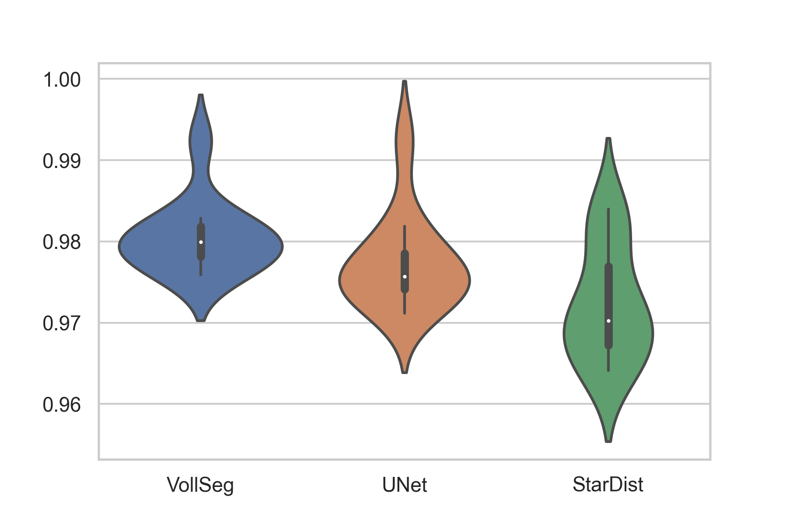
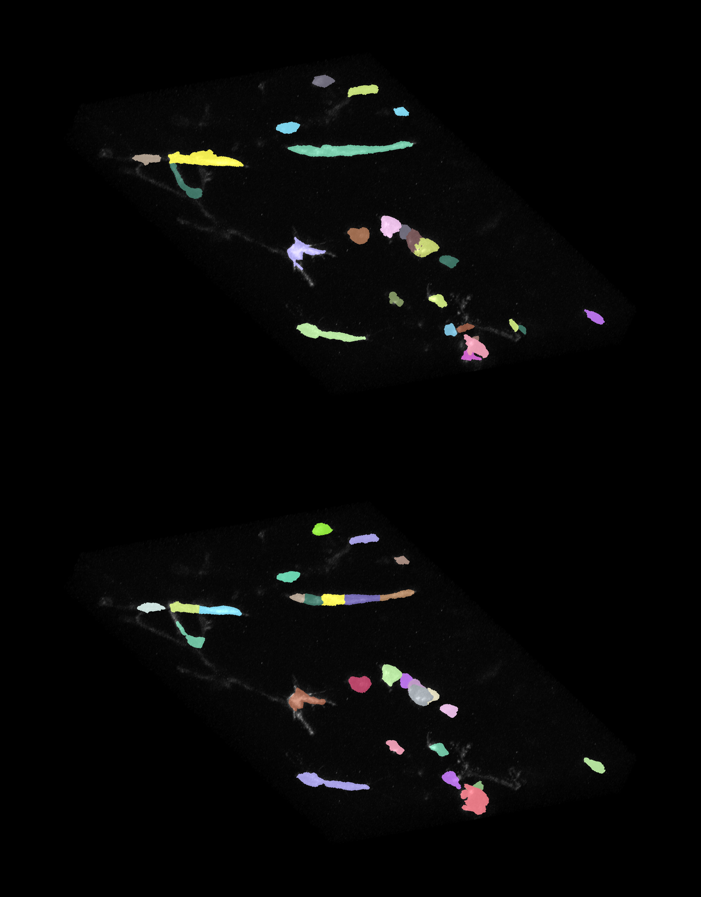
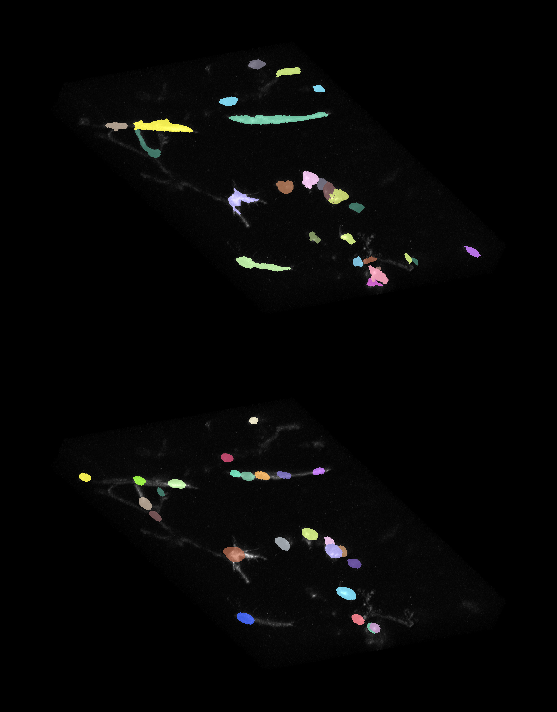

:author: Varun Kapoor
:email: varun.kapoor@curie.fr
:institution: Institut Curie
:institution: Paris, France
:corresponding:

:author: Claudia Carabana Garcia
:email: claudia.carabana-garcia@curie.fr
:institution: Institut Curie
:institution: Paris, France

:bibliography: ``vkc.bib``
------------------------------------------------------------------------------------------------
Cell Tracking in 3D using deep learning segmentations
------------------------------------------------------------------------------------------------

.. class:: abstract

Live-cell imaging is a highly used technique to study cell migration and dynamics over time. Although many computational tools have been developed during the past years to automatically detect and track cells, they are optimized to detect cell nuclei with similar shapes and/or cells not clustering together. However, automated analysis of fluorescently membrane-labeled cells can be highly challenging due to their irregular shape, variability in size and dynamic movement across Z planes making it difficult to detect and track them.
Here we provide a detailed analysis pipeline to perform segmentation with accurate shape information, combined with a customized codebase of popular Fiji software Trackmate, BTrackmate, to perform cell tracking inside the tissue of interest. We developed VollSeg, a new segmentation method able to detect membrane-labeled cells with low signal-to-noise ratio and dense packing. Finally, we also created an interface in Napari, an Euler angle based viewer, to visualize the tracks along a chosen view making is possible to follow a cell along the plane of motion. Importantly, we provide a detailed protocol to implement this pipeline in a new dataset, together with the required Jupyter notebooks. Our code is released open source and BTrackmate is supplied as a plugin in ImageJ/Fiji available at the following link.s 

.. class:: keywords

   3D segmentation, cell tracking, deep learning, irregular shaped cells

Introduction
------------

Quantitative analysis to study morphogenesis requires an accurate image analysis workflow. Such a workflow entails volumetric (3D) imaging of cells via fluorescence microscopy, accurate detection and segmentation of cells followed by tracking and track analysis. Depending on the biological question of interest the cells can be stained either with nuclei, cytoplasm or membrane fluorescent marker. The segmentation pipeline is tailored based on the staining,if the experiment is done with nuclei staining segmenting the nuclei pixels are of interest in contrast to when it is membrane staining obtaining the boundary pixels are of interest. Broadly speaking the task of segmentation can be separated into semantic (classifying pixels as background or pixels belonging to the cell) segmentation or instance (classifying pixels belonging to individual cells by assigning a unique label to each cell) segmentation. Segmentation is complicated due to presence of multiple objects in the image, overlapping object pixels and non-homogeneous intensity distribution. Several methods have been proposed for such automated detection and segmentation tasks such as the traditional intensity based thresholding, watershed transform :cite:`Beucher2018` and of recent machine learning methods based on random-forest classifiers and support vector machines :cite:`berg2019`. Methods based on deep learning have improved the accuracy of segmentation for natural and biomedical images alike :cite:`Rasse2020`. For the purpose of semantic segmentation U-Net has emerged as the most widely used network. This network also forms the backbone of another successful network to do cell nuclei segmentation in 3D, stardist :cite:`schmidt2018` :cite:`weigert2020`. Stardist directly predicts a shape representation as star-convex polygons for cell nuclei. Cell membrane segmentation is more challenging because segmentation mistakes would lead to missing links whereas for cell nuclei segmentation this only would lead to few missing pixels. To predict cell contours together with cell centroids :cite:`eschweiler2018` proposed a 3D U-Net network using centroids as seeds for watershed in 3D confocal microscopy images. The drawback of this approach is misclassification due to sub-optimal seeding. Another approach is to directly predict the cell boundaries using a 3D U-Net and then using a volume partitioning algorithm to segment each cell based on the boundary prediction :cite:`Wolny2020`.
   
Our data set comprised of epithelial cells of mouse mammary glands using membrane marker. The cells are highly irregular in shape and do not posses clear boundaries to have a segmentation based on the boundary information alone, hence we developed a segmentation package in python called VollSeg, as a method to perform segmentation of such cells. Instead of segmenting the membrane we try to segment the region inside the membrane. We use stardist in 3D to obtain a star convex shape approximation for the cells and extract the cell centroids from these polygons. We also train a 3D U-Net to obtain a semantic segmentation map of the cells. We then perform a marker controlled watershed on the probability map of stardist using the U-Net segmentation as a mask image to prevent the overflow of segmentation regions. To avoid the error of sub-optimal seeding we developed a seed pooling approach to take advantage of strength of both the stardist and U-Net network to create an optimal seed pool to start the watershed process. We benchmarked our segmentation result and obtain different metrics showing how our approach is able to obtain shape approximation for the overlapping cells that go beyond the star convex shape.    
   
For analysis of the cell migration behavior we need to reliably track the cells and obtain certain attributes such as intensity, cell to tissue distance change over time. Cell tracking is challenging due to erratic volumetric motion, occlusion and cell divisions. Tracking using only the centroid information may lead to wrong cell assigmements hence we need to include other cell attributes such as the shape and intensity information while making the links between the cells in successive time frames. Trackmate :cite:`Tinevez2017` is a popular tracking software that uses customizable cost matrix for solving the linear assingement problem and uses Jaqman linker as a second step to link segments of dividing and merging cells. The software also comes with an interactive track editing interface. In our tracking solution called BTrackmate we only track the cells that are inside a tissue and allow the input to the tracking program as a csv file of cell attributes or image files of cell and tissue segmentation. We provide Jupyter notebooks to create such csv files that serve as an input to the tracker. Furthermore we also add some biological context in the tracking process of segment linking where after segment linking is done a track inspector removes tracklets that are shorter than a user defined time length. This avoids the tedious manual correction of removing such unphysical tracklets. 

The tracking results are saved as an xml file, the xml file can be re-opened in the software again to do more track editing. Of recent there is an Euler angle based viewer in python called Napari that allows for volumetric viewing along any chosen view. Using the track layer of napari :cite:`Ulicna2020` the cell tracks can be viewed in the plane of cell motion. We made a python package napatrackmater to export the track xml file as tracks layer in Napari for dividing and non dividing tracks. We provide a customized Napari widget to view selected tracks and obtain cell migration attributes from the selected tracks. Our pipeline allows precise segmentation of epithelial cells with irregular shape and posterior analysis of cell migration behavior.

Material and Methods
----------------------- 

Preparation of the dataset
---------------------------

We used fluorescent microscopy images of mouse embryonic mammary glands stabilized in ex vivo culture previously collected in the laboratory of Dr. S. Fre at Institut Curie. All images were acquired with an inverted CLSM or multiphoton microscope (e.g. Zeiss LSM780/880 or Leica SP8) equipped with long-working distance objectives to acquire high-resolution 3D image stacks. The quality at which these images are acquired is determined by the spatial resolution of the used optical device, desired temporal resolution, duration of the experiment, depth of the acquired Z stacks and phototoxicity. Microscopy always has trade offs between these aspects such as reduction of exposure time to gain imaging speed leads to sacrificing the signal to noise ratio. Some of these trade offs can be overcome by optimizing the microscope hardware while for other aspects computational procedures can be used to improve the quality of images which makes the downstream analysis easier. One such procedure is image restoration where a network can be trained to map the images acquired at low signal to noise ratio to as if they were acquired at high signal to noise ratio. The network is trained to learn this mapping function. Training of restoration networks can be done in supervised way by acquiring low and high signal to noise ratio image pairs to train the network :cite:`Weigert2017` or in an unsupervised way where training image pairs are not required :cite:`krull2019`. It was shown that using unsupervised denoising produces better results than using classical deconvolutional algorithms such as Lucy-Richardson denoising. Given our microscope settings the image acquisition of registered low and high signal to noise ratio images was not possible hence we used the unsupervised learning to restore the volumetric images. 

Segmentation
-------------

Post restoration we developed a method to perform the segmentation of the cells using deep learning techniques as it was shown in :cite:`Rasse2020` that conventional computer vision and machine learning based techniques alone will almost always will lead to sub par segmentation :cite:`Rasse2020`.We create a training dataset with hand drawn segmentation of 14 Z stacks. We perform data augmentation on the microscopy images by denoising, adding Poisson and Gaussian noise, random rotations and flips to create 700 Z stacks. We choose a patch size of (16,128,128) and create 11264 patches for training stardist and U-Net network. For the stardist network we choose 256 rays to have a better shape resolution for the irregular shaped cells. Stardist predicts object instances based on probability threshold and non maximal suppression threshold to merge overlapping predictions. These parameters can be automatically determined using optimize threshold program we provide with the segmentation package. Higher values of the probability threshold yield fewer object instances, but avoids false positives. Higher values of the overlap threshold will allow segmented objects to overlap more. We used 32 Z stacks to determine the optimal parameters of probability threshold of 0.76 and non maximal suppression threshold of 0.3. We obtain the centroids of the star convex approximated cell shapes and create a seed pool with these centroid locations. Even with the optimized threshold values we find that the seeds found can be sub-optimal as many faint cells instances are missed. In order to make the seed pool optimal we use the U-Net prediction to obtain a binary image of semantic segmentation, perform connected component analysis to label the image and obtain bounding boxes for each label in 3D. For each bounding box we search for a seed from the stardist predicted seed pool. If a stardist seed is found in side the bounding box the centroid of the U-Net predicted bounding box is rejected else we add that centroid to the seed pool to make a complete set of seeds that we use to start a watershed process in 3D. The code for making this complete set of seeds is shown below. We use the probability map of stardist to start the watershed process to obtain a better shape approximation for the irregular shaped cells that goes beyond the star convex shape.  

   
 
The code for the merging U-Net and stardist seeds

.. code-block:: python

  def iou3D(boxA, centroid):
    
    ndim = len(centroid)
    inside = False
    
    Condition = [Conditioncheck(centroid, boxA, p, ndim)
     for p in range(0,ndim)]
        
    inside = all(Condition)
    
    return inside

  def Conditioncheck(centroid, boxA, p, ndim):
    
      condition = False
    
      if centroid[p] >= boxA[p] 
      and centroid[p] <= boxA[p + ndim]:
          
           condition = True
           
      return condition 
      
      
The code for doing watershed in 3D using the complete set of seeds on the probability map of stardist.    

.. code-block:: python     

  def WatershedwithMask3D(Image, Label,mask, grid): 
  
    properties = measure.regionprops(Label, Image) 
    binaryproperties = 
    measure.regionprops(label(mask), Image) 
    cord = 
    [prop.centroid for prop in properties] 
    bin_cord =
    [prop.centroid for prop in binaryproperties]
    Binarybbox = 
    [prop.bbox for prop in binaryproperties]
    cord = sorted(cord , 
    key=lambda k: [k[0], k[1], k[2]]) 
    if len(Binarybbox) > 0:    
            for i in range(0, len(Binarybbox)):
                
                box = Binarybbox[i]
                inside = 
                [iou3D(box, star) for star in cord]
                
                if not any(inside) :
                         cord.append(bin_cord[i])    
                         
    
    cord.append((0,0,0))
    cord = np.asarray(cord)
    cord_int = np.round(cord).astype(int) 
    
    markers_raw = np.zeros_like(Image) 
    markers_raw[tuple(cord_int.T)] =
    1 + np.arange(len(cord)) 
    markers = 
    morphology.dilation(markers_raw,
    morphology.ball(2))

    watershedImage = 
    watershed(-Image, markers, mask) 
    
    return watershedImage, markers 
    
The software package we provide comes with training and prediction notebooks for training the base U-net and stardist networks on your own dataset. We provide jupyter notebooks to do so on local GPU servers and also on Google Colab.
   
Network Training and Prediction
---------------------------------

In the first notebook we create the dataset for U-net and Stardist training. In the first cell the required parameters are the path to your data that contains the folder of Raw and Segmentation images with the same name of images to create training pairs. Also to be specified is the name of the generated npz file along with the model directory to store the h5 files of the trained model and the model name.

.. code-block:: python

  Data_dir = '/data/'
  NPZ_filename = 'VolumeSeg'
  Model_dir = '/data/'
  Model_Name = 'VolumeSeg'
  
  
In the next cell specify the model parameters, these parameters are the patch size chosen for training in XYZ for making overlapping patches for training, the number of patches to make the training data. The network depth is an important hyperparameter, the image patch size has to be big enough so that during downsampling the size of the image in the inner most layer is still greater than 1. Start number of convolutional filters is another crucial hyperparameter controlling the network learning capacity. These double up at each layer of the network and depending on the size of the training dataset and of the GPU memory capacity this parameter can be tuned when doing hyperparameter optimization to obtain the best model parameters for the given dataset. As a first step we generate the npz file for U-net training by setting the boolean GenerateNPZ to be true. Then in the next cell we can either train U-net and stardist network sequentially by setting TrainUNET and TrainSTAR booleans to be true or the users can split the training task between two GPUs by making a copy of the notebook and training one network per notebook. The other parameters to be chosen are the number of epochs for training, kernel size of the convolutional filter, the number of rays for stardist network to create a distance map along these directions. Additionally some of the OpenCL computations can be performed on a GPU using gputools library and if that is installed in the environment you can set use_gpu_opencl to be true. 
  
.. code-block:: python

  #Network training parameters
  NetworkDepth = 5
  Epochs = 100
  LearningRate = 1.0E-4 
  batch_size = 1
  PatchX = 128
  PatchY = 128
  PatchZ = 16
  Kernel = 3
  n_patches_per_image = 16
  Rays = 192 
  startfilter = 48
  use_gpu_opencl = True
  GenerateNPZ = True
  TrainUNET = False
  TrainSTAR = False  
  
After the network has been trained it will save the conFigure files of the training conFigureuration for both the networks along with the weight vector file as h5 files that will be used by the prediction notebook. For running the network prediction on XYZ shape images use the prediction notebook either locally or on Colab. In this notebook you only have to specify the path to the image and the model directory. The only two parameters to be set here are the number of tiles (for creating image patches to fit in the GPU memory) and min_size in pixel units to discard segmented objects below that size. Since we perform watershed on either the probability map or the distance map coming out of stardist the users can choose the former by setting UseProbability variable to true or by default we use the distance map.  The code below operates on a directory of XYZ shape images.

.. code-block:: python
 
     ImageDir = 'data/tiffiles/'
     Model_Dir = 'data/' 
     SaveDir = ImageDir + 'Results/'
     UNETModelName = 'UNETVolumeSeg'
     StarModelName = 'VolumeSeg'
     NoiseModelName = 'NoiseVoid'
      
     UnetModel = CARE(conFigure = None, 
     name = UNETModelName, 
     basedir = Model_Dir)
     StarModel = StarDist3D(conFigure = None, 
     name = StarModelName, 
     basedir = Model_Dir)
     NoiseModel = N2V(conFigure=None,
     name=NoiseModelName,
     basedir=Model_Dir)
  
     Raw_path = 
     os.path.join(ImageDir, '*.tif')
     filesRaw =
     glob.glob(Raw_path)
     filesRaw.sort
     min_size = 5 
     n_tiles = (1,1,1)
     for fname in filesRaw:
     
          SmartSeedPrediction3D(ImageDir,
          SaveDir, fname, 
          UnetModel, StarModel, NoiseModel, 
          min_size = min_size, 
          n_tiles = n_tiles, 
          UseProbability = False)

Tracking
----------  

After we obtain the segmentation using VollSeg we create a csv file of the cell attributes that include their location, size and volume inside a region of interest. As an input to the tracker we can either use an image to display the tracks on, usually the Raw image along with this csv file or we can use the segmentation image of cells and the tissue in place of the csv file. For large datasets memory usage could be of concern while loading the images into memory hence inputs via csv could prove helpful in such cases. We do the tracking in Fiji, which is a popular software among the biologists. We developed our code over the existing tracking solution called Trackmate :cite:`Tinevez2017`. Trackmate uses linear assignment  problem (LAP) algorithm to do linking of the cells and uses Jaqman linker for linking the segments for dividing and merging trajectories. It also provides other trackers such as the Kalaman filter to do tracking of non-dividing cells. While these automated linking algorithms have a good tracking accuracy track editing is still a neccesity to correct for the mistakes the tracker may make while making these assignments. Trackmate comes with a fully interactive track editing interface with graph listener to show the sleected cell in the trackscheme and vice versa to click on the graph and have the selected cell being highlighted in the image, making the process of track editing interactive. Post editing the tracks are saved as an xml file which can then be loaded back into the program to do more track editing if needed, the program reads the saved settings from the xml to restore the state of track editing as it was when the xml file was last saved. A track in which cell divides multiple times can be broken into shorter tracks called the tracklets, a track is a union of all the independent tracklets that comprise a track. In order to aid in track editing we introduced a new parameter of minimum tracklet length to remove tracklets in a track that are short in the time dimension. This introduces a biological context of not having very short trajectories and hence reduces the track editing effort to correct for the linking mistakes made by the program. For testing our tracking program we used a freely available dataset from the cell tracking challenge of a developing C.elegans embryo. Using our software we can remove cells from tracking which do not fit certain criteria such as being too small (hence most likely a segmentation mistake) or being low in intensity or outside the region of interest such as when we want to track cells only inside a tissue. For this dataset we kept 12,000 cells and after filtering short tracks kept about 50 tracks with and without division events.

For this dataset the track scheme along with overlayed tracks in shown in Figure. Selected node in the trackscheme is highlighted in Green and vice versa. Extensive manual for using the track editing is available on Fiji wiki :cite:`wiki`.

.. figure:: Figures/trackscheme.png
  
     Trackscheme display for the C-elegans dataset. 
   
  

Results
--------

We compare our proposed VollSeg segmentation approach to StarDist :cite:`schmidt2018` :cite:`weigert2020` and U-Net in 3D. StarDist in 3D was compared to other classicial method the IFT Watershed and was shown to perform better than the classical method which is why we use it as a baseline for comparision. We use TP,FP, FN, precision (TP/(TP + FP)), recall (TP / (TP + FN)), F1 score (geometric mean of precision and recall), mean true score (matched score/ TP), panoptic quality (matchedscore / (TP + FP/2 +FN/2)) and accuracy score 
:math:`AP_\tau= \frac{TP_\tau}{TP_\tau+ FP_\tau + FN_\tau}` 
     
over a range of overlap threshold, :math:`\tau \in [0,1]`. TP are the true positives that are the pairs of predicted and ground truth labels having intersection over union (IOU) score value :math:`> \tau`. FP are false positives, these predicted instances are not present in the ground truth image and FN are the false negatives, these are the unmateched ground truth instances that are not present in the predicted label image. Matched score is the number of matching pixels between the predictions and the ground truth at a certain :math:`\tau` We use the stardist implementation to compute accuracy scores which uses the hungarian method (scipy implementation) :cite: to compute an optimal matching to do a one to one assingement of predicted label to ground truth labels. The values of :math:`\tau` used is specific to biological application, for our dataset value of 0.3 works well. We also compute mean squared error (mse) and structural similarity index measurement (ssim) between the ground truth and the predicted results. Low value of mse and high value of ssim implies tha tthe prediction match closely to the ground truth results showing a better shape resolution. From the results shown in Figure:ref:mse and Figure.:ref:ssim. we see that our method has the lowest mse and highest ssim compared to the other methods. 

In Figure.:ref:`metrics` we show the stardist, unet and results from our approach (vollseg). Our method has highest accuracy and true positive rate and lowest false positive and false negative rates. This is because we are able to obtain a more accurate shape representation of the epithelial cells which is a derived accuracy coming from U-Net prediction and are also able to seperate the overlapping instances which is a derived accuracy coming from stardist prediction.   

.. figure:: Figures/Metrics.png
   
     Metric of comparison between 1) VollSeg, 2) Stardist, 3) Unet. 
   

   
.. figure:: Figures/MSE.png
   
     Mean Squared error comparison between VollSeg,  Stardist, Unet. 
     

   

   
     Structural similarity index measurement comparison between VollSeg,  Stardist, Unet.  
   

   
     Visual 3D segmentation comparison between 1) GT segmentation (top) and 2) VollSeg segmentation (bottom). 
   

   
.. figure:: Figures/GTUnet
   
     Visual  3D segmentation comparison between 1) GT segmentation (top) and 2) Unet segmentation (bottom). 
   
   

   

   
     Visual 3D segmentation comparison between 1) GT segmentation (top) and 2) Stardist segmentation (bottom).  
   
   

Track Analysis
------------------------

After obtaining the tracks from BTrackmate we save them as Trackmate XML file, this file contains the information about all the cells in a track. Since the cells can be highly erratic in their volumetric motions and for this we needed an Euler angle based viewer to visualize such tracks from different reference positions. Napari is a python based viewer and it has a tracks layer to visualize tracks of cells. We made a python package to export the XML files previously saved in Fiji and convert them into the tracks layer of Napari. We made a customised widget to view slected tracks, display the track information and save the cell track along user selected view. Such animation recordings can be saved as a mp4 file.

We provide two example jupyter notebooks with the package. In the first one we compute the cell distance from the tissue boundary change over time for dividing and non-dividing trajectories seperately. The user selects a track of interest and we display two plots next to the track view that show this distance change over time for the whole track (non-dividing trajectory) and the starting and end location of cell in the track. For the tracks which had multiple events of cell division we show the distance change over time of each tracklet that comprises the track, in the localozation plot the parent tracklet start and end location is shown in green while all the daughter cell start and end locations are shown in red. In the second example notebook we change the plots to show instead intensity change in the track over time along with the associated frequency of intensity oscillation present in each tracklet of the track if any is present. The frequency associated with each tracklet is computed using the scipy implementation of fast fourier transform.    

.. figure:: Figures/DistanceDividing1.png
      
      Parent cell before division. 
   

.. figure:: Figures/DistanceDividing2.png
      
      Parent cell after division, one daughter cells moves inside while other stays close to the boundary.  
   
      
The results of track analysis can be saved as images or csv files.    
     
Conclusions
--------------     
We have presented a workflow to do segmentation, tracking and track analysis of cells in 3D for cells of irregular shape and intensity distribution. For performing the segmentation we developed a jupyter notebook based python package VollSeg that combines the strengths of semantic and instance segmentation methods based on deep learning to deliver good performance for segmenting membrane marked cells in 3D. The training of the networks and the network prediction can be done on local GPU servers or on Google Colab. Our notebooks also come with a training notebook for doing unsupervised denoising using noise to void package. Post segmentation we create a csv file containing the information about the cells inside a region of interest which serves as an input to the Fiji plugin we created for doing the tracking. The tracking software uses existing track editing interfaceof Trackmate and saves the track information as an xml file. To view and analyze such volumetric tracks we created a python package to export such trajectories as track layer of Napari and we provide jupyter notebook based enviornment for track analysis with two example notebooks.

Acknowledgements
-----------------
We acknowledge the Cell and Tissue Imaging Platform (PICT-IBiSA) of the Genetics and Developmental Biology Department (UMR3215/U934) at Institut Curie, in particular Olivier Renaud for supporting the software development. We are grateful to Dr Silvia Fre for support and constructive discussions. V.K is supported by Labex DEEP at Institut Curie (ANR-11- LBX0044 grant). C.C is supported by funding from the European Unions Horizon 2020 research and innovation programme under the Marie Skłodowska-Curie grant agreement No 666003. 

Author Contributions
---------------------
V.K conceived the project and wrote the code; C.C performed the image acquisition of the used dataset and created labeled training dataset in 3D; V.K and C.C wrote the manuscript. 

        

References
--------------------

.. [berg2019]  Berg, Stuart and Kutra, Dominik and Kroeger, Thorben and Straehle, Christoph N. and Kausler, Bernhard X. and Haubold, Carsten and Schiegg, Martin and Ales, Janez and Beier, Thorsten and Rudy, Markus and Eren, Kemal and Cervantes, Jaime I. and Xu, Buote and Beuttenmueller, Fynn and Wolny, Adrian and Zhang, Chong and Koethe, Ullrich and Hamprecht, Fred A. and Kreshuk, Anna *ilastik: interactive machine learning for (bio)image analysis*, Nature Methods 2019.

.. [Beucher2018] S. Beucher and F. Meyer *The Morphological Approach to Segmentation: The Watershed Transformation*, 2018

.. [eschweiler2018] Dennis Eschweiler and Thiago V. Spina and Rohan C. Choudhury and Elliot Meyerowitz and Alexandre Cunha and Johannes Stegmaier *CNN-based Preprocessing to Optimize Watershed-based Cell Segmentation in 3D Confocal Microscopy Images*, 2018
