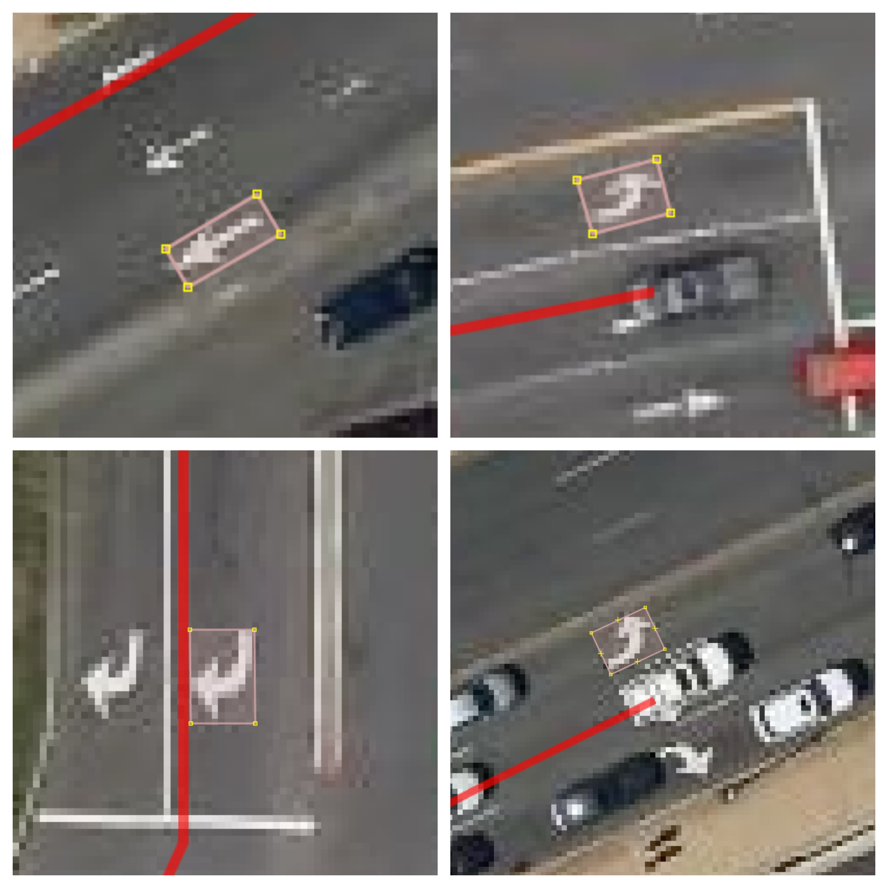

:author: Virginia Ng
:email: virginia@mapbox.com
:institution: Mapbox

:author: Daniel Hofmann
:email: hofmann@mapbox.com
:institution: Mapbox

--------------------------------------------------------------
Scalable Feature Extraction with Aerial and Satellite Imagery
--------------------------------------------------------------

.. class:: abstract

   Deep learning techniques has greatly advanced the performance to the already rapidly developing field of computer vision, powering a variety of emerging technologies—from facial recognition to augmented reality to self-driving cars. The remote sensing and mapping communities are particularly interested in extracting, understanding and mapping real and current physical elements in the landscape. These mappable physical elements are called features and can include both natural and man made objects. For example, a single polygon representing a recreational park is one example of a feature that can belong to an editable collection of GeoJSON features containing city park polygons. In this paper we present the steps to developing deep learning tools and pipelines, which allow us to perform object detection and semantic segmentation on aerial and satellite imagery at large scale. Practical applications of these deep learning based computer vision pipelines include classification, detection, localization and automatic mapping of turn lane markings, parking lots, roads, water, and buildings etc.

   We first discuss the main challenges to sourcing high-resolution satellite and aerial imagery and our efforts to lower the barrier to entry for performing computer vision tasks on such data sources. We give an overview of our data prepation process in which imagery data collected from Mapbox Satellite is annotated with labels created from OpenStreetMap dataa using very little manual effort.

   We then discuss the implementation of various state-of-the-art detection and semantic segmentation systems such as YOLOv2, U-Net, Residual Network, and Pyramid Scene Parsing Network (PSPNet), as well as specific adaptations for the aerial and satellite imagery domain in our pipelines.

   We conclude this paper by discussing our ongoing efforts in improveing our models and expanding our work to other geospatial features like buildings and roads, geographical regions of the world, and data sources such as street-level and drone imagery.

.. class:: keywords

   computer vision, deep learning, neural networks, satellite imagery, aerial imagery

I. Background
-------------

Location data is built into the fabric of our daily experiences and is more important than ever with the introduction of new technologies such as self-driving cars. Mapping communities, open sourced or proprietary, work to extract, understand and map real and current physical elements in the landscape. However, mappable physical elements in the landscape are constantly evolving. Each day new roads, buildings, and parks — everything that matters for cities and towns across the globe - are added. Therefore the two biggest challenges faced by the mapping communities are maintaining recency while expanding worldwide coverage. We propose integrating artificial intellegence (AI) and new mapping techniques, such as deep neural network models, into the mapping workflow in order to keep up with these changes. In particular, we have developed tools and pipelines to detect various geospatial features from satellite and aerial imagery at scale. We collaborate with the OpenStreetMap community to create quality geospatial datasets, validated by trained mappers and local OSM communities. We present two usecases to demonstrates our workflow for extracting valuable navigation assets like turn restrictions signs, turn lane markings, parking lots to improve our routing engines. We designed our processing pipelines and tools with open source libraries like Scipy, Rasterio, Fiona, Osium, JOSM [#]_, Keras, PyTorch, OpenCV etc, while our training data was compiled from OpenStreetMap [osm]_ and Mapbox Maps API [mapbox_api]_. Our pipelines and tools are generalizable to extracting other geospatial features as well as other data sources.

.. [#] JOSM is an extensible editor for OpenStreetMap (OSM) for Java 8+. It supports loading GPX tracks, background imagery and OpenStreetMap data from local sources as well as from online sources and allows to edit the OpenStreetMap data (nodes, ways, and relations) and their metadata tags. It is open source and licensed under GPL. 

II. Scalable Computer Vision Pipelines
-----------------------------------------

The general design for our deep learning based computer vision pipelines can be found in Figure 1 and is applicable to both object detection and semantic segmantation tasks. We design these pipelines with two things in mind. We not only ensured scalability in the amount of data we process, but also how easily it is to expand to perform computer vision tasks on other geospatial features. We present turn lane markings as an example to our object detection pipeline and parking lot segmentation as an example to semantic segmantation pipeline.

.. figure:: fig1.png
   :height: 100 px
   :width:  200 px
   :scale: 39 %

   Computer Vision Pipeline. 

1. Data
--------

**Data Preparation.** The actual data that is needed to create our training sets depends on the computer vision task at hand. Object detection and semantic segmentation are two different tasks in computer vision. Object detection involves locating and classifying a variable number of objects in an image. Figure 2 demonstrates how we use object detection models to classify and locate turn lane markings from satellite imagery. We are not just distinguishing left-turn only lane markings from right-turn only lane markings like we would do in a classification problem, but we also want to know where in the image each of these markings are located. There are many other practical applications of object detection such as face detection, counting, visual search engine. In our case, detected turn lane markings become valuable navigation assets to our routing engines when determining the most optimal routes.

.. figure:: fig2.png
   :height: 75 px
   :width:  150 px
   :scale: 22 %

   Turn lane markings detection.

The training data for turn lane marking detection was created by collecting imagery of various types of turn lane markings and drawing bounding doxes around each marking. OpenStreetMap is a collaborative project to create a free editable map of the world. We used a tool called Overpass Turbo [overpass]_ to query OpenStreetMap streets containing turn lane markings, which were tagged as one of the following attributes - “\turn:lane=*”, “\turn:lane:forward=*”, “\turn:lane:backward=*” in OpenStreetMap. As shown in Figure 3, extracted locations of the roads containing turn lane markings were labeled in red, stored as GeoJSON features and clipped to the Mapbox Satellite basemap [mapbox]_.. Figure 4 shows how skilled mappers used this map layer as a guide to manually draw bounding boxes around each turn lane markings using JOSM [josm]_, a process called annotation. Each of these bounding boxes were stored as GeoJSON polygons on Amazon S3 [s3]_.

.. figure:: fig3a.png
   :height: 75 px
   :width: 150 px
   :scale: 25 %

   Visualize streets containing turn lane markings. Custom layer created by clipping the locations of roads with turn lane markings to Mapbox Satellite.

   
   Annotating turn lane markings - Draw bounding box around the turn lane markings.

To ensure the highest quality for our training set, we had a separate group and mappers verify each of the bounding boxes drawn. Mappers annotated six classes of turn lane markings - “\Left”, “\Right”, “\Through”, “\ThroughLeft”, “\ThroughRight”, “\Other” in five cities, creating a training set consists of over 54,000 turn lane markings. Turn lane markings of all shapes and sizes, as well as ones that are partially covered by cars and/or shadows were included in this training set. We excluded turn lane markings that are erased or fully covered by cars seen in Figure 5.

.. figure:: fig3c.png
   :height: 75 px
   :width: 150 px
   :scale: 22 %

   Data Cleaning - Excluding turn lane arrows that are fully covered by car.

Semantic segmentation on the other hand, is the computer vision task that attempts to partition the image into semantically meaningful parts, and to classify each part into one of the pre-determined classes. One can also achieve the same goal by classifying and labeling each pixel with the class of its enclosing object or region. For example, in addition to recognizing the road from the buildings, we also delineate the boundaries of each object shown in Figure 6.

.. figure:: fig4.png
   :height: 100 px
   :width: 200 px
   :scale: 22 %

   Semantic segmentation on roads, buildings and vegetation

The training data for parking lot segmentation was created by combining imagery collected from Mapbox Satellite with binary masks for parking lots. The binary masks for parking lots were generated from OpenStreetMap polygons with the attributes “\tag:amenity=parking=*” except ones tagged as underground, sheds, carports, garage_boxes using a tool called Osmium [osmium]_. These binary masks were stored as single channel numpy arrays.Each of these single channel numpy arrays are then stacked with its respective aerial image tile, a three channel numpy array - Red, Green, and Blue. We annotated 55,710 masks for parking lot segmentation.

**Data Engineering.** We built a data engineering pipeline within the larger object detection pipeline, so that we can create and process training sets in large quantities. This data engineering pipeline is capable of streaming any set of prefixes off of Amazon S3 into prepared training sets. Several pre-processing steps were taken to convert turn lane marking annotations to the appropriate data storage format before combining them with real imagery. As mentioned earlier, turn lane marking annotations were initially stored as GeoJSON polygons group by class. Each of these polygons had to be streamed out of the GeoJSON files on S3, converted to image pixel coordinates, and stored as JSON image attributes to actract tiles [tile]_. The pre-processed annotations were then randomly assigned to training and testing datasets, following the classic 80/20 split rule. Annotations were written to disk and joined by imagery fetched from the Satellite layer of Mapbox Maps API. During this step the abstract tiles in the pipeline is replaced by real image tiles. Finally, the training and test sets are zipped and uploaded to Amazon S3. 

Before we scale up processing, we first developed Python command line tools and libraries for our data preparation steps. All of command line tools we developed for the segmentation task can be found on our GitHub repository [robosat]_. These scripts were then ran at large scale, multiple cities in parallel on Amazon Elastic Container Service [ecs]_. Amazon Elastic Container Service is a highly scalable, fast, container management service that makes it easy to run, terminate, and manage Docker containers on a cluster - grouping of container instances. This data engineering pipeline is shown in Figure 5.

.. figure:: fig5.png
   :height: 200 px
   :width: 400 px
   :scale: 47 %

   Data engineering pipeline converts OpenStreetMap GeoJSON features to image pixel space and combines each feature with imagery fetched from Mapbox Maps API.

Our data engineering pipelines are generalizable to any OpenStreetMap feature. Buildings is another example of an OpenStreetMap feature that we experimented with .Users can generate training sets with any OpenStreetMap feature simply by writing their own Osmium handler to turn OpenStreetMap geometries into polygons.

2. Model
---------

**Fully Convolutional Neural Networks.** Fully convolutional are neural
networks composed of convolutional layers without any fully-connected
layers or MLP usually found at the end of the network. A convolutional
neural network (CNN, or ConvNet)  with fully connected layers is just
as end-to-end learnable as a fully
convolutional one. The main difference is that the fully convolutional
net is learning filters everywhere. Even the decision-making layers at
the end of the network are filters. Traditional Convolutional neural
networks containing fully connected layers cannot manage different input
sizes , whereas fully convolutional networks can have only convolutional
layers or layers which can manage different input sizes and are faster
at that task.

A fully convolutional net tries to learn representations and make
decisions based on local spatial input. Appending a fully connected
layer enables the network to learn something using global information
where the spatial arrangement of the input falls away and need not
apply.

**Object Detection Models.**\ We implemented YOLOv2 [yolov2]_, a real-time object
detection system and is the improved version of YOLO [yolo]_, which was
introduced in 2015. YOLOv2 outperforms all other state-of-the-art
methods like Faster R-CNN with ResNet [resnet]_ and Single Shot MultiBox Detector (SSD)
in both speed and detection
accuracy [cite1]_. Our YOLOv2 was first pre-trained on
ImageNet 224x224 resolution imagery and then the network was resized and finetuned
for classification on higher resolution 448x448 turn lane marking imagery. A major feature of
the YOLO family is the use of anchor boxes to run prediction. There are
two ways of predicting the bounding boxes- directly predicting the
bounding box of the object or using a set of predefined bounding boxes
(anchor box) to predict the actual bounding box of the object. YOLO
predicts the coordinates of bounding boxes directly using fully
connected layers on top of the convolutional feature extractor. But, it
makes a significant amount of localization error [yolo-drawbacks]_. It is easier to
predict the offset based on anchor boxes than to predict the coordinates
directly. Instead of using pre-defined anchor boxes, we performed K-means clustering
on bounding boxes from the training data set as suggested by the YOLOv2 authors.
In addition to using clustering on bounding boxes, our YOLOv2 was able to
converge and regularize well through the use of batch normalization,

**Segmentation Models.** We implemented U-Net [unet]_ for parking lot
segmentation. The U-Net architecture can be found in Figure 7. It consists
of a contracting path to capture context and a symmetric expanding path that enables precise
localization. This type of network can be trained end-to-end with very
few training images and yields more precise segmentations than prior
best method such as the sliding-window convolutional network. This first part is 
called down or one may think it as the encoder part
where one apples convolution blocks followed by a maxpool downsampling to
encode the input image into feature representations at multiple
different levels. The second part of the network consists of upsample
and concatenation followed by regular convolution operations. Upsampling
in convolutional neural networks may be a new concept to some but the idea is
fairly simple: we are expanding the feature dimensions to meet the same
size with the corresponding concatenation blocks from the left. While
upsampling and going deeper in the network, we are simultaneously concatenating the
higher resolution features from down part with the upsampled features in
order to better localize and learn representations with following
convolutions. For parking lot segmentation, we perform binary
segmentation distinguishing parking lots from the background.

.. figure:: fig6.png
   :height: 150 px
   :width: 300 px
   :scale: 37 %

   U-Net Architecture

We also experimented with Pyramid Scene Parsing Network (PSPNet) [pspnet]_. PSPNet
is effective to produce good quality results on scenes that are complex, contain
multi-class and on dataset with great
diversity. We found that it was redundant with our parking lot segmenation where there are
only two categories - parking lot versus background. PSPNet adds a
multi-scale pooling on top of the backend model to aggregate different
scale of global information. The upsample layer is implemented by
bilinear interpolation. After concatenation, PSP fuses different levels of
feature with a 3x3 convolution.

**Hard Negative Mining.** This is a technique we used to improve model
performance by reducing the negative samples. A hard negative is when we
take that falsely detected patch, and explicitly create a negative
example out of that patch, and add that negative to our training set.
When we retrain our models with this extra
knowledge, they usually perform better and not make as many false positives.

Figure 8 shows probability mask over what our models believe are pixels
belonging to parking lots. The average over multiple IoU (AP)
of our baseline model U-Net is 46.7 for a test set of 900 samples.

.. figure:: fig7.png
   :height: 150 px
   :width: 300 px
   :scale: 37 %

   Probability Mask

3. Post-Processing
------------------

Figure 9 shows an example of the raw segmentation mask derived
from our U-Net model. It cannot be used directly as input into
OpenStreetMap. We performed a series of post-processing to improve the
quality of the segmentation mask and to transform the mask into the
right data format for OpenStreetMap.

.. figure:: fig8.png
   :height: 200 px
   :width: 200 px
   :scale: 38 %

   Raw segmentation mask derived from our U-Net model

.. figure:: fig9.png
   :height: 200 px
   :width: 200 px
   :scale: 39 %

   Clean polygon in the form of GeoJSON

**Noise Removal.** We remove noise in the data by performing two
morphological operations: erosion followed by dilation. Erosion removes
white noises, but it also shrinks our object. So we dilate it.

**Fill in holes.** We fill holes in the mask by performing dilation
followed by erosion. It is especially useful in closing small holes
inside the foreground objects, or small black points on the object. We
use this operator to deal with polygons within polygons.

**Contouring.** Contours are curves joining all the continuous points
that have same color or intensity.

**Simplification.** Douglas-Peucker Simplification takes a curve
composed of line segments and finds a similar curve with fewer points.
We get simple polygons that can be ingested by OpenStreetMap as feature type “nodes” and “ways”

**Transform Data.** Convert detection or segmentation results from pixel
space back into GeoJSONs (world coordinate).

**Removing tile border artifacts.** Query and match neighboring image
tiles. This step reads in the segmentation mask, do cleanup and simplification,
and turn tile images and pixels into a GeoJSON file with extracted parking lot features.

**Merging multiple polygons.** Handles and merges GeoJSON features crossing tile boundaries
into a single feature [visualize]_.

**Deduplication.** Deduplicates by matching GeoJSONs with data that already exist on
OpenStreetMap, so that we only upstream detections that are not already mapped.

After performing all these post-processing steps, we have a clean mask
that is also a polygon in the form of GeoJSON. An example of such a mask can be
found in Figure 10. This can now be added to
OpenStreetMap as a parking lot feature.

4. Output
----------

With this pipeline design, we are able to run batch prediction at large
scale (on the world). The output of these processing pipelines are turn
lane markings and parking lots in the form of GeoJSONs. We can then add
these GeoJSONs back into OpenStreetMap as turn lane and parking lot
features. Our routing engines then take these OpenStreetMap features
into account when calculating routes. We are still in the process of
making various improvements to our baseline model, therefore we include two manual steps
performed by humans as a stopgap. First is verification and inspection of our model results. Second is
to manually map the true positive results in OpenStreetMap. Shown in Figure 11 is a front-end UI that
allows users to pan around for instant turn lane markings detection.

.. figure:: fig10.png
   :height: 200 px
   :width: 400 px
   :scale: 42 %

   Front-end UI for instant turn lane markings detection

IV. Ongoing Work
----------------
We demonstrate the scalability of our computer vision pipelines which enables us to run object detection and segmentation tasks. We built our tools and pipelines so that users can easily expand to other physical elements in the landscape or to other geographical regions of interest. Going forward, we will continue to improve the quality, resolution and coverage of our imagery layer - Mapbox Satellite. We believe this significantly lowers the barrier to entry into deep learning and computer vision.

For turn lane marking detection, we plan on experimenting with the new and improved YOLOv3 [yolov3]_, which was published in April 2018.

We ran the first round of large-scale parking lot segmentation over Atlanta, Baltimore, Sacremanto, and Seattle. The next steps is to run predictions over all of North America where we have high resolution imagery. We open sourced Robosat[*]_, our end-to-end semantic segmantion pipeline, along with all its tools in June 2018. Users have already started experiementing with building detection on drone imagery from the OpenAerialMap project in the area of Tanzania [tanzania]_. We are in the process of making several improvements to our models. We recently performed one round of hard negative mining and added 49,969 negative samples to our training set. We are also currently working on replacing the standard U-Net encoder with pre-trained ResNet50 encoder. In addition, we are replacing learned deconvolutions with nearest neighbor upsampling followed by a convolution for refinement instead. We believe that this approach gives us more accurate results, while speeding up training and prediction, lowering memory usage. The drawback to such an approach is that it only works for three-channel inputs (RGB) and not with arbitrary channels.

The training data for building segmentation, we generated polygons from tags with attributes “\building=*” except ones tagged as construction, houseboat, static_caravan, stadium, conservatory, digester, greenhouse, ruins. 

.. [*] Robosat is an end-to-end pipeline for extracting physical elements in the landscape that can be mapped from aerial and satellite imagery https://github.com/mapbox/robosat

References
----------
.. [osm] OpenStreetMap, https://www.openstreetmap.org
.. [mapbox] Mapbox, https://www.mapbox.com/about/
.. [mapbox_api] Mapbox Maps API, https://www.mapbox.com/api-documentation/#maps, https://www.openstreetmap.org/user/pratikyadav/diary/43954
.. [osm-lanes] OpenStreetMap tags, https://wiki.openstreetmap.org/wiki/Lanes
.. [overpass] Overpass, https://overpass-turbo.eu/
.. [josm] JOSM, https://josm.openstreetmap.de/
.. [osm-parking] OpenStreetMap tags, https://wiki.openstreetmap.org/wiki/Tag:amenity%3Dparking
.. [osmium] Osmium, https://wiki.openstreetmap.org/wiki/Osmium
.. [tile] tile scheme, https://wiki.openstreetmap.org/wiki/Slippy_map_tilenames
.. [robosat] Robosat, https://github.com/mapbox/robosat#rs-extract
.. [s3] Amazon Simple Storage Service, https://aws.amazon.com/s3/
.. [ecs] Amazon Elastic Container Service, https://aws.amazon.com/ecs/
.. [yolo-drawbacks] Joseph Redmon, Ali Farhadi. *YOLO9000: Better, Faster, Stronger*, arXiv:1612.08242 [cs.CV], Dec 2016
.. [yolov2] Joseph Redmon, Ali Farhadi. *YOLO9000: Better, Faster, Stronger*, arXiv:1612.08242 [cs.CV], Dec 2016
.. [cite1] Joseph Redmon, Ali Farhadi. *YOLO9000: Better, Faster, Stronger*, arXiv:1612.08242 [cs.CV], Dec 2016
.. [yolo] Joseph Redmon, Santosh Divvala, Ross Girshick, Ali Farhadi, *You Only Look Once: Unified, Real-Time Object Detection*, arXiv:1506.02640 [cs.CV], June 2015
.. [unet] Olaf Ronneberger, Philipp Fischer, Thomas Brox. *U-Net: Convolutional Networks for Biomedical Image Segmentation*, arXiv:1505.04597 [cs.CV], May 2015.
.. [resnet] Kaiming He, Xiangyu Zhang, Shaoqing Ren, Jian Sun arXiv:1512.03385 [cs.CV], Dec 2015.
.. [pspnet] Hengshuang Zhao, Jianping Shi, Xiaojuan Qi, Xiaogang Wang, Jiaya Jia, *Pyramid Scene Parsing Network*, arXiv:1612.01105 [cs.CV], Dec 2016.
.. [visualize] https://s3.amazonaws.com/robosat-public/3339d9df-e8bc-4c78-82bf-cb4a67ec0c8e/features/index.html#16.37/33.776449/-84.41297
.. [yolov3]    Joseph Redmon, Ali Farhadi. *YOLOv3: An Incremental Improvement*, arXiv:1804.02767 [cs.CV], Apr 2018
.. [tanzania] daniel-j-h, https://www.openstreetmap.org/user/daniel-j-h/diary/44321

