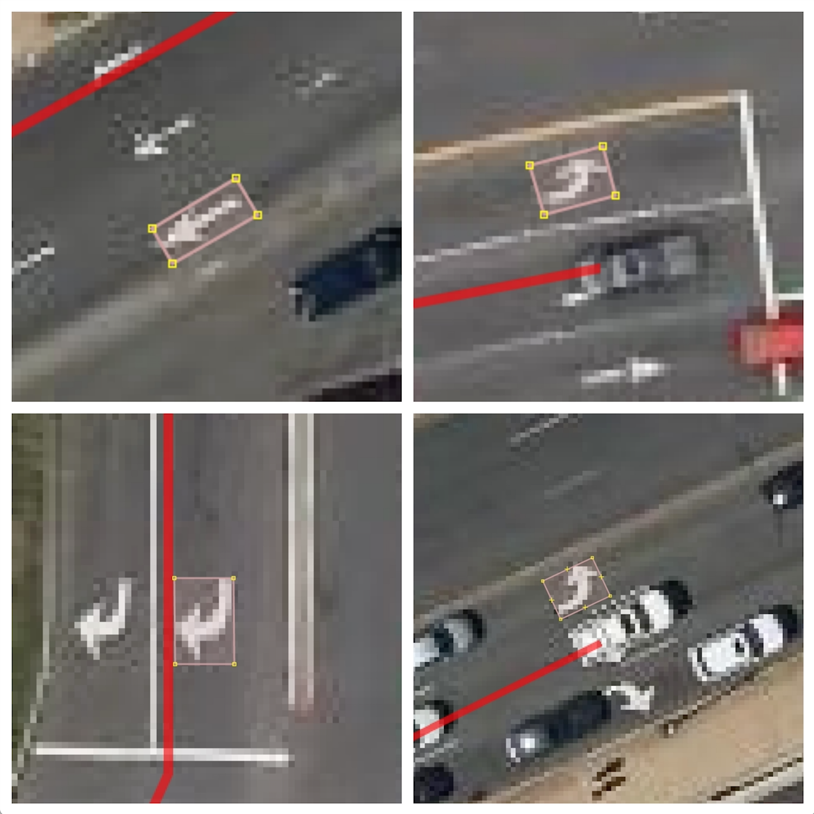
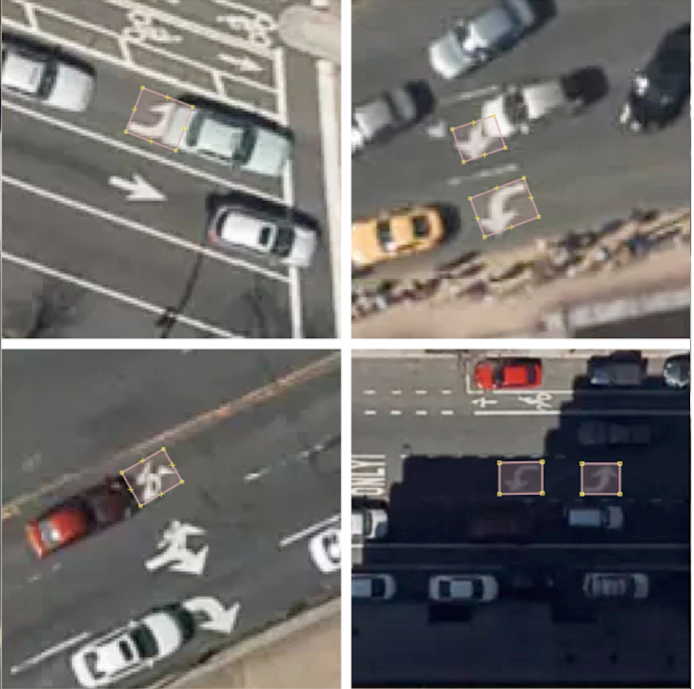
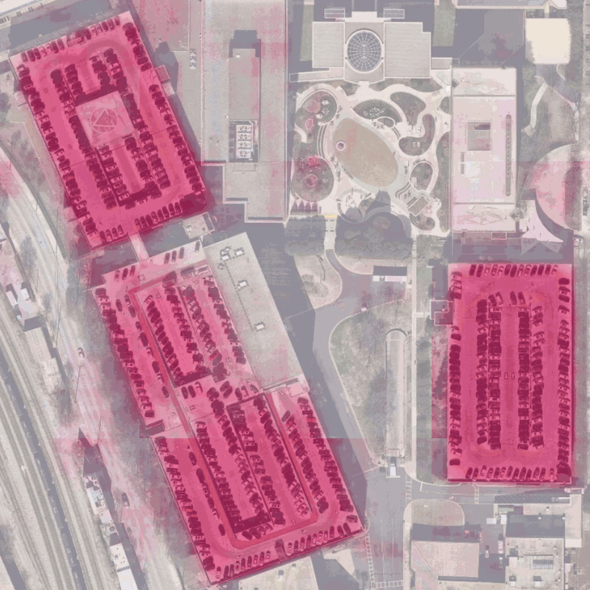
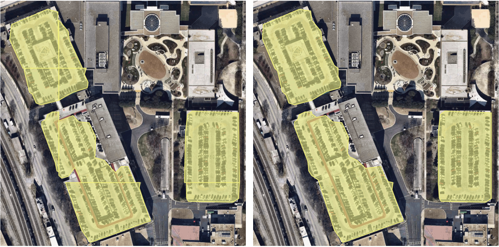
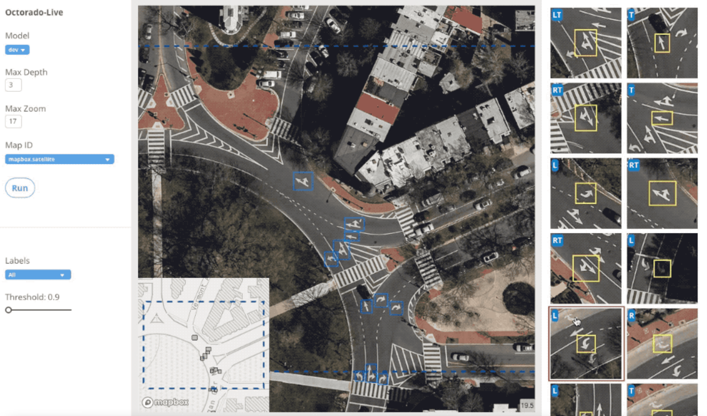

:author: Virginia Ng
:email: virginia@mapbox.com
:institution: Mapbox

:author: Daniel Hofmann
:email: hofmann@mapbox.com
:institution: Mapbox

:video: https://youtu.be/3AuRW9kq89g

--------------------------------------------------------------
Scalable Feature Extraction with Aerial and Satellite Imagery
--------------------------------------------------------------

.. class:: abstract

   Deep learning techniques have greatly advanced the performance of the already rapidly developing field of computer vision, which powers a variety of emerging technologies—from facial recognition to augmented reality to self-driving cars. The remote sensing and mapping communities are particularly interested in extracting, understanding and mapping physical elements in the landscape. These mappable physical elements are called features, and can include both natural and synthetic objects of any scale, complexity and character. Points or polygons representing sidewalks, glaciers, playgrounds, entire cities, and bicycles are all examples of features. In this paper we present a method to develop deep learning tools and pipelines that generate features from aerial and satellite imagery at large scale. Practical applications include object detection, semantic segmentation and automatic mapping of general-interest features such as turn lane markings on roads, parking lots, roads, water, building footprints.

   We give an overview of our data preparation process, in which data from the Mapbox Satellite layer, a global imagery collection, is annotated with labels created from OpenStreetMap data using minimal manual effort. We then discuss the implementation of various state-of-the-art detection and semantic segmentation systems such as the improved version of You Only Look Once (YOLOv2), modified U-Net, Pyramid Scene Parsing Network (PSPNet), as well as specific adaptations for the aerial and satellite imagery domain. We conclude by discussing our ongoing efforts in improving our models and expanding their applicability across classes of features, geographical regions, and relatively novel data sources such as street-level and drone imagery.

.. class:: keywords

   computer vision, deep learning, neural networks, satellite imagery, aerial imagery

I. Introduction
---------------

Location data is built into the fabric of our daily experiences, and is more important than ever with the introduction of new location-based technologies such as self-driving cars. Mapping communities, open source or proprietary, work to find, understand and map elements of the physical landscape. However, mappable physical elements are continually appearing, changing, and disappearing. For example, more than 1.2 million residential units were built in the United States alone in 2017 [buildings]_. Therefore, a major challenge faced by mapping communities is maintaining recency while expanding worldwide coverage. To increase the speed and accuracy of mapping, allowing better pace-keeping with change in the mappable landscape, we propose integrating deep neural network models into the mapping workflow. In particular, we have developed tools and pipelines to detect various geospatial features from satellite and aerial imagery at scale. We collaborate with the OpenStreetMap [osm]_ (OSM) community to create reliable geospatial datasets, validated by trained and local mappers.

Here we present two use cases to demonstrate our workflow for extracting street navigation indicators such as turn restrictions signs, turn lane markings, and parking lots, in order to improve our routing engines. Our processing pipelines and tools are designed with open source libraries including Scipy, Rasterio, Fiona, Osium, JOSM, Keras, PyTorch, and OpenCV, while our training data is compiled from OpenStreetMap and the Mapbox Maps API [mapbox_api]_. Our tools are designed to be generalizable across geospatial feature classes and across data sources.

II. Scalable Computer Vision Pipelines
-----------------------------------------

The general design for our deep learning based computer vision pipelines can be found in Figure 1, and is applicable to both object detection and semantic segmantation tasks. We design such pipelines with two things in mind: they must scale to process petabytes worth of data; and they must be agile enough to be repurposed for computer vision tasks on other geospatial features. This requires tools and libraries that make up these pipelines to be developed in modularized fashion. We present turn lane markings as an example of an object detection pipeline, and parking lots as an example of a semantic segmentation pipeline. Code for Robosat [robosat]_, our end-to-end semantic segmantion pipeline, along with all its tools, is made available at: *https://github.com/mapbox/robosat*.

.. figure:: fig1.png
   :height: 100 px
   :width:  200 px
   :scale: 32 %

   Computer Vision Pipeline.

1. Data
--------

The data needed to create training sets depends on the type of task: object detection or semantic segmentation. We first present our data preparation process for object detection and then discuss the data preperation process for semantic segmentation.

**Data Preparation For Object Detection.** Object detection is the computer vision task that deals with locating and classifying a variable number of objects in an image. Figure 2 demonstrates how object detection models are used to classify and locate turn lane markings from satellite imagery. There are many other practical applications of object detection such as face detection, counting, and visual search engines. In our case, detected turn lane markings become valuable navigation assets to our routing engines when determining the most optimal routes.

.. figure:: fig2.png
   :height: 75 px
   :width:  150 px
   :scale: 21 %

   Left: Original satellite image. Right: Turn lane markings detection.

The turn lane marking training set is created by collecting imagery of various types of turn lane markings and manually drawing a bounding box around each marking. We use Overpass Turbo [#]_ to query the OpenStreetMap database for streets containing turn lane markings, i.e., those tagged with one of the following attributes: “\turn:lane=*”, “\turn:lane:forward=*”, “\turn:lane:backward=*” in OpenStreetMap. The marked street segments, as shown in Figure 3, are stored as GeoJSON features clipped into the tiling scheme [tile]_ of the Mapbox Satellite basemap [mapbox]_. Figure 4 shows how skilled mappers use this map layer as a cue to manually draw bounding boxes around each turn lane marking using JOSM [#]_, a process called annotation. These bounding boxes are stored in GeoJSON polygon format on Amazon S3 [s3]_ and used as labels during training.

.. [#] JOSM [josm]_ is an extensible OpenStreetMap editor for Java 8+. At its core, it is an interface for editing OSM, i.e., manipulating the nodes, ways, relations, and tags that compose the OSM database. Compared to other OSM editors, JOSM is notable for its range of features, such as allowing the user to load arbitrary GPX tracks, background imagery, and OpenStreetMap data from local and online sources. It is open source and licensed under GPL.
.. [#] Overpass Turbo [overpass]_ is a web based data mining tool for OpenStreetMap. It runs any kind of Overpass API query and shows the results on an interactive map.

.. figure:: fig3.png
   :height: 200 px
   :width: 400 px
   :scale: 32 %

   A custom layer created by clipping the locations of roads with turn lane markings to Mapbox Satellite. Streets with turn lane markings are rendered in red.

   Annotating turn lane markings by drawing bounding boxes.

Mappers annotate over 54,000 turn lane markings, spanning six classes - “\Left”, “\Right”, “\Through”, “\ThroughLeft”, “\ThroughRight”, and “\Other” in five cities. Turn lane markings of all shapes and sizes, as well as ones that are partially covered by cars and/or shadows are included in this training set. To ensure a high-quality training set, we had a separate group of mappers verify each of the bounding boxes drawn. We exclude turn lane markings that are not visible, as seen in Figure 5.

   Left: Examples of visible turn lane markings that are included in the training set. Right: Defaced or obscured turn lane markings, such as those covered by cars, are excluded from the training set.

**Data Engineering Pipeline for Object Detection.** Within the larger object detection pipeline, sits a data engineering pipeline designed to create and process training data in large quantities. This data engineering pipeline is capable of streaming any set of prefixes off of Amazon S3 into prepared training sets. Several pre-processing steps are taken to convert annotations to the appropriate data storage format before combining them with real imagery. The turn lane marking annotations are initially stored as GeoJSON polygons grouped by class. Each of these polygons is streamed out of the GeoJSON files on S3, converted to image pixel coordinates, and stored as JSON image attributes to abstract tiles [tile]_. The pre-processed annotations are randomly assigned to training and testing datasets with a ratio of 4:1. The abstract tiles are then replaced by the corresponding real image tiles, fetched from the Satellite layer of the Mapbox Maps API. At this point, each training sample consisted of a photographic image paired with its corresponding JSON image attribute. Finally, the training and test sets are zipped and uploaded to Amazon S3. This process is scaled up to run multiple cities in parallel on Amazon Elastic Container Service [#]_. This data engineering pipeline is shown in Figure 6.

.. figure:: fig6.png
   :height: 200 px
   :width: 400 px
   :scale: 32 %

   Object Detection Data Engineering Pipeline: Annotated OpenStreetMap GeoJSON features are converted to image pixel space, stored as JSON image attributes and used as training labels. These labels are then combined with each of their respective imagery tiles, fetched from the Mapbox Maps API (Satellite), to create a training set for turn lane marking detection.

**Data Preparation for Semantic Segmentation.** Semantic segmentation is the computer vision task that partitions an image into semantically meaningful parts, and classifies each part into one of any pre-determined classes. This can be understood as assigning a class to each pixel in the image, or equivalently as drawing non-overlapping masks or polygons with associated classes over the image. As an example of the polygonal approach, in addition to distinguishing roads from buildings and vegetation, we also delineate the boundaries of each object in Figure 7.

.. figure:: fig7.png
   :height: 75 px
   :width: 150 px
   :scale: 21 %

   Left: Original satellite image. Right: Semantic segmentation of roads, buildings and vegetation.

The parking lot training set is created by combining imagery tiles collected from Mapbox Satellite with parking lots polygons. Parking lot polygons are generated by querying the OpenStreetMap database with Osmium [osmium]_ for OpenStreetMap features with attributes “\tag:amenity=parking=*” using the *rs extract* tool [rs-extract]_ in Robosat, our segmentation pipeline. These parking lot polygons are stored as two-dimensional single-channel numpy arrays, or binary mask clipped and scaled to the Mapbox Satellite tiling scheme using the *rs rasterize* tool [rs-rasterize]_. Each mask array is paired with its corresponding photographic image tile. Conceptually, this can be compared to concatenating a fourth channel, the mask, onto a standard red, green, and blue image. 55,710 parking lots are annotated for the initial training set. Our tools and processes can be generalized to any OpenStreetMap feature and any data source. For example, we also experiment with building segmentation in unmanned aerial vehicle (UAV) imagery from the OpenAerialMap project in Tanzania [tanzania]_. One can generate training sets for any OpenStreetMap feature in this way by writing custom Osmium handlers to convert OpenStreetMap geometries into polygons.

.. [#] Osmium [osmium]_ is a fast and flexible C++ library for working with OpenStreetMap data.
.. [#] Amazon ECS [ecs]_ is a highly scalable, fast, container management service that makes it easy to run, stop, and manage Docker containers on specified type of instances

2. Model
---------

**Fully Convolutional Neural Networks.** Fully convolutional networks (FCNs) are neural networks composed only of convolutional layers. They are contrasted with more conventional networks that typically have fully connected layers or other non-convolutional subarchitectures as “decision-makers” just before the output. For the purposes considered here, FCNs show several significant advantages. First, FCNs can handle input images of different resolutions, while most alternatives require input dimensions to be of a certain size [FCN]_. For example, architectures like AlexNet can only work with input images sizes that are 224 x 224 x 3 [FCN]_. Second, FCNs are well suited to handling spatially dense prediction tasks like segmentation because one would no longer be constrained by the number of object categories or complexity of the scenes. Networks with fully connect layers, in contrast, generally lose spatial information in these layers because all output neurons are connected to all input neurons [FCN]_.

**Object Detection Models.** Many of our applications require low latency prediction from their object detection algorithms. We implement YOLOv2 [yolov2]_, the improved version of the real-time object detection system You Only Look Once (YOLO) [yolo]_, in our turn lane markings detection pipeline. YOLOv2 outperforms other state-of-the-art methods, like Faster R-CNN with ResNet [resnet]_ and Single Shot MultiBox Detector (SSD) [ssd]_, in both speed and detection accuracy [yolov2]_. It works by first dividing the input image into 13 × 13 grid cells (i.e., there are 169 total cells for any input image). Each grid cell is responsible for generating 5 bounding boxes. Each bounding box is composed of its center coordinates relative to the location of its corresponding grid cell, its normalized width and height, a confidence score for "objectness," and an array of class probabilities. A logistic activation is used to constrain the network’s location prediction to fall between 0 and 1, so that the network is more stable. The objectness predicts the intersection over union (IOU) of the ground truth and the proposed box. The class probabilities predict the conditional probability of each class for the proposed object, given that there is an object in the box [yolov2]_.

6 classes are defined for the turn lane markings detection project. With 4 coordinates defining each box's geometry, the "objectness" confidence, and 6 class probabilities, each bounding box object is comprised of 11 numbers. Multiplying by boxes per grid cell and grid cells per image, this project's YOLOv2 network therefore always yields 13 x 13 x 5 x 11 = 9,295 outputs per image.

The base feature extractor of YOLOv2 is Darknet-19 [darknet]_, a FCN composed of 19 convolutional layers and 5 maxpooling layers. Detection is done by replacing the last convolutional layer of Darknet-19 with three 3 × 3 convolutional layers, each outputting 1024 channels. A final 1 × 1 convolutional layer is then applied to convert the 13 × 13 × 1024 output into 13 × 13 × 55. We follow two suggestions proposed by the YOLOv2 authors when designing our model. The first is incorporating batch normalization after every convolutional layer. During batch normalization, the output of a previous activation layer is normalized by subtracting the batch mean and dividing by the batch standard deviation. This technique stabilizes training, improves the model convergence, and regularizes the model [yolov2_batch]_. By including batch normalization, YOLOv2 authors saw a 2% improvement in mAP on the VOC2007 dataset [yolov2]_ compared to the original YOLO model. The second suggestion is the use of anchor boxes and dimension clusters to predict the actual bounding box of the object. This step is acheieved by running k-means clustering on the turn lane marking training set bounding boxes. As seen in Figure 8, the ground truth bounding boxes for turn lane markings follow specific height-width ratios. Instead of directly predicting bounding box coordinates, our model predicts the width and height of the box as offsets from cluster centroids. The center coordinates of the box relative to the location of filter application is predicted by using a sigmoid function.

.. figure:: fig8.png
   :height: 150 px
   :width: 150 px
   :scale: 38 %

   Clustering of box dimensions in the turn lane marking training set. We run k-means clustering on the dimensions of bounding boxes to get anchor boxes for our model. We used k = 5, as suggested by the YOLOv2 authors, who found that this cluster count gives a good tradeoff for recall v. complexity of the model.

Our model is first pre-trained on ImageNet 224 × 224 resolution imagery. The network is then resized and fine-tuned for classification on 448 × 448 turn lane marking imagery, to ensure that the relatively small features of interest are still reliably detected.

**Segmentation Models.** For parking lot segmentation, we select an approach of binary segmentation (distinguishing parking lots from the background), and found U-Net [unet]_ to be a suitable architecture. The U-Net architecture can be found in Figure 9. It consists of a contracting path, to capture context, and a symmetric expanding path, which allows precise localization. This type of network can be trained end-to-end with very few training images and can yield more precise segmentations than prior state-of-the-art methods such as sliding-window convolutional networks. The first part of the U-Net network downsamples, and is similar in design and purpose to the encoding part of an autoencoder. It repeatedly applies convolution blocks followed by maxpool downsamplings, encoding the input image into increasingly abstract representations at successively deeper levels. The second part of the network consists of upsampling and concatenation, followed by ordinary convolution operations. Concatenation combines relatively “raw” information with relatively “processed” information. This can be understood as allowing the network to assign a class to a pixel with sensitivity to small-scale, less-abstract information about the pixel and its immediate neighborhood (e.g., whether it is gray) and simultaneously with sensitivity to large-scale, more-abstract information about the pixel’s context (e.g., whether there are nearby cars aligned in the patterns typical of parking lots). we gain a modest 1% improvement in accuracy by making two additional changes. First we replace the standard U-Net encoder with pre-trained ResNet50 [resnet]_ encoder. Then, we switch out the learned deconvolutions with nearest neighbor upsampling followed by a convolution for refinement.

.. figure:: fig9.png
   :height: 125 px
   :width: 200 px
   :scale: 36 %

   U-Net architecture.

We experiment with a Pyramid Scene Parsing Network (PSPNet) [pspnet]_ architecture for a 4-class segmentation task on buildings, roads, water, and vegetation. PSPNet is one of the few pixel-wise segmentation methods that focuses on global priors, while most methods fuse low-level, high resolution features with high-level, low resolution ones to develope comprehensive feature representations. Global priors can be especially useful for objects that have similar spatial features. For instance, runways and freeways have similar color and texture features, but they belong to different classes, which can be discriminated by adding car and building information. PSPNet uses pre-trained ResNet to generate a feature map that is 1/8 the size of the input image. The feature map is then fed through the pyramid parsing module, a hierarchical global prior that aggregates different scales of information. After upsampling and concatenation, the final feature representatation is fused with a 3 x 3 convolution to produce the final prediction map. As seen in Figure 6, PSPNet produced good-quality segmentation masks in our tests on scenes with complex features such as irregularly shaped trees, buildings and roads. For the 2-class parking lot task, however, we found PSPNet unnecessarily complex and time-consuming.

**Hard Negative Mining.** This is a technique we apply to improve model accuracy [hnm]_ . We first train a model with an initial subset of negative examples, and collect negative examples that are incorrectly classified by this initial model to form a set of hard negatives. A new model is then trained with the hard negative examples and the process may be repeated a few times.

Figure 10 shows a model's output as a probability mask overlaid on Mapbox Satellite. Increasingly opaque red indicates an increasingly high probability estimate of the underlying pixel belonging to a parking lot. We use this type of visualization to find representative falsely detected patches for use as hard negatives in hard negative mining.

   A probability mask marking the pixels that our model believes belong to parking lots.

3. Post-Processing
------------------

Figure 11 shows an example of the raw segmentation mask derived from our U-Net model. It cannot be used directly as input for OpenStreetMap. We perform a series of post-processing steps to refine and transform the mask until it met quality and format requirements for OpenStreetMap consumption:

.. figure:: fig11.png
   :height: 150 px
   :width: 150 px
   :scale: 47 %

   An example of border artifacts and holes in raw segmentation masks produced by our U-Net model.

**Noise Removal.** Noise in the output mask is removed by two morphological operations: erosion followed by dilation. Erosion removes some positive speckle noise ("islands"), but it also shrinks objects. Dilation re-expands the objects.

**Fill in holes.** The converse of the previous step, removing "lakes" (small false or topologically inconvenient negatives) in the mask.

**Contouring.** During this step, continuous pixels having same color or intensity along the boundary of the mask are joined. The output is a binary mask with contours.

**Simplification.** We apply Douglas-Peucker simplification [DP]_, which takes a curve composed of line segments and gives a similar curve with fewer vertexes. OpenStreetMap favors polygons with the least number of vertexes necessary to represent the ground truth accurately, so this step is important to increase the data's quality as percieved by its end users.

**Transform Data.** Polygons are converted from in-tile pixel coordinates to GeoJSONs in geographic coordinates (longitude and latitude).

**Merging multiple polygons.** This tool combines polygons that are nearly overlapping, such as those that represent a single feature broken by tile boundaries, into a single polygon. See Figure 12.

**Deduplication.** Cleaned GeoJSON polygons are compared against parking lot polygons that already exist in OpenStreetMap, so that only previously unmapped features are uploaded.

   Left: Polygons crossing tile boundaries, and other adjacent polygons, are combined. Right: Combined polygons.

All post-processing tools can be found in our Robosat [robosat]_ GitHub repository.

4. Conclusion
-------------

We demonstrated the steps to building deep learning-based computer vision pipelines that can run object detection and segmentation tasks at scale. With these pipeline designs, we are able to create training data with minimal manual effort, experiment with different network architectures, run inference, and apply post-process algorithms to tens of thousands of image tiles in parallel using Amazon ECS. The outputs of the processing pipelines discussed are turn lane markings and parking lots in the form of GeoJSON features suitable for adding to OpenStreetMap. Mapbox routing engines then take these OpenStreetMap features into account when calculating optimal navigation routes. As we make various improvements to our baseline model and post-processing algorithms (see below), we keep human control over the final decision to add a given feature to OpenStreetMap. Figure 13 shows a front-end user interface (UI) created to allow users to run instant turn lane marking detection and visualize the results on top of Mapbox Satellite. Users can select a model, adjust the level of confidence for the model, choose from any Mapbox map styles [mapbox_style]_, and determine the area on the map to run inference on [mapbox_zoom]_.

   Front-end UI for instant turn lane marking detection on Mapbox Satellite layer, a global imagery collection.

IV. Future Work
----------------

We are now working on making a few improvements to Robosat, our segmentation pipeline, so that it becomes more flexible in handling input image of different resolutions. First, our existing post-processing handler is designed for parking lot features and is specifically tuned with thresholds set for zoom level 18 imagery [osm_zoom]_. We are replacing these hard-coded thresholds with generalized ones that are calculated based on resolution in meters per pixel. We also plan to experiment with a feature pyramid-based deep convolutional network called Feature Pyramid Network (FPN) [FPN]_. It is a practical and accurate solution to multi-scale object detection. Similar to U-Net, the FPN has lateral connections between the bottom-up pyramid (left) and the top-down pyramid (right). The main difference is where U-net only copies features and appends them, FPN applies a 1x1 convolution layer before adding the features. We will most likely follow the authors' footsteps and use ResNet as the backbone of this network.

There two other modifications planned for the post-processing steps. First, we want to experiment with a more sophisticated polygon simplication algorithm besides Douglas-Peucker. Second, we are rethinking the ordering of first performing simplication then merging. The current post-process workflow performs simplication on individual extracted polygons and then merges polygons that are across imagery tiles together. The resulting polygons, according to this process, may no longer be in the simplest shape.

We design our tools and pipelines with the intent that other practitioners would find it straightforward to adapt them to other landscapes, landscape features, and imagery data sources. For instance, we generated 184,000 turn restriction detections following a similar process applying deep learning models on Microsoft's street-level imagery [streetside]_. We released these turn restriction detections located across 35,200 intersections and 23 cities for the OpenStreetMap community [turn-restrict]_ in June 2018. For future work we will continue to look for ways to bring different sources and structures of data together to build better computer vision pipelines.

References
----------
.. [buildings] Cornish, C., Cooper, S., Jenkins, S., & US Census Bureau. (2011, August 23). US Census Bureau New Residential Construction. Retrieved from https://www.census.gov/construction/nrc/index.html
.. [osm] OpenStreetMap Contributors. (2017). OpenStreetMap. Retrieved May 30, 2018, from https://www.openstreetmap.org/
.. [mapbox] Mapbox. (n.d.). About. Retrieved June 30, 2018, from https://www.mapbox.com/about/
.. [mapbox_api] Mapbox. (n.d.). Mapbox API Documentation. Retrieved May 30, 2018, from https://www.mapbox.com/api-documentation/#maps
.. [osm-lanes] OpenStreetMap Contributors. (2018, February 27). Lanes. Retrieved May 30, 2018, from https://wiki.openstreetmap.org/wiki/Lanes
.. [overpass] Raifer, M. (2017, January).  Overpass Turbo. Retrieved from https://overpass-turbo.eu/
.. [josm] Scholz, I., & Stöcker, D. (2017, May). Java OpenStreetMap Editor. Retrieved from https://josm.openstreetmap.de/
.. [osm-parking] OpenStreetMap Contributors. (2018, April). Tag:amenity=parking. Retrieved from https://wiki.openstreetmap.org/wiki/Tag:amenity%3Dparking
.. [rs-extract] Mapbox. (2018, June). Robosat. Retrieved from https://github.com/mapbox/robosat#rs-extract
.. [rs-rasterize] Mapbox. (2018, June). Robosat. Retrieved from https://github.com/mapbox/robosat#rs-rasterize
.. [osmium] Topf, J. (2018, April). Osmcode/libosmium. Retrieved May 11, 2018, from https://github.com/osmcode/libosmium
.. [tile] OpenStreetMap Contributors. (2018, June). Tile Scheme. Retrieved from https://wiki.openstreetmap.org/wiki/Slippy_map_tilenames
.. [tanzania] Hofmann, D. (2018, July 5). Daniel-j-h's diary | RoboSat loves Tanzania. Retrieved from https://www.openstreetmap.org/user/daniel-j-h/diary/44321
.. [s3] Amazon. (n.d.). Cloud Object Storage | Store & Retrieve Data Anywhere | Amazon Simple Storage Service. Retrieved from https://aws.amazon.com/s3/
.. [ecs] Amazon. (n.d.). Amazon ECS - run containerized applications in production. Retrieved from https://aws.amazon.com/ecs/
.. [yolo] Redmon, J., Divvala, S., Girshick, R., & Farhadi, A. (2016, June). You Only Look Once: Unified, Real-Time Object Detection. 2016 IEEE Conference on Computer Vision and Pattern Recognition (CVPR). doi:10.1109/cvpr.2016.91
.. [ssd] Liu, W., Anguelov, D., Erhan, D., Szegedy, C., Reed, S., Fu, C., & Berg, A. C. (2016, September 17). SSD: Single Shot MultiBox Detector. Computer Vision – ECCV 2016 Lecture Notes in Computer Science, 21-37. doi:10.1007/978-3-319-46448-0_2
.. [darknet] Redmon, J. (2013-2016). Darknet: Open Source Neural Networks in C. Retrieved from https://pjreddie.com/darknet/
.. [yolov2] Redmon, J., & Farhadi, A. (2017, July). YOLO9000: Better, Faster, Stronger. 2017 IEEE Conference on Computer Vision and Pattern Recognition (CVPR). doi:10.1109/cvpr.2017.690
.. [yolov2_batch] Ioffe, S., & Szegedy, C. (2015, February 11). Batch normalization: Accelerating deep network training by reducing internal covariate shift.arXiv:1502.03167
.. [FCN] Long, J., Shelhamer, E., & Darrell, T. (2015, June). Fully Convolutional Networks for Semantic Segmentation. 2015 IEEE Conference on Computer Vision and Pattern Recognition (CVPR). doi:10.1109/CVPR.2015.7298965
.. [unet] Ronneberger, O., Fischer, P., & Brox, T. (2015, May 18) U-Net: Convolutional Networks for Biomedical Image Segmentation. 2015 MICCAI. arXiv:1505.04597
.. [resnet] He, K., Zhang, X., Ren, S., & Sun, J. (2016, June). Deep Residual Learning for Image Recognition. 2016 IEEE Conference on Computer Vision and Pattern Recognition (CVPR). doi:10.1109/cvpr.2016.90
.. [pspnet] Zhao, H., Shi, J., Qi, X., Wang, X., & Jia, J. (2017, July). Pyramid Scene Parsing Network. 2017 IEEE Conference on Computer Vision and Pattern Recognition (CVPR). doi:10.1109/cvpr.2017.660
.. [hnm] Dalal, N., & Triggs, B. (2005, June). Histograms of oriented gradients for human detection. 2005 IEEE Conference on Computer Vision and Pattern Recognition. 10.1109/CVPR.2005.177
.. [robosat] Mapbox. (2018, June). Robosat. Retrieved from https://github.com/mapbox/robosat
.. [DP] Wu, S., & Marquez, M. (2003, October). A non-self-intersection Douglas-Peucker algorithm. 16th Brazilian Symposium on Computer Graphics and Image Processing (SIBGRAPI 2003). doi:10.1109/sibgra.2003.1240992
.. [mapbox_style] Mapbox. (n.d.). Styles. Retrieved from https://www.mapbox.com/help/studio-manual-styles/
.. [mapbox_zoom] Mapbox. (n.d.). Zoom Level. Retrieved from https://www.mapbox.com/help/define-zoom-level/
.. [osm_zoom] OpenStreetMap Contributors. (2018, June 20). Zoom Levels. Retrieved June 30, 2018, from https://wiki.openstreetmap.org/wiki/Zoom_levels
.. [FPN] Lin, T., Dollar, P., Girshick, R., He, K., Hariharan, B., & Belongie, S. (2017, July). Feature Pyramid Networks for Object Detection. 2017 IEEE Conference on Computer Vision and Pattern Recognition (CVPR). doi:10.1109/cvpr.2017.106
.. [streetside] Microsoft. (n.d.). Streetside. Retrieved from https://www.microsoft.com/en-us/maps/streetside
.. [turn-restrict] Ng, V. (2018, June 14). virginiayung's diary | Releasing 184K Turn Restriction Detections. Retrieved from https://www.openstreetmap.org/user/virginiayung/diary/44171
