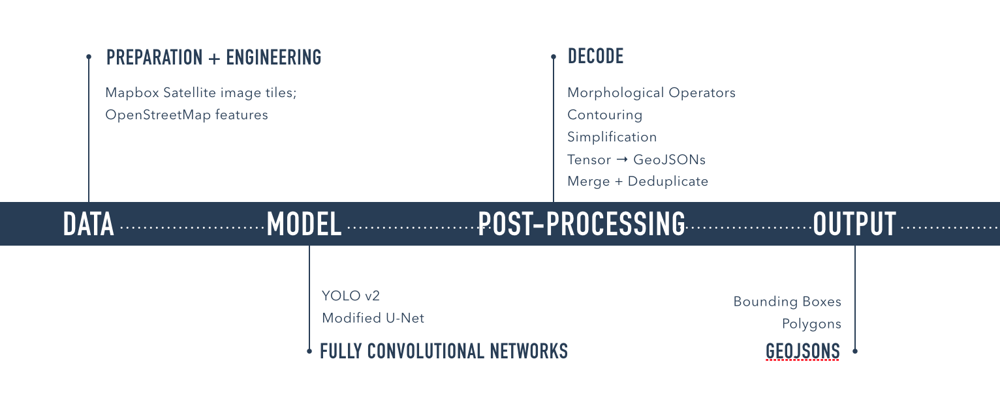
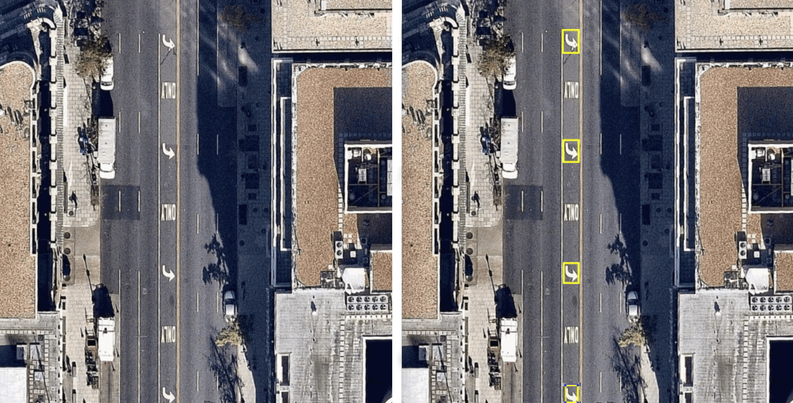
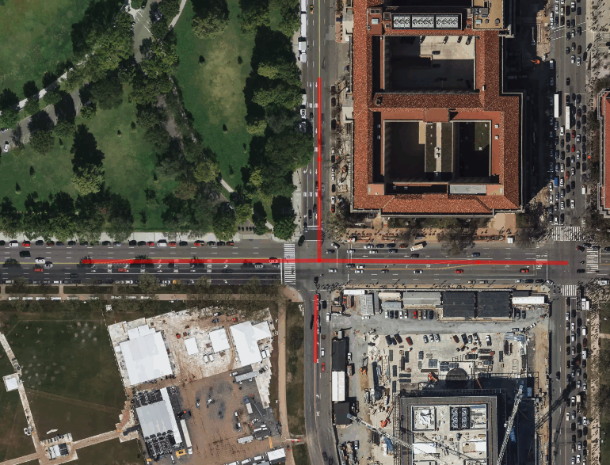
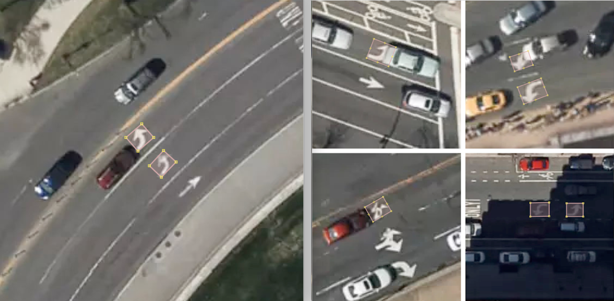
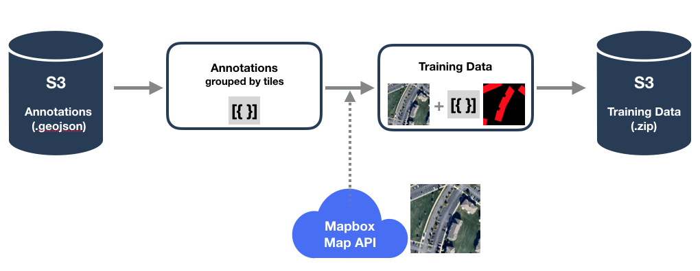
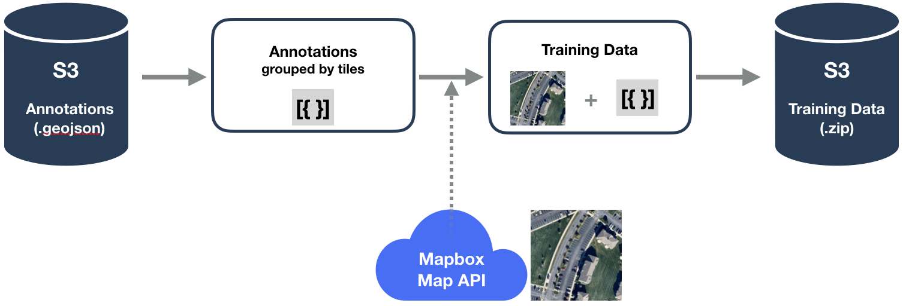
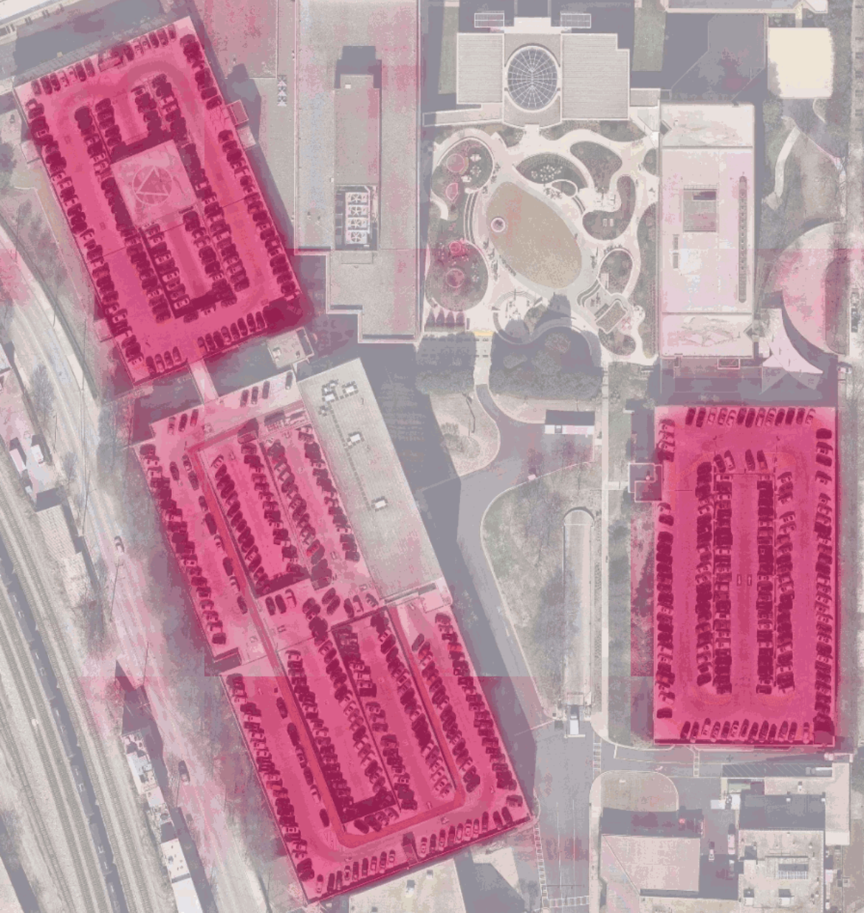
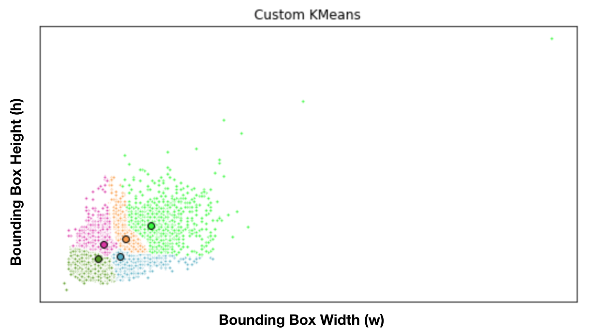

:author: Virginia Ng
:email: virginia@mapbox.com
:institution: Mapbox

:author: Daniel Hofmann
:email: hofmann@mapbox.com
:institution: Mapbox

--------------------------------------------------------------
Scalable Feature Extraction with Aerial and Satellite Imagery
--------------------------------------------------------------

.. class:: abstract

   In this talk we introduce use cases for feature extraction with aerial
   and satellite imagery such as turn lane marking detection, road and
   building footprint detection. In doing so, we show the potential of
   large-scale object detection and segmentation on aerial and satellite
   imagery. 

   We give insights into how imagery training sets can be built
   with little or no human annotations needed making use of available
   datasets such as OpenStreetMap. We then focus on modeling aspects for
   object detection and segmentation. In doing so we give an insight into
   state-of-the-art detection systems and adaptations we had to make for
   the aerial and satellite imagery domain. 

   We conclude the talk with lessons learned in building these 
   large-scale object detection and segmentation pipelines, and show 
   potential for future work in this
   domain.

.. class:: keywords

   computer vision, deep learning, neural networks, satellite imagery, aerial imagery

I. Mapbox
---------

Mapbox is the location data platform for mobile and web applications. We
provide building blocks to add location features like maps, search, and
navigation into any experience you create.

Location is built into the fabric of our daily experiences. Whether
you’re exploring a city with Lonely Planet, sharing with friends on
Snapchat, seeing if it’s going to rain on Weather.com, tracking breaking
news on Bloomberg — location is essential to every one of these
applications, and they’re powered by Mapbox.

II. Navigation
--------------

In particular, our navigation products are focused on providing smart
turn-by-turn routing based on real-time traffic. Valuable Assets For
Routing, Maps, and Geocoding inlcude

turn Restrictions, turn lane markings, parking lots, buildings, grass,
trees, parks, water, bridges.

We can manually map them, or we can abstract these assets from imagery.

III. Designed with Open-Source Tools
-------------------------------------

We designed our processing pipelines and tools with open-source
libraries like Scipy, Rasterio, Fiona, Osium, JSOM, Keras, PyTorch,
OpenCV etc, while our training data was compiled from
OpenStreetMap [osm]_ and Mapbox Maps
API [mapbox]_.

IV. Scalable Feature Extraction Pipelines
-----------------------------------------

In this talk we introduce step-by-step how we scale object detection and
semantic segmentation pipelines (Figure 1). Two examples we will
present are turn lane markings and parking lot segmentation with aerial
and satellite imagery.

   Feature Extraction Pipeline. 

1. Data
--------

**Data Preparation.** Before we talk about data, we would first like to
explain the difference between object detection and semantic
segmentation. These are two different problem spaces in computer vision.
Object detection is the problem of locating and classifying a variable
number of objects in an image. Here we use object detection models to
detect turn lane markings from satellite imagery (Figure 2). Other
practical applications of object detection include face detection,
counting, visual search engine.

   Turn lane markings detection.

Semantic segmentation on the other hand, not only locates and classifies
objects, it does so at pixel level. For example, in addition to
recognizing the road from the buildings, we also have to delineate the
boundaries of each object (See Figure 3)

   Semantic segmentation on roads, buildings and greens

To prepare training data for detecting turn lane markings, we first find
where the turn lane markings are. OpenStreetMap is a collaborative
project to create a free editable map of the world. Turn lane markings
on OpenStreetMap are recorded as “ways” (line-strings) [OSM-lanes]_. We used a tool
called Overpass Turbo [overpass]_ to query
OpenStreetMap turn lane markings. We then extracted GeoJSONs in 5 cities
from OpenStreetMap that have one of the following attributes
(“\turn:lane=*”, “\turn:lane:forward=*”, “\turn:lane:backward=*” ) and
created a custom layer over `mapbox.satellite
layer <http://api.mapbox.com/v4/mapbox.satellite.html?access_token=pk.eyJ1IjoibWFwYm94IiwiYSI6ImNpejY4NDg1bDA1cjYzM280NHJ5NzlvNDMifQ.d6e-nNyBDtmQCVwVNivz7A#3/0.00/0.00>`__.
We annotated (draw bounding box around the turn lane markings) six
classes of turn lane markings: “\Left”, “\Right”, “\Through” (straight),
“\ThroughLeft”, “\ThroughRight”, “\Other” using JOSM [josm]__ in 5 cities, over 53K turn
lane markings. JOSM is an extensible editor for OpenStreetMap (OSM) for
Java 8+. It supports loading GPX tracks, background imagery and OpenStreetMap data
from local sources as well as from online sources and allows to edit the
OpenStreetMap data (nodes, ways, and relations) and their metadata tags. It is
open source and licensed under GPL. We included turn lane markings of
all shapes and sizes, as well as ones that are partially covered by cars
and/or shadows. We excluded turn lane markings that are erased or fully
covered by cars (see Figure 4b).

   Annotating turn lane markings - Draw bounding box around the turn lane markings.
   Figure 4b: Data Cleaning - Excluding turn lane arrows that are fully covered by car.

To prepare training data for parking lot segmentation, we first generate
polygons from OpenStreetMap tags [OSM-parking]_ excluding features that are not visible
in aerial imagery. Explicitly, these are OpenStreetMap features with the
attributes “\Tag:amenity=parking=*” except underground, sheds, carports,
garage_boxes. To prepare training data for building segmentation, we
generate polygons from tags with attributes “\building=*” except
construction, houseboat, static_caravan, stadium, conservatory ,
digester, greenhouse, ruins. We then use a tool called
Osmium [osmium]_ to annotate
these parking lots.

**Data Engineering.** We built a data engineering pipeline within the
larger object detection pipeline to create our training datasets. 
This data engineering pipeline is capable of streaming
any set of prefixes off of Amazon S3 [s3]_ into prepared training sets. 
For turn lane marking detection, we first stream these turn lane markings,
which are stored as OpenStreetMap features, out of the GeoJSON files on S3
and merge classes and bounding boxes into feature
attributes. Next, we convert these into JSON image annotations grouped by
tile. During this step, the annotated bounding boxes are converted to
image pixel coordinates. The annotations are then randomly assigned to
training and testing datasets (80/20 split) and written to disk, joined by
imagery fetched from the Mapbox Maps API. This is where the abstract
tile in the pipeline is replaced by real imagery. Finally, the training and test
data are zipped and uploaded to S3. For parking lot segmentation, we convert the annotated parking lots,
which are also stored as GeoJSON polygons, into single channel numpy arrays.
We then stack each of these single channel numpy arrays with its respective aerial
image tile, a three channel numpy array (RGB).

In either of these cases, we wrote
scripts for our data preparation steps (Python library and CLI). These
scripts were then ran at large scale in parallel (multiple cities at
once) on Amazon Elastic Container Service. Amazon Elastic Container Service is a
highly scalable, fast, container management service that makes it easy
to run, terminate, and manage Docker containers on a cluster (grouping of
container instances). This pipeline is shown in Figure 5.

   Data engineering pipeline combines OpenStreetMap GeoJSON features with imagery fetched from Mapbox Maps API.

Our data engineering pipelines are generalizable to any OpenStreetMap
feature. Examples of other features we have implemented include buildings. 
Users can generate training sets with any OpenStreetMap feature
simply by writing their own Osmium handler to turn OpenStreetMap geometries into
polygons.

2. Model
---------

**Fully Convolutional Neural Networks.** Fully convolutional are neural
networks composed of convolutional layers without any fully-connected
layers or MLP usually found at the end of the network. A CNN with fully
connected layers is just as end-to-end learnable as a fully
convolutional one. The main difference is that the fully convolutional
net is learning filters everywhere. Even the decision-making layers at
the end of the network are filters. Traditional Convolutional neural
networks containing fully connected layers cannot manage different input
sizes , whereas fully convolutional networks can have only convolutional
layers or layers which can manage different input sizes and are faster
at that task.

A fully convolutional net tries to learn representations and make
decisions based on local spatial input. Appending a fully connected
layer enables the network to learn something using global information
where the spatial arrangement of the input falls away and need not
apply.

**Object Detection Models.**\ The general way in which object detection
works is, the model is pre-trained on ImageNet for classification. Then
for detection, the network is resized to higher resolution especially to
detect smaller objects in a scene. Fully convolutional models jointly
trains these two steps. We implemented YOLOv2 [yolov2]_, a real-time object
detection system and is the improved version of YOLO [yolo]_, which was
introduced in 2015. YOLOv2 outperforms all the other state-of-the-art
methods like Faster RCNN with ResNet and SSD in both speed and detection
accuracy. Improvements made to YOLOv2 included batch normalization,
which helped the model converge while regularizing it. Another change
that was made to YOLO was the image resolution of which the network did
resizing and fine-tuning. In generally, object detection models are
pre-trained on ImageNet for classification. The network is then resized
for higher resolution for detection. This has worked particular well on
detecting smaller objects in a scene. YOLOv2 was first pre-trained on
ImageNet (224x224) and then fine-tuned on (448x448). A major feature of
the YOLO family is the use of anchor boxes to run prediction. There are
two ways of predicting the bounding boxes- directly predicting the
bounding box of the object or using a set of predefined bounding boxes
(anchor box) to predict the actual bounding box of the object. YOLO
predicts the coordinates of bounding boxes directly using fully
connected layers on top of the convolutional feature extractor. But, it
makes a significant amount of localization error. It is easier to
predict the offset based on anchor boxes than to predict the coordinates
directly. Instead of using pre-defined anchor boxes, YOLOv2 authors
performed K-means clustering on bounding boxes from the training data
set.

**Segmentation Models.** We implemented U-Net [unet]_ for parking lot
segmentation. The U-Net architecture (Figure 6) consists of a contracting path to
capture context and a symmetric expanding path that enables precise
localization. This type of network can be trained end-to-end with very
few training images and yields more precise segmentations than prior
best method such as the sliding-window convolutional network. This first part is 
called down or you may think it as the encoder part
where you apply convolution blocks followed by a maxpool downsampling to
encode the input image into feature representations at multiple
different levels. The second part of the network consists of upsample
and concatenation followed by regular convolution operations. Upsampling
in CNNs may be a new concept to some of the readers but the idea is
fairly simple: we are expanding the feature dimensions to meet the same
size with the corresponding concatenation blocks from the left. While
upsampling and going deeper in the network we are concatenating the
higher resolution features from down part with the upsampled features in
order to better localize and learn representations with following
convolutions. For parking lots segmentation, we are doing binary
segmentation distinguishing parking lots from the background.

   U-Net Architecture

We also experimented with Pyramid Scene Parsing Network (PSPNet) [pspnet]_. PSPNet
is good when the scene is complex (multi-class) and dataset has great
diversity. It’s redundant when the number of categories are less and
dataset are more simple (such as self-driving car). PSP adds a
multi-scale pooling on top of the backend model to aggregate different
scale of global information. The upsample layer is implemented by
bilinear interpolation. After concatenation, PSP fuse different level of
feature with a 3x3 convolution.

**Hard Negative Mining.** This is a technique we used to improve model
performance by reducing the negative samples. A hard negative is when we
take that falsely detected patch, and explicitly create a negative
example out of that patch, and add that negative to our training set.
When we retrain your model it should perform better with this extra
knowledge, and not make as many false positives.

3. Post-Processing
------------------

Figure 7 shows an example of the raw segmentation mask derived
from our U-Net model. It cannot be used directly as input into
OpenStreetMap. We performed a series of post-processing to improve the
quality of the segmentation mask and to transform the mask into the
right data format for OpenStreetMap.

   Raw segmentation mask derived from our U-Net model

   Clean polygon in the form of GeoJSON

**Noise Removal.** We remove noise in the data by performing two
morphological operations: erosion followed by dilation. Erosion removes
white noises, but it also shrinks our object. So we dilate it.

**Fill in holes.** We fill holes in the mask by performing dilation
followed by erosion. It is especially useful in closing small holes
inside the foreground objects, or small black points on the object. We
use this operator to deal with polygons within polygons.

**Contouring.** Contours are curves joining all the continuous points
that have same color or intensity.

**Simplification.** Douglas-Peucker Simplification takes a curve
compared of line segments and finds a similar curve with fewer points.
We get simple polygons that can be ingested by OpenStreetMap as feature type “nodes” and “ways”

**Transform Data.** Convert detection or segmentation results from pixel
space back into GeoJSONs (world coordinate).

**Removing tile border artifacts.** Query and match neighboring image
tiles.

**Deduplication.** Deduplicate by matching GeoJSONs with data that already exist on OpenStreetMap.

After performing all these post-processing steps, we have a clean mask (Figure 8)
that is also a polygon in the form of GeoJSON. This can now be added to
OpenStreetMap as a parking lot feature.

4. Output
----------

With this pipeline design, we are able to run batch prediction at large
scale (on the world). The output of these processing pipelines are turn
lane markings and parking lots in the form of GeoJSONs. We can then add
these GeoJSONs back into OpenStreetMap as turn lane and parking lot
features. Our routing engines then take these OpenStreetMap features
into account when calculating routes. We also built a front-end UI that
allows users to pan around for instant turn lane markings detection
(Figure 9).

.. figure:: fig9.png
   :height: 200 px
   :width: 400 px
   :scale: 42 %

   Front-end UI for instant turn lane markings detection

References
----------
.. [osm] OpenStreetMap, https://www.openstreetmap.org
.. [mapbox] Mapbox, https://www.mapbox.com/api-documentation/#maps
.. [overpass] Overpass, https://overpass-turbo.eu/
.. [josm] JOSM, https://josm.openstreetmap.de/
.. [osmium] Osmium, https://wiki.openstreetmap.org/wiki/Osmium
.. [s3] Amazon S3, https://aws.amazon.com/s3/
.. [OSM-lanes] OpenStreetMap tags, https://wiki.openstreetmap.org/wiki/Lanes
.. [OSM-parking] OpenStreetMap tags, https://wiki.openstreetmap.org/wiki/Tag:amenity%3Dparking
.. [yolov2] Joseph Redmon, Ali Farhadi. *YOLO9000: Better, Faster, Stronger*, arXiv:1612.08242 [cs.CV], Dec 2016
.. [yolo] Joseph Redmon, Santosh Divvala, Ross Girshick, Ali Farhadi, *You Only Look Once: Unified, Real-Time Object Detection*, arXiv:1506.02640 [cs.CV], June 2015
.. [unet] Olaf Ronneberger, Philipp Fischer, Thomas Brox. *U-Net: Convolutional Networks for Biomedical Image Segmentation*, arXiv:1505.04597 [cs.CV], May 2015.
.. [pspnet] Hengshuang Zhao, Jianping Shi, Xiaojuan Qi, Xiaogang Wang, Jiaya Jia, *Pyramid Scene Parsing Network*, arXiv:1612.01105 [cs.CV], Dec 2016.

