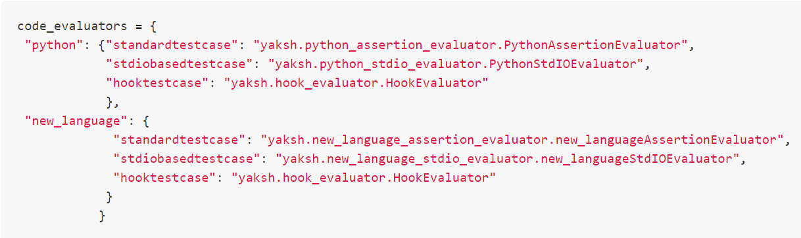

:author: Prabhu Ramachandran
:email: prabhu@aero.iitb.ac.in
:institution: Department of Aerospace Engineering
:institution: IIT Bombay, Mumbai, India
:corresponding:

:author: Prathamesh Salunke
:email: pratham920@gmail.com
:institution: FOSSEE IIT Bombay, Mumbai, India

:author: Ankit Javalkar
:email: ankitrj.iitb@gmail.com
:institution: FOSSEE IIT Bombay, Mumbai, India

:author: Aditya Palaparthy
:email: aditya94palaparthy@gmail.com
:institution: FOSSEE IIT Bombay, Mumbai, India

:author: Mahesh Gudi
:email: mahesh.p.gudi@gmail.com
:institution: FOSSEE IIT Bombay, Mumbai, India

:author: Hardik Ghaghada
:email: hardy_the1@yahoo.com
:institution: FOSSEE IIT Bombay, Mumbai, India

--------------------------------------
Yaksh: Facilitating Learning by Doing
--------------------------------------

.. class:: abstract

    Yaksh is a free, and open-source online evaluation platform. At its core,
    Yaksh focuses on problem-based learning and lets teachers create practice
    exercises and quizzes which are evaluated in real-time. With a large array
    of question types like multiple choice, fill-in-the-blanks, assignment
    upload and assertion or standard I/O based programming questions
    available, Yaksh supports Python, C, C++, Java, Bash and Scilab
    programming languages. In addition, Yaksh allows teachers to create
    full-blown courses with video and/or markdown text-based lessons. Yaksh is
    designed to be secure, easily deployable, and can scale-up to 500+ users
    simultaneously.

Introduction
-------------

Yaksh_ is created by the `FOSSEE Python team`_. The `FOSSEE project`
(http://fossee.in) based at IIT Bombay, is funded by the Ministry of Human
Resources and Development, MHRD (http://mhrd.gov.in) of the Government of
India. The goal of the FOSSEE project is to increase the adoption of Free and
Open Source Software in Education in India. The project started in 2009 and
develops, and promotes a variety of open source projects. FOSSEE's Python
group attempts to promote the adoption of Python in India. More details on the
activities of the Python group of FOSSEE have been presented earlier at SciPy
2016 [PR2016]_. Yaksh was described briefly there. However, Yaksh has evolved
considerably in the last few years. It has been used for several courses at
IIT Bombay as well as online. Yaksh provides a simple interface to host a MOOC
and we discuss this feature as well.

As part of FOSSEE's efforts we have created learning material for Python and
have conducted hundreds of workshops on Python. We find that to effectively
train people to learn to program, it is imperative to make them solve
programming problems.  Yaksh_ has been created by FOSSEE for this purpose.

.. _`FOSSEE Python team`: https://python.fossee.in
.. _`FOSSEE project`: https://fossee.in
.. _Yaksh: https://github.com/FOSSEE/online_test

The FOSSEE project is based out of IIT Bombay and promotes the use of various
open source packages in order to help eliminate the use of proprietary
packages in the curriculum.

Overview of Yaksh
---------------------

Since the emergence of learning management system (LMS) and massive open
online course (MOOC) providers, e-learning has grown significantly. Despite
the ever increasing adopters, major platforms still use simple question types
like multiple-choice questions and uploading of assignments from students as a
means to evaluate students' performance. Yaksh seeks to improve on this.

It is well known that practice assignments and problem solving improve
understanding. In the case of programming languages, this is especially so.
Programming is a skill and to develop it, one must necessarily write programs.
By providing an interface where users can attempt a question and immediately
obtain feedback on the correctness of their program would be very useful both
to a student and also to a teacher. This same interface could also be used to
assess the performance of the student and assess how much the student has
understood. This is useful for the student to understand where they can
improve and to the teacher to find out which concepts are not properly
understood by the students. In the Indian context, a recent study [AM2017]_
that even though there are many graduates from a computer science background,
that only 5% of the students are able to write the correct logic for the
program. Indeed, our own experience is that many students learn computer
science theoretically without writing too many computer programs. It is
therefore important to provide a tool that facilitates practice programming
and programming assessment.

In 2011, the first version of Yaksh was developed to administer programming
quizzes for an online teacher training course that FOSSEE conducted. More than
600 teachers were trained and we wanted them to be able to write programs and
have those corrected. This work was presented in at SciPy India 2011 [PR11]_.
It would have been impossible to do this manually.

Yaksh is a free, and open-source online evaluation software that allows
teachers to create courses and students to watch lessons and attempt tests
which are evaluated immediately. Yaksh is designed to be used by a large
number of users concurrently thereby making it apt for using in schools,
colleges and other educational institutes for training a large number of
students.

Yaksh is implemented in Python and uses Django
(https://www.djangoproject.com/). It is also written as a pip-installable
Django app, thus allowing other Django based web projects to install the app
within their project. The sources are available from:
https://github.com/FOSSEE/online_test

To use Yaksh, one could sign-up on the official https://yaksh.fossee.in
website or host it on one's own servers. The most standard and secure way to
deploy Yaksh on a server is to build separate docker images using docker
compose. Instructions for this are available in the yaksh sources and are easy
to setup.

For teachers, Yaksh provides a wide array of question types which include the
basic question types like multiple choice, fill-in-the-blanks, assignment
upload, etc. One can also add standard I/O and assertion test cases based
questions for simple and basic programming questions. Also, for complex
programs, teachers can add a hook-based test case which would enable them to
take the student answer and evaluate it in whatever way they want. Once the
questions are created, they can create a question paper that can be added to a
practice exercise or a quiz. The question paper can have a mixed set of fixed
questions or a random set of questions selected from a pool of questions. In
conjunction with quizzes, teachers can also add video or markdown text-based
lessons. With that, teachers can also monitor students real time during a
test, as well as their overall progress for the course, there by gaining
insight on how students are performing.

Yaksh is designed to be easy-to-use by a student. All they have to do is
sign-up, enroll for a course and start. They could go through the lessons,
practice a few questions and then attempt the quiz, on which their performance
is rated. While doing so, they get easy to understand feedback for their
answers from the interface, thereby improving their answers.

Yaksh is being used extensively by the FOSSEE team to teach Python to many
students all across India. Over 3000 students have used the interface to learn
Python. It has been used in several courses taught at IIT Bombay and also for
conducting recruitment interviews internally.

In this talk we first demonstrate yaksh and then discuss its features and
implementation. We show an example of a complete Python course that we host at
FOSSEE using yaksh.

Yaksh is created and maintained by the Python team at FOSSEE
(http://fossee.in), based at IIT Bombay. Yaksh is completely free and
open-source, distributed under BSD license. The source code can be found
https://github.com/FOSSEE/online_test/

Installation and setup
----------------------

Deployment of a web application for temporary use as well as for production should be as easy as possible. There are a few different ways of setting up Yaksh:

- Trial instance with Docker
- Trial instance without Docker
- Production instance using Docker and Docker compose.

The deployment procedure has been boiled down to a limited number of commands using the 'invoke' python package to make the deployment as easy as possible.

Prerequisites:

Yaksh is written in Python and depends on Django and a few other Python dependencies. The dependencies can be installed using the `pip <https://pip.pypa.io/en/latest/installing.html>`__ package manager tool. It is recommended to use Yaksh along with Docker.

Installation:

Yaksh can be cloned from the Github repository. To do this one can run

      ::

          $ git clone https://github.com/FOSSEE/online_test.git

One can then install the required dependencies, for Python 2, by running

      ::

          $ cd ./online_test
          $ pip install -r ./requirements/requirements-py2.txt # For Python 2

or for Python 3, by running

      ::

          $ cd ./online_test
          $ pip install -r ./requirements/requirements-py3.txt # For Python 3

It is recommended that one must use Python 3 to run Yaksh.

Quickstart
----------

This setup method allows a user to setup a local instance of Yaksh to try the platform for a limited number of users.

Yaksh can be run within a demo instance on a local system to try the platform for a limited number of users. To set up a demo instance one can run

      ::

          $ invoke start

This command will start the code server within a docker environment.

In case docker is not available, the code server can also be run without docker by running

      ::

          $ invoke start --unsafe

However, this is not recommended since this leaves the bases system potentially vulnerable to malicious code. In case one wishes to use this method, all Python dependencies will have to be installed using sudo.

In order to access the interface, one can run the web server using

   ::

       $ invoke serve

This command will run the django application server on the 8000 port and can be accessed using a browser, also this port will be unavailable to other processes.

Production Setup With Docker
----------------------------

In order to setup Yaksh on a Production server with docker compose. To start off, one needs to set certain environment variables. To do so, one can create a ``.env`` file with the following details

   ::

       DB_ENGINE=mysql # Or psycopg (postgresql), sqlite3 (SQLite)
       DB_NAME=yaksh
       DB_USER=root
       DB_PASSWORD=mypassword # Or the password used while creating a Database
       DB_PORT=3306

The local system needs to have `Docker Compose <https://docs.docker.com/compose/install/>`__ installed.

One must navigate to the Docker directory

   ::

       cd /path/to/online_test/docker

And running the following commands will ensure that the platform is setup

   ::

       invoke build
       invoke begin
       invoke deploy --fixtures

The ``build`` command builds the docker images, the ``begin`` command spwans the docker containers and the ``deploy`` command runs the necessary migrations.

The demo course/exams
---------------------

Since setting up a complete course with associated Modules, Lessons, Quizzes and Questions can be a tedious process for a first time user, Yaksh allows moderators to create a Demo Course by clicking on the 'Create Demo Course' button available on the dashboard.

One can then click on the Courses tab and browse through the Demo Course that has been just created.

One can read more about Courses, Modules, Lessons and Quizzes in the section below.

Basic features
---------------

- Create a full fleged course with lessons, practice and evaluation based quizzes.
- Yaksh supports following languages such as Python, Java, C, C++, Scilab.
- Yaksh provides several question types such as Single Correct Choice, Multiple Correct Choice, Programming, Fill in the blanks, Arrange the options, Assignment upload.

- For simple and complex questions several test case types are provided such as Stdio test case, Standard Assertion test case, Hook based test case, Mcq based test case, Fill in the blanks test case, Arrange options.

- Monitoring a course or quiz almost real time.
- Automatic grading and instant feedback for a student to improve on submissions.
- Get certificates after successful completion of a course.

All the features are explained in detail in workflow section.

Internal design
---------------

The two essential pieces of yaksh are:

- Django Server
- Code server

Django Server
-------------

Django is a high-level Python Web framework. Django makes it is easy to create web applications, handles basic security issues, provides basic authentication system.

For client interaction we need to focus on some areas i.e.

- How to store the information
- How a user interacts with the system

To store the information we need a database. Django provides Object-relational mapping(ORM) which makes it easy to interact with the database instead of traditional SQL query approach.

Django provides a view controller to handle all the requests sent from the client side.
A view then interacts with the database if any database data is required, collects all the data and sends the data back to the templates which is then rendered for the client.

- **Yaksh models**

  A model is a Python class that subclasses django.db.models.Model representing the database table.
  Each attribute of the model represents a database table field.

  Models for yaksh are as follows:

  - User
    
    This is the default model provided by django for storing username, first name, last name, password etc.

  - Profile

    This model is used for storing more info of a user such as institute, department etc.

  - Question

    This model is used for storing question information such as name, description etc. Once the questions are created they are added in the question paper

  - TestCase
    
    This model is used for storing question test cases.

    Different test case models are available which subclasses the TestCase model. They are:

    - StandardTestCase

      This model is used for standard assertion test case type.

    - StdIOBasedTestCase

      This model is used for standard input/output test case type.

    - McqTestCase

      This model is used for MCQ (Single correct choice) or MCC
      (Multiple correct choice) type of question.

    - HookTestCase

      This model is used for questions where there is a need for higher level
      of testing. This models comes with a predefined function `check_answer`
      where the student answer (path to user submitted files for assignment
      uploads) is passed as an argument. The question creator can hence
      scrutinise the user answer in much more specific ways.

    - Fill in the blanks Test case

      This model supports integer, float, string type of fill in the blanks.

    - ArrangeTestCase

      This model is used for creating a test case with jumbled options.

  - Course
    
    This model is used for creating a course.

  - Quiz
    
    This model is used for creating a quiz.

  - QuestionPaper
    
    This model is used for creating a questionpaper for a quiz containing all the questions for the quiz.

  - AnswerPaper
    
    This model is used for storing answerpaper for a particular course and quiz.

  - Answer
    
    This model is used for storing the answer submitted by the user which are added to answerpaper.

  - Lesson

    A lesson can be any markdown text with/or an embedded video of a particular topic.

  - LearningUnit
    
    A learning unit can either be a lesson or a quiz.

  - LearningModule

    A learning module can be any markdown text with/or an embedded video of a particular topic. A learning module contains learning units.

Code Server
-----------

Code Server is an important part of yaksh. All the code evaluations are done through code server. We have used Tornado web framework for asynchronous process generation. A settings file is provided which is used to get values required to start the tornado server and code evaluation procedure.

This settings file contains information such as:

- number of code server processes required to process the code (defaults to 5).
- server pool port, a common port for accessing the Tornado web server(defaults to 55555).
- server host name, a server host for accessing the Tornado web server(defaults to http://localhost).
- server timeout a code runs within this time (defaults to 4 seconds).
- dictionary of code evaluators based on programming language of a question i.e. Python, Cpp, Java etc and test case type i.e. Standard Assert, Standard Input/Output, Hook based test case.

A Tornado server is started with the specified server host and server pool port from the settings. Tornado server reuires json metadata which should contain unique id, programming language of the question, user answer, user output directory, files(if any for file based questions), test case data i.e. test case type and test cases. Each submitted answer has a unique id associated with it which makes it easier to keep the track of the evalaution status whether it is completed or not. Tornado server then takes the json data and creates code server processes as specified in the settings. A separate dictionary is maintained for each process storing the data such as process status (done, not started, runnning, unknown), result (success, test case weightage, error). Once the evaluation is done, the result is sent back to the django server. Sending a get request to the tornado server with the host url http://localhost:55555 gives the process status i.e. total, running and queued processes.

The json meta data is sent to the grader where the actual code evaluation procedure takes place. Code evalaution takes place in several steps:

- **Grader**

  Grader extracts the data such as language, test case type, test cases, user directory path from json metadata sent to it. Grader creates the user directory from the path. Then it sends the test case type and language information to the language registry to get the evaluator. Once the evaluator is obtained, grader calls the evaluator and sends the test cases, user answer to the evaluator and code execution starts. Evaluator will be explained in the next section.

- **Language Registry**

  Language Registry takes programming language type and test case type and generates a evaluator instance using the dictionary mapping from settings file and returns the evaluator instance to the Grader.

  Dictionary mapping of evaluator is as shown in Fig :ref:`fig:code-evaluator-dictionary`

  .. figure:: code_evaluators.PNG
     :alt:  Code evaluator dictionary

     Dictionary mapping of python code evaluator :label:`fig:code-evaluator-dictionary`

  For ex. say *python* language and *standard assert* test case type are set during question creation, then python assertion evaluator is instantiated from the dictionary mapping and the created instance is returned to grader.

- **Evaluators**

  Evaluators are selected based on the programming language and test case type set during the question creation.

  For ex. say *python* language and *standard assert* test case type are set during question creation, then python assertion evaluator is used for evaluating python code.

  For each programming language and test case type separate evaluator classes are available.

  Each evaluator class subclasses BaseEvaluator.
  The BaseEvaluator class includes common functionality such as running a command using python subprocess, creating a file and writing user code in the file, setting the file as executable.

Several important aspects handled during code evaluation:

- Sandboxing

  A code might be malicious i.e it might contain instructions which can access the system information and can damage the system. To avoid such situation, all the code server process run as a nobody so that the code does not damage the system.

- Handling infinite loops

  Several times there are chances that in a code, due to improper condition in loops code might run infinitely. To avoid this, code is executed within a specific time limit. If the code execution is not finished in the specified time, a signal alarm is triggered to stop the code execution sending a message to the user that code might contain an infinite loop.
  We use the signal module to trigger the SIGALARM with the server timeout value.

- Docker

  To make the code evaluation more secure all the code evaluation are done inside docker.
  Docker can also be used to limit the use of system resources such as cpu utilization, memory utilization etc.

Workflow of yaksh
-----------------

- **Authentication system**
  
  Yaksh provides a basic authentication system for an user. A user has to first register on the interface. An email is sent to verify if the user email is correct or not. Once the email is verified user can login to the interface. A user can also login via oauth system such as Gmail and Facebook. By default the user becomes student, although the user can become a moderator if the user is added to the moderator group. Fig. :ref:`fig:yaksh-login` shows the login screen for Yaksh.

  .. figure:: yaksh_login.PNG
     :alt:  Login screen

     The Yaksh application login screen :label:`fig:yaksh-login`

- **Instructor workflow**
  
  .. figure:: yaksh_question.png
     :alt:  Question interface

     Question interface :label:`fig:yaksh-question`

  .. figure:: yaksh_testcase.png
     :alt:  Question testcase

     Sample Test case :label:`fig:yaksh-testcase`

  An instructor (also called the moderator) has to first create a course before creating a quiz, lesson or module. Before creating a quiz, instructor has to create some questions which can be added to a quiz. The instuctor can create any number of questions through the online interface. These can be either Mcq, programming, assignment upload, fill in the blanks or arrange option questions. All these question types must be accompanied with several test cases. A sample python question along with its test case is shown in the Fig. :ref:`fig:yaksh-question` and Fig. :ref:`fig:yaksh-testcase`. The instructor can set minimum time for a question if the question is required for an exercise. Question can have partial grading which depends on weightage of each test case. Question can have a solution which can be either a video or any code. 

  A programming question can have test case types of standard assert, standard I/O or hook.
  Fig. :ref:`fig:yaksh-testcase` shows sample test case of standard assert type. In the similar way, instructor can add test cases for standard I/O. For simple questions standard assert and standard I/O type test cases can be used. For complex questions, hook based test case is provided where the user answer is provided to the hook code as a string and instructor can write some code to check the user answer. For other languages assertions are not easily possible but standard input/output based questions are easy to create. The moderator can also create a question with jumbled options and student has to arrange the options in correct order. Detailed instructions on creating a question and test cases are provided at (https://yaksh.readthedocs.io).

  The moderator can also import and export questions. The moderator then creates a quiz and an associated question paper. A quiz can have a passing criterion. Quizzes have active durations and each question paper will have a particular time within which it must be completed. For example one could conduct a 15 minute quiz with a 30 minute activity window. Questions are automatically graded. A user either gets the full marks or zero if the tests fail. If a question is allowed to have partial grading then during evaluation the user gets partial marks based on passing test cases.

  The moderator can then create lessons and modules. A lesson can have description either as a markdown text or a video or both. After lesson creation, the moderator can create modules. A module can have its own description either as a markdown text or a video or both. All the lessons and quizzes are added to the created module. The moderator can create any number of modules, lessons and quizzes as desired. These modules are added to a course.

  .. figure:: yaksh_monitor.PNG
   :alt: Monitor interface

   The moderator interface for monitor of a quiz on yaksh. :label:`fig:yaksh-monitor`

  Fig. :ref:`fig:yaksh-monitor` shows monitor for a quiz from one of the course running on yaksh. The instructors can also monitor students real time during a quiz there by gaining insight on how students are performing. The moderator can also view complete course progress showing student progress for overall course. i.e how many modules a student has completed, how much percentage of the course is completed.
  
  The moderator can regrade answerpapers using three ways:

  - Answerpaper can be regraded per quiz
  - Answerpaper can be regraded per student
  - Answerpaper can be regraded per question

- **Student workflow**
  
  Working on the student side is relatively easy. After login, a student can view all the open courses or search for a course. Once the course is available, the student can enroll in a course.
  A Student has to complete the course within a specified time. After enrolling, the student will be able to see all the modules and its units (Lessons/Quizzes) for the course. A student can view all the lessons and once the lessons are finished student can attempt the quiz. Fig. :ref:`fig:yaksh-lesson` shows a video lesson from the monthly running Python course.

  .. figure:: yaksh_view_lesson.PNG
     :alt:  Lesson

     The interface showing a video lesson :label:`fig:yaksh-lesson`

  .. figure:: yaksh_mcc_mcq.PNG
     :alt: MCQ interface

     The interface for a multiple-choice question on yaksh. :label:`fig:yaksh-mcq`

  .. figure:: yaksh_coding.PNG
     :alt:  Programming

     The interface for a programming question on yaksh. :label:`fig:yaksh-code`

  .. figure:: yaksh_error.PNG
     :alt:  Error

     Error output after submitting the code answer. :label:`fig:yaksh-error`

  .. figure:: yaksh_stdio_que.PNG
     :alt:  Programming Stdio

     The interface for a stdio question type on yaksh. :label:`fig:yaksh-code-stdio`

  .. figure:: yaksh_error_stdio.PNG
     :alt:  Error Stdio

     Error output for stdio question type. :label:`fig:yaksh-error-stdio`

  Fig. :ref:`fig:yaksh-mcq` shows a mcq question from a quiz. A student can select any one of the option and submit the answer.
  
  Fig. :ref:`fig:yaksh-code` shows a programming question from a quiz in Python course. Once the student clicks on check answer, the answer is sent to the code server for evaluation and the result from the code server is shown. From the Fig. :ref:`fig:yaksh-code` we can see that there is an indentation error in the code. Once the answer is submitted we get an indentation error message as shown in the Fig. :ref:`fig:yaksh-error`.

  Fig. :ref:`fig:yaksh-code-stdio` shows an StdIO based question. Once the answer is submitted we get the error output as shown in fig :ref:`fig:yaksh-error-stdio`. Fig :ref:`fig:yaksh-error-stdio` shows the user output and expected output separately indicating line by line difference between user output and expected output making it easy to trace where the error occured.

  Students can submit the answer multiple times, thereby improving their answers. Suppose a student is not able to solve a question, that question can be skipped and can be attempted later. All the submitted and skipped question's answers are stored so that the instructor can view all the attempts made by the student. Student can view the answerpaper for a quiz after completion.

  Students can take the practice exercises where each question in the exercise is timed. Student has to solve the question within the specified time, if not done within time then the solution for the question is shown and student can submit the answer once again. This makes it easy for the student to understand the mistake and correct it. These exercises run for infinite time and allows multiple attempts.

  Once the course is completed, the student can view the course grades and download the certificate for that course which is generated automatically.

Supporting a new language
-------------------------

Adding a new language is relatively easy. In the settings file you need to add mapping for the evaluator corresponding to the language. An example is shown below

     Dictionary mapping for new code evaluator :label:`fig:yaksh-new-code`

In the given Fig :ref:`fig:yaksh-new-code`,

python is the programming language, standardtestcase, stdiobasedtestcase, hooktestcase are the test case type which are mapped to corresponding evaluator class. Here yaksh is the directory, python_assertion_evaluator is the file and PythonAssertionEvaluator is the class which contains evaluation related code.

Separate evaluator files needs to be created for all the test case types except hook test case.

An evaluator class should have four methods `__init__`, teardown, compile_code and check_code.

- `__init__` method is used to extract all the metadata such as user answer, test cases, files (if any for file based questions), weightage (float value), partial_grading (boolean value).
- teardown method is used to delete all the files that are not relevant once the execution is done.
- All the code compilation task will be done in compile_code method. No need to add this method if there is no compilation procedure.
- All the code execution task will be done in check_code method. This method should return three values.

  - success (Boolean value) - indicating if code was executed successfully, correctly
  - weight (Float value) - indicating total weight of all successful test cases
  - error (String value) - error message if success is false

Some experiences using yaksh
~~~~~~~~~~~~~~~~~~~~~~~~~~~~~~

  During its inception in 2011, Yaksh was designed as a quizzing interface
  with the idea that anyone can use Yaksh to test and grade the programming
  skills of students. As a quizzing interface, Yaksh was first used with
  training 600 teachers in an event in 2011. Since then, Yaksh is a regular
  tool in teaching students, especially for courses at IIT Bombay and for
  conducting employment hiring tests within FOSSEE. With the introduction of
  Python Workshops (https://python-workshops.fossee.in/), an initiative of
  FOSSEE to remotely train students and teachers across India, Yaksh has since
  been refactored around the MOOC ideology, introducing the ability to learn
  with an heavy emphasis on hands on coding.
  Let's look at an overview of all the activities done using Yaksh -

    Courses at IIT Bombay
    ~~~~~~~~~~~~~~~~~~~~~
    Yaksh has been used as a online learning and testing tool for courses at
    IIT Bombay. The **SDES** course used Yaksh extensively to quiz students on
    concepts from Python, Bash and Git.
    Yaksh is used frequently by one of the authors, Prof. Prabhu Ramachandran,
    to teach Python to undergraduate  students. So far, almost 300 students
    from IIT-B have been taught using Yaksh.

    Usage for Python Workshops
    ~~~~~~~~~~~~~~~~~~~~~~~~~~

    In early 2017, FOSSEE started conducting Remote Python Workshops in
    technical colleges across India. These workshops consists of several
    sessions spread through one or three days, depending on the type of
    the course an institute chooses. A Session typically begins with screening
    a video tutorial inside the venue. The tutorials are followed by
    a demanding set of exercises and quizzes, both of which are conducted on
    Yaksh. This is followed by brief Q&A sessions with the remotely
    assisting Python instructors from FOSSEE. Finally a certificate is awarded
    to those students who successfully finish the course. Apart from this,
    Yaksh also hosts a monthly, self learning online course, consisting of the
    same workshop materials and some bonus contents. Here is some figures that
    we have gathered from these activities -

    1. As of mid 2018, around 13,000 active users are on Yaksh, with more
       expected to join by the end of the year.

    2. Rapidly growing user base with 730+,4500+ and 7500+ user registrations
       for year 2016, 2017 and mid-2018 respectively.

    3. 100+ institutes have conducted the workshop with 6000+ students
       participating and 3600+ students obtaining a certificate.

    4. For the first three months of the Python Self learning Course, an
       estimate of 3500+ students enrolled with 1200+ completing the course
       within the time frame and 400+ students obtaining a passing certificate.

    5. An astounding equal ratio of male to female participants with most users
       from the age of 18-24.

    6. Average time spent on the website by an user is around 30 mins.
    7. Major users from tier 1 cities of India, regarded as highly developed
       IT hubs like -

      - Hyderabad
      - Bengaluru
      - Pune
      - Mumbai

    Usage for hiring
    ~~~~~~~~~~~~~~~~
    One surprising use case for Yaksh has been as a tool for evaluating
    employment candidates by conducting tests.
    Yaksh has been used several times for hiring for teams functioning inside
    FOSSEE project.
    Some of the projects that have used Yaksh are -

      - OSDAG (https://osdag.fossee.in/)
      - Esim/Xcos (https://esim.fossee.in/)
      - Python (https://python.fossee.in/)
      - DWSIM (https://dwsim.fossee.in/)
      - SBHS (https://sbhs.fossee.in/)

Plans
~~~~~~
  The team behind Yaksh is devoted to further improving user experience for
  both moderators and students. This includes addition of features like
  Instant Messaging (IM) service for moderators and teachers to
  guide and solve students' doubts in real time. The team also plans to add
  support for more programming languages to include a larger question base.
  Moderators will have facility to do detailed analysis on students'
  performance in future.

  For moderators, a stable web-API is being designed for other websites to
  harness the power of Yaksh. With this API, moderators could be able to
  embed lessons and quizzes available on Yaksh in Jupyter notebooks.

Conclusions
------------

  As discussed in this paper, Yaksh as an free and open source tool can be used
  effectively and extensively for testing programming skills of students.
  The features provided by Yaksh facilitates teachers to automate evaluation
  of students in almost real time, thereby reducing the grunt work. With
  addition of MOOC like features, students can learn, practice and test their
  programming abilities within the same place. With Yaksh in its arsenal,
  the Python team at FOSSEE continues to promote and spread Python throughout
  India.

Acknowledgments
----------------

FOSSEE would not exist but for the continued support of MHRD and we are
grateful to them for this. This work would not be possible without the efforts
of the many FOSSEE staff members. The past and present members of the project
are listed here: http://python.fossee.in/about/ the author wishes to thank
them all.

References
-----------

.. [PR2016] Prabhu Ramachandran, Spreading the Adoption of Python in India: the
    FOSSEE Python Project", Proceedings of the 15th Python in Science
    Conference (SciPy 2016), July 6-12, 2016, Austin, Texas, USA.
    http://conference.scipy.org/proceedings/scipy2016/prabhu_ramachandran_fossee.html

.. [kmm14] Kannan Moudgalya, Campaign for IT literacy through FOSS and Spoken
    Tutorials, Proceedings of the 13th Python in Science Conference, SciPy,
    July 2014.

.. [FOSSEE-Python] FOSSEE Python group website.  http://python.fossee.in, last
    seen on May 7 2018.

.. [PR11] Prabhu Ramachandran.  FOSSEE: Python and Education, Python
    for science and education, Scipy India 2011, 4th-11th December 2011,
    Mumbai India.

.. [AM2017] 95% engineers in India unfit for software development jobs,
    claims report.  http://www.aspiringminds.com/automata-national-programming-report
