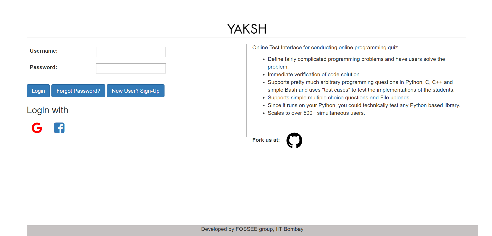
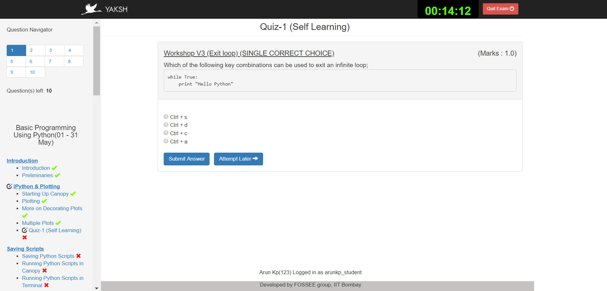
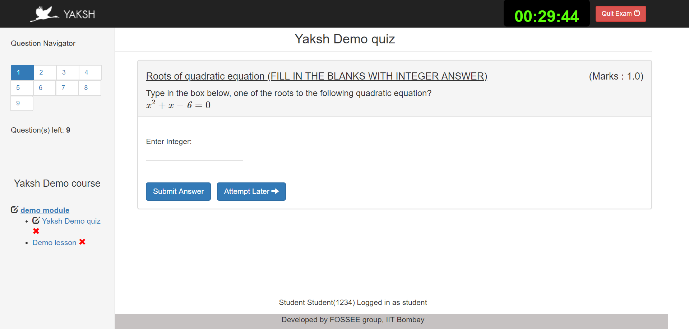
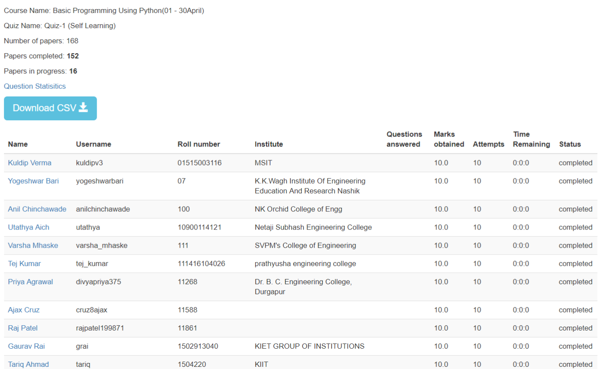

:author: Prabhu Ramachandran
:email: prabhu@aero.iitb.ac.in
:institution: Department of Aerospace Engineering
:institution: IIT Bombay, Mumbai, India
:corresponding:

:author: Prathamesh Salunke
:email: pratham920@gmail.com

:author: Ankit Javalkar
:email: ankitrj.iitb@gmail.com

:author: Aditya Palaparthy
:email: aditya94palaparthy@gmail.com

:author: Mahesh Gudi
:email: mahesh.p.gudi@gmail.com

:author: Hardik Ghaghada
:email: hardy_the1@yahoo.com

--------------------------------------
Yaksh: Facilitating Learning by Doing
--------------------------------------

.. class:: abstract

    Yaksh is a free, and open-source online evaluation platform. At its core,
    Yaksh focuses on problem-based learning and lets teachers create practice
    exercises and quizzes which are evaluated in real-time. With a large array
    of question types like multiple choice, fill-in-the-blanks, assignment
    upload and assertion or standard I/O based programming questions
    available, Yaksh supports Python, C, C++, Java, Bash and Scilab
    programming languages. In addition, Yaksh allows teachers to create
    full-blown courses with video and/or markdown text-based lessons. Yaksh is
    designed to be secure, easily deployable, and can scale-up to 500+ users
    simultaneously.

Introduction
-------------

Yaksh_ is created by the `FOSSEE Python team`_. The `FOSSEE project`
(http://fossee.in) based at IIT Bombay, is funded by the Ministry of Human
Resources and Development, MHRD (http://mhrd.gov.in) of the Government of
India. The goal of the FOSSEE project is to increase the adoption of Free and
Open Source Software in Education in India. The project started in 2009 and
develops, and promotes a variety of open source projects. FOSSEE's Python
group attempts to promote the adoption of Python in India. More details on the
activities of the Python group of FOSSEE have been presented earlier at SciPy
2016 [PR2016]_. Yaksh was described briefly there. However, Yaksh has evolved
considerably in the last few years. It has been used for several courses at
IIT Bombay as well as online. Yaksh provides a simple interface to host a MOOC
and we discuss this feature as well.

As part of FOSSEE's efforts we have created learning material for Python and
have conducted hundreds of workshops on Python. We find that to effectively
train people to learn to program, it is imperative to make them solve
programming problems.  Yaksh_ has been created by FOSSEE for this purpose.

.. _`FOSSEE Python team`: https://python.fossee.in
.. _`FOSSEE project`: https://fossee.in
.. _Yaksh: https://github.com/FOSSEE/online_test

The FOSSEE project is based out of IIT Bombay and promotes the use of various
open source packages in order to help eliminate the use of proprietary
packages in the curriculum.

Overview of Yaksh
---------------------

Since the emergence of learning management system (LMS) and massive open
online course (MOOC) providers, e-learning has grown significantly. Despite
the ever increasing adopters, major platforms still use simple question types
like multiple-choice questions and uploading of assignments from students as a
means to evaluate students' performance. Yaksh seeks to improve on this.

It is well known that practice assignments and problem solving improve
understanding. In the case of programming languages, this is especially so.
Programming is a skill and to develop it, one must necessarily write programs.
By providing an interface where users can attempt a question and immediately
obtain feedback on the correctness of their program would be very useful both
to a student and also to a teacher. This same interface could also be used to
assess the performance of the student and assess how much the student has
understood. This is useful for the student to understand where they can
improve and to the teacher to find out which concepts are not properly
understood by the students. In the Indian context, a recent study [AM2017]_
that even though there are many graduates from a computer science background,
that only 5% of the students are able to write the correct logic for the
program. Indeed, our own experience is that many students learn computer
science theoretically without writing too many computer programs. It is
therefore important to provide a tool that facilitates practice programming
and programming assessment.

In 2011, the first version of Yaksh was developed to administer programming
quizzes for an online teacher training course that FOSSEE conducted. More than
600 teachers were trained and we wanted them to be able to write programs and
have those corrected. This work was presented in at SciPy India 2011 [PR11]_.
It would have been impossible to do this manually.

Yaksh is a free, and open-source online evaluation software that allows
teachers to create courses and students to watch lessons and attempt tests
which are evaluated immediately. Yaksh is designed to be used by a large
number of users concurrently thereby making it apt for using in schools,
colleges and other educational institutes for training a large number of
students.

Yaksh is implemented in Python and uses Django
(https://www.djangoproject.com/). It is also written as a pip-installable
Django app, thus allowing other Django based web projects to install the app
within their project. The sources are available from:
https://github.com/FOSSEE/online_test

To use Yaksh, one could sign-up on the official https://yaksh.fossee.in
website or host it on one's own servers. The most standard and secure way to
deploy Yaksh on a server is to build separate docker images using docker
compose. Instructions for this are available in the yaksh sources and are easy
to setup.

For teachers, Yaksh provides a wide array of question types which include the
basic question types like multiple choice, fill-in-the-blanks, assignment
upload, etc. One can also add standard I/O and assertion test cases based
questions for simple and basic programming questions. Also, for complex
programs, teachers can add a hook-based test case which would enable them to
take the student answer and evaluate it in whatever way they want. Once the
questions are created, they can create a question paper that can be added to a
practice exercise or a quiz. The question paper can have a mixed set of fixed
questions or a random set of questions selected from a pool of questions. In
conjunction with quizzes, teachers can also add video or markdown text-based
lessons. With that, teachers can also monitor students real time during a
test, as well as their overall progress for the course, there by gaining
insight on how students are performing.

Yaksh is designed to be easy-to-use by a student. All they have to do is
sign-up, enroll for a course and start. They could go through the lessons,
practice a few questions and then attempt the quiz, on which their performance
is rated. While doing so, they get easy to understand feedback for their
answers from the interface, thereby improving their answers.

Yaksh is being used extensively by the FOSSEE team to teach Python to many
students all across India. Over 3000 students have used the interface to learn
Python. It has been used in several courses taught at IIT Bombay and also for
conducting recruitment interviews internally.

In this talk we first demonstrate yaksh and then discuss its features and
implementation. We show an example of a complete Python course that we host at
FOSSEE using yaksh.

Yaksh is created and maintained by the Python team at FOSSEE
(http://fossee.in), based at IIT Bombay. Yaksh is completely free and
open-source, distributed under BSD license. The source code can be found
https://github.com/FOSSEE/online_test/

   The Yaksh application login screen with a video on how one can use
   it. :label:`fig:yaksh-login`

   The interface for a multiple-choice question on
   yaksh. :label:`fig:yaksh-mcq`

.. figure:: yaksh_coding.png
   :scale: 30%
   :height: 920
   :width: 1893
   :alt: Code interface

   The interface for a programming question on yaksh. :label:`fig:yaksh-code`

   The interface for a fill in the blank question on yaksh. :label:`fig:yaksh-fill`

   The moderator interface for monitoring student progress during an exam on
   yaksh. :label:`fig:yaksh-monitor`

Fig. :ref:`fig:yaksh-login` shows the login screen for Yaksh.

Fig. :ref:`fig:yaksh-mcq` shows the interface for an MCQ question.

Fig. :ref:`fig:yaksh-code` shows the interface for a programming question.

Fig. :ref:`fig:yaksh-fill` shows the interface for an Fill in the blank question.

Fig. :ref:`fig:yaksh-monitor` shows a typical moderator interface while
monitoring a running quiz.

Installation and setup
~~~~~~~~~~~~~~~~~~~~~~

Deployment of a web application for temporary use as well as for production should be as easy as possible. There are a couple of different ways of setting up Yaksh:

- Set up a trial instance with Docker
- Set up a trial instance without Docker
- Set up a production instance using Docker and Docker compose.

The deployment procedure has been boiled down to a limited number of commands using the 'invoke' python package to make the deployment as easy as possible.

Prerequisites:

1. Ensure that Python is available.
2. Ensure `pip <https://pip.pypa.io/en/latest/installing.html>`__ is
   installed.
3. Ensure Docker is installed

Installation:

1. Install yaksh

   -  Clone the repository

      ::

          $ git clone https://github.com/FOSSEE/online_test.git

   -  Go to the online\_test directory

      ::

          $ cd ./online_test

   -  Install the dependencies

      -  For Python 2 use:

         ::

             $ pip install -r ./requirements/requirements-py2.txt

      -  For Python 3 (recommended) use:

         ::

             $ pip install -r ./requirements/requirements-py3.txt

Quickstart:

This setup method allows a user to setup a local instance of Yaksh to try the platform for a limited number of users.

1. Start up the code server that executes the user code safely:

   -  To run the code server in a sandboxed docker environment, run the
      command, this method is recommended:

      ::

          $ invoke start

   -  Make sure that you have Docker installed on your system
      beforehand. `Docker
      Installation <https://docs.docker.com/engine/installation/#desktop>`__

   -  To run the code server without docker, locally use:

      ::

          $ invoke start --unsafe

   -  Note this command will run the yaksh code server locally on your
      machine and is susceptible to malicious code. You will have to
      install the code server requirements in sudo mode.

2. On another terminal, run the application using the following command:

   ::

       $ invoke serve

   -  *Note:* The serve command will run the django application server
      on the 8000 port and hence this port will be unavailable to other
      processes.

3. Open your browser and open the URL ``http://localhost:8000/exam``

4. Login as a teacher to edit the quiz or as a student to take the quiz
   Credentials:

   -  Student - Username: student \| Password: student
   -  Teacher - Username: teacher \| Password: teacher

5. User can also login to the Default Django admin using;

   -  Admin - Username: admin \| Password: admin

Production Setup with Docker:

1. Clone this repository and cd to the cloned repo.

   ::

       $ git clone  https://github.com/FOSSEE/online_test.git

2. Rename the ``.sampleenv`` to ``.env``

3. In the ``.env`` file, uncomment the following and replace the values (please keep the remaining settings as is);

   ::

       DB_ENGINE=mysql # Or psycopg (postgresql), sqlite3 (SQLite)
       DB_NAME=yaksh
       DB_USER=root
       DB_PASSWORD=mypassword # Or the password used while creating a Database
       DB_PORT=3306

4. Install `Docker Compose <https://docs.docker.com/compose/install/>`__

5. Rename the ``.sampleenv`` to ``.env``

6. In the ``.env`` file, uncomment all the values and keep the default values as is.

7. Go to the ``docker`` directory where the project is located:
   
   ::

       cd /path/to/online_test/docker

8. Build the docker images

   ::

       invoke build

9. Run the containers and scripts necessary to deploy the web
   application

   ::

       invoke begin

10. Make sure that all the containers are ``Up`` and stable

   ::

       invoke status

11. Run the containers and scripts necessary to deploy the web
   application, ``--fixtures`` allows you to load fixtures.

   ::

       invoke deploy --fixtures

12. Stop the containers, you can use ``invoke restart`` to restart the containers without removing them

   ::

       invoke halt

13. Remove the containers

   ::

       invoke remove

14. You can use ``invoke --list`` to get a list of all the available commands

The demo course/exams
~~~~~~~~~~~~~~~~~~~~~

Yaksh allows moderators to create a Demo Course by clicking on the 'Create Demo Course' button available on the dashboard.

This actions sets up a Demo Course and associated Modules, Lessons, Quizzes and Questions.

Basic features
---------------

- For a student.
  - The generic interface and how quizzes etc. are taken.

- For an instructor

  - Different question types, their use.
  - Stdio
  - Assertion
  - Philosophy of allowing multiple submissions to make it easier.
  - Assignment upload.

Internal design
~~~~~~~~~~~~~~~

Yaksh has two important modules:-

- Web server

  A django server for client interaction.

- Code server

  A tornado server for code evaluation.

Web Server
----------

Django is a high-level Python Web framework. Django makes it is easy to create web applications, handles basic security issues, provides basic authentication system.

For client interaction we need to focus on some areas i.e.

- How to store the information
- How a user interacts with the system

To store the information we need a database. Django provides Object-relational mapping(ORM) which makes it easy to interact with the database instead of traditional SQL query approach.

Django has a view controller to handle all the requests sent from the client side.
A view then interacts with the database if any database data is required, collects all the data and sends the data to the templates which is then rendered for the client.

Code Server
-----------

Code Server is an important part of yaksh. All the code evaluations are done through code server.
We have used Tornado web framework for asynchronous process generation.
Tornado is a Python web framework and asynchronous networking library. Tornado generates a code server process queue depending on the number of code server processes. This queue is used to keep track of the code server processes. Once a process finishes its job it is dequeued.

A settings file is provided which contains information such as:

- number of code server processes required to process a code (defaults to 5).
- server timeout if a code runs too long then server times out with the specified time (defaults to 4 seconds).
- dictionary of code evaluators based on programming language of a question i.e. Python, Cpp, Java etc and test case type i.e. Standard Assert, Standard Input/Output, Hook based test case.

Code Server consists of several modules:

- Grader
- Language Registry
- Evaluators

Code Server takes metadata in json format.
Json metadata includes programming language, user answer, files(if any for file based questions), test case data i.e. test case type and test cases.

**Grader**

Code server sends all the metadata to the Grader. Grader gets the evaluator from the metadata 
i.e. the evaluator which will evaluate the code.

**Language Registry**

The evaluator instance in Grader is provided by Language Registry.
Language Registry takes question programming language type and test case type and generates a evaluator instance using the dictionary mapping from settings file and returns the evaluator instance to the Grader.

**Evaluators**

Evaluators are selected based on the programming language and test case type set during the question creation.

For ex. say *python* language and *standard assert* test case type are set during question creation, then python assertion evaluator is used for evaluating python code.

For each programming language and test case type separate evaluator classes are available.

Each evaluator class subclasses BaseEvaluator.
The BaseEvaluator class includes common functionality such as running a code using python subprocess, creating a file and writing user code in the file, setting the file as executable.

Several important aspects handled in code evaluation:

- Sandboxing

  A code might be malicious i.e it might contain instructions which can access the system information and can harm the system. To avoid such situation, all the code server process run as a nobody so that the code does not damage the system.

- Handling infinite loops.

  In a code, due to improper condition in loops there are chances that it might run infinitely.
  To avoid this, code is executed within a specific time limit. If the code execution is not finished in the specified time, a signal alarm is triggered to stop the code execution sending a message to the user that code might contain an infinite loop.

- Docker.

  To make the code evaluation more secure all the code evaluation are done inside docker.
  Docker can also be used to limit the use of system resources such as cpu utilization, memory utilization etc.

- Logging of the answers.

Supporting a new language
~~~~~~~~~~~~~~~~~~~~~~~~~

Adding a new language is easy. In the settings file you need to add mapping for the evaluator corresponding to the language. An example is shown below

.. code-block:: python

   code_evaluators = {
    "python": {"standardtestcase": "yaksh.python_assertion_evaluator.PythonAssertionEvaluator",
               "stdiobasedtestcase": "yaksh.python_stdio_evaluator.PythonStdIOEvaluator",
               "hooktestcase": "yaksh.hook_evaluator.HookEvaluator"
               },
    "new_language": {
                "standardtestcase": "yaksh.new_language_assertion_evaluator.New_languageAssertionEvaluator",
                "stdiobasedtestcase": "yaksh.new_language_stdio_evaluator.New_languageStdIOEvaluator",
                "hooktestcase": "yaksh.hook_evaluator.HookEvaluator"
               }
              }

In the given example 

python is the programming language.

standardtestcase, stdiobasedtestcase, hooktestcase are the test case type which are mapped to corresponding evaluator class. Here yaksh is the directory, python_assertion_evaluator is the file and PythonAssertionEvaluator is the class which contains evaluation related code.

Separate evaluator files need to be created for all the test case types except hook test case.

An evaluator class should have four methods __init__, teardown, compile_code and check_code.

- __init__ method is used to extract all the metadata such as user answer, test cases, files (if any for file based questions), weightage (float value), partial_grading (boolean value).
- teardown method is used to delete all the files that are not relevant once the execution is done.
- All the code compilation task will be done in compile_code method. No need to add this method if there is no compilation procedure.
- All the code execution task will be done in check_code method. This method should return three values.

  - success (Boolean value) - indicating if code was executed successfully, correctly
  - weight (Float value) - indicating total weight of all successful test cases
  - error (String value) - error message if success is false

Yaksh models
-------------

A model is a Python class that subclasses django.db.models.Model representing the database table.
Each attribute of the model represents a database field.

Model classes for yaksh are as follows:

- User
  
  This is the default model provided by django for storing username, first name, last name, password etc.

- Profile

  This model consists of user information such as institute, roll number, department etc and a OnetoOne relation with the user model to associate the profile with the specific user.

- Question

  This model consists of question information such as description, points, language etc and a foreign key relation with the user model so that each question is associated with a specific user.

- TestCase
  
  This model contains foreign key relation to the Question model and the test case type.

  Different test case models are available which subclasses the TestCase model. They are:

  - StandardTestCase
  - StdIOBasedTestCase
  - McqTestCase
  - HookTestCase
  - IntegerTestCase
  - StringTestCase
  - FloatTestCase
  - ArrangeTestCase

- Course
  
  This model contains course information such as course name, enrollment type (open enrollment or enrollment request), start time and end time for course enrollment etc.

  This model has ManytoMany relation with user model to store enrolled students, requested students, rejected students and ManytoMany relation with LearningModule model to store learning modules.

- Quiz
  
  This model contains quiz information such as start time, end time of the quiz, quiz duration,
  quiz creator, passing percentage etc.

- QuestionPaper
  
  This model contains foreign key association with the quiz. This model also has ManytoMany relation with questions i.e fixed questions added to the questionpaper, random questions set to be added to the questionpaper. Along with that it also has total marks etc.

- AnswerPaper
  
  This model contains information such as user, questions, question paper, course, start time, end time, marks obtained, pass status (boolean) etc.

- Answer
  
  This model contains information such as question to which user answered, user answer, error message, marks, correct etc.

- Lesson

  A lesson can be any markdown text with/or an embedded video of a particular topic.

  This model contains lesson information such as lesson name, description (markdown text) and
  foreign key association with user model.

- LearningUnit
  
  A learning unit can either be a lesson or a quiz.

  This model contains lesson, quiz, order i.e order in which the units will be added to the learning module, check prerequisite i.e. check if previous unit is completed this is required once the unit is added to a learning module.

- LearningModule

  A learning module contains learning units.

  This model contains module information such as name, description (markdown text), order i.e order in which the modules will be added to the course.

**Note:** order attribute in LearningUnit and LearningModule models indicates the order of appearance of a unit or a module.

Use of docker.

An example of interfacing yaksh on the ST website.

Additional plugin app support.

Import and export.

API?

Some experiences using yaksh
~~~~~~~~~~~~~~~~~~~~~~~~~~~~~~

- Usage in the internal courses at IIT, AE 102, SDES etc.

- Usage for hiring!

- Usage for practice

- Usage for full MOOC course

Plans
~~~~~~

New features planned.

Things already under way.

Other features we are thinking of.

Conclusions
------------

Acknowledgments
----------------

FOSSEE would not exist but for the continued support of MHRD and we are
grateful to them for this. This work would not be possible without the efforts
of the many FOSSEE staff members. The past and present members of the project
are listed here: http://python.fossee.in/about/ the author wishes to thank
them all.

References
-----------

.. [PR2016] Prabhu Ramachandran, Spreading the Adoption of Python in India: the
    FOSSEE Python Project", Proceedings of the 15th Python in Science
    Conference (SciPy 2016), July 6-12, 2016, Austin, Texas, USA.
    http://conference.scipy.org/proceedings/scipy2016/prabhu_ramachandran_fossee.html

.. [kmm14] Kannan Moudgalya, Campaign for IT literacy through FOSS and Spoken
    Tutorials, Proceedings of the 13th Python in Science Conference, SciPy,
    July 2014.

.. [FOSSEE-Python] FOSSEE Python group website.  http://python.fossee.in, last
    seen on May 7 2018.

.. [PR11] Prabhu Ramachandran.  FOSSEE: Python and Education, Python
    for science and education, Scipy India 2011, 4th-11th December 2011,
    Mumbai India.

.. [AM2017] 95% engineers in India unfit for software development jobs,
    claims report.  http://www.aspiringminds.com/automata-national-programming-report
