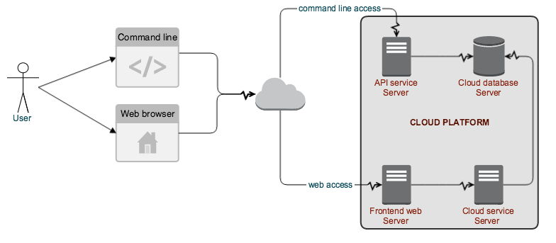

:author: Faical Yannick Palingwende Congo
:email: faical.congo@nist.gov
:institution: Blaise Pascal University

:video: http://www.youtube.com/watch?v=dhRUe-gz690

---------------------------------------------------------------
Building a Cloud Service for Reproducible Simulation Management
---------------------------------------------------------------

.. class:: abstract

   The notion of capturing each execution of a script and workflow and its
   associated meta-data is enormously appealing and should be at the heart of any
   attempt to make scientific simulations repeatable and reproducible.

   Most of the work in the litterature focus on the reproducibility requirements and the tools to acquire those meta-data. Yet, it is a great need to support the discoverabiliy of the meta-data produced and also to investigate on the content of what a reproducible simulation execution context is.

   In this paper we propose our investigation results into defining a reproducibility
   assessable record and the cloud infrastructure to support it. A use case example with sumata and docker is provided.

.. class:: keywords

   meta-data, simulations, repeatable, reproducible, sumatra, cloud.

Introduction
------------

Reproducibility is important because it is the cornerstone of scientific
advancement. Either done manually or automatically; reusability, refutability
and discovery are the key proprieties that make research results repeatable
and reproducible.

While most of the litterature focus on the terms [SlezakWaczulikova]_ (repeatable,
reproducible and replicable) and the technics of recording the simulation
meta-data [Oinn2000]_ (workflow, library, event control) [GuoCDE2011]_, there are less
contributions into cloud infrastructures to support these data. We think that
reproducibility at its current state is lacking a data driven presence in the
cloud. Version control is the proper example that we can refer to. Github [MacDonnell2012]_ and
Bitbucket [Delorenzo2015]_ are certainly the big names in the cloud arena for version control.
Many scientific project like SciPy [Oliver2013]_ got some interest and contribution
because of their exposure on github.

In this paper we are proposing a cloud platform to support data driven
simulation managment tools. We will discuss on the structure of a 
reproducibility assessable record structure. Then we will present the propose
Data driven cloud service. And finally show an integration use case with the
Data driven simulation management tool Sumatra [DavidsonSumatra2010]_.

A reproducible assessable record
--------------------------------

Defining what are the requirements that have to be recorded to better enforce
the reproducibility of a simulation has been a hot topic for some time and
still is. From more general approaches like defining rules [Goodman2013]_ that has
to be fulfilled [Sandve2013]_ to more specific approaches [Heroux2011]_ we can define a
set of data that are important to assess the reproducibility of a simulation.

The execution of a simulation involves five different components: The source
code or executable, the input files, the output files, the dependencies and
the hosting system. The source code or executable gives all the information
about what is the simulation, where it can be found and how it was run. The
input files represent all the files being loaded by the simulation during its
execution. The output files represent all the files that the simulation
produced during its execution. The dependencies are all the libraries and
tools that are needed by the simulation to run. The hosting system is the
system in which the simulation is being runned. These components can be
classified in two groups regarding repeatability as a goal. When trying to
repeat a simulation, the obvious variable components are: the dependencies and
the hosting system. We think of them as a cause of uncertainty in altering the
output file when the source code and inputs are still the same. To asses a
reproducibility property on a simulation as repeated, reproduced,
irrepeatable, irreproducible and unknown we classified scenarios in Table
:ref:`assesstable`. It consists of taking The source code, inputs and outputs
values of records and assessing the reproducibility case on the reference
record. We mean in this table by Same that the content is identical and by
Different that the content varied.

.. raw:: latex

   \begin{table*}

     \begin{longtable*}{|l|r|r|r|r|}
     \hline
     \multirow{2}{*}{Output Files} & \multicolumn{4}{c|}{Source Code and Input Files}\tabularnewline
     \cline{2-5}
      & Same and Same & Same and Different & Different and Same & Different and Different\tabularnewline
     \hline
     Same  & Repeatable & Reproducible & Reproducible & Reproducible\tabularnewline
     \hline
     Different & Irrepeatable & Unknown & Unknown & Unknown\tabularnewline
     \hline
     \end{longtable*}

     \caption{Reproducibility assessment based on source code, inputs and outputs \DUrole{label}{assesstable}}

   \end{table*}

One of the great challenges of making a computation repeatable and
reproducible is to be able to recreate the exact execution context as when the
simulation was done. Sometimes even from the same computer a library upgrade
can have terrible and not easy to determine consequences. We think that
containers based systems [Bottomley2014]_ are a possible solution to ensure the
consistency of the operating system and dependencies on which the simulation
runs [Melia2014]_. Building a container that will deliver a runnable image in which the
simulation execution is well scoped and known will ensure that accross
machines and platforms we get closer to a consistent execution environment.

We propose as following, a set of four models that combined together should be
necessary to deliver a reproducible simulation record storage. We show here a
project model in Table :ref:`projecttable` which most interesting field is
*history*.

.. table:: Simulation Meta-Data Project Model. :label:`projecttable`

   +--------------+-------------------------------------------+
   | Fields       | Descriptions                              |
   +==============+===========================================+
   | created      | string: simulation creation timestamp.    |
   +--------------+-------------------------------------------+
   | scope        | string: privacy choice: public or private.|
   +--------------+-------------------------------------------+
   | name         | string: project name.                     |
   +--------------+-------------------------------------------+
   | description  | string: full description of the project.  |
   +--------------+-------------------------------------------+
   | goals        | string: project goals.                    |
   +--------------+-------------------------------------------+
   | status       | string: open, close, terminate, pause.    |
   +--------------+-------------------------------------------+
   | owner        | user: the creator of the project.         |
   +--------------+-------------------------------------------+
   | history      | list: container images list.              |
   +--------------+-------------------------------------------+
   | reprodegree  | double: degree of reproducibility.        |
   +--------------+-------------------------------------------+
   | repeadegree  | double: degree of repeatability.          |
   +--------------+-------------------------------------------+
   | irreprodegree| double: degree of irreproducibility       |
   +--------------+-------------------------------------------+
   | irrepeadegree| double: container images list.            |
   +--------------+-------------------------------------------+

It is the structure that describe the simulation project and its *history*
field is the list of container images that have been build each time that the
project source code changed. There are two ways of setting up the container.
In the first case, the container can be setup directly from the source code of
the simulation. In the second case, the container can be built from an empty
directory from which, the source code of the simulation will be pulled into.
In the second case, pulling down the source code will be considered as a step
in the image building process. This paper will provide examples of the first
case and we recommand as a remote source code pull can induce some
uncertanties. The last four properties are the degree of reproducibility
features. They are computed from all the records done in the project. We will
explain later what they mean, how we compute them and why they are important.
We also propose a container model that is as simple as shown in the Table
:ref:`containertable`.

.. table:: Simulation Meta-Data Container Model. :label:`containertable`

   +--------------+-------------------------------------------+
   | Fields       | Descriptions                              |
   +==============+===========================================+
   | created      | string: simulation creation timestamp.    |
   +--------------+-------------------------------------------+
   | system       | string: docker, rocket, ...               |
   +--------------+-------------------------------------------+
   | image        | string: path to the image in the cloud.   |
   +--------------+-------------------------------------------+

Based on the project's model in Table :ref:`assesstable`, we came up with a
record model shown in Table :ref:`recordtable`. A record is related to a
project but also has to reference the image that it has been executed from.
Thus the latest records from the same project source code e are done from the
latest project history image.

.. table:: Simulation Meta-Data Record Model. :label:`recordtable`

   +--------------+-------------------------------------------+
   | Fields       | Descriptions                              |
   +==============+===========================================+
   | created      | string: execution creation timestamp.     |
   +--------------+-------------------------------------------+
   | ended        | string: execution last update timestamp.  |
   +--------------+-------------------------------------------+
   | program      | dictionary: command, verison control,...  |
   +--------------+-------------------------------------------+
   | inputs       | list: input files.                        |
   +--------------+-------------------------------------------+
   | outputs      | list: output files.                       |
   +--------------+-------------------------------------------+
   | dependencies | list: dependencies.                       |
   +--------------+-------------------------------------------+
   | system       | dictionary: machine and os information.   |
   +--------------+-------------------------------------------+
   | project      | project: the simulation project.          |
   +--------------+-------------------------------------------+
   | image        | container: reference to the container.    |
   +--------------+-------------------------------------------+

Differently from the project reproducibilty features assessments based on its four
properties (reprod, repeat, irreprod, irrepeat), a record reproducibility
assesment is done through a differenciation process. A differentiation process
is a procedure that allows the resolution of a record reproducibilty feature
compared to another. In this case, the two records are considered being from
simulations that try to achieve the same goals. It is quite hard to assess at
a high level standpoint if two records are the same because it will most
likely be a domain related decision that prooves that both records support the
same claims. We can list three ways of tackling this problem. In the first
one, the records needs to be compared on a specific known metric. This metric
can either be propose by the targeted record owner or the requesting record
owner. If it is comming from the targeted record owner it can be automated as
it will give a precise answer to the differenciation with the requesting
record. If it is comming from the other side then the targeted request owner
need to validate the differenciation and give a final status. In the second
one, the records need to follow a standard structure depending on the domain
of simulation. Thus, based on standard differenciation methods in that domain
(error scalling, rounding, ...), the  differenciation can be done
automatically. These previous approaches are still to investigate into. We focus here in another, practical  and not optimal approach that is a manual and visual differenciation based on different methods that will be added
progressively. Thus, the differenciation will most likely be based on the
targeted record owner domain knowledge and visual assessment. 

A differenciation request or shortly 'diff request' is the 'contract' on which
the mechanism described before runs. A requesting record owner ask a targeted
record owner to validate a record reproducibility proposal from him. In this
mechanism, the requesting party has to define on what the assessement is base:
repeated, reproduced, irreproduced and irrepeated. This party also has to
define the base differenciation methode on which the assessement has been
made: default, visual, custom. These methodes are based on the third approach cited
before. A default diff is a leveinstein based diff on the text  data. A visual
one is a knowledge based assessment and custom is left to the requester to
define and propse to the targeted. The targeted record owner has then to
answer to the request by setting after verification, the status of the request
to agreed or denied. By default the status is at proposed. The table
:ref:`requesttable` represents the fields that a diff request should contain.
In fact one may say that in a model level a solved diff request is a
relationship of reproducibility assessment between two records.

.. table:: Simulation Record Differenciation Request Model. :label:`requesttable`

   +--------------+-------------------------------------------+
   | Fields       | Descriptions                              |
   +==============+===========================================+
   | created      | string: request creation timestamp.       |
   +--------------+-------------------------------------------+
   | sender       | user: responsible of the request.         |
   +--------------+-------------------------------------------+
   | toward       | record: targeted record.                  |
   +--------------+-------------------------------------------+
   | from         | record: requesting record.                |
   +--------------+-------------------------------------------+
   | diff         | dictionary: method of differenciation.    |
   +--------------+-------------------------------------------+
   | proposition  | string: repeated,reproduced,irrepeated,...|
   +--------------+-------------------------------------------+
   | status       | string: agreed,denied,proposed.           |
   +--------------+-------------------------------------------+

In a database of records, the graph of reproduciblity assessment relationships
can give interesting information about a record like: the number of repeated,
reproduced, irreproduced, irrepeated records. Then an extraction from the
variables can allow the determination of source of irrepeatability and
irreproducibility. It is also interesting to see at a project level that all
the records refering to it will allow the determination of the four type of
reproducibility features assessment  degrees:

.. math::
   :label: repeadegree

   Repeatability(Project) = \frac{sum_{i=1}^{i=NRepeat} isRecord_i(Project)}{sum_{i=1}^{i=NTotal} isRecord_i(Project)}

.. math::
   :label: reprodegree
   
   Reproducibility(Project) = \frac{sum_{i=1}^{i=NReprod} isRecord_i(Project)}{sum_{i=1}^{i=NTotal} isRecord_i(Project)}

.. math::
   :label: irrepeadegree
   
   Irrepeatability(Project) = \frac{sum_{i=1}^{i=NIrrepeat} isRecord_i(Project)}{sum_{i=1}^{i=NTotal} isRecord_i(Project)}

.. math::
   :label: irreprodegree
   
   Irreproducibility(Project) = \frac{sum_{i=1}^{i=NIrreprod} isRecord_i(Project)}{sum_{i=1}^{i=NTotal} isRecord_i(Project)}

Where:

.. raw:: latex

    \begin{itemize}
      \item $NRepeat$ is the number of repeated records.
      \item $isRecord_i$ tests if the record $i$ belongs to Project.
      \item $NReprod$ is the number to total records.
      \item $NIrrepeat$ the number of reproduced records.
      \item $NIrreprod$ the number of irrepeatable records.
    \end{itemize}

Data Driven Cloud Service Platform
----------------------------------

   Platform Architecture. :label:`paltformfig`

To support simulation management tools meta-data, we are proposing a cloud
platform that implements the reproducible assessable record described
previously. This platform that has two sides. As shown in the Figure
:ref:`paltformfig`, a REST API access and a Web Frontend access. All those two
accesses communicate at the most end with a MongoDB database [#]_ that
contains: the user accounts, the projects, the records, the containers and the
differenciation requests. Depending on the type of access, the user has  a
specific set of actions he can do.

The REST API service exposes endpoints that are accessible with the
Simulation management tool from the executing machine. It is a token based
credential access that can be activated and renewed only from the Web Frontend
access. The REST API allows the Simulation Management tools to push, pull and
search for projects and records. The REST API documentation will be available
publically and will present the endpoints, HTTP methods and the mendatory fields
in the structured JSON[#]_ format envelope.

The Web Frontend service on the other end is controlled by the Cloud service.
The Cloud service is accessible only by the Web Frontend. Thus when the user
interacts with the Web Frontend he is actually securely interacting with the
Cloud service. This strongly coupled design allows a flexible deployment and 
evolution but at the same time harden the security of the platform. This access
allows the user to manage his account, handle his API credentials that are used
by the Simulation Management tool to communicate with the REST interfaces.
It also allows the user to visualize his projects, records and requests. It is
the only place where the user can update some content. 

On the platform, the REST API is the only place where projects and records
are automatically created. On the Web side this is still possible but it is 
a manual process. Differenciation requests on the other end can only be created
and resolved from the Web Frontend access.

A Simulation tool that needs to interact with our platform has to follow the 
endpoints descriptions in Tables :ref:`projendtable` and :ref:`recoendtable`.
Since the differenciation request handling is not accessible from the API,
there is no endpoint for that.

.. raw:: latex

   \begin{table*}

     \begin{longtable*}{|l|r|r|r|r|}
     \hline
     \multirow{2}{*}{Endpoint} & \multicolumn{2}{c|}{Content}\tabularnewline
     \cline{2-3}
      & Methode & Envelope\tabularnewline
     \hline
     $/api/v1/<api-token>/project/pull/<project-name>$  & GET & null\tabularnewline
     \hline
     $/api/v1/<api-token>/project/push/<project-name>$ & POST & name, description, goal and custom\tabularnewline
     \hline
     \end{longtable*}

     \caption{REST Project endpoints \DUrole{label}{projendtable}}

   \end{table*}

.. raw:: latex

   \begin{table*}

     \begin{longtable*}{|l|r|r|r|r|}
     \hline
     \multirow{2}{*}{Endpoint} & \multicolumn{2}{c|}{Content}\tabularnewline
     \cline{2-3}
      & Methode & Envelope\tabularnewline
     \hline
     \hline
     $/api/v1/<api-token>/record/push/<project-name>$ & POST & program, inputs, outputs, dependencies, system and custom\tabularnewline
     \hline
     \end{longtable*}

     \caption{REST Record endpoints \DUrole{label}{recoendtable}}

   \end{table*}

.. [#] An Agile, Scalable NoSQL Database: https://www.mongodb.org/ 
.. [#] A Data-Interchange format: http://json.org/ 

Integration with Sumatra and Use Case
-------------------------------------

*Sumatra Integration*

Sumatra is an open source event based simulation management tool.
To integrate our cloud API into sumatra we have to briefly investigate
how Sumatra store the meta-data that it records.

To store records about simulations, Sumatra implements record stores. It also
has data stores that allows the storage of the simulation results. As of today,
Sumatra provides three data storage options:

.. raw:: latex

    \begin{itemize}
      \item FileSystemDataStore: It provides methods for accessing files stored on a local file system, under a given root directory.
      \item ArchivingFileSystemDataStore: It provides methods for accessing files written to a local file system then archived as .tar.gz.
      \item MirroredFileSystemDataStore: It provides methods for accessing files written to a local file system then mirrored to a web server.
    \end{itemize}

Sumatra also provides three ways of recording the simulation meta-data:

.. raw:: latex

    \begin{itemize}
      \item ShelveRecordStore: It provides the Shelve based record storage.
      \item DjangoRecordStore: It provides the Django based record storage (if Django is installed).
      \item HttpRecordStore: It provides the Http based record storage.
    \end{itemize}

Regarding the visualization of the meta-data from a simulation, Sumatra
provides a tool namely smtweb. It is a django local web app that provides a
web view to the project folder that it has been run from within.
For a simulation management tool like Sumatra there are many advantages in
integrating a cloud platform into its record storage options. We can cite:

.. raw:: latex

    \begin{itemize}
      \item Local Storage irrelevance: There is no need to store the data locally they can be pushed to the cloud.
      \item Complexity reduction: There is no need for a local record viewer. The scientist can have access to his record anytime and anywhere.
      \item Discoverability enhancement: Everything about a simulation execution is a click away to be publicly shared.
      \item Better scope: The team can fully focus on improving the event control based recording process.
    \end{itemize}

As presented, Sumatra already has a http based record store available. Yet it
does not suite the requirements of our cloud platform. Firstly because there
is no automatic mechanism to push the data in the cloud. The
MirroredFileSystemDataStore has to be fully done by user. Secondly we think
there is need for more atomicity. In fact, Sumatra gather the meta-data about
the execution and store it at the end of the execution, which can have many
disavantages generaly when the simulation process dies or the sumatra instance
dies.

To integrate the cloud API and fully comply to the simple requirement just
cited we had to implement and update some parts of the Sumatra source code:

.. raw:: latex

    \begin{itemize}
      \item DataStore: Currently the collect of newly created data happens a the end of the execution. This creates many issues regarding concurrent runs of the same projects because the same files are going to be messed up with. We are investigating two alternatives. The first is about running the simulation in a labeled working directory. This way many runs can be done at the same time while having a private labeled space to write to. The second alternative consists of writing directly into the cloud. This will most likely break the
      already implemented data and record store paradigm. The both are being tested
      right now.
      \item RecordStore: We make the point that the simulation management tool is the one that should comply to as many API interfaces as possible to give the user as many interoperability as possible with cloud platform like cited here. Thus, we intend to provide a total new DdsmStore that will fully integrate our rest API to Sumatra.
      \item Recording Mechanism: In Sumatra the knowledge of the final result of the execution combines with atomic state monitoring of the process will allow us to have a live state of the execution. We modified the source code so that this information allong with any information that is available be pushed. An update endpoint on a record will be available to allow this. We want to make Sumatra record
      creation a dynamic 'on the time available data' recorder. In addition to a live monitoring, this case allows the scientist to have a basic information about its runs may they crash or not. 
    \end{itemize}

*Reproducibility instrumentation with Sumatra*

The sumatra repository [#]_ provides three test example projects. Our instrumentation
demo is based on the python one. This is the demo skeleton model that we propose
as a base line to make your simulation comply with the principles described here.
This one is for sumatra users and we are working on providing alternatives.

.. [#] https://github.com/open-research/sumatra.git

The demo is the encapsulation of the execution of a python simulation code main.py
with some parameter files. The instrumented project is organized as following:

.. raw:: latex

    \begin{itemize}
      \item Python main: It is the simulation main source code.
      \item Git ignore: It contains the files that will not be versioned.
      \item Requirements: It contains all the python requirements needed by the simulation.
      \item Dockerfile: It contains the sumatra docker container setup.
      \item Manage files: It allows the researcher to manage the container builds and
      the simulation executions.
    \end{itemize}

To instrument a simulation, the researcher has to follow some few steps:

.. raw:: latex

    \begin{itemize}
      \item Source code: The scientist may remove the script main.py and include his source code.
      \item Requirements: The scientist may provide the python libraries used by the simulation there.
      \item Dockerfile: This file contains sections that needs to be updated by the scienits such as: the git global paramaters and the simulation name at smt init.
      \item Management: In the manage files the researcher has to probably update the mapping data folder with docker. For example in the default case we are mapping the default.param file that is needed by the simulation.
    \end{itemize}

The scientist has to build the container every time that the source changes.
In this case a newly exported image will be available to be used by sumatra.
As described before, the changes that we are going to provide to sumatra will
require that the container image be pushed when there is a code change. After
a build a run will execute the simulation and create the associated record
that will be pushed to our cloud API. We will be providing more automated
process soon. The interesting part of such a design is that the record image
can be runned by any other scientist with the possibility to change the input
data. This allow reproducibility at an input data level. For source level
modification, the other scientist has to recreate an instrumented project. In
the manage script an API token mechanism is provided and will contain the
credentials required by sumatra to tap into our cloud API. The researcher will
have to put his own. In the case of a research that want to use the image, he
will have to manually provide the api key allong with running sumatra. A
further detailed documentation will be provided as soon as Sumatra is
integrated to our cloud infrastructure. The source code of the demo can be
found in my github SciPy proceeding repository [#]_ under the 2015 branch. It
has been tested on an ubuntu 15.04 machine and is supposed on any Linux or Osx
machine that has docker installed.

.. [#] https://github.com/faical-yannick-congo/scipy_proceedings.git

Conclusion and Perspective
--------------------------

Scientfic computational experiments through simulation is getting more support
to ehnance the reproducibility of research results. Execution meta-data
recording systems through event control, workflows and libraries are the
approaches that are investigated and quite a good number of software and tools
implement them. Yet the aspect of  discoverability of these results that are
experessed in a reproducible manner is still an unfulfilled need. This paper
proposes a cloud structure that can be easily integrated to the existing Data
Driven Simulation Management tools and allow: reproducibility assessements,
world wide web discoverability and sharing. We provided an integration use
case with Sumatra and explained how beneficial and useful it is for a Sumatra
user to link our cloud api account to the  Sumatra tool. This platform main
focus is to provide standard and generic ways for scientists to make some
differenciation procedures that will allow them to assess if a simulation is
repeatable, reproducible, irrepeatable, irreproducible or if its an ungoing
research. Some metrics have been provided to determine the degree of those
features from the atomic records during the executions of the simulation. A
differenciation request as been provided and is a sort of hand shake between
researchers regarding the result of two runs. One can request a
reproducibility accessement feature validation from a record against another
one. This allows another mode of collaboration.

We are under integration investigation for the most used tools in the
community. In the short term this platform will hopefully be where researchers
could clone the entire execution environment that another researcher did. And
from there be able to very the claims of the project and investigate other
execution on different data. The container based record described, we hope,
will allow a better standard environment control accross repeats and
reproductions, which is a very hard battle currently for all simulation
management tools. Operating System, Compilers and Dependencies variations are
the nightmare of reproducibility tools because the information is not fully
accessible and there is not usually an easy way to recreate the appropriate
environment.
 

References
----------

.. [SlezakWaczulikova] P. Slezák and I. Waczulíková. *Reproducibility and Repeatability*,
        Comenius University, July 2010.

.. [Oinn2000] Tom Oinn et al. *Taverna: Lessons in creating a workflow environment for the life sciences*, 
       Concurrency Computat.: Pract. Exper. 2000; 00:1-7 Prepared using cpeauth.cls [AtrVersion: 2002/09/19 v2.02].

.. [GuoCDE2011] Philip Guo. *CDE: A tool for automatically creating reproducible experimental software packages*,
       6th Year Ph.D. Student, Department of Computer Science, Standford University, 2011.

.. [MacDonnell2012] John MacDonnell. *Git for Scientists: A Tutorial*,
       July 2012.

.. [Delorenzo2015] Ike DeLorenzo. *Coding in the cloud with Bitbucket*,
       Frebruary 2015.

.. [Oliver2013] Marc Oliver. *Introduction to the Scipy Stack – Scientific Computing Tools for Python*,
       Jacobs University, November 2013.

.. [DavidsonSumatra2010] Andrew Davidson. *Automated tracking of computational experiments using Sumatra*,
       EuroSciPy 2010, Paris.

.. [Goodman2013] Alyssa Goodman. *10 Simple Rules for the Care and Feeding of Scientific Data*,
        Harvard University Seminar – What to Keep and How to Analyze It: Data Curation and Data Analysis with Multiple Phases, May 2013.

.. [Sandve2013] Sandve GK et al. *Ten Simple Rules for Reproducible Computational Research.*,
        PLoS Comput Biol 9(10): e1003285, October 2013.

.. [Heroux2011] Michael A. Heroux. *Improving CSE Software through Reproducibility Requirements*,
       Sandia National Laboratories; revised May 2011.

.. [Bottomley2014] James Bottomley. *What is All the Container Hype?*,
        Linux Foundation, April 2014.

.. [Melia2014] Ivan Melia et al. *Linux Containers: Why They'are in Your Future and What Has to Happen First*,
       Cisco and RedHat, C11-732571-00, September 2014