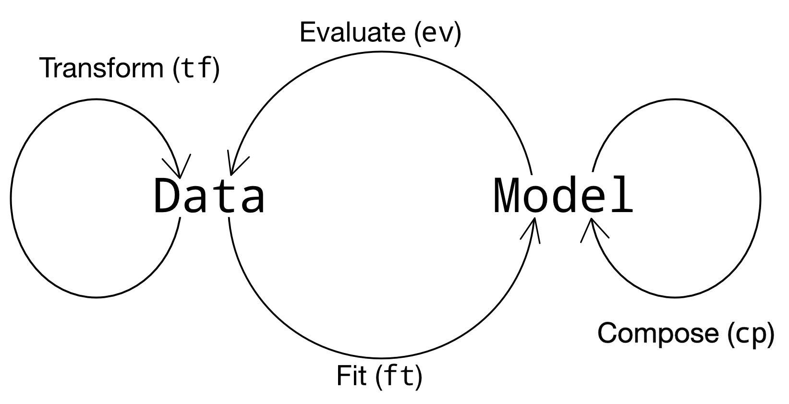
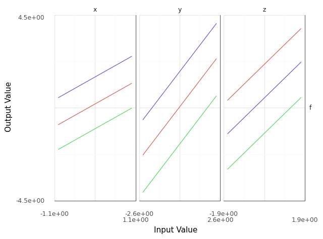
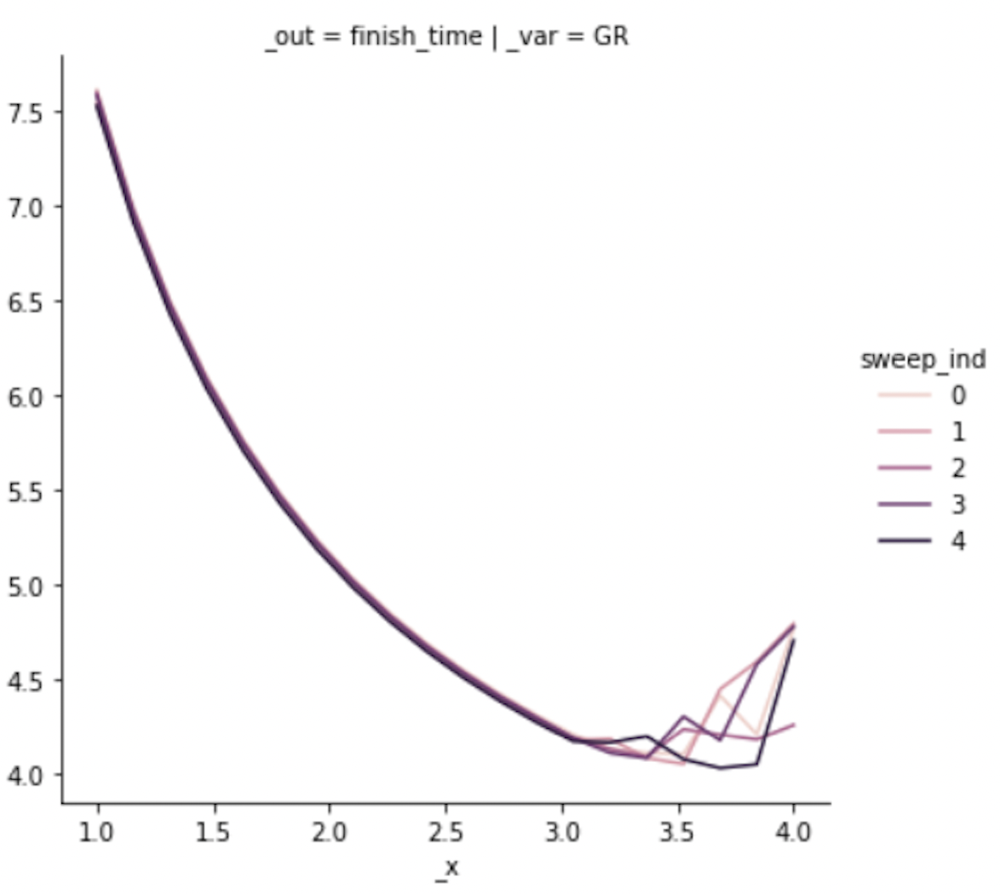
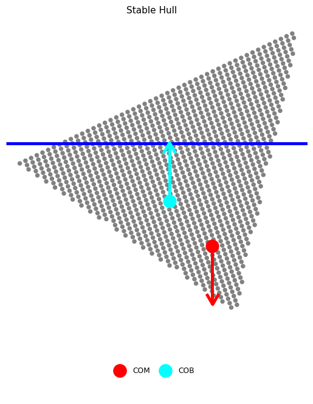
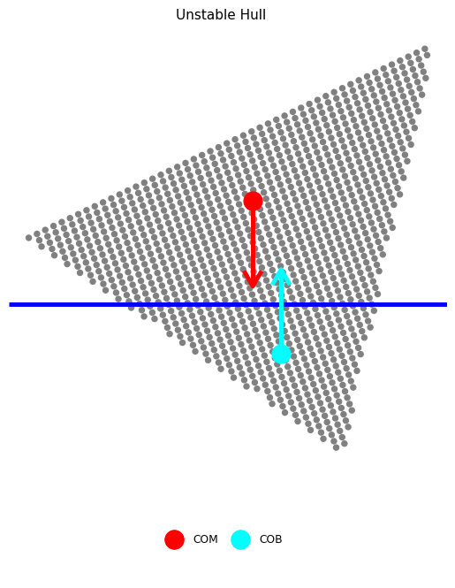
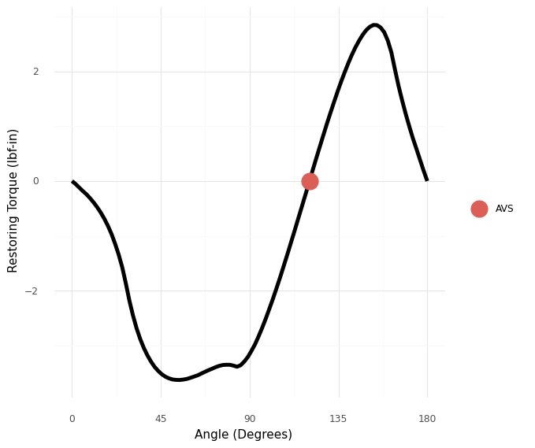
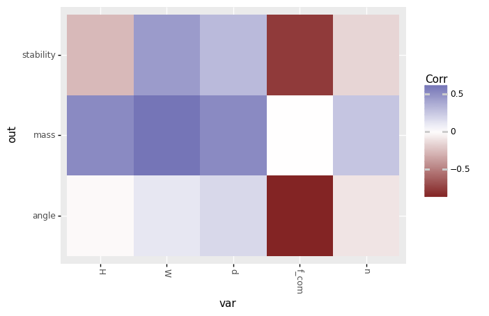
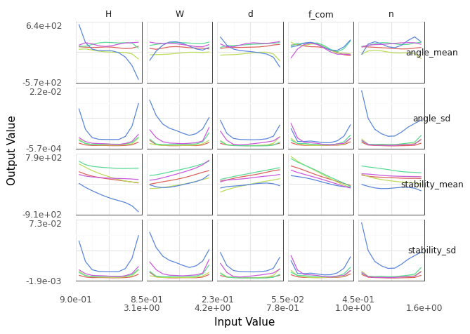
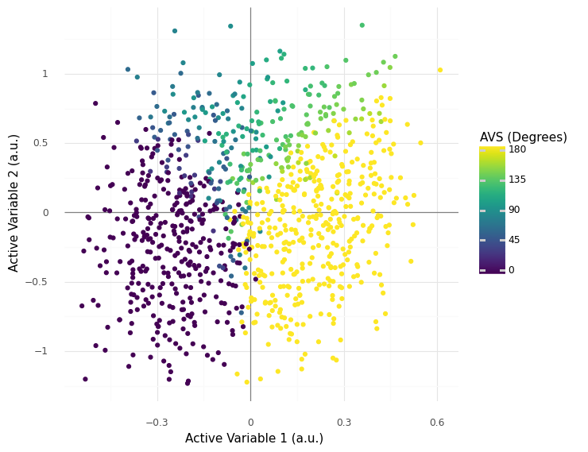

:author: Zachary del Rosario
:email: zdelrosario@olin.edu
:institution: Assistant Professor of Engineering and Applied Statistics, Olin College of Engineering

:bibliography: references

=====================================================================================
Enabling Active Learning Pedagogy and Insight Mining with a Grammar of Model Analysis
=====================================================================================

.. class:: abstract

Modern engineering models are complex, with dozens of inputs, uncertainties arising from simplifying assumptions, and dense output data. While major strides have been made in the computational scalability of complex models, relatively less attention has been paid to user-friendly, reusable tools to explore and make sense of these models. Grama is a python package aimed at supporting these activities. Grama is a grammar of model analysis: an ontology that specifies data (in tidy form), models (with quantified uncertainties), and the verbs that connect these objects. This definition enables a reusable set of evaluation "verbs" that provide a consistent analysis toolkit across different grama models. This paper presents three case studies that illustrate pedagogy and engineering work with grama: 1. Providing teachable moments through errors for learners, 2. Providing reusable tools to help users self-initiate productive modeling behaviors, and 3. Enabling *exploratory model analysis* (EMA)---exploratory data analysis augmented with data generation.

.. class:: keywords

   engineering, engineering education, exploratory model analysis, software design, uncertainty quantification

Introduction
============

Modern engineering relies on scientific computing. Computational advances enable faster analysis and design cycles by reducing the need for physical experiments; for instance, finite-element analysis enables computational study of aerodynamic flutter, and Reynolds-averaged Navier-Stokes simulation supports the simulation of jet engines---both of these are enabling technologies that support the design of modern aircraft :cite:`keane2005computational`. Modern areas of computational research include heterogeneous computing environments :cite:`mittal2015survey`, task-based parallelism :cite:`bauer2012legion`, and big data :cite:`sagiroglu2013big`. Another line of work considers the development of *integrated tools* to unite diverse disciplinary perspectives in a single, unified environment, e.g. the integration of multiple physical phenomena in a single code :cite:`esmaily2020benchmark` or the integration of a computational solver and data analysis tools :cite:`maeda2022integrated`. Such integrated computational frameworks are highlighted as *essential* for applications such as computational analysis and design of aircraft :cite:`slotnick2014cfd`. While engineering computation has advanced along the aforementioned axes, the conceptual understanding of practicing engineers has lagged in key areas.

Every aircraft you have ever flown on has been designed using probabilistically-flawed, potentially dangerous criteria :cite:`zdr2021allowables`. The fundamental issue underlying these criteria is a flawed heuristic for uncertainty propagation; initial human subjects work suggests that engineers' tendency to misdiagnose sources of variability as inconsequential noise may contribute to the persistent application of flawed design criteria :cite:`aggarwal2021qualitative`. These flawed treatments of uncertainty are not limited to engineering design; recent work by Kahneman et al. :cite:`kahneman2021noise` highlights widespread failures to recognize or address variability in human judgment, leading to bias in hiring, economic loss, and an unacceptably capricious application of justice.

Grama was originally developed to support model analysis under uncertainty; in particular, to enable *active learning* :cite:`freeman2014active`---a form of teaching characterized by active student engagement shown to be superior to lecture alone. This toolkit aims to *integrate* the disciplinary perspectives of computational engineering and statistical analysis within a unified environment to support a *coding to learn* pedagogy :cite:`barba2016computational`---a teaching philosophy that uses code to teach a discipline, rather than as a means to teach computer science or coding itself. The design of grama is heavily inspired by the Tidyverse :cite:`wickham2019welcome`, an integrated set of R packages organized around the 'tidy data' concept :cite:`wickham2014tidy`. Grama uses the tidy data concept and introduces an analogous concepts for *models*.

Grama: A Grammar of Model Analysis
==================================

Grama :cite:`zdr2020grama` is an integrated set of tools for working with *data* and *models*. Pandas :cite:`mckinney2011pandas` is used as the underlying data class, while grama implements a :code:`Model` class. A grama model includes a number of functions---mathematical expressions or simulations---and domain/distribution information for the deterministic/random inputs. The following code illustrates a simple grama model with both deterministic and random inputs [#]_.

.. [#] Throughout, :code:`import grama as gr` is assumed.

.. code-block:: python

		# Each cp_* function adds information to the model
		md_example = (
		    gr.Model("An example model")
		    # Overloaded `>>` provides pipe syntax
		    >> gr.cp_vec_function(
		        fun=lambda df: gr.df_make(f=df.x+df.y+df.z),
			var=["x", "y", "z"],
			out=["f"],
		    )
		    >> gr.cp_bounds(x=(-1, +1))
		    >> gr.cp_marginals(
		        y=gr.marg_mom("norm", mean=0, sd=1),
		        z=gr.marg_mom("uniform", mean=0, sd=1),
		    )
		    >> gr.cp_copula_gaussian(
		        df_corr=gr.df_make(
			    var1="y",
			    var2="z",
			    corr=0.5,
			)
		    )
		)

While an engineer's interpretation of the term "model" focuses on the input-to-output mapping (the simulation), and a statistician's interpretation of the term "model" focuses on a distribution, the grama model integrates both perspectives in a single model.

Grama models are intended to be *evaluated* to generate data. The data can then be analyzed using visual and statistical means. Models can be *composed* to add more information, or *fit* to a dataset. Figure :ref:`verbs` illustrates this interplay between data and models in terms of the four categories of function "verbs" provided in grama.

   Verb categories in grama. These grama functions start with an identifying prefix, e.g. :code:`ev_*` for evaluation verbs. :label:`verbs`

Defaults for Concise Code
-------------------------

Grama verbs are designed with sensible default arguments to enable concise code. For instance, the following code visualizes input sweeps across its three inputs, similar to a *ceteris paribus* profile :cite:`kuzba2019pyceterisparibus,biecek2020paribus`.

.. code-block:: python

		(
		    ## Concise default analysis
		    md_example
		    >> gr.ev_sinews(df_det="swp")
		    >> gr.pt_auto()
		)

This code uses the default number of sweeps and sweep density, and constructs a visualization of the results. The resulting plot is shown in Figure :ref:`example-sweep`.

   Input sweep generated from the code above. Each panel visualizes the effect of changing a single input, with all other inputs held constant. :label:`example-sweep`

Grama imports the plotnine package for data visualization :cite:`kibirige2021plotnine`, both to provide an expressive grammar of graphics, but also to implement a variety of "autoplot" routines. These are called via a dispatcher ``gr.pt_auto()`` which uses metadata from evaluation verbs to construct a default visual. Combined with sensible defaults for keyword arguments, these tools provide a concise syntax even for sophisticated analyses. The same code can be slightly modified to change a default argument value, or to use plotnine to create a more tailored visual.

.. code-block:: python

		(
		    md_example
		    ## Override default parameters
		    >> gr.ev_sinews(df_det="swp", n_sweeps=10)
		    >> gr.pt_auto()
		)

		(
		    md_example
		    >> gr.ev_sinews(df_det="swp")
		    ## Construct a targeted plot
		    >> gr.tf_filter(DF.sweep_var == "x")
		    >> gr.ggplot(gr.aes("x", "f", group="sweep_ind"))
		    + gr.geom_line()
		)

This system of defaults is important for pedagogical design: Introductory grama code can be made extremely simple when first introducing a concept. However, the defaults can be overridden to carry out sophisticated and targeted analyses. We will see in the Case Studies below how this concise syntax encourages sound analysis among students.

Pedagogy Case Studies
=====================

The following two case studies illustrate how grama is designed to support *pedagogy*: the formal method and practice of teaching. In particular, grama is designed for an active learning pedagogy :cite:`freeman2014active`, a style of teaching characterized by active student engagement.

Teachable Moments through Errors for Learners
---------------------------------------------

An advantage of a unified modeling environment like grama is the opportunity to introduce design *errors for learners* in order to provide teachable moments.

It is common in probabilistic modeling to make problematic assumptions. For instance, Cullen and Frey :cite:`cullen1999probabilistic` note that modelers frequently and erroneously treat the normal distribution as a default choice for all unknown quantities. Another common issue is to assume, by default, the independence of all random inputs to a model. This is often done *tacitly*---with the independence assumption unstated. These assumptions are problematic, as they can adversely impact the validity of a probabilistic analysis :cite:`zdr2021allowables`.

To highlight the dependency issue for novice modelers, grama uses error messages to provide just-in-time feedback to a user who does not articulate their modeling choices. For example, the following code builds a model with no dependency structure specified. The result is an error message that summarizes the conceptual issue and points the user to a primer on random variable modeling.

.. code-block:: python

		md_flawed = (
		    gr.Model("An example model")
		    >> gr.cp_vec_function(
		        fun=lambda df: gr.df_make(f=df.x+df.y+df.z),
			var=["x", "y", "z"],
			out=["f"],
		    )
		    >> gr.cp_bounds(x=(-1, +1))
		    >> gr.cp_marginals(
		        y=gr.marg_mom("norm", mean=0, sd=1),
		        z=gr.marg_mom("uniform", mean=0, sd=1),
		    )
		    ## NOTE: No dependency specified
		)
		(
		    md_flawed
		    ## This code will throw an Error
		    >> gr.ev_sample(n=1000, df_det="nom")
		)

.. error::

   ``ValueError``: Present model copula must be defined for sampling. Use ``CopulaIndependence`` only when inputs can be guaranteed independent. See the Documentation chapter on Random Variable Modeling for more information. https://py-grama.readthedocs.io/en/latest/source/rv_modeling.html

Grama is designed both as a teaching tool and a scientific modeling toolkit. For the student, grama offers teachable moments to help the novice grow as a modeler. For the scientist, grama enforces practices that promote scientific reproducibility.

Encouraging Sound Analysis
--------------------------

As mentioned above, concise grama syntax is desirable to *encourage sound analysis practices*. Grama is designed to support higher-level learning outcomes :cite:`bloom1956taxonomy`. For instance, rather than focusing on *applying* programming constructs to generate model results, grama is intended to help users *study* model results ("evaluate," according to Bloom's Taxonomy). Sound computational analysis demands study of simulation results (e.g., to check for numerical instabilities). This case study makes this learning outcome distinction concrete by considering *parameter sweeps*.

Generating a parameter sweep similar to Figure :ref:`example-sweep` with standard Python libraries requires a considerable amount of boilerplate code, manual coordination of model information, and explicit loop construction. The following code generates parameter sweep data using standard libraries. Note that this code sweeps through values of ``x`` holding values of ``y`` fixed; additional code would be necessary to construct a sweep through ``y`` [#]_.

.. [#] Code assumes ``import numpy as np; import pandas as pd``.

.. code-block:: python

    ## Parameter sweep: Manual approach
    # Gather model info
    x_lo = -1; x_up = +1;
    y_lo = -1; y_up = +1;
    f_model = lambda x, y: x**2 * y
    # Analysis parameters
    nx = 10               # Grid resolution for x
    y_const = [-1, 0, +1] # Constant values for y
    # Generate data
    data = np.zeros((nx * len(y_const), 3))
    for i, x in enumerate(np.linspace(x_lo, x_up, num=nx)):
        for j, y in enumerate(y_const):
            data[i + j*nx, 0] = f_model(x, y)
            data[i + j*nx, 1] = x
            data[i + j*nx, 2] = y
    # Package data for visual
    df_manual = pd.DataFrame(
        data=data,
        columns=["f", "x", "y"],
    )

The ability to write low-level programming constructs---such as the loops above---is an obviously worthy learning outcome in a course on scientific computing. However, not all courses should focus on low-level programming constructs. Grama is not designed to support low-level learning outcomes; instead, the package is designed to support a "coding to learn" philosophy :cite:`barba2016computational` focused on higher-order learning outcomes to support sound modeling practices.

Parameter sweep functionality can be achieved in grama without explicit loop management and with sensible defaults for the analysis parameters. This provides a "quick and dirty" tool to inspect a model's behavior. A grama approach to parameter sweeps is shown below.

.. code-block:: python

    ## Parameter sweep: Grama approach
    # Gather model info
    md_gr = (
        gr.Model()
        >> gr.cp_vec_function(
            fun=lambda df: gr.df_make(f=df.x**2 * df.y),
            var=["x", "y"],
            out=["f"],
        )
        >> gr.cp_bounds(
            x=(-1, +1),
            y=(-1, +1),
        )
    )
    # Generate data
    df_gr = gr.eval_sinews(
        md_gr,
        df_det="swp",
        n_sweeps=3,
    )

Once a model is implemented in grama, generating and visualizing a parameter sweep is trivial, requiring just two lines of code and zero initial choices for analysis parameters. The practical outcome of this software design is that users will tend to *self-initiate* parameter sweeps: While students will rarely choose to write the extensive boilerplate code necessary for a parameter sweep (unless required to do so), students writing code in grama will tend to self-initiate sound analysis practices.

For example, the following code is unmodified from a student report [#]_. The original author implemented an ordinary differential equation model to simulate the track time ``"finish_time"`` of an electric formula car, and sought to study the impact of variables such as the gear ratio ``"GR"`` on ``"finish_time"``. While the assignment did not require a parameter sweep, the student chose to carry out their own study. The code below is a self-initiated parameter sweep of the track time model.

.. [#] Included with permission of the author, on condition of anonymity.

.. code-block:: python

		## Unedited student code
		md_car = (
		    gr.Model("Accel Model")
		    >> gr.cp_function(
		        fun = calculate_finish_time,
		        var = ["GR", "dt_mass", "I_net" ],
		        out = ["finish_time"],
		    )

		    >> gr.cp_bounds(
		        GR=(+1,+4),
		        dt_mass=(+5,+15),
		        I_net=(+.2,+.3),
		    )
		)

		gr.plot_auto(
		    gr.eval_sinews(
		        md_car,
		        df_det="swp",
		        #skip=True,
		        n_density=20,
		        n_sweeps=5,
		        seed=101,
		    )
		)

   Input sweep generated from the student code above. The image has been cropped for space, and the results are generated with an older version of grama. The jagged response at higher values of the input are evidence of solver instabilities. :label:`example-sweep`

The parameter sweep shown in Figure :ref:`example-sweep` gives an overall impression of the effect of input ``"GR"`` on the output ``"finish_time"``---this particular input tends to dominate the results. However, variable results at higher values of ``"GR"`` provide evidence of numerical instability in the ODE solver underlying the model. Without this sort of model evaluation, the student author would not have discovered the limitations of the model.

Exploratory Model Analysis Case Study
=====================================

This final case study illustrates how grama supports exploratory model analysis. This iterative process is a computational approach to mining insights into physical systems. We illustrate the approach by considering the design of boat hull cross-sections.

Static Stability of Boat Hulls
------------------------------

Stability is a key consideration in boat hull design. One of the most fundamental aspects of stability is *static stability*; the behavior of a boat when perturbed away from static equilibrium :cite:`larsson2000yacht`. Figure :ref:`boat-stable` illustrates the physical mechanism governing stability at small perturbations from an upright orientation.

   Schematic boat hull rotated to :math:`22.5^{\circ}`. The forces due to gravity and buoyancy act at the center of mass (COM) and center of buoyancy (COB), respectively. Note that this hull is upright stable, as the couple will rotate the boat to upright. :label:`boat-stable`

As a boat is rotated away from its upright orientation, its center of buoyancy (COB) will tend to migrate. If the boat is in vertical equilibrium, its buoyant force will be equal in magnitude to its weight. A stable boat is a hull whose COB migrates in such a way that a restoring torque is generated (Fig. :ref:`boat-stable`). However, this upright stability is not guaranteed; Figure :ref:`boat-unstable` illustrates a boat design that does not provide a restoring torque near its upright angle. An upright-unstable boat will tend to capsize spontaneously.

   Schematic boat hull rotated to :math:`22.5^{\circ}`. Gravity and buoyancy are annotated as in Figure :ref:`boat-stable`. Note that this hull is upright unstable, as the couple will rotate the boat away from upright. :label:`boat-unstable`

Naval engineers analyze the stability of a boat design by constructing a *moment curve*, such as the one pictured in Figure :ref:`moment-curve`. This curve depicts the net moment due to buoyancy at various angles, assuming the vessel is in vertical equilibrium. From this figure we can see that the design is upright-stable, as it possesses a negative slope at upright :math:`\theta=0^{\circ}`. Note that a boat may not have an unlimited range of stability; note that Figure :ref:`moment-curve` exhibits an *angle of vanishing stability* (AVS) beyond which the boat does not recover to upright.

   Total moment on a boat hull as it is rotated through :math:`180^{\circ}`. A negative slope at upright :math:`\theta=0^{\circ}` is required for upright stability. Stability is lost at the *angle of vanishing stability* (AVS). :label:`moment-curve`

The classical way to build intuition about boat stability is via mathematical derivations :cite:`larsson2000yacht`. In the following section we present an alternative way to build intuition through exploratory model analysis.

EMA for Insight Mining
----------------------

Generation and post-processing of the moment curve are implemented in the grama model :code:`md_performance` [#]_. This model parameterizes a 2d boat hull via its height :code:`H`, width :code:`W`, shape of corner :code:`n`, the vertical height of the center of mass :code:`f_com` (as a fraction of the height), and the *displacement ratio* :code:`d`---the ratio of the boat's mass to maximum water mass displaced. Note that a boat with :code:`d > 1` is incapable of flotation; a smaller value of :code:`d` corresponds to a boat that floats higher in the water. The model :code:`md_performance` returns :code:`stability = -dMdtheta_0`; the negative of the moment curve slope at upright, as well as the :code:`mass` and AVS :code:`angle`. A positive value of :code:`stability` indicates upright stability, while a larger value of :code:`angle` indicates a wider range of stability.

The EMA process begins by generating data from the model; however, the generation of a moment curve is a nontrivial calculation. One should exercise care in choosing an initial sample of designs to analyze. The statistical problem of selecting efficient input values for a computer model is called the *design of computer experiments* :cite:`sacks1989doe`: The grama verb `gr.tf_sp()` implements the support points algorithm :cite:`mak2018support` to reduce a large dataset of target points to a smaller (but representative) sample. The following code generates a sample of input design values via :code:`gr.ev_sample()` with the :code:`skip=True` argument, uses :code:`gr.tf_sp()` to "compact" this large sample, then evaluates the performance model at the smaller sample.

.. [#] The analysis reported here is available as a `jupyter notebook <https://github.com/zdelrosario/boat-stability/blob/main/01-ema-example.ipynb>`_.

.. code-block:: python

		df_boats = (
		    md_performance
		    >> gr.ev_sample(
		        n=5e3,
			df_det="nom",
			seed=101,
			skip=True,
		    )
		    >> gr.tf_sp(n=1000, seed=101)
		    >> gr.tf_md(md=md_performance)
		)

With an initial sample generated, we can perform an exploratory analysis relating the inputs and outputs. The verb :code:`gr.tf_iocorr()` computes correlations between every pair of input variables :code:`var` and outputs :code:`out`. The routine also attaches metadata, enabling an autoplot as a tileplot of the correlation values.

.. code-block:: python

		(
		    df_boats
		    >> gr.tf_iocorr(
		        var=["H", "W", "n", "d", "f_com"],
			out=["mass", "angle", "stability"],
		    )
		    >> gr.pt_auto()
		)

   Tile plot of input/output correlations; autoplot `gr.pt_auto()` visualization of `gr.tf_iocorr()` output. :label:`corrtile`

The correlations in Figure :ref:`corrtile` suggest that :code:`stability` is positively impacted by increasing the width :code:`W` and displacement ratio :code:`d` of a boat, and by decreasing the height :code:`H`, shape factor :code:`n`, and vertical location of the center of mass :code:`f_com`. The correlations also suggest a similar impact of each variable on the AVS :code:`angle`, but with a weaker dependence on :code:`H`. These results also suggest that :code:`f_com` has the strongest effect on both :code:`stability` and :code:`angle`.

Correlations are a reasonable first-check of input/output behavior, but linear correlation quantifies only an average, linear association. A second-pass at the data would be to fit an accurate surrogate model and inspect parameter sweeps. The following code defines a gaussian process fit :cite:`rasmussen2006gp` for both :code:`stability` and :code:`angle`, and estimates model error using k-folds cross validation :cite:`james2013introduction`. Note that a non-default kernel is necessary for a reasonable fit of the latter output [#]_.

.. [#] :code:`RBF` is imported as :code:`from sklearn.gaussian_process.kernels import RBF`.

.. code-block:: python

		## Define fitting procedure
		ft_common = gr.ft_gp(
		    var=["H", "W", "n", "d", "f_com"],
                    out=["angle", "stability"],
		    kernels=dict(
		        stability=None,  # Use default
			angle=RBF(length_scale=0.1),
		    )
		)
		## Estimate model accuracy via k-folds CV
		(
		    df_boats
		    >> gr.tf_kfolds(
		        ft=ft_common,
                        out=["angle", "stability"],
		    )
		)

.. csv-table:: Accuracy (:math:`R^2`) estimated via k-fold cross validation of gaussian process model. :label:`kcv`
   :file: ./papers/zachary_delrosario/kcv.csv

The k-folds CV results (Tab. :ref:`kcv`) suggest a highly accurate model for :code:`stability`, and a moderately accurate model for :code:`angle`. The following code defines the surrogate model over a domain that includes the original dataset, and performs parameter sweeps across all inputs.

.. code-block:: python

		md_fit = (
		    df_boats
		    >> ft_common()
		    >> gr.cp_marginals(
		        H=gr.marg_mom("uniform", mean=2.0, cov=0.30),
		        W=gr.marg_mom("uniform", mean=2.5, cov=0.35),
		        n=gr.marg_mom("uniform", mean=1.0, cov=0.30),
		        d=gr.marg_mom("uniform", mean=0.5, cov=0.30),
		        f_com=gr.marg_mom(
			    "uniform",
			    mean=0.55,
			    cov=0.47,
			),
		    )
		    >> gr.cp_copula_independence()
		)

		(
		    md_fit
		    >> gr.ev_sinews(df_det="swp", n_sweeps=5)
		    >> gr.pt_auto()
		)

   Parameter sweeps for fitted GP model. Model :code:`*_mean` and predictive uncertainty :code:`*_sd` values are reported for each output :code:`angle`, :code:`stability`. :label:`fit-sweep`

Figure :ref:`fit-sweep` displays parameter sweeps for the surrogate model of :code:`stability` and :code:`angle`. Note that the surrogate model reports both a mean trend :code:`*_mean` and a predictive uncertainty :code:`*_sd`. The former is the model's prediction for future values, while the latter quantifies the model's confidence in each prediction.

The parameter sweeps Figure :ref:`fit-sweep` of show a consistent and strong effect of :code:`f_com` on the :code:`stability_mean` of the boat; note that all the sweeps across :code:`f_com` for :code:`stability_mean` tend to be monotone with a fairly steep slope. This is in agreement with the correlation results of Figure :ref:`corrtile`; the :code:`f_com` sweeps tend to have the steepest slopes. Given the high accuracy of the model for :code:`stability` (as measured by k-folds CV), this trend is reasonably trustworthy.

However, the same figure shows an inconsistent (non-monotone) effect of most inputs on the AVS :code:`angle_mean`. These results are in agreement with the k-fold CV results shown above. Clearly, the surrogate model is untrustworthy, and we should resist trusting conclusions from the parameter sweeps for :code:`angle_mean`. This undermines the conclusion we drew from the input/output correlations pictured in Figure :ref:`corrtile`. Clearly, :code:`angle` exhibits more complex behavior than a simple linear correlation with each of the boat design variables.

A different analysis of the boat hull :code:`angle` data helps develop useful insights. We pursue an active subspace analysis of the data to reduce the dimensionality of the input space by identifying directions that best explain variation in the output :cite:`delRosario2017,constantine2015`. The verb :code:`gr.tf_polyridge()` implements the variable projection algorithm of Reference :cite:`hokanson2018projection`; the following code pursues a two-dimensional reduction of the input space. Note that the hyperparameter :code:`n_degree=6` is set via a cross-validation study.

.. code-block:: python

		## Find two important directions
		df_weights = (
		    df_boats
		    >> gr.tf_polyridge(
		        var=["H", "W", "n", "d", "f_com"],
		        out="angle",
		        n_degree=6, # Set via CV study
		        n_dim=2,    # Seek 2d subspace
		    )
		)

The subspace weights are reported in Table :ref:`weights` below. Note that the leading direction :code:`1` is dominated by the displacement ratio :code:`d` and COM location :code:`f_com`; essentially, this describes the "loading" of the vessel. The second direction corresponds to "widening and shortening" of the hull cross-section (in addition to lowering :code:`d` and :code:`f_com`).

.. table:: Subspace weights in :code:`df_weights`. :label:`weights`

   +-----------+---------+--------+---------+---------+---------+
   | Direction |    H    |    W   |     n   |    d    |  f_com  |
   +===========+=========+========+=========+=========+=========+
   |     1     | -0.0277 | 0.0394 | -0.1187 |  0.4009 | -0.9071 |
   +-----------+---------+--------+---------+---------+---------+
   |     2     | -0.6535 | 0.3798 | -0.0157 | -0.6120 | -0.2320 |
   +-----------+---------+--------+---------+---------+---------+

Using the subspace weights in Table :ref:`weights` to produce a 2d projection of the feature space enables visualizing all boat geometries in a single plot. Figure :ref:`2d-projection` reveals that this 2d projection is very successful at separating universally-stable (:code:`angle==180`), upright-unstable (:code:`angle==0`), and intermediate cases (:code:`0 < angle < 180`). Intermediate cases are concentrated at higher values of the second active variable; there is a phase transition between universally-stable and upright-unstable vessels at lower values of the second active variable.

   Boat design feature vectors projected to 2d active subspace. The origin corresponds to the mean feature vector. :label:`2d-projection`

Interpreting Figure :ref:`2d-projection` in light of Table :ref:`weights` provides us with deep insight about boat stability: Since active variable 1 corresponds to loading (high displacement ratio :code:`d` with a low COM :code:`f_com`), we can see that the boat's loading conditions are key to determining its stability. Since active variable 2 depends on the aspect ratio (higher width, shorter height), Figure :ref:`2d-projection` suggests that only wider boats will tend to exhibit intermediate stability.

Conclusions
===========

We presented grama---a grammar of model analysis with a Python implementation. This grammar is designed to support an active learning approach to teaching sound scientific modeling practices. We demonstrated the teaching benefits of grama through two case studies: *errors for learners* help guide novices toward a more sound analysis, while concise syntax encourages novices to carry out sound analysis practices. We also discussed how grama can be used for exploratory model analysis (EMA)---an exploratory procedure to mine a scientific model for useful insights. We demonstrated EMA through a case study of boat hull design for stability; in particular, we used grama to explore and explain the relationship between boat design parameters and two metrics of stability.

Several ideas from the grama project are of interest to other practitioners and developers in scientific computing. Grama was designed to support model analysis *under uncertainty*; however, the **data/model and four-verb ontology** (Fig. :ref:`verbs`) underpinning grama is a much more general idea. This design enables very concise model analysis syntax, which provides much of the benefit behind grama.

The design idiom of **errors for learners** is not simply focused on writing "useful" error messages, but is rather a design orientation to use errors to introduce teachable moments. In addition to writing error messages "for humans" :cite:`bryan2020closure`, an *errors for learners* philosophy designs errors not simply to avoid fatal program behavior, but rather introduces exceptions to prevent conceptually invalid analyses. For instance, in the case study presented above, designing `gr.tf_sample()` to assume independent random inputs when a copula is unspecified would lead to code that throws errors less frequently. However, this would silently endorse the conceptually problematic mentality of "independence is the default." While throwing an error message for an unspecified dependence structure leads to more frequent errors, it serves as a frequent reminder that dependency is an important part of a model involving random inputs.

Finally, exploratory model analysis holds benefits for both learners and practitioners of scientific modeling. EMA is an alternative to derivation for the activities in an active learning approach; rather than structuring courses around deriving and implementing scientific models, course exercises could have students explore the behavior of a pre-implemented model to better understand physical phenomena. Lorena Barba :cite:`barba2016computational` describes some of the benefits in this style of lesson design. EMA is also an important part of the modeling practitioner's toolkit as a means to verify a model's implementation and to develop new insights. Grama supports both novices and practitioners in performing EMA through a concise syntax.
