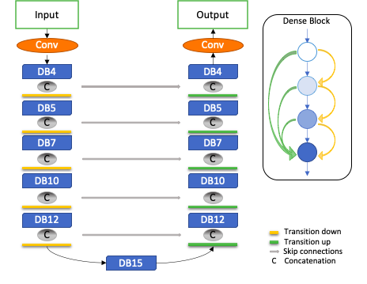
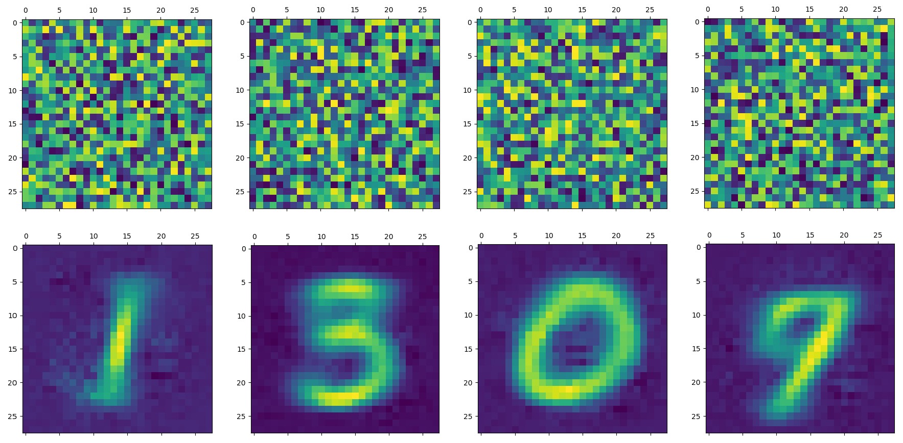
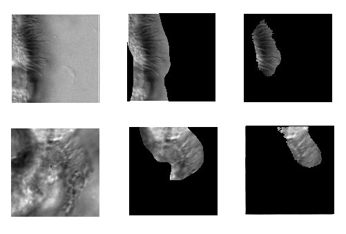

:author: Meekail Zain
:email: meekail.zain@uga.edu
:institution: These authors contributed equally
:institution: Computer Science Department, Franklin College of Arts and Sciences
:institution: Mathematics Department, Franklin College of Arts and Sciences

:author: Sonia Rao
:email:
:institution: Computer Science Department, Franklin College of Arts and Sciences
:institution: These authors contributed equally

:author: Nathan Safir
:email: 
:institution: Computer Science Department, Franklin College of Arts and Sciences

:author: Quinn Wyner
:email:
:institution: Mathematics Department, Franklin College of Arts and Sciences

:author: Isabella Humphrey
:email:
:institution: Computer Science Department, Franklin College of Arts and Sciences
:institution: Mathematics Department, Franklin College of Arts and Sciences

:author: Alex Eldridge
:email:
:institution: Mathematics Department, Franklin College of Arts and Sciences

:author: Chenxiao Li
:email:
:institution: Comparative Biomedical Sciences, College of Veterinary Medicine

:author: Bahaa AlAila
:email:
:institution: Computer Science Department, Franklin College of Arts and Sciences

:author: Shannon Quinn
:email: spq@uga.edu	
:institution: Computer Science Department, Franklin College of Arts and Sciences

------------------------------------------------------------------------------------------------
Unsupervised Spatiotemporal Representation of Cilia Video Using A Modular Generative Pipeline
------------------------------------------------------------------------------------------------

.. class:: abstract

Motile cilia are a highly conserved organelle found on the exterior of many human cells. Cilia 
beat in rhythmic patterns to transport substances or generate signaling gradients. Disruption 
of these patterns is often indicative of diseases known as ciliopathies, whose consequences can 
include dysfunction of macroscopic structures within the lungs, kidneys, brain, and other organs. 
Characterizing ciliary motion phenotypes as healthy or diseased is an essential step towards diagnosing 
and differentiating ciliopathies. We propose a modular generative pipeline for the analysis of cilia 
video data so that expert labor may be supplemented or replaced for this task. Our proposed model 
is divided into three modules: preprocessing, appearance, and dynamics. The preprocessing module 
augments the initial data, and its output is fed frame-by-frame into the generative appearance 
model which learns a compressed latent representation of the cilia. The frames are then embedded 
into the latent space as a low-dimensional path. This path is fed into the generative dynamics module, 
which focuses only on the motion of the cilia. Since both the appearance and dynamics modules are 
generative, the pipeline itself serves as an end-to-end generative model. This thorough and 
versatile model allows experts to spend less time caught in the minutiae of cilia biopsy analysis, 
while also enabling new insights by quantifying subtle patterns that would be otherwise difficult to categorize.

.. class:: keywords

Machine Learning, Data Science, Video Analysis, Generative Modeling, Variational Autoencoder, Modular, Pipeline

Introduction
------------

Motile cilia are organelles commonly found throughout the human body, such as in the bronchial and nasal passages 
[houtmeyers1999regulation,satir1990physiology]. Cilia beat in synchronous, rhythmic patterns to 
expel foreign matter, collectively forming the mucociliary defense, a vital mechanism for sinopulmonary 
health [mucociliary2017]. Ciliopathies are genetic disorders which can adversely affect the motion 
of cilia. Disorders resulting from the disruption of ciliary motion range from sinopulmonary diseases 
such as primary ciliary dyskinesia (PCD) [o2007diagnosing] to mirror symmetric organ placement and 
situs inversus or randomized left-right organ placement as in heterotaxy [garrod2014airway]. 
Precise diagnosis of patients exhibiting abnormal ciliary motion prior to surgery may provide 
clinicians with opportunities to institute prophylactic respiratory therapies to prevent 
complications. Therefore, the study of ciliary motion may have a broad clinical impact.

Visual examination of the ciliary waveform by medical professionals is critical in diagnosing 
ciliary motion defects, but such manual analysis is highly subjective and prone to error. 
This approach also precludes the possibility of cross-institutional and longitudinal studies 
which include assessment of ciliary motion. Therefore, we aim to develop an unsupervised, 
computational approach to analyze ciliary motion, developing a quantitative "library" of 
well-defined, clinically relevant ciliary motion phenotypes. Clustering and classification 
are established problems in machine learning. However, their applications to ciliary 
waveform analysis are novel: cilia exhibit subtle, rotational, non-linear motion. 
While attempts have been made at addressing this problem, we note that generic dynamics 
models fail to classify and cluster this type of motion accurately or meaningfully, and 
are insufficient for generating a semantically potent representation. We thus apply a 
novel machine learning approach to create an underlying representation which then can be 
used for downstream tasks such as classification and clustering, and whatever else 
experts may deem necessary. It is worth noting that none have attempted to create a 
spatio-temporal model to represent cilia. Therefore, this is not only a unique problem 
in terms of its application, but on a theoretical basis. Furthermore, we avoid using 
labeled data in order to free the model from systematic assumptions naturally imposed 
by labels :---: the choice of labels themselves can inadvertently limit the model by
asserting that all data *must* conform to those exact labels. An unsupervised model 
has the freedom to discover potentially semantically meaningful patterns and phenotypes 
that experts currently wouldn't even know to label. Furthermore, an unsupervised model 
is independent of expert input, thus allowing data processing to occur immediately after 
generation, simultaneously reducing barriers to access as a scientific tool and the 
associated expenses of use.

Our approach is to create a pipeline that learns a low-dimensional representation of 
ciliary motion on unlabeled data. The model we propose considers the spatial and temporal 
dimensions of ciliary motion separately. The pipeline encodes each frame of the input video 
and then encodes the paths between frames in the latent space. The low-dimensional latent 
space in this pipeline will have semantic significance, and thus interpolation and clustering 
on the latent space should be meaningful for those studying ciliary motion and its connection to ciliopathies. 

Related Works
-------------

A computational method for identifying abnormal ciliary motion patterns was proposed by 
Quinn et al. 2015 [quinn2015automated]. The authors hypothesize ciliary motion as an instance 
of a dynamic texture, which are rhythmic motions of particles subjected to stochastic noise 
[doretto2003] and include familiar patterns such as flickering flames, rippling water, 
and grass in the wind. Each instance of dynamic texture contains a small amount of 
stochastic behavior altering an otherwise consistent visual pattern. Likewise, ciliary 
motion can be considered a dynamic texture as it consists of rhythmic behavior subject 
to stochastic noise that collectively determine the beat pattern. The authors used 
autoregressive (AR) representations of optical flow features that were fed into a 
support vector machine classifier to decompose high-speed digital videos of ciliary motion 
into "elemental components," or quantitative descriptors of the ciliary motion, and 
classify them as normal or abnormal.

While this study proved there is merit in treating ciliary motion as a dynamic texture, 
the use of an AR model for the classification task imposed some critical limitations. 
While AR models are often used in representing dynamic textures, they are primarily used in 
distinguishing distinct dynamic textures (e.g., rippling water from billowing smoke), 
rather than identifying different instances of the same texture (e.g., cilia beating 
normally versus abnormally). Additionally, AR models impose strong parametric assumptions 
on the underlying structure of the data, rendering AR models incapable of capturing 
nonlinear interactions. Lastly, even though the majority of the pipeline is automated, 
their study relied on clinical experts to manually annotate the video data with regions 
of interest (ROIs) in order to serve as ground truth for the inference. Drawing ROIs 
required specialized labor, increasing the cost and time of clinical operations. 
This is also potentially problematic in that expert drawn ROIs introduce the same 
subjective bias that the study is ostensibly attempting to remove. 

The model proposed by Quinn 2015 was improved upon by Lu 2018, the latter attempt using 
stacked Fully Convolutional DenseNets and LSTM networks [lu_stacked_2018]. Densely 
Connected Convolutional Networks, referred to as DenseNets [huang_densely_2018],
do not make strong parametric or linear assumptions about the underlying data, 
allowing more complex behavior to be captured.  Once Lu et al. extract segmentation 
masks using their 74-layer FCDenseNet, ciliary motion is treated as a time 
series using convolutional long short-term memory (Conv-LSTM) networks, a specific 
type of recurrent neural network (RNN), to model the long-term temporal dependencies in the data. 

We aim to build upon these studies by developing a fully unsupervised approach to 
characterizing ciliary motion phenotypes. This pipeline is advantageous in that it does 
not need hand-drawn ROI maps nor a labelled dataset as training data. While clinicians 
acknowledge the existence of varied motion phenotypes, experts lack standard guidelines 
for determining ciliary motion phenotype. Additionally, experts may not observe the 
level of quantitative detail required to associate complex motion phenotypes with 
specific ciliopathies and genetic mutations [quinn2015automated]. Thus, we shift away 
from a classification-style task (classifying abnormal versus normal ciliary motion) 
to a representational learning task to generate meaningful, low dimensional representations 
of ciliary motion. Unsupervised representation learning enables a model to 
learn families of complex ciliary motion phenotypes beyond the normal-abnormal binary.

Methods
-------

Our proposed model is divided into three modules: preprocessing, appearance, and dynamics. 
The preprocessing module firstly generates segmentation masks to limit representation 
learning to video regions containing cilia, and secondly extracts dense optical flow 
vector fields and differential quantities as compressed representations of ciliary 
behavior over time. These entities are concatenated with the original video data as 
additional channels to each frame to form an augmented video. Each expanded video 
is fed frame-by-frame to the appearance module which learns a compressed spatial 
representation for images of cilia. After the appearance module learns a latent 
representation of the spatial aspects of cilia in that frame, videos are embedded as 
sequences of points in the compressed latent space. The dynamics module employs another 
VAE to learn a representation from this compressed sequence, in order to reduce the 
amount of irrelevant information considered. If it were to instead train on the original 
video itself, the information would be too high-volume, potentially drowning out useful 
information in a sea of noise. This compressed sequence allows it to focus only on the 
motion of cilia. Through this construction, we factor the representation of cilia into 
disentangled spatial and temporal components.

Results
-------

Preprocessing
=============

The preprocessing module primarily functions to
- generate segmentation masks that distinguish spatial regions containing cilia from background noise and 
- supplement cilia data with measures of temporal behavior, such as optical flow and its derivative values.

Because we are interested in modelling the spatio-temporal behavior of only cilia, segmentation 
masks provide a direct mapping to pixels of interest within each frame. These masks will later 
be used within the appearance module to ignore background noise and limit representation learning 
to cilia localities. We draw upon prior supervised segmentation literature to implement FCDenseNet, 
a fully convolutional dense network that is able to leverage deep learning advantages without 
excessive parameters or loss of resolution. Each layer in a DenseNet is connected to every other 
layer in a feed-forward fashion; each layer takes the previous layers' feature maps as input, 
and its respective feature map is used by following layers. Fully Connected DenseNets (FCDenseNets) 
expand on this architecture with the principle goal of upsampling to recover input resolution 
[jegou_one_2017]. Building a straightforward upsampling path requires multiplication of 
high-resolution feature maps, resulting in a computationally intractable number of feature maps. 
To mitigate this "feature explosion" issue, FCDenseNets upsample only the preceding dense block 
instead of upsampling all feature maps concatenated in previous layers. We modify and train a 
FCDenseNet to generate usable segmentation masks as input to the appearance module. Our 
architecture, shown in Fig. 1, consists of dense blocks, transition blocks, and skip connections 
totalling to 103 layers.

	Fully Convolutional Dense Net with 103 layers

The data used for the segmentation task consists of 223 corresponding sets of ground truth masks 
and raw video data. The ground truth masks were manually generated to represent regions of cilia, 
and the raw video contains consecutive grayscale image frames. Since healthy cilia rhythmically 
beat at 12Hz and our raw imagery is recorded at 200 frames per second, there are approximately 
17 frames per single ciliary beat cycle. As such, we truncate our videos to 40 frames to capture 
at minimum 2 full ciliary cycles; the starting frame is randomly sampled. Because each video 
varies in dimensions, we obtain patches of size 128 x 128 as inputs to FCDN-103. Instead of 
randomly sampling crops, we extract the first frame of the truncated video, and tile each 
frame-mask set such that no 128 x 128 patches overlap. Each model trained is evaluated by 
testing intersection over union (IOU), testing precision, and testing accuracy. For every 
mask generated by FCDN-103, IOU computes the region of overlap between predicted pixels 
containing cilia and ground truth pixels containing cilia over the joint regions of 
either prediction or ground truth that contain cilia. Although IOU is typically a superior 
metric for segmentation evaluation, FCDN-103 is optimized with the goal of minimizing type II 
error or the presence of false positives because the output masks will be used to narrow 
representation learning to our region of interest. Thus, we aim to produce segmentation masks 
with high precision that exclusively identify regions of cilia containing minimal background scene.
	
Since we aim to represent both spatial and temporal features, it is critical to obtain optical 
flow vector fields as a quantifiable proxy for ciliary movement. Two dimensional motion can be 
thought of as the projection of three dimensional motion on an image plane, relative to a visual 
sensor such as a camera or microscope. As such, optical flow represents the apparent motion of 
pixels within consecutive frames, relative to the visual sensor. To calculate pixel displacement, 
optical flow algorithms are contingent on several assumptions. Brightness Constancy assumes that a 
pixel's apparent intensity does not change between consecutive frames, Small Motion assumes that 
pixels are not drastically displaced between consecutive frames, Spatial and Temporal Coherence 
assumes that a pixel's neighbors likely exhibit similar motion over gradual time. Solving these 
constraints yields a series of dense optical flow vector fields; each vector represents a pixel, 
and the magnitude and direction of each vector signal the estimated pixel position in the following 
frame. We refer to Beauchemin and Barron [beauchemin_computation_1995] for a full derivation of 
optical flow. Healthy cilia largely exhibit delicate textural behavior in which patches of cilia 
move synchronously, slowly, and within a set spatial region near cell boundaries. Additionally, 
our imaging modality allowed for consistent object brightness throughout sequences of frames. 
As such, we explored optical flow solutions that focus on Brightness Constancy, Small Motion, 
and Spatial Coherence systems of equations. Among Farneback, Horn-Schunck, and Lucas-Kanade 
optical flow computation algorithms, we incorporate a slightly modified Horn-Schunck algorithm 
that adequately captures synchronous ciliary motion [horn_determining_1981].
	
For further insight into behavioral patterns, we extract first-order differential image quantities 
from our computed optical flow fields. Estimating combinations of optical flow derivatives results 
in orientation-invariant quantities: curl, deformation, and divergence [fu_extracting_2004]. 
Curl represents apparent rotation, with each scalar in a curl field signaling the speed and 
direction of possible micro-circulation. Deformation is the shearing about two different axes, 
in which one axis extends while the other contracts. Divergence, or dilation, is the apparent 
movement toward or away from the visual sensor, in which object size changes as a product of 
varied depth. Because our cilia data are captured without possibility of dilation, we limit 
our computation to curl and deformation. 
	
.. figure:: of_Ex.png

	Raw imagery and corresponding optical flow visualization

Figure 2. shows an example of healthy cilia and its mid-cycle optical flow where vector magnitude 
corresponds to color saturation; we can reasonably assume that the primary region of movement within 
optical flow fields will contain healthy cilia. While optical flow fields can potentially provide 
information on cilia location, we avoid solely using optical flow fields to generate segmentation 
masks due to the presence of dyskinetic cilia. Identifying stationary cilia is a crucial step in 
learning ciliary motion phenotype. However, it is possible that optical flow provides insight 
into both ciliary location and temporal behavior. 
		
Generative Model
================

Both the appearance and dynamics modules ultimately rely on a choice of a particular generative model. 
The chosen model greatly affects the rendered representation, and thus the efficacy of the entire 
pipeline. Our current choice of generative model is a variational autoencoder (VAE) 
[Kingma and Welling, 2014], an architecture that generates a low-dimensional representation of 
the data, parameterized as a probability distribution. A VAE can be considered a modified autoencoder 
(AE). A general autoencoder (AE) attempts to learn a low-dimensional representation of the data by 
enforcing a so-called "bottleneck" in the network. This bottleneck is usually in the form of a 
hidden layer whose number of nodes is significantly smaller than the dimensionality of the input. 
The AE then attempts to reconstruct the original input using only this bottleneck representation. 
The idea behind this approach is that to optimize the reconstruction, only the most essential 
information will be maintained in the bottleneck, effectively creating a compressed, critical 
information based representation of the input data. The size of the bottleneck is a 
hyperparameter which determines how much of the data is compressed.

With this task in mind, an AE can be considered as the composition of two constituent neural networks: 
the encoder, and the decoder. Suppose that the starting dataset is a collection of n-dimensional points, 
:math:`S\subset\mathbb{R}^n`, and we want the bottleneck to be of size :math:`l`, then we can write 
the encoder and decoder as functions mapping between :math:`\mathbb{R}^n\text{ and }\mathbb{R}^l`: 

.. math::

	E_\theta:\mathbb{R}^n\rightarrow\mathbb{R}^l,\quad D_\theta:\mathbb{R}^l\rightarrow\mathbb{R}^n

The subscript :math:`\theta` denotes that these functions are constructed as neural networks parameterized 
by learanble weights :math:`\theta`.The encoder is tasked with taking the original data input and 
sending it to a compressed or *encoded* representation. The output of the encoder serves as the 
bottleneck layer. Then the decoder is tasked with taking this encoded representation and reconstructing 
a plausible input which could have been encoded to generate this representation, and thus is encouraged 
to become an approximate inverse of the encoder. The loss target of a AE is generally some distance 
function (not necessarily a metric) between items in the data space, which we denote as 

.. math::

	d:\mathbb{R}^n\times\mathbb{R}^n\rightarrow\mathbb{R}

So given a single input :math:`x\in S`, we then write the loss function as 
	
.. math::

	L_\theta(x)=d(x,D_\theta(E_\theta(x)))
	
where a common choice for :math:`d` is the square of the standard euclidean norm, resulting in

.. math::

	L_\theta(x)=\|x-D_\theta(E_\theta(x))\|^2

The AE unfortunately is prone to degenerate solutions where when the decoder is sufficiently 
complex, rather than learning a meaningful compressed representation, it instead learns a hash 
of the input dataset, achieving perfect reconstruction at the expense of any generalizability. 
Notably, even without this extreme hash example, there is no restraint on continuity on the decoder, 
thus even if a point :math:`z\in E(S)\subset\mathbb{R}^l` in the latent space decodes into a nice, 
plausible data point in the original dataset, points close to :math:`z` need not nicely decode.

A VAE attempts to solve this problem by decoding neighborhoods around the encoded points rather 
than just the encoded points themselves. A neighborhood around a point :math:`z\in\mathbb{R}^l` 
is modeled by considering a multivariate gaussian distribution centered at :math:`\mu\in\mathbb{R}^l` 
with covariance :math:`\Sigma\in\mathbb{R}^{l\times l}`. It often suffices to assert that the 
covariance be a diagonal matrix, allowing us to write :math:`\Sigma=\operatorname{diag}(\sigma)` 
for some :math:`\sigma\in\mathbb{R}^l`. While the decision to model neighborhoods via distributions 
deserves its own discussion and justification, it falls outside the scope of this paper and thus 
we omit the technical details while referring you to [?] for further reading. Instead, we provide 
a sort of rationalization of the conclusions of those discussions in the paragraphs that follow. 
While this is a little backwards, we find it does a better job of communicating the nature of the 
techniques to most audiences than does touring the complex mathematical underpinnings. The idea of 
modeling neighborhoods as distributions is implemented by changing the encoder to a new function 

.. math::
	
	\tilde E_\theta:\mathbb{R}^n\rightarrow\mathbb{R}^l\times\mathbb{R}^l, \quad \tilde E_\theta: x \mapsto (\mu,\sigma)

where :math:`\mu` is the analog to the encoded :math:`z` in the AE. However now we also introduce 
:math:`\sigma`, which is the main diagonal of a covariance matrix :math:`\Sigma`, which determines 
how far, and in what direction, to randomly sample around the mean :math:`\mu`. What this means 
is after encoding, we no longer get a singular point, but a distribution modeling a neighborhood 
of points as promised. This distribution is referred to as the *posterior distribution* corresponding 
to :math:`x`, written as :math:`q(z|x)=\mathcal{N}(\mu,\Sigma)`. We sample from this posterior using 
the following construction 

.. math::

	z\sim q_\theta(z|x) \iff z=\mu+\Sigma\epsilon\text{, where } \epsilon\sim\mathcal{N}(0,\mathcal{I}_l)
	
to ensure that we may complete backpropogation, since :math:`\mu,\sigma` are dependent on weights 
within the network. This is known as the reparameterization trick. Our modified loss is then

.. math::

	L_\theta(x)=\|x-D_\theta(z)\|^2
	
Through this change, over the course of training we obtain a Monte Carlo estimation of the neighborhoods 
around the embedded points, encouraging continuity in their decoding. This results is still incomplete 
in that there's no guarantee that the decoder doesn't degenerate to setting :math:`\sigma` arbitrarily 
close to zero, resulting in a slightly more complex AE. Thus we assert that if one were to sample from 
some predetermined *prior distribution* on the latent space, written as :math:`p(z)`, then the sampled 
point should be able to be reasonably decoded as a point in the starting data space. To break that down, 
this means that the portions of the latent space that our model should be best trained on should follow 
the prior distribution. A common choice for prior, due to simplicity, is the unit-variance Gaussian 
distribution. This is implemented by imposing a KL-Divergence loss between the posterior distributions 
(parameterized by our encoder via :math:`\mu, \sigma`) and the prior distribution (in this case 
:math:`\mathcal{N}(0,\mathcal{I}_l)`). Thus our final loss function is 

.. math::

	L_\theta(x)=\|x-D_\theta(z)\|^2+\operatorname{KL}(q_\theta(z|x) \,\|\, p(z))
	
	
Now we finally have a vanilla VAE, wherein it can not only encode and decode the starting dataset, 
but it can also decode points in the latent space that it hasn't explicitly trained with (though with 
no strict promises on the resulting quality). Further improvements to the VAE framework have been made 
in recent years. To empower the decoder without introducing a significant number of parameters, we 
implement a spatial broadcast decoder (SBD), as outlined in [watters2019]. To achieve greater flexibility 
in terms of the shape of the prior and posterior distributions, we employ the VampPrior in [tomczak2017] 
with an added regularization term. Both these changes afford us greater flexibility and performance 
in creating a semantically meaningful latent space. The VampPrior is an alternative prior distribution 
that is constructed by aggregating the posteriors corresponding to :math:`K` learned pseudo-inputs 
:math:`\chi_1,\dots,\chi_K`. The distribution is given by

.. math::

	p(z)= \frac{1}{K}\sum_i^K q(z|\chi_i)

This choice of prior optimizes the pipeline for downstream tasks such as clustering and phenotype 
discovery. We apply a regularization term to the loss to encourage that these pseudo-inputs look 
as though they could be reasonably generated by the starting dataset. Thus our loss becomes 

.. math::
	
	\tilde z_i\sim q(z|\chi_i)

.. math::
	:type: eqnarray

	L_\theta(x)=\|x-D_\theta(z)\|^2+\operatorname{KL}(q_\theta(z|x)\,\|\, p(z)) \\
	+\gamma \left( \sum_i^K\|\chi_i-D_\theta(\tilde z_i)\|^2+\operatorname{KL}(q_\theta(z|\chi_i) \| p(z)) \right)

This has an immediate use in both clustering and semantic pattern discovery tasks. Rather than 
the embedding :math:`E(S)\subset\mathbb{R}^l` of the dataset being distributed as a unit gaussian, 
it is distributed as a mixture of gaussians, with each component being a posterior of a 
pseudo-input. Consequently, the pseudo-inputs create notable and calculable clusters, and the 
semantic significance of the clusters can be determined, or at least informed, by analyzing the 
reconstruction of the pseudo-input responsible for that posterior distribution.

	
	Pseudo-inputs of a VampPrior based VAE on MNIST without additional regularization term (top row), and with regularization term (bottom row)

Appearance
==========

The appearance module's role is to learn a sufficient representation so that, frames are 
reconstructed accurately on an individual basis, and that spatial differences of frames 
over time is represented with a meaningful sequence of points in the latent space. 
The latter is the core assumption of the dynamics module. 

The appearance module is designed to work with generalized videos, regardless of specific 
application. Specifically it is designed to take as input singular video frames, augmented 
with the information generated during the preprocessing phase, including optical flow 
quantities such as curl. These additional components are included as additional channels 
concatenated to the starting data, and thus is readily expandable to suit whatever augmented 
information is appropriate for a given task. In the case of our particular problem, one notable 
issue is that cilia occupy a small portion of the frame [figure reference?] and thus, the 
content of the images that we are interested in exist in some subspace that is significantly 
smaller than the overall data space. This can result in problems where the neural network 
optimizes components such as background noise and image artifact at the expense of the 
clinically critical cilia. To remedy this, we leverage the segmentation masks created during 
the preprocessing phase to focus the network on only the critical portions of the image.

To that effect, we mask the augmented frame data :---: the raw images concatenated with 
additional information such as optical flow quantities :---: using the segmentation 
masks and train the network on these masked quantities. Mathematically we refer to a single 
augmented frame with :math:`k` channels as :math:`f`, a doubly-indexed collection of vectors, 
writing the channel information of pixel :math:`(i,j)` as :math:`f_{i,j}\in\mathbb{R}^k`. 
We similarly write the generated segmentation mask :math:`m` as a doubly-indexed collection 
of scalars with :math:`m_{i,j}\in [0,1]\subset\mathbb{R}`, then we construct the augmented frame 

.. math::

	\tilde f_{i,j}:=f_{i,j}\cdot m_{i,j}

The appearance module ultimately embeds a segmented region of cilia observed in a single frame 
into what we refer to as the appearance latent space. Due to the temporally static nature of frames, 
this latent space is an encoded representation of *only* the spatial information of the 
underlying processed data. This spatial information includes aspects such as the shape 
and distribution of cilia along cells, as well as factors such as their length, orientation 
and overall shape. These spatial features can be then used in downstream tasks such as 
phenotype discovery, by drawing a strong connection between apparent patterns in this 
space as and semantically meaningful patterns in the underlying data as well.

Dynamics
========

While the appearance module handles representing the video frames individually under a 
generative model, the dynamics module is where the temporal behavior is represented. We propose 
a VAE generative seq2seq module that consists of both an encoder and a decoder to embed 
the temporal dynamics in a latent semantic space  for motion patterns (dynamics). The encoder 
handles embedding the dynamics of the observed  video frames (input) into a latent vector 
:math:`z_\text{dyn}` in the dynamics semantic space :math:`\mathbb{R}^{d_\text{dyn}}`. 
This vector :math:`z_\text{dyn}` represents the conceptual path of the observed dynamics 
in the video by the encoder so far.

The decoder, then, extrapolates the video into future time-steps by unrolling a sampled 
latent vector :math:`z_\text{dyn}` from the dynamics space into a sequence of vectors 
:math:`c_\text{dyn}^{1..k}`. These vectors represent changes on a supplied appearance 
vector :math:`z_\text{out}^0` of an initial frame :---: a starting point for extrapolation. 
Applying this sequence of change vectors to the initial appearance vector one-by-one, 
using a aggregation operator :math:`\phi(z,c)`, results in a sequence of appearance 
vectors :math:`z_\text{out}^{1..k}` that can be generated back into video frames through 
the decoder of the appearance module :math:`D_\text{app}`. 

Since the encoder and the decoder of the dynamics module need to process sequences of vectors, 
they are modeled using a GRU (Gated Recurrent Unit[]) and a LSTM (Long Short-Term Memory[]) 
units, respectively. They are a type of recurrent neural networks (RNN) with unique 
architectures that allow them to handle sequences of data longer than a generic RNN can. 
Their architectures employ neural gates whose operations somewhat resemble those of a digital 
memory (RAM). A GRU cell operates on an input vector :math:`x^t`, and a hidden state 
vector :math:`s^t` at a certain time-step :math:`t`. Applying a GRU step results in an 
updated state vector :math:`s^{t+1}`. An LSTM cell is similar, but it also has another 
output state :math:`h^t` that gets updated as well like the hidden state.

The dynamics encoder GRU, :math:`E_\text{dyn}`, starts from a blank state vector 
:math:`s_\text{enc}^0` that updates every time the appearance vector of the next video 
frame is fed-in. After feeding in the appearance vector of the last input frame :math:`z_\text{app}^n`, 
the state vector :math:`s_\text{enc}^n` would encompass information about the motion 
patterns in the observed video frames :math:`z_\text{app}^{1..n}`, and would then 
constitute a latent vector in the dynamics semantic space :math:`z_\text{dyn}=s^n`.

The dynamics decoder LSTM :math:`D_\text{dyn}` starts from from a latent dynamics 
vector as its hidden state :math:`s_\text{dec}^0=z_\text{dyn}`, a blank output state 
vector :math:`h_\text{dec}^0=0` and the appearance vector of an initial supplied 
output frame :math:`x_\text{dec}^0 = z_\text{out}^0`. Applying each step results 
in a change vector :math:`c^{t+1}=h^{t+1}` (output state vector), that gets applied 
to the most recent appearance vector in the output sequence to predict the next 
appearance vector :math:`z_\text{out}^{t+1}=\phi(z_\text{out}^t,c^{t+1})`, 
which in turn is used as an input vector to the next LSTM step. The sequence of 
predicted appearance vectors are then passed through the appearance decoder 
:math:`D_\text{app}(z_\text{out}^1),...,D_\text{app}(z_\text{out}^k)`, to generate 
back the video frames. During training time, an :math:`L_2` loss is minimized on 
the predicted :math:`k` frames and the true ones.

A prior constraint is imposed on the encoder's output. Therefore, the size of the state 
vector of the encoder is :math:`2d_\text{dyn}`, to represent both :math:`z_\text{dyn}^\mu`, 
and :math:`z_\text{dyn}^\sigma`, such that 
:math:`z_\text{dyn} \sim \mathcal{N}(z_\text{dyn}^\mu,\operatorname{diag}(z_\text{dyn}^\sigma))`, 
and a prior loss of :math:`\operatorname{KL}(\mathcal{N}(z_\text{dyn}^\mu,\operatorname{diag}
(z_\text{dyn}^\sigma)) \,||\, \mathcal{N}(0,\mathcal{I}))` is minimized.

It is important to note that the appearance module and the dynamics module are decoupled, 
such that sampling a different vector :math:`z_\text{dyn}` from the dynamics latent space results 
in different motion dynamics in the extrapolated sequence of video frames despite starting 
from the same initial supplied frame. As is the case when supplying a different initial output frame as well.

Technical Discussion
--------------------

Data
====

Our data, taken directly from Quinn et al.'s 2015 study, consist of  nasal biopsy 
samples observed in patients with diagnosed ciliopathies and in healthy controls [quinn2015automated]. 
Nasal epithelial tissue was obtained from the inferior nasal turbinate using a Rhino-Pro 
curette, and cultured for three passages prior to recording. Grayscale video data was 
recorded for 1.25 seconds using a Phantom v4.2 high speed camera at 200 frames per second, 
resulting in 250 frames per sample. For every biopsy sample, a panel of experts and 
clinicians determined ground truth ciliary motion, and defaulted to majority vote for 
instances without unanimous consensus. Recorded videos vary in dimension, ranging 
from 256 to 640 pixels on either axis. Segmentation masks used during the training of the 
preprocessing module were generated manually using ITK-SNAP, where each pixel is a binary 
value corresponding to whether the pixel contains cilia. Our dataset has a total of 
325 sample videos, taken from Quinn et al.'s 2015 cohort sampled at the University of 
Pittsburgh, and 230 ground-truth segmentation masks. 

Implementation Notes
====================

We train our FCDN-103 model, written in PyTorch, with an Adam optimizer and cross-entropy 
loss on one NVIDIA Titan X GPU card. We split our data to consist of 1785 training patches 
and 190 testing patches. Throughout training and tuning, we experiment with several parameters: 
standard parameters such as batch size, learning rate, and regularization parameters such as 
learning rate decay, weight decay, and dropout. We observe optimal performance after 50 epochs, 
14 patches per batch, learning rate of 0.0001, learning rate decay of 0.0, and weight decay of 0.0001. 
This model achieves 33.06% average testing IOU, and 53.26% precision. Fig. 2 shows two examples 
of 128 x 128 test patches with their corresponding ground truth mask (middle) and FCDN-103 
generated mask (right); the predicted masks cover more concise areas of cilia than the ground 
truths and ignore the background in entirety. Previously, Lu et al. implement a Fully Convolutional 
DenseNet with 109 layers in a tiramisu architecture trained on ciliary data [lu_stacked_2018]; 
FCDN-103 achieves an average of 88.3% testing accuracy, outperforming Lu et al.'s FCDN-109 
by two percentage points.

The optical flow fields are computed using a coarse-to-fine implementation of Horn-Schunck's 
influential algorithm. Although we tested other methods, namely Farneback, Lucas-Kanade, 
and TV-L1, coarse-to-fine Horn-Schunck produced fields more robust to background movement. 
Horn-Schunck operates by firstly assuming motion smoothness between two frames; the algorithm 
then minimizes perceived distortions in flow by iteratively updating a global energy function. 
The coarse-to-fine aspect transforms consecutive frames into Gaussian image pyramids; at each 
fielditeration, corresponding to levels in the Gaussian pyramids, an optical flow field is 
generated by Horn-Schunck, and then used to "warp" the images toward one another until both 
frames have converged. While Horn-Schunck has potential to be noise-sensitive due to its 
smoothness assumption, we observe that this is mitigated by the coarse-to-fine estimation and 
hyperparameter tuning. Additionally, we find that this estimation is more computationally 
and time efficient than its contemporaries. Curl and deformation fields are extracted from 
the Horn-Schunck generated optical flow fields using SciPy's signal and ndimage packages.

	Segmentation examples from left to right: raw frame, frame overlain with ground truth 
	segmentation mask, frame overlain with predicted segmentation mask

The entirety of the appearance module's architecture was written using PyTorch. The encoder 
is a composition of residual blocks, with pixel-wise convolutions and maxpooling operations 
between them to facilitate channel shuffling and dimensionality reduction respectively, 
connecting to a fully-connected layer which represents the means and log-variances along 
each axis of the latent space. We use log-variances instead of the usual standard deviation, 
or even variance, to guarantee numerical stability, make subsequent calculations such as 
KL-divergence easier, and reduce the propensity for degenerate distributions with variances 
that approach 0. Since we use a modified VampPrior, the KL-divergence is between a single 
gaussian, the posterior, and a mixture of gaussians, the prior, and thus intractable. 
In order to estimate this, we employ a Monte Carlo estimation technique, manually calculate 
the difference in log-probabilities for each distribution at every pass of the loss function, 
asserting that throughout training these values approximate the ideal KL-divergence.

Conclusion
----------

The virtue of this generative pipeline is not solely in its ability to handle the task of 
cilia representation, but rather in offering a framework that is readily extensible to almost 
any task that involves the simultaneous, yet separate, representation of spatial and temporal 
components. While this project was contextualized specifically to the realm of cilia, it is 
important to note that many of the findings and constructions apply in a general context. 
The specific aim of this project was to both develop separate, usable tools which sufficiently 
accomplish their narrow roles, while also integrating together to offer a more meaningful 
understanding of the overall problem. While we are still in the early phases of evaluating 
the entire integrated pipeline as a singular solution, we have demonstrated early successes 
with the preprocessing module, and have situated the appearance and dynamics modules in the 
context of modern machine learning approaches well enough to justify further exploration.

Further Research
================

We encourage the expansion and application of this framework to various other problem contexts. 
The generic approach to its design ensures portability and adaptability to all sorts of projects. 
For example, the preprocessing module can be replaced with whatever field-specific 
computations are appropriate, or forgone entirely. Furthermore, the fact that the dynamics 
module is designed to operate within the abstract latent space of the appearance module means 
that the appearance module acts as sort of a buffer or converter between the concrete data 
and the temporal analysis. Consequently, when adapting to new projects, only the appearance 
module need be adapted, while the preprocessing module may optionally be adapted, and the 
dynamics module preserved.

One example task this pipeline could be adapted to is that of RNA folding analysis. 
The study of RNA folding patterns is essential in areas such as drug development. One way to 
model RNA folding is to consider a strand of RNA as a partially-connected point cloud, tracked 
through time. In this case, the preprocessing module may be forgone, and altering the appearance 
encoder/decoder to a generic architecture compatible with point clouds, e.g. a geometric neural 
network or graph convolutional network, is all that is necessary. The dynamics module could be 
readily applied without significant changes. This pattern is in general true to most tasks.

Acknowledgements
----------------

We gratefully acknowledge the support of NVIDIA Corporation with the donation of the Titan X 
Pascal GPU used for this research. This study was supported in part by NSF CAREER #1845915.
