:author: Meekail Zain
:email: meekail.zain@uga.edu
:institution: Department of Computer Science, University of Georgia, Athens, GA 30602 USA

:author: Eric Miller
:email: EricMiller@uga.edu
:institution: Institute for Artificial Intelligence, University of Georgia, Athens, GA 30602 USA

:bibliography: refs

----------------------------------------------------
Low Level Feature Extraction for Cilia Segmentation
----------------------------------------------------
.. role:: raw-latex(raw)
   :format: latex

.. class:: abstract

   Cilia are organelles found on the surface of some cells in the human body that sweep rhythmically to transport substances. Dysfunction of ciliary motion is often indicative of diseases known as ciliopathies, which disrupt the functionality of macroscopic structures within the lungs, kidneys and other organs :cite:`li2018composite`. Phenotyping ciliary motion is an essential step towards understanding ciliopathies; however, this is generally an expert-intensive process :cite:`quinn2015automated`. A means of automatically parsing recordings of cilia to determine useful information would greatly reduce the amount of expert intervention required. This would not only improve overall throughput, but also mitigate human error, and greatly improve the accessibility of cilia-based insights. Such automation is difficult to achieve due to the noisy, partially occluded and potentially out-of-phase imagery used to represent cilia, as well as the fact that cilia occupy a minority of any given image. Segmentation of cilia mitigates these issues, and is thus a critical step in enabling a powerful pipeline. However, cilia are notoriously difficult to properly segment in most imagery, imposing a bottleneck on the pipeline. In this paper, we use and evaluate alternative methods of feature extraction for cilia imagery to build a potent segmentation model. Current experiments show up to a 10\% improvement over base segmentation models using a novel combination of feature extractors.

.. class:: keywords

   cilia, segmentation, u-net, deep learning

Introduction
============

Cilia are organelles found on the surface of some cells in the human
body that sweep rhythmically to transport substances
:cite:`ishikawa2017axoneme`. Dysfunction of ciliary motion
often indicates diseases known as ciliopathies, which on a larger scale
disrupt the functionality of structures within the lungs, kidneys and
other organs. Phenotyping ciliary motion is an essential step towards
understanding ciliopathies; however, this is generally an
expert-intensive process
:cite:`li2018composite, quinn2015automated`. A means of
automatically parsing recordings of cilia to determine useful
information would greatly reduce the amount of expert intervention
required, thus increasing throughput while alleviating the potential for
human error. Hence, Zain et. al. (2020) discuss the construction of a
generative pipeline to model and analyze ciliary motion, a prevalent
field of investigation in the Quinn Research Group at the University of
Georgia :cite:`cilia`.

The current pipeline consists of three major stages: preprocessing,
where segmentation masks and optical flow representations are created to
supplement raw cilia video data; appearance, where a model learns a
condensed spacial representation of the cilia; and dynamics, which
learns a representation from the video, encoded as a series of latent
points from the appearance module. In the primary module, the
segmentation mask is essential in scoping downstream analysis to the
cilia themselves, so inaccuracies at this stage directly affect the
overall performance of the pipeline. However, due to the high variance
of ciliary structure, as well as the noisy and out-of-phase imagery
available, segmentation attempts have been prone to error.

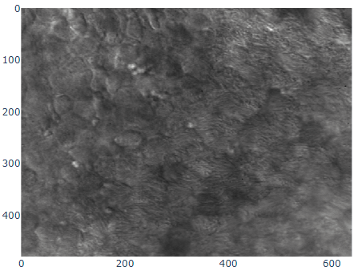

   A sample frame from the cilia dataset

While segmentation masks for such a pipeline could be manually
generated, the process requires intensive expert labor
:cite:`doornbos2021cell`. Requiring manual segmentation
before analysis thus greatly increases the barrier to entry for this
tool. Not only would it increase the financial strain of adopting
ciliary analysis as a clinical tool, but it would also serve as an
insurmountable barrier to entry for communities that do not have
reliable access to such clinicians in the first place, such as many
developing nations and rural populations. Not only can automated
segmentation mitigate these barriers to entry, but it can also simplify
existing treatment and analysis infrastructure. In particular, it has
the potential to reduce magnitude of work required by an expert
clinician, thereby decreasing costs and increasing clinician throughput
:cite:`quinn2015automated, cilia`. Furthermore, manual
segmentation imparts clinician-specific bias which reduces the
reproducability of results, making it difficult to verify novel
techniques and claims :cite:`doornbos2021cell`.

A thorough review of previous segmentation models, specifically those
using our same dataset, shows that current results are poor, impeding
tasks further along the pipeline. We hence evaluate various methods of
feature extraction that are hypothesized to improve the accuracy of a
base segmentation model, such as using zero-phased PCA maps and Sparse
Autoencoder reconstructions with various parameters as a data
augmentation tool. We run various experiments with these methods and
provide a summary of both qualitative and quantitative results, along
with an analysis of the experimental data to evaluate our methods.

Related Works
=============

Lu et. al. (2018) utilized a Dense Net segmentation model as an upstream
to a CNN based Long Short-Term Memory (LSTM) time-series model for
classifying cilia based on spatiotemporal patterns
:cite:`charles`. While the model reports good classification
accuracy and a high F-1 score, the underlying dataset only contains 75
distinct samples and the results must therefore be taken with great
care. Furthermore, Lu et. al. did not report the separate performance of
the upstream segmentation network. Their approach did, however, inspire
the follow-up methodology of Zain et. al. (2020) for segmentation. In
particular, they employ a Dense Net segmentation model as well, however
they first augment the underlying images with the calculated optical
flow. In this way, their segmentation strategy employs both spatial
*and* temporal information. To compare against
:cite:`charles`, the authors evaluated their segmentation
model in the same way – as an upstream to an CNN/LSTM classification
network. Their model improved the classification accuracy two points
above that of Charles et. al. (2018). Their reported
intersection-over-union (IoU) score is :math:`33.06\%` and marks the
highest performance achieved on this dataset.

.. figure:: unet.png

   The classical U-Net architecture, which serves as both a
   baseline and backbone model for our research :label:`fig:unet`

One alternative segmentation model, often used in biomedical image
processing and analysis, where labelled data sets are relatively small,
is the U-Net architecture (:ref:`fig:unet`)
:cite:`unet`. Developed by Ronneberger et. al., U-Nets
consist of two parts: contraction and expansion. The contraction path
follows the standard strategy of most convolutional neural networks
(CNNs), where convolutions are followed by Rectified Linear Unit (ReLU)
activation functions and max pooling layers. While max pooling
downsamples the images, the convolutions double the number of channels.
Upon expansion, up-convolutions are applied to up-sample the image while
reducing the number of channels, and at each stage, the up-sampled image
is concatenated with the image of corresponding size (cropped to account
for border pixels) from a layer in the contracting path. A final layer
uses pixel-wise (:math:`1\times1`) convolutions to map each pixel to a
corresponding class, building a segmentation. Before training, data is
generally augmented to provide both invariance in rotation and scale as
well as a larger amount of training data. In general, U-Nets have shown
high performance on biomedical data sets with low quantities of labelled
images, as well as reasonably fast training times on graphics processing
units (GPUs) :cite:`unet`. However, in a few past
experiments with cilia data, the U-Net architecture has had low
segmentation accuracy :cite:`charles`. Difficulties modeling
cilia with CNN-based architectures include their fine high-variance
structure, spatial sparsity, color homogeneity (with respect to the
background and ambient cells) as well as inconsistent shape and
distribution across samples. Hence, we seek to test various enhancements
to the pure U-Net model for cilia segmentation.

Methodology
===========

To construct the model, we start with a backbone U-Net model due to its
well-established performance in the biomedical image analysis domain.
The focus of this paper is on extracting and highlighting the underlying
features in the image through various means, therefore optimization of
the U-Net backbone is not a major consideration of this project. Indeed,
we believe the relative performance of the various modified U-Nets
sufficiently communicate the efficacy of the underlying methods. Each
feature extraction method will map the underlying raw image to a
corresponding feature map. To evaluate the usefulness of these feature
maps, we concatenate them to the original image and use the aggregate
data as input to a U-Net that is slightly modified to accept multiple
input channels.

The feature extractors we utilize are Zero-phase PCA sphering (ZCA) and
a Sparse Autoencoder (SAE), both of which are detailed in the following
subsections. Roughly speaking, these are both lossy, non-bijective
transformations which map a single image to a single feature map. In the
case of ZCA, empirically the feature maps tend to preserve edges and
reduce the rest of the image to arbitrary noise, thereby emphasizing
local structure (since cell structure tends not to be well-preserved).
The SAE instead acts as a harsh compression and filters out both linear
and non-linear features, preserving global structure. Each extractor is
evaluated by considering the performance of a U-Net model trained on
multi-channel inputs, where the first channel is the original image, and
the second and/or third channels are the feature maps extracted by these
methods. In particular, we hope that the doubly-augmented data, which we
refer to as the “composite” model, may achieve state-of-the-art
performance on this challenging dataset.

We implement ZCA using SciPy linear algebra solvers and use the PyTorch
deep learning library to implement the U-Net, and SAE. We measure the
performance of the model using canonical segmentation quality metrics,
such as the Jaccard score and Dice coefficient. Then we evaluate the
composite model to determine any potential improvements to the
state-of-the-art for cilia segmentation.

Cilia Data
----------

As in the Zain paper, we will be using a limited data set of grayscale
cilia imagery, from both healthy patients and those diagnosed with
ciliopathies, with corresponding ground truth masks provided by experts.
The images are cropped to :math:`128\times128` patches. The images are
cropped at random coordinates in order to increase the size and variance
of our sample space, and each image is cropped a number of times
proportional its resolution. Additionally, crops that contain less than
fifteen percent cilia are excluded from the training/test sets. This
method increases the size of our training set from 253 images to 1409
images. We also take care to employ standard minmax contrast
normalization to map the luminosity to the interval :math:`[0,1]`.

Zero-phase PCA sphering (ZCA)
-----------------------------

We consider augmenting the underlying data by applying concatenating the
input to the backbone U-Net model with the ZCA-transformed data. ZCA
maps the underlying data to a version of the data that is “rotated”
through the dataspace to ensure certain spectral properties. ZCA in
effect can implicitly normalize the data using the most significant (by
empirical variance) spatial features present across the dataset. Given a
matrix :math:`X` with rows representing samples and columns for each
feature, a sphering (or whitening) transformation :math:`W` is one which
decorrelates :math:`X`. That is, the covariance of :math:`WX` must be
equal to the identity matrix. By the spectral theorem, the symmetric
matrix :math:`XX^T`—the covariance matrix corresponding to the data,
assuming the data is centered—can be decomposed into :math:`PDP^T`,
where :math:`P` is an orthogonal matrix of eigenvectors and :math:`D` a
diagonal matrix of corresponding eigenvalues of the covariance matrix.
ZCA uses the sphering matrix :math:`W=PD^{-1/2}P^T` and can be thought
of as a transformation into the eigenspace of its covariance
matrix—projection onto the data’s principal axes, as the minimal
projection residual is onto the axes with maximal variance—followed by
normalization of variance along every axis and rotation back into the
original image space. In order to reduce the amount of two-way
correlation in images, Krizhevsky applies ZCA whitening to preprocess
CIFAR-10 data before classification and shows that this process nicely
preserves features, such as edges :cite:`zca`.

We implement ZCA using the Python SciPy library (SciPy) which builds on
top of low-level hardware-optimized routines such as BLAS and LAPACK to
efficiently calculate many linear algebra operations. In particular, we
choose to implement ZCA as a generalized whitening technique. While
normal ZCA is calculated by selecting a whitening matrix
:math:`W=PD^{-\frac{1}{2}}P^T`, we instead choose
:math:`W=P\sqrt{(D+\epsilon I)^{-1}}P^T` where :math:`\epsilon` is a
hyperparameter which attenuates eigenvalue sensitivity. This new
“whitnening” is actually not a proper whitening since it doesn’t
guarantee an identity covariance matrix (this can be easily verified by
the reader) however it serves a similar purpose and actually lends some
benefits.

Most importantly, it is indeed a generalization of canonical ZCA. That
is to say, when :math:`\epsilon=0` we recover canonical ZCA and observe
that the spectrum of :math:`W` is provided by the map
:math:`\lambda\rightarrow \sqrt{\frac{1}{\lambda}}` on the eigenvalues.
However, when :math:`\epsilon>0` instead we obtain the map
:math:`\lambda\rightarrow \sqrt{\frac{1}{\lambda+\epsilon}}` and observe
that while *all* eigenvalues are mapped to smaller values compared to
the original map, we have that the smallest eigenvalues are mapped to
significantly smaller values compared to the original map. This means
that :math:`\epsilon` serves to “dampen” the effects of whitening for
particularly small eigenvalues. This is a valuable feature since often
times in image analysis low eigenvalues (and the span of their
corresponding eigenvectors) tend to capture high-frequency data. Such
data is essential for tasks such as texture analysis, and thus we may
tune the value of :math:`\epsilon` to preserve this data. ZCA maps for
various values of :math:`\epsilon` on a sample image are shown in figure
:ref:`fig:zcaeps`.

.. raw:: latex

    \begin{figure}[h]
    \centering
    \begin{tabular}{ccccc}
        \includegraphics[scale=0.3]{zca/orig.png} & \includegraphics[scale=0.3]{zca/4.png} &\includegraphics[scale=0.3]{zca/5.png}& \includegraphics[scale=0.3]{zca/6.png}& \includegraphics[scale=0.3]{zca/7.png}
    \end{tabular}
    \caption{Comparison of ZCA maps on a cilia sample image with various levels of $\epsilon$. The original image is followed by maps with $\epsilon=1\mathrm e-4$, $\epsilon=1\mathrm e-5$, $\epsilon=1\mathrm e-6$, and $\epsilon=1\mathrm e-7$, from left to right.}
    \label{fig:zcaeps}
    \end{figure}

Sparse Autoencoder (SAE)
------------------------

Similar in aim to ZCA, we may consider augmenting the underlying images
using an SAE to further filter and reduce noise while allowing the
construction and retention of potentially nonlinear spatial features.
Autoencoders are deep learning models that first compress data into a
low-level latent space and then attempt to reconstruct images from the
low-level representation. SAEs in particular add an additional
constraint, usually via the loss function, that encourages sparsity
(i.e., less activation) in hidden layers of the network. Xu et. al. use
the SAE architecture for breast cancer nuclear detection and show that
the architecture preserves essential, high-level, and often nonlinear
aspects of the initial imagery—even when unlabelled—such as shape and
color :cite:`sae`. We adapt the first two terms of their
loss function to enforce sparsity:

.. math:: \mathcal{L}_{SAE}(\theta)=\frac{1}{N}\sum_{k=1}^N(L(x(k),d_{\hat{\theta}}(e_{\check{\theta}}(x(k)))))+\alpha \frac{1}{n}\sum_{j=1}^{n}KL(\rho||\hat{\rho}).

\ The first term is a standard reconstruction loss (mean squared error),
whereas the latter is the mean Kullback-Leibler (KL) divergence between
:math:`\hat{\rho}`, the activation of a neuron in the encoder, and
:math:`\rho`, the enforced activation. For the case of our experiments,
we maintain :math:`\rho=0.05` but experiment with various values of
:math:`\alpha`, specifically :math:`1\mathrm e -2`,
:math:`1\mathrm e -3`, and :math:`1\mathrm e -4`, for each of which a
static dataset is created for feeding into the segmentation model.
Larger alpha prioritizes sparsity over reconstruction accuracy, which to
an extent, is hypothesized to retain significant low-level features of
the cilia. Reconstructions with various values of :math:`\alpha` are
shown in figure :ref:`fig:saealphas`

.. raw:: latex

    \begin{figure}[h]
    \centering
    \begin{tabular}{cccc}
        \includegraphics[scale=0.3]{sae/orig.png} & \includegraphics[scale=0.3]{sae/2.png} &\includegraphics[scale=0.3]{sae/3.png}& \includegraphics[scale=0.3]{sae/4.png}
    \end{tabular}
    \caption{Comparison of SAE reconstructions from different training instances with various levels of $\alpha$ (the activation loss weight). From left to right: original image, $\alpha=1\mathrm e -2$ reconstruction, $\alpha=1\mathrm e -3$ reconstruction, $\alpha=1\mathrm e -4$ reconstruction.}
    \label{fig:saealphas}
    \end{figure}

A significant amount of freedom can be found in potential architectural
choices for SAE. We focus on low-medium complexity models for both
efficiency, and to minimize overfitting and artifacts as consequence of
degenerate autoencoding. One important danger to be aware of is that
SAEs—and indeed, *all* AEs—are at risk of a degenerate solution wherein
a sufficiently complex decoder essentially learns to become a hashmap of
arbitrary (and potentially random) encodings.

The SAE will therefore utilize a CNN architecture, as opposed to more
modern transformer-style architectures, since the simplicity and induced
spatial bias provide potent defenses against overfitting and mode
collapse. Furthermore the encoder will use Spatial Broadcast Decoding
(SBD) which provides a method for decoding from a latent vector using
size-preserving convolutions, thereby preserving the spatial bias even
in decoding, and eliminating the artifacts generated by alternate
decoding strategies such as “transposed” convolutions
:cite:`SBD`.

Spatial Broadcast Decoding (SBD)
--------------------------------

Spatial Broadcast Decoding provides an alternative method from
”transposed” (or ”skip”) convolutions to upsample images in the decoder
portion of CNN-based autoencoders. Rather than maintaining the square
shape, and hence associated spatial properties, of the latent
representation, the output of the encoder is reshaped into a single
one-dimensional tensor per input image, which is then tiled to the shape
of the desired image (in our case, :math:`128\times128`). In this way,
the initial dimension of the latent vector becomes the number of input
channels when fed into the decoder, and two additional channels are
added to represent 2-dimensional spatial coordinates. In its initial
publication, SBD has been shown to provide effective results in
disentangling latent space representations in various autoencoder
models.

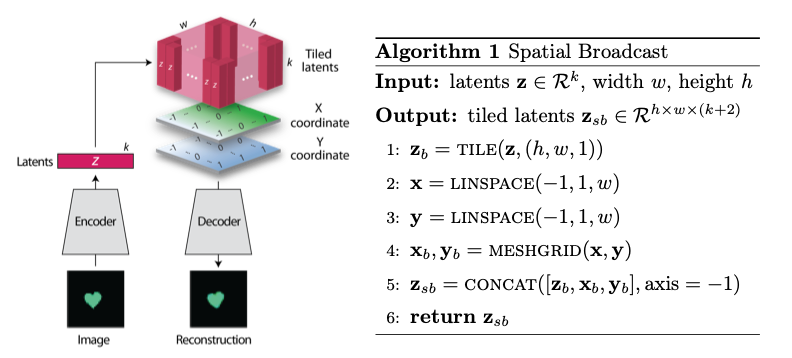

   Illustration and pseudocode for Spatial Broadcast Decoding :cite:`SBD` :label:`fig:sbd`

U-Net
-----

For all models, we use a standard U-Net and employ the same training
process, to provide a solid basis for analysis. Besides the number of
input channels to the initial model (:math:`1` plus the number of
augmentation channels from SAE and ZCA, up to :math:`3` total channels),
the model architecture is identical for all runs. We first train a
single-channel (original image) U-Net as a basis point for analysis.
Then, we train the model on two-channel inputs provided by ZCA (original
image concatenated with the ZCA-mapped one) with various
:math:`\epsilon` values for the dataset, and similarly SAE with various
:math:`\alpha` values. Finally, we train a composite model with a few
combinations of ZCA and SAE hyperparameters. Each model was trained
using binary cross entropy loss with a learning rate of
:math:`1\mathrm{e}-3` for 225 epochs.

Results
=======

Figures :ref:`fig:basetrain`, :ref:`fig:zcatrain`,
:ref:`fig:saetrain`, and :ref:`fig:comptrain` show masks produced
on validation data from instances of the four model types. While the
former three show results near the end of training (about 200-250
epochs), figure :ref:`fig:comptrain` was taken only 10 epochs into
the training process. We note that this model—the composite
pipeline—produced usable artifacts in mere minutes of training, whereas
other models did not produce similar results until about 10-40 epochs
in.

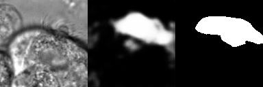

   Artifacts generated during the training of U-Net. From left to
   right: original image, generated segmentation mask (pre-threshold),
   ground-truth segmentation mask :label:`fig:basetrain`

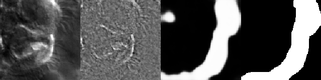

   Artifacts generated during the training of ZCA+U-Net. From left
   to right: original image, ZCA-mapped image, generated segmentation
   mask (pre-threshold), ground-truth segmentation mask :label:`fig:zcatrain`

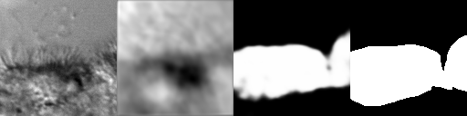

   Artifacts generated during the training of SAE+U-Net. From left
   to right: original image, SAE-reconstructed image, generated
   segmentation mask (pre-threshold), ground-truth segmentation mask :label:`fig:saetrain`

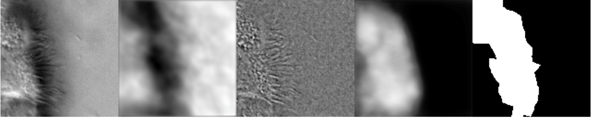

   Artifacts generated 10 epochs into the training of the
   composite U-Net. From left to right: original image, ZCA-mapped
   image, SAE-mapped image, generated segmentation mask (pre-threshold),
   ground-truth segmentation mask :label:`fig:comptrain`

Figure :ref:`fig:results` provides a summary of
experiments that we performed with :math:`SAE` and :math:`ZCA` augmented
data, along with a few composite models and a base U-Net for comparison.
These models were produced with data augmentation at various values of
:math:`\alpha` (for the Sparse Autoencoder loss function) and
:math:`\epsilon` (for ZCA) discussed above. While we provide five
metrics, we focus mostly on the Intersection over Union (IoU), or
Jaccard Score, as well as the Dice (or F1) score, which are the most
commonly used metrics for evaluating the performance of segmentation
models. Most feature extraction models at least marginally improve the
performance in of the U-Net in terms of IoU and Dice scores, and the
best-performing composite model (with :math:`\epsilon` of
:math:`1\mathrm{e}-4` for ZCA and :math:`\alpha` of
:math:`1\mathrm{e}-3` for SAE) provide an improvement of approximately
:math:`10\%` from the base U-Net in these metrics. There does not seem
to be an obvious correlation between which feature extraction
hyperparameters provided the best performance for individual ZCA+U-Net
and SAE+U-Net models versus those for the composite pipeline, but more
experiments shall be run to further analyze this.

.. raw:: latex

   \begin{figure}
   \centering
   \scalebox{0.7}{
   \begin{tabular}{rccccccl}\toprule
   & \multicolumn{2}{c}{Extractor Parameters} & \multicolumn{5}{c}{Scores}
   \\\cmidrule(lr){2-3}\cmidrule(lr){4-8}
   Model          & $\epsilon$ (ZCA) & $\alpha$ (SAE)    & IoU & Accuracy & Recall & Dice & Precision\\ \midrule
   U-Net (base)  & --- & --- & 0.399 & 0.759 & 0.501 & 0.529 & \textbf{0.692}  \\ \midrule
   \multirow{4}{*}{ZCA + U-Net}  & $1\mathrm{e}-4$ & --- & 0.395 & 0.754 & 0.509 & 0.513 & 0.625 \\
      & $1\mathrm{e}-5$ & --- & 0.401 & 0.732 & 0.563 & 0.539 & 0.607 \\
      & $1\mathrm{e}-6$ & --- & 0.408 &  0.756 & 0.543 & 0.546 & 0.644 \\
      & $1\mathrm{e}-7$ & --- & 0.419 & 0.758 & 0.563 & 0.557 & 0.639 \\ \midrule
   \multirow{3}{*}{SAE + U-Net}  & --- & $1\mathrm{e}-2$ & 0.380 & 0.719 & 0.568 & 0.520 & 0.558 \\
      & --- & $1\mathrm{e}-3$ & 0.398 & 0.751 & 0.512 & 0.526 & 0.656 \\
      & --- & $1\mathrm{e}-4$ & 0.416 & 0.735 & \textbf{0.607} & 0.555 & 0.603 \\ \midrule
   \multirow{3}{*}{Composite}  & $1\mathrm{e}-6$ & $1\mathrm{e}-4$ & 0.405 & 0.729 & 0.587 & 0.545 & 0.591 \\
      & $1\mathrm{e}-4$ & $1\mathrm{e}-2$ & 0.401 & 0.761 & 0.506 & 0.521 & 0.649 \\
      & $1\mathrm{e}-4$ & $1\mathrm{e}-3$ & \textbf{0.441} & \textbf{0.767} & 0.580 & \textbf{0.585} & 0.661 \\
      \bottomrule
   \end{tabular}
   }
   \caption{A summary of segmentation scores on test data for a base U-Net model, ZCA+U-Net, SAE+U-Net, and a composite model, with various feature extraction hyperparameters. The best result for each scoring metric is in bold.}
   \label{fig:results}
   \end{figure}

The base U-Net does outperform the others in precision, however. From an
analysis of predicted masks from various models, some of which are shown
in figure :ref:`fig:testimages`, we noticed that the
base U-Net model tends to under-predict cilia, explaining the relatively
high precision. This was also noticed in previous endeavors in cilia
segmentation.

.. raw:: latex

   \begin{center}
   \begin{figure}
   \scalebox{0.4}{
   \begin{tabular}{rccccccl}\toprule
   \multicolumn{3}{c}{Input Images} & & \multicolumn{4}{c}{Predicted Masks}
   \\\cmidrule(lr){1-3}\cmidrule(lr){5-8}
   Original          & ZCA & SAE  & Ground Truth & Base U-Net & ZCA + U-Net & SAE + U-Net & Composite \\ \midrule
   \includegraphics[scale=0.5]{cilia/ex1/orig.png} & \includegraphics[scale=0.5]{cilia/ex1/zca.png} & \includegraphics[scale=0.5]{cilia/ex1/sae.png} & \includegraphics[scale=0.5]{cilia/ex1/mask.png} &\includegraphics[scale=0.5]{cilia/ex1/pred.png}&\includegraphics[scale=0.5]{cilia/ex1/zca_pred.png} &\includegraphics[scale=0.5]{cilia/ex1/sae_pred.png} &\includegraphics[scale=0.5]{cilia/ex1/comp_pred.png} \\\midrule
   \includegraphics[scale=0.5]{cilia/ex2/orig.png} & \includegraphics[scale=0.5]{cilia/ex2/zca.png} & \includegraphics[scale=0.5]{cilia/ex2/sae.png} & \includegraphics[scale=0.5]{cilia/ex2/mask.png} &\includegraphics[scale=0.5]{cilia/ex2/pred.png}&\includegraphics[scale=0.5]{cilia/ex2/zca_pred.png} &\includegraphics[scale=0.5]{cilia/ex2/sae_pred.png} &\includegraphics[scale=0.5]{cilia/ex2/comp_pred.png} \\ \midrule
   \includegraphics[scale=0.5]{cilia/ex3/orig.png} & \includegraphics[scale=0.5]{cilia/ex3/zca.png} & \includegraphics[scale=0.5]{cilia/ex3/sae.png} & \includegraphics[scale=0.5]{cilia/ex3/mask.png} &\includegraphics[scale=0.5]{cilia/ex3/pred.png}&\includegraphics[scale=0.5]{cilia/ex3/zca_pred.png} &\includegraphics[scale=0.5]{cilia/ex3/sae_pred.png} &\includegraphics[scale=0.5]{cilia/ex3/comp_pred.png} \\ \bottomrule
   \end{tabular}
   }
   \caption{Comparison of predicted masks and ground truth for three test images. ZCA mapped images with $\epsilon=1\mathrm{e}-4$ and SAE reconstructions with $\alpha=1\mathrm{e}-3$ are used where applicable.} 
   \label{fig:test_images}
   \end{figure}
   \end{center}

Conclusions
===========

In this paper, we discussed the current shortcomings of automated,
deep-learning based segmentation models for cilia, specifically on the
data provided to the Quinn Research Group, and provided two additional
methods–Zero-Phase PCA Sphering (ZCA) and Sparse Autoencoders (SAE)—for
providing feature extracting augmentations with the purpose of aiding a
U-Net model in segmentation. We evaluate the performance of U-Nets with
various combinations of these feature extraction and parameters to
evaluate the feasibility of low-level feature extraction in improving
cilia segmentation, and results from our initial experiments show up to
:math:`10\%` increases in relevant metrics.

While these improvements, in general, have been marginal, our results
show that pre-segmentation based feature extraction methods,
particularly the avenues we explored, provide a worthwhile path of
exploration and research for improving cilia segmentation. The
implications internal to other projects within our research group are
clear. As discussed earlier, later pipelines of ciliary representation
and modeling are currently being bottlenecked by the poor segmentation
masks produced by base U-Nets, and the under-segmented predictions
provided by the original model limits the scope of what these later
stages may achieve. Better predictions hence tend to transfer to better
downstream results.

Our results also have significant implications outside of the specific
task of cilia segmentation and modeling. The inherent problem that
motivated our introduction of feature extraction into our segmentation
process was the poor quality of our data set. From occlusion to poor
lighting to blurred images, these are problems that typically plague
segmentation models in the real world, where data sets are not of ideal
quality. For many modern computer vision tasks, segmentation is a
necessary technique to begin analysis of certain objects in an image,
including any forms of objects from people to vehicles to landscapes.
Many images for these tasks are likely to come from low-resolution
imagery, whether that be satellite data or security cameras, and are
likely to face similar problems as our cilia data set in terms of image
quality. Even if this is not the case, manual labelling, like that of
our dataset, is prone to error and is likely to bottleneck results. As
we have shown, feature extraction through SAE and ZCA maps are a
potential avenue for improvement of such models and would be an
interesting topic to explore on other problematic datsets.

Especially compelling, aside from the raw numeric results, is how soon
composite pipelines began to produce usable masks on training data. As
discussed earlier, most original U-Net models would take at least 40-50
epochs before showing any accurate predictions on training data.
However, when feeding in composite SAE and ZCA data along with the
original image, unusually accurate masks were produced within just a
couple minutes, with usable results at 10 epochs. This has potential
implications in scenarios such as one-shot and/or unsupervised learning,
where models cannot train over a large datset.

Future Research
===============

While this work establishes a primary direction and a novel perspective
for segmenting cilia, there are many interesting and valuable directions
for future research which we encourage the interested reader explore. In
particular, a novel and still-developing alternative to the convolution
layer known as a Sharpened Cosine Similarity (SCS) layer has begun to
attract some attention. While regular CNNs are proficient at filtering,
developing invariance to certain forms of noise and perturbation, they
are notoriously poor at serving as a spatial indicator for features –
convolution activations can be high due to changes in luminosity, and do
not necessarily imply the *distribution* of the underlying luminosity,
therefore losing precise spatial information. SCS is designed to avoid
these faults by considering the mathematical case of a “normalized”
convolution, wherein neither the magnitude of the input, nor of the
kernel, affect the final output – instead, SCS activations are dictated
purely by the *relative* magnitudes of weights in the kernel, which is
to say by the *spatial distribution* of features in the input
:cite:`scs`. Domain knowledge suggests that cilia, while
able to vary greatly, all share relatively unique spatial distributions
when compared to non-cilia, e.g. cells, out-of-phase structures,
microscopy artifacts, etc. Therefore, we believe that SCS may provide a
strong augmentation to the backbone U-Net model by acting as an
additional layer *in tandem with* the already existing convolution
layers – this way the model is a true generalization of the canonical
U-Net, and is less likely to suffer poor performance due to the
introduction of SCS.

Another avenue of exploration would be a more robust ablation study on
some of the hyperparameters of the feature extractors used. While most
of the hyperparameters were chosen based on either canonical choices
:cite:`sae` or through empirical study (e.g.
:math:`\epsilon` for ZCA whitening), it would be worth considering a
more comprehensive hyperparameter search. This would be especially
valuable for the composite model since the choice of most optimal
hyperparameters is dependent on the downstream tasks, and therefore
would could be different for the composite model than what we found for
the individual models.

More robust data augmentation may additionally improve results. Image
cropping and basic augmentation methods alone provided minor
improvements of just the base U-Net from the state of the art. Regarding
the cropping method, we may seek to implement an upper threshold for the
percent of cilia per image, as cropped images containing over
approximately :math:`90\%` cilia produced poor results, likely due to a
lack of surrounding context. Additionally, rotations and
lighting/contrast adjustments will be used to further augment our data
set during the training process.

We also plan on re-segmenting the cilia images by hand with the intent
of providing more accurate masks for the training process. This is an
especially difficult task for the cilia data set, as the poor lighting
and focus even causes medical professionals to disagree on the exact
location of cilia in certain instances. However, our research group is
currently in the process of setting up a web interface for such
professionals to ”vote” on segmentation masks. Additionally, it is
likely worth experimenting with various thresholds for converting U-Net
outputs into masks, and potentially some form of region growing to
dynamically aid the process.

Finally, we note that it is possible to train the SAE and U-Net jointly
as an end-to-end system. We chose to forego this path due to the
additional computational and memory complexity, and instead opted for
separate training to at least justify this direction of exploration. We
theorize that training in an end-to-end fashion could lead to a more
optimal result, and potentially even an interesting latent
representation of ciliary features in the image. It is worth noting that
larger end-to-end systems like this tend to be more difficult to train
and balance, and can fall into degenerate solutions more readily.

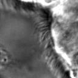
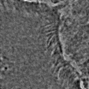
.. |image2| image:: zca/5.png

.. |image4| image:: zca/7.png
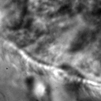
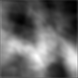
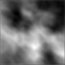
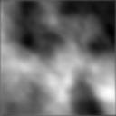
