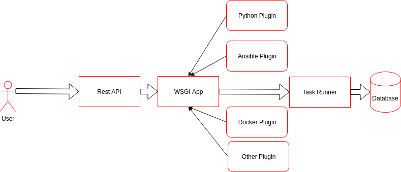

:author: Bihan Zhang
:email: bihan.zh@gmail.com
:institution: Red Hat
:equal-contributor:

:author: Austin Macdonald
:email: austin@redhat.com
:institution: Red Hat
:equal-contributor:

:bibliography: mybib

--------------------------------------------------
Pulp as a Tool to create Reproducible Environments
--------------------------------------------------

.. class:: abstract

   Trustworthy results require reproducibility. Publishing source code is
   necessary but not sufficient for complete reproducibility since complex
   programs often depend on external code. Techniques and tools for managing
   complex environments include but are not limited to requirements.txt files,
   docker images, and ansible roles. These tools are necessary to create
   reproducible environments, but managing these tools require different
   techniques and workflows.

   This talk seeks to provide an overview to the basic tools to manage
   environments, including workflows, best practices, and potential
   downfalls.This also provides and overview to Pulp_ as a way to
   manage and maintain maintain reproducible computational environments.

   Attendees of any skill level can come learn best practices for creating
   reproducible environments, and managing them with Pulp.

.. class:: keywords

   dependency-hell, reproducibility

Introduction
============

Trustworthy results require reproducibility. Publishing code is necessary but
not sufficient for complete reproducibility. Complex programs often depend on
external code. “An article […] in a scientific publication is not the
scholarship itself, it is merely advertising of the scholarship. The actual
scholarship is the complete software development environment and the complete
set of instructions which generated the figures” :cite:`Buckheit` .

Scholarly research containing descriptions of methodology is no longer
sufficient.  For standalone scripts, publishing source code might be
acceptable, but as computational systems grow more complex, this method becomes
more unreliable. Nontrivial research often depends on other external
libraries for everything from left-padding a line to building scalable machine
learning. This "has led to an ever larger and more complex black box between
what was actually done and what is described in literature." :cite:`Boettiger`

Fortunately, this is a common problem and there are a number of best practices
and tools that can make this easier. However these tools require different
techniques and workflows to manage. This talk seeks to summarize these tools
and techniques including workflows, best practices, and potential pitfalls.
And will then introduce Pulp_ as a potential environment manager to work in
conjunction with these tools, to provide easily manageable and maintainable environments.

..Note::
    Tools include things such as requirements.txt and pipfile.lock for Python, Docker Images,
    and Ansible Roles.

    Managers are used to manage the environment for these tools such as: Package indexes for
    python packages, Dockerhub for docker Images, Ansible Galaxy for Ansible roles and Pulp.

    Workflows are ...

Measuring Reproducibility
-------------------------

Two factors have to be considered when we think about published environments:

1.  Reproducibility is the ability to have the researcher and reviewer share identical
    'bits' of the necessary system, program, and dependencies.

    Vandewalle identifies several necessities for complete reproducibility
    :cite:`Vandewalle`: the program's source code, package dependencies, system
    requirements and configuration, data source used, and documentation on running
    the provided the source code.

2.  Code entropy is the tendency of code systems to move fast. Programs and environments need to be
    flexible to change. Software moves fast, and even widely used programs become
    legacy and eventually deprecated. Pinning dependencies might accelerate this
    process. This is the guarantee that code that works today, can also be ran 10 years from now.

A good tool, and management system will balance reproducibility and
code entropy.

Existing Tools and Techniques
=============================

This is a quick introduction to the existing tools used to create reproducible environments.

Published Source Code
---------------------

Publishing source code used to be the only thing necessary to
Publishing source code in papers makes them inflexible to change-- bugs fixed
after publication cannot be communicated to the readers of the paper. Code is
not versioned and even if the source code is updated and made available it is
hard to communicate what issues were fixed.

GitHub and Other Version Control Software
-----------------------------------------

Using an online git repository is a great way to keep track of source code
:cite:`Wilson`.  With git you can easily track changes you make to data and
software. Git identifies commits by a unique hash, which can be used to
reference a specific point in the source code.

What git lacks is the ability to do environmental management, it is not a
package manager. System dependencies in git can only be documented-- and need
the user to install them following instructions.  It is recommended that git be
used to store the source code, and that some other package manager be used to
manage the system environment.

Python Packaging
----------------

Python has a strong community, and many libraries and tools are hosted on the
Python Package Index.  Currently, the standard tool for installing packages is
pip_, which installs Python packages and their Python dependencies. For
development, it is strongly recommended to use pip with virtual environments
[0]_. Doing so will allow the developed projects to use the newest stable
versions of their dependencies, and well maintained dependencies should work
correctly together.

.. code-block:: bash

   $ mkvirtualenv venv-demo (venv-demo)
   $ pip install scipy

After development is complete and analysis begins, the need for reproducibility
often overtakes the benefits of keeping dependencies up to date. Though many
projects strive to maintain backwards compatibility, a researcher would not
want to use numpy-1.13.1 for part of their analysis and numpy-1.14.2 for
another, the stakes are simply too high. At this point, it is recommended that
researchers “pin” their versions.

.. code-block:: bash

   $ workon venv-demo (venv-demo)
   $ pip freeze > scipy-requirements.txt

Pip can use a requirements_ file to achieve more
stability. Creating a requirements file in this way specifies the exact version
of each dependency.

.. code-block:: bash

   numpy==1.14.3 scipy==1.1.0

The requirements file can now be used to recreate the same environment using
the same versions.

.. code-block:: bash

   $ mkvirtualenv separate-env
   (separate-env) $ pip install -r scipy-requirements.txt

For Python users who need to guarantee deterministic builds, another step is
suggested. Adding hashes to a requirements.txt provides the guarantee that the
exact bits are installed. PyPI now supports sha256, which is strongly
recommended over md5, which has known vulnerabilities. Pip can be used to
calculate the hashes, which are then added to the requirements file.

.. code-block:: bash

   $ pip download numpy==1.14.3
   Collecting numpy==1.14.3
   Saved ./numpy-1.14.3-cp27-cp27mu-manylinux1_x86_64.whl
   Successfully downloaded numpy

.. code-block:: bash

   $ pip hash ./numpy-1.14.3-cp27-cp27mu-
   manylinux1_x86_64.whl
   ./numpy-1.14.3-cp27-cp27mu-
   manylinux1_x86_64.whl:
   --hash=sha256:0db6301324d0568089663ef2701ad90ebac0e97
   5742c97460e89366692bd0563

Add these hashes to your requirements file, and use the `--require-hashes`
option. Note that these files are specific to architecture and python package type.
For code that should run in more than one environment, multiple hashes can be
specified.

.. code-block:: bash

   numpy==1.14.3 \
       --hash=sha256:0db6301324d0568089663ef2701ad90eba
       c0e975742c97460e89366692bd0563
   scipy==1.1.0 \
       --hash=sha256:08237eda23fd8e4e54838258b124f1cd14
       1379a5f281b0a234ca99b38918c07a

.. code-block:: bash

   $ mkvirtualenv deterministic-venv (deterministic-venv)
   $ pip install --require-hashes -r
   scipy_requirements.txt

Guarantees:
 - All Python dependencies installed this way will contain exactly the same
   bits
 - Hashes safeguard against man in the middle attacks
 - Hashes safeguard against malicious modification of packages on PyPI

Limitations: Packages on PyPI can be removed at any time by their maintainer.
pip is only useful for managing python dependencies, and cannot be used for
system dependencies and environment configuration.

Pip was selected because it is the standard tool, and it is most likely to
maintain backward compatibility. However, there are other tools with rich
feature sets that simplify the process. In particular,
pipenv_ uses hashing and virtual environments by
default for a smooth experience.

Ansible
-------

Ansible_ is an IT automation tool. It can configure systems, deploy software,
and orchestrate more advanced tasks. With ansible it is possible to install
Python dependencies and system dependencies.

"The approach is characterized by scripting, rather than documenting, a
description of the necessary dependencies for software to run, usually from the
Operating System [...] on up" :cite:`Clark`

With ansible you write a "playbook" that executes a set of tasks. It is
generally expected that each task is idempotent.

.. code-block:: yaml

   - name: Install python3-virtualenvwrapper (Fedora)
     package:
     name:
       - which
       - python3-virtualenvwrapper
     when:
       - pulp_venv is defined
       - ansible_distribution == 'Fedora'

   - name: Create a virtualenv
     command: 'python3 -m venv my_venv'
     args:
       creates: 'my_venv'
     register: result

   - pip:
     name: scipy
     version: 1.1.0

Ansible is only as good as your playbook. To make your environment
reproducible, your playbook has to follow best practices like pinning packages
to a version. A default host OS also should be specified when the playbook is
written: ansible uses separate plugins to install system dependencies, and to
be multiplatform the researcher needs to do some ansible host checking to use
the right plugins.

Ansible playbook and roles are yaml files that can be called with:

.. code-block:: bash

    ansible-playbook playbook.yml

Containers
----------

Containers_ [1]_ "are technologies that allow you to package and isolate
applications with their entire runtime environment—all of the files
necessary to run." Applied to the scientific field this means that each
container will contain an image of your system, a copy of your source code,
installed dependencies, and data used. These are stored in a static file called
an Image.

This Image can be given to peer reviewers and other collaborators as a baseline
to run your research. However the Image itself is opaque, and it is hard to
tell what dependencies have been installed on the image without substantial
inspection.  It is recommended that the Image is built from a Dockerfile for
full transparency.

A Dockerfile is a text document that contains all the commands a user could call
on the command line to assemble an image
[https://docs.docker.com/engine/reference/builder/].

This example dockerfile creates an ubuntu image and installs scipy and numpy on
it.

.. code-block:: text

   FROM ubuntu:16.04
   RUN pip install scipy --hash=sha256:0db6301324d05680
   89663ef2701ad90ebac\
   0e975742c97460e89366692bd0563

An Dockerfile can be built by running

.. code-block:: bash

   docker build

Note that while the Docker image is immutable, running `docker build` on the
same Dockerfile does not guarantee an identical image, unless best practices
were followed.

Dockerfiles can be kept in GitHub, and linked to DockerHub so that the
image is rebuilt with every change to the Dockerfile. This is the best of both
worlds- an immutable image is managed by DockerHub, but documentation on how
that image was built is kept under version control.

DockerHub identifies images by their digest, so the chance of collision is low.
Sharing a DockerHub managed image can be done by providing your docker repository
and a digest.

.. code-block:: bash

    docker pull internal-registry/my-project@sha256:b2ea
    388fdbabb22f10f2e9ecccaccf9efc3a11fbd987cf299c79825a
    65b62751

The downside of Docker Images is that docker is high in entropy. The Docker
Engine has no long-term support version [3]_.
This could result in `docker load` suddenly not working [4]_ after upgrading
the system docker to a later version.

Environmental Managers
======================

No matter which tool you are working with, even if you follow the best
practices, you are at the mercy of the upstream repository. For packages that
are user managed and exist on 3rd party platforms, such as PyPI, content can be
modified or removed making it difficult or impossible to guarantee
reproducibility. The only way to guarantee reproducibility is to create and
host your own repositories.

Given all these tools one needs to manage, it be more efficient to do so
from a centralized place. It is a lot easier to learn one tool, rather than a
tool for each content type. Package management is inherently complicated.
Each content type handles the complexities in a different way- usually tools
are built and optimized for a single content type. Context switching between
these tools consume human RAM cycles.

There are a multitude of environmental managers each with their benefits and downsides,
This paper will primarily focus on Pulp, and have a summary of other managers at the end.

Pulp
====

Pulp is an open source repository manager[2]_ that can be used to create
immutable computational environments that can be easily verified and shared.
With Pulp you can host and manage multiple registries (think PyPI or Ansible
Galaxy), each containing your packages and their dependencies.

Pulp v.2 has plugins (python, rpm, docker, debian, ostree, puppet) and has been
used in large production environments for about 4 years. Pulp v.2 is useful for
owning a pipe, and versioned repositories can be implemented by the user.

Pulp v.3 is currently in beta, and supports python and ansible plugins.
Pulp v.3 natively versions repositories, which makes it ideal for careful
management optimized for reproducibility.

TODO: add a diagram illustrating these concepts

Pulp stores *content units* (e.g. Python Wheel, Ansible Role) into collections
called *repositories*.

Repositories are versioned: content units (like Python Wheel, or Ansible Role)
in Pulp are organized by their membership in repositories over time.
Plugin users can add or remove content units to a repository by *uploading*
them individually, or *syncing* from a remote source like PyPI.

All content that is managed by Pulp can be hosted. Users create
type-specific *publishers* that provide the settings necessary to generate a
*publication* for a content set in a repository version. A publication
consists of the metadata of the content set and the *artifacts* of each
content unit in the content set. To host a publication, it must be assigned
to a *distribution*, which determines how and where a publication is served.

It is easy to add content types to pulp that is currently doesn't support, plugin
development is easy and well documented. [5]_

Architecture
------------

Pulp’s architecture has four components to it. Each of these can be horizontally
scaled independently for both high availability and/or additional capacity for
that part of the architecture.

1.  WSGI application
    Pulp’s web application is served by one or more WSGI webservers. See the
    WSGI Application docs for more info on deploying and scaling this component.

2.  Task Runner
    Pulp’s tasking system requires running rq. Additional rq workers can be
    added to add capacity to the tasking system.

3.  Database

4.  Plugins
    The content units Pulp manages is dependent on the plugins that are installed.

Workflow to Manage Content
--------------------------

TODO: diagram for this workflow.

1. Set up a pulp repository to mirror a subset of packages from PyPI that
are used by your lab.

Create a Repository

.. code-block:: bash

    http POST http://trypulp.org/pulp/api/v3/repositories/
    name=top-secret-project-dev

.. code-block:: json

    {
       "_href": "http://trypulp.org/pulp/api/v3/repositories/
       e81221c3-9c7a-4681-a435-aa74020753f2/",
        ...
    }

Create a Remote Source

.. code-block:: bash

    http POST http://trypulp.org//pulp/api/v3/remotes/python/ \
    name='pypi-secret-subset' \
    url='https://pypi.org/' \
    projects='{"name":"scipy", "version":"~=1.0.0"}'

.. code-block:: json

    {
        "_href": "http://trypulp.org/pulp/api/v3/repositories/
        e81221c3-9c7a-4681-a435-aa74020753f2/remotes/python/
        3750748b-781f-48df-9734-df014b2a11b4/",
        ...
    }

2. You can sync as often as you want, and publish as rarely as you want.

Sync the remote source to the created repository

.. code-block:: bash

    http POST http://trypulp.org/pulp/api/v3/repositories/e81221c3-
    9c7a-4681-a435-aa74020753f2/remotes/python/3750748b-781f-48df-
    9734-df014b2a11b4/'sync/'
    repository=http://trypulp.org/pulp/
    api/v3/repositories/e81221c3-9c7a-4681-a435-aa74020753f2/

Publish a repository

.. code-block:: bash

    http POST http://http://trypulp.org/pulp/api/v3/publishers/
    python/fd4cbecd-6c6a-4197-9cbe-4e45b0516309/publish/'
    repository=http://trypulp.org/pulp/api/v3/repositories/
    e81221c3-9c7a-4681-a435-aa74020753f2/

3. Your custom packages can be uploaded to Pulp and added to repositories.

Upload an artifact

.. code-block:: bash

    http POST http://trypulp.org/pulp/api/v3/artifacts/
    file@./top-secret-project-0.1-py2-none-any.whl

.. code-block:: bash

    {
        "_href": "http://trypulp.org/pulp/api/v3/artifacts/
        7d39e3f6-535a-4b6e-81e9-c83aa56aa19e/",
        ...
    }

Create a manageable unit from the artifact

.. code-block:: bash

    http POST http://trypulp.org/pulp/api/v3/content/python/
    packages/ artifact=http://trypulp.org/pulp/api/v3/
    artifacts/7d39e3f6-535a-4b6e-81e9-c83aa56aa19e/
    filename=top-secret-project-0.1-py2-none-any.whl

.. code-block:: bash

    {
        "_href": "http://localhost:8000/pulp/api/v3/
        content/python/packages/a9578a5f-c59f-4920-
        9497-8d1699c112ff/",
        ...
    }

Add your content to a repository

.. code-block:: bash

    http POST http://trypulp.org/pulp/api/v3/repositories/
    e81221c3-9c7a-4681-a435-aa74020753f2/ add_content_units:=
    "[\"http://localhost:8000/pulp/api/v3/content/python/
    packages/a9578a5f-c59f-4920-9497-8d1699c112ff/"]"

4. Create a publication and assign it to a distribution to host the repository.

Create a publisher

.. code-block:: bash

     http POST http://trypulp.org/pulp/api/v3/pulp/api/v3/
     publishers/python/
     name=python-publisher

.. code-block:: bash

    {
        "_href": "http://http://trypulp.org/pulp/api/v3/
        publishers/python/fd4cbecd-6c6a-4197-9cbe-4e45b0516309/",
        ...
    }

Publish the repository

.. code-block:: bash

    http POST http://http://trypulp.org/pulp/api/v3/
    publishers/python/fd4cbecd-6c6a-4197-9cbe-4e45b0516309/
    publish/' repository=http://trypulp.org/pulp/
    api/v3/repositories/e81221c3-9c7a-4681-a435-aa74020753f2/

Host (distribute) the repository

.. code-block:: bash

    http POST http://http://trypulp.org/pulp/api/v3/distributions/
    name='dev' base_path='top-secret-development'
    publication=http://trypulp.org/pulp/api/
    v3/publications/b787e6ad-d6b6-4e3d-ab12-73eba19b42fb/

5. Configure pip.conf to install dependencies from the distribution

.. code-block:: bash

    [global]
    index-url = http://trypulp.org/pulp/content/top-secret-
    development/simple/

6. Update the repository periodically, changes are not served until giving you
   control of when the dependencies might change.

7. At crucial points, note the repository version so you can roll back if
   necessary.

Preservation
------------

1. As development comes to an end, use pip freeze or pipenv to get a curated
list of specific packages. Create a new repository and add only this
known good set to it.

2. Publish the new repository and distribute it.

3. This distribution URL can then be sent to collaborators, reviewers, and
editors

    .. code-block:: bash

        http://trypulp.org/pulp/content/
        top-secret-development/simple/

Adding a Plugin to Pulp
-----------------------

Downsides to Using Pulp
-----------------------

There is no hosted instance of Pulp. An instance has to be set up by a
individual or university.

Other Environmental Managers
----------------------------

Future Work
-----------

Summary
=======

For researches who use code in their methods, it is crucial to consider the
reproducibility of the software environments they use. Excellent research can
become nearly impossible to replicate because of the difficulty of maintaining
a reliable dependency chain. By using the tools best practices developed for
software engineering, researchers can take steps to prevent code entropy and
preserve the efficacy of their work.

Acknowledgements
================

We appreciate Red Hat's continued support for open source technologies
(including Pulp), and to the PyPA for their continuous effort at making
Python packaging usable and stable. A special thank you to Michael Hrivnak,
who helped formulate and fact check the Containers terminology, and Dana
Walker for proof reading.

References
==========

.. [0] A virtual environment, often abbreviated “virtualenv” or “venv”,
    is an isolated python environments that is used to prevent projects and
    their dependencies from interfering with with each other. Under the hood,
    virtual environments work by managing the PYTHON_PATH Another benefit of
    Virtual environments is that they do not require root privileges and are
    safer to use.

.. [1] Most often people think of docker containers when the word container is
    mentioned. Docker is the most well known, however docker schema, and
    standards are not well documented.  Containers in this case can refer to
    Linux Container which is a superset of Docker Containers, Rkt, LXC, and
    other implementations. While most of the ideas discussed here will be
    generic across containers, the docker container, and DockerHub will be used
    as examples, due largely in part to their popularity.

.. [2] There are several closed sourced alternatives; Artifactory and Nexus are
    the two that are most commonly used.

.. [3] https://github.com/moby/moby/issues/20424

.. [4] https://github.com/moby/moby/issues/20380

.. [5] https://docs.pulpproject.org/en/3.0/nightly/plugins/plugin-writer/index.html

.. [#Pulp] Pulp Project, 2018, A Red Hat Community Project, https://pulpproject.org/

.. [#pip] pip, 2008-2017, PyPA, https://pip.pypa.io/en/stable/

.. [#requirements] requirements.txt, 2008-2017, PyPA, https://pip.readthedocs.io/en/1.1/requirements.html

.. [#pipenv] pipenv, Kenneth Reitz, https://docs.pipenv.org/

.. [#Ansible] Ansible, 2018, Red Hat, Inc, https://www.ansible.com/

.. [#Containers] containers, 2018 Red Hat, Inc, https://www.redhat.com/en/topics/containers

.. [#concepts] concepts, 2018, A Red Hat Community Project,
    https://docs.pulpproject.org/en/3.0/nightly/overview/concepts.html
