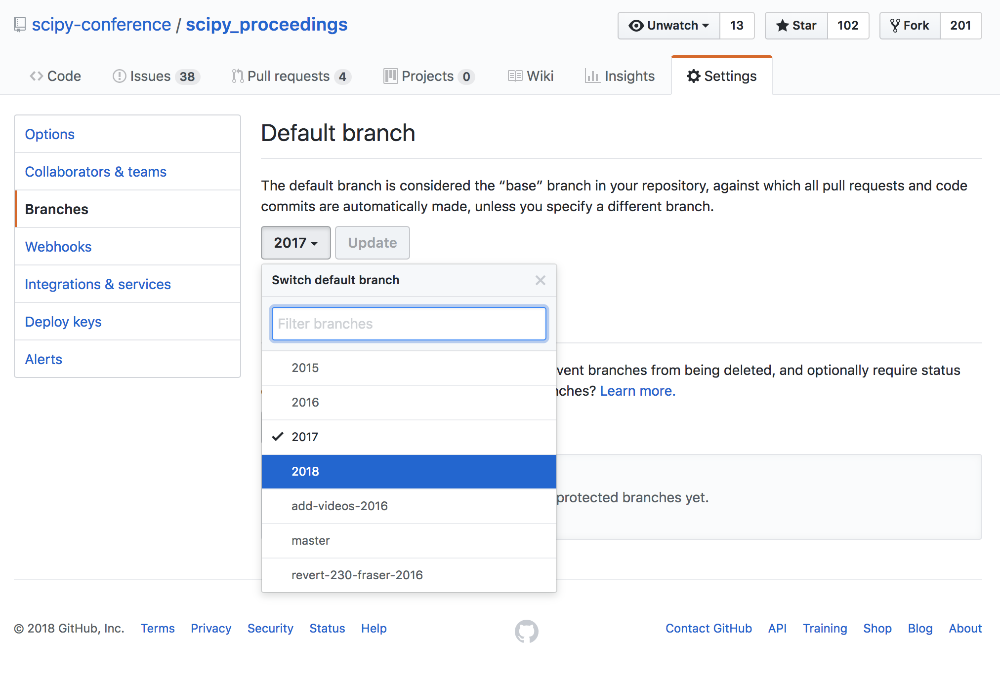
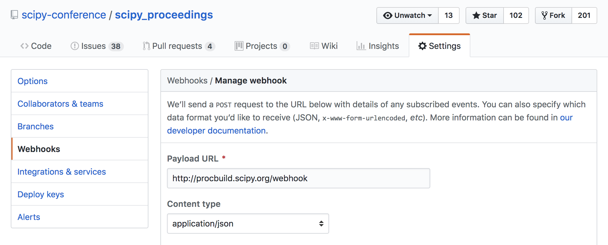

# Getting ready for the new year's proceedings

We're going to assume that you are working in year *x* to set up the proceedings
system for SciPy *x*.

This workflow requires a few steps. We will list those steps here, but if you
don't know what some of the words mean, we highly recommend that you read
[the problem section](#What-problem-are-we-solving).

# Workflow

All development work should have been occurring on the `dev` branch of the repo.

1. Merge `dev` into `master`
1. Create new branch for year `x` based off of the new `master`
1. Update the default branch
   - 
1. (potential step) If you have a new server location, you need to update the webhook
1. Update the docs to reflect all of the above changes
   - that includes:
       - `scipy_proceedings/README.md`
       - `scipy_proceedings/publisher/README.md`
       - `scipy_proceedings/publisher/getting_ready_for_new_year.md`

## What problem are we solving?

For the purposes of this explanation, we're going to describe the workflow in
terms of what needs to be done in the repo in the year `x = 2018`.

We organise the repo around git branches, specifically we're going to be thinking about 4 branches:

- `master`: the master branch, reflecting the canonical source of the proceedings system
- `dev`: the development branch, reflecting the up-to-date source of the proceedings system
- `2017`: the previous year's proceedings' branch
- `2018`: this year's proceedings' branch (this branch does not yet exist)

Most of the decisions we need to make revolve around what we want to do with
each of these branches.

### What goes into `master`?

In `2017` we have a lot of things that differ from `master`. On the one hand,
there are all the great changes that were made by the previous year's
proceedings committee. We're going to definitely want to have those in our
`master` branch. However, `2017` also has all of the papers that were submitted
by the authors of the 2017 proceedings.

**We never want to have any real papers in master, ever**. `master` is supposed
to only ever reflect the build system itself. That means the only papers that
should ever be in `master` should be the demo papers.

We want to keep `master` and its history as small as possible. It is intended to
transcend any particular year, and should not be tied to any of the history of
the proceedings system. Additionally, this keeps `master` as small as possible.

So, we only want to put the changes to the build system in master. But people
have to submit their proceedings to `2017` in 2017, and `2018` in 2018. How can
we get the improvements to the system without getting the papers?

### `dev` is where build changes go

The solution to the previous section problems is the `dev` branch.

`dev` specifically exists to house the improvements to the system, without any
of the papers.

That means during the 2018 proceedings any work that is being done to improve
the system should be in PRs made against `dev`, not `2018`.

### Base the new year's branch (e.g., `2018`) off of `master`

After merging `dev` into `master`, can branch `2018` off of `master`.

### Merge `dev` into `2018` on an on-going basis.

But as you are developing the system, you will be making changes to address
specific problems that come up for authors. If we aren't putting any changes in
`2018`, we won't be solving their problems!

The solution to this is to merge `dev` into `2018` with every change to
`dev`.

## Update webhook

If the server has changed you will need to update the webhook as well.

## TODO: move previous year's branch into its own git repository.

TODO: Figure out workflow to move previous year's branch into its own repo.

Once we write up the workflow, this should be added to the todo list under
.
